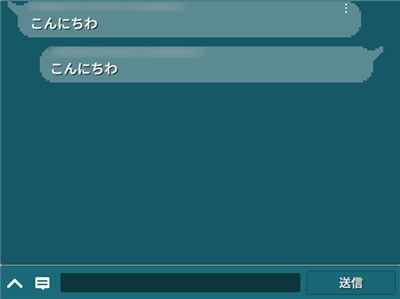

# チャット　解説

[GS2-Chat](https://app.gs2.io/docs/index.html#gs2-chat) を使ってチャット、メッセージの送受信を行うサンプルです。　　



## GS2-Deploy テンプレート

- [initialize_chat_template.yaml - チャット](../Templates/initialize_chat_template.yaml)

## チャット設定 ChatSetting


| 設定名 | 説明 |
|---|---|
| chatNamespaceName | GS2-Chat のネームスペース名 |
| roomName | GS2-Chat のルーム名 |

| イベント | 説明 |
|---|---|
| onGetRoom(EzRoom) | ルーム情報を取得したときに呼び出されます。 |
| onListSubscribeRooms(List<EzSubscribe>) | 購読しているルームの一覧を取得したときに呼び出されます。 |
| onCreateRoom(EzRoom) | ルームを作成したときに呼び出されます。 |
| onSubscribe(EzSubscribe) | ルームの購読を実行したときに呼び出されます。 |
| onUnsubscribe(EzSubscribe) | 購読を解除したときに呼び出されます。 |
| onListMessages(List<EzMessage>) | ルーム内のメッセージ一覧を取得したときに呼び出されます。 |
| onPost(EzMessage) | メッセージを投稿したときに呼び出されます。 |
| OnError(Gs2Exception error) | エラーが発生したときに呼び出されます。 |

## メッセージの送信
```c#
AsyncResult<EzPostResult> result = null;
yield return client.Chat.Post(
    r => { result = r; },
    session,
    chatNamespaceName,
    roomName,
    message,
    null,
    null
);
```

## メッセージの受信

購読をしているルームにメッセージの投稿があれば [GS2-Gateway](https://app.gs2.io/docs/index.html#gs2-gateway) から通知が届きます。
```c#
Gs2WebSocketSession
    public delegate void NotificationHandler(NotificationMessage message);
```

メッセージを取得します。

```c#
AsyncResult<EzListMessagesResult> result = null;
yield return client.Chat.ListMessages(
    r => { result = r; },
    session,
    chatNamespaceName,
    roomName,
    null,
    null,
    null
);
```

※　受信した他プレイヤーのメッセージの吹き出しをタップすると、対象となる他プレイヤーへのフォロー、フレンドリクエスト、ブラックリストへの追加が行えます。
こちらはGS2-Friendを使ったフレンド機能のための機能です。
