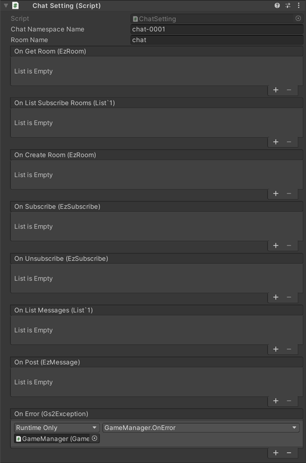

# チャット　解説

[GS2-Chat](https://app.gs2.io/docs/index.html#gs2-chat) を使ってチャット、メッセージの送受信を行うサンプルです。　　


## GS2-Deploy テンプレート

- [initialize_chat_template.yaml - チャット](../Templates/initialize_chat_template.yaml)

## チャット設定 ChatSetting



| 設定名 | 説明 |
|---|---|
| chatNamespaceName | GS2-Chat のネームスペース名 |
| roomName | GS2-Chat のルーム名 |

| イベント | 説明 |
|---|---|
| onGetRoom(EzRoom) | ルーム情報を取得したときに呼び出されます。 |
| onListSubscribeRooms(List<EzSubscribe>) | 購読しているルームの一覧を取得したときに呼び出されます。 |
| onCreateRoom(EzRoom) | ルームを作成したときに呼び出されます。 |
| onSubscribe(EzSubscribe) | ルームの購読を実行したときに呼び出されます。 |
| onUnsubscribe(EzSubscribe) | 購読を解除したときに呼び出されます。 |
| onListMessages(List<EzMessage>) | ルーム内のメッセージ一覧を取得したときに呼び出されます。 |
| onPost(EzMessage) | メッセージを投稿したときに呼び出されます。 |
| OnError(Gs2Exception error) | エラーが発生したときに呼び出されます。 |

## メッセージの送信

・UniTask有効時
```c#
var domain = gs2.Chat.Namespace(
    namespaceName: chatNamespaceName
).Me(
    gameSession: gameSession
).Room(
    roomName: roomName,
    password: null
);
try
{
    var result = await domain.PostAsync(
        metadata: message,
        category: null
    );
    var item = await result.ModelAsync();
    onPost.Invoke(item);
}
catch (Gs2Exception e)
{
    onError.Invoke(e);
}
```
・コルーチン使用時
```c#
var domain = gs2.Chat.Namespace(
    namespaceName: chatNamespaceName
).Me(
    gameSession: gameSession
).Room(
    roomName: roomName,
    password: null
);
var future = domain.PostFuture(
    metadata: message,
    category: null
);
yield return future;
if (future.Error != null)
{
    onError.Invoke(future.Error);
    yield break;
}

var result = future.Result;
var future2 = result.ModelFuture();
yield return future2;
if (future2.Error != null)
{
    onError.Invoke(future2.Error);
    yield break;
}

var item = future2.Result; 
onPost.Invoke(item);
```

## メッセージの受信

購読をしているルームにメッセージの投稿があれば [GS2-Gateway](https://app.gs2.io/docs/index.html#gs2-gateway) から通知が届きます。
```c#
Gs2WebSocketSession
    public delegate void NotificationHandler(NotificationMessage message);
```

メッセージを取得します。

・UniTask有効時
```c#
var domain = gs2.Chat.Namespace(
    namespaceName: chatNamespaceName
).Me(
    gameSession: gameSession
).Room(
    roomName: roomName,
    password: null
);
try
{
    List<EzMessage> massages = await domain.MessagesAsync().ToListAsync();
    
    onListMessages.Invoke(massages);
}
catch (Gs2Exception e)
{
    onError.Invoke(e);
}
```
・コルーチン使用時
```c#
var domain = gs2.Chat.Namespace(
    namespaceName: chatNamespaceName
).Me(
    gameSession: gameSession
).Room(
    roomName: roomName,
    password: null
);
var it = domain.Messages();
List<EzMessage> massages = new List<EzMessage>();
while (it.HasNext())
{
    yield return it.Next();
    if (it.Error != null)
    {
        onError.Invoke(it.Error);
        break;
    }

    if (it.Current != null)
    {
        massages.Add(it.Current);
    }
    else
    {
        break;
    }
}

onListMessages.Invoke(massages);
```

※　受信した他プレイヤーのメッセージの吹き出しをタップすると、対象となる他プレイヤーへのフォロー、フレンドリクエスト、ブラックリストへの追加が行えます。
こちらはGS2-Friendを使ったフレンド機能のための機能です。
