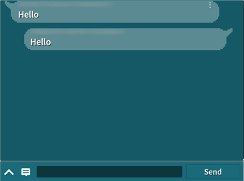

# Chat Explanation

This is a sample of using [GS2-Chat](https://app.gs2.io/docs/en/index.html#gs2-chat) to chat, send and receive messages.



## GS2-Deploy template

- [initialize_chat_template.yaml - chat](../Templates/initialize_chat_template.yaml)

## ChatSetting ChatSetting


| Setting Name | Description |
|---|---|
| chatNamespaceName | GS2-Chat namespace name
| roomName | GS2-Chat room name

| Event | Description |
|---|---|
| onGetRoom(EzRoom) | Called when room information is obtained. | onGetRoom(EzRoom)
| onListSubscribeRooms(List<EzSubscribe>) | Called when a list of subscribed rooms is obtained. | onListSubscribeRooms(List<EzSubscribe>)
| onCreateRoom(EzRoom) | Called when a room is created. | onCreateRoom(EzRoom)
| onSubscribe(EzSubscribe) | Called when a room subscription is performed. | onSubscribe(EzSubscribe)
| onUnsubscribe(EzSubscribe) | Called when a subscription is canceled. | onUnsubscribe(EzSubscribe)
| onListMessages(List<EzMessage>) | Called when a list of messages in a room is retrieved. | onListMessages(List<EzMessage>)
| onPost(EzMessage) | Called when a message is posted. | onPost(EzMessage)
| OnError(Gs2Exception error) | Called when an error occurs. | OnError(Gs2Exception error)

## Send message

When UniTask is enabled
```c#
var domain = gs2.Chat.Namespace(
    namespaceName: chatNamespaceName
).Me(
    gameSession: gameSession
).Room(
    roomName: roomName,
    password: null
);
try
{
    var result = await domain.PostAsync(
        metadata: message,
        category: null
    );
    var item = await result.ModelAsync();
    onPost.Invoke(item);
}
catch (Gs2Exception e)
{
    onError.Invoke(e);
}
```
When coroutine is used
```c#
var domain = gs2.Chat.Namespace(
    namespaceName: chatNamespaceName
).Me(
    gameSession: gameSession
).Room(
    roomName: roomName,
    password: null
);
var future = domain.Post(
    metadata: message,
    category: null
);
yield return future;
if (future.Error != null)
{
    onError.Invoke(future.Error);
    yield break;
}

var result = future.Result;
var future2 = result.Model();
yield return future2;
if (future2.Error != null)
{
    onError.Invoke(future2.Error);
    yield break;
}

var item = future2.Result; 
onPost.Invoke(item);
```

## Receive messages

You will receive a notification from [GS2-Gateway](https://app.gs2.io/docs/en/index.html#gs2-gateway) when a message is posted to the room to which you are subscribed.
```c#
Gs2WebSocketSession
    public delegate void NotificationHandler(NotificationMessage message);
```

Retrieve the message.

When UniTask is enabled
```c#
var domain = gs2.Chat.Namespace(
    namespaceName: chatNamespaceName
).Me(
    gameSession: gameSession
).Room(
    roomName: roomName,
    password: null
);
try
{
    List<EzMessage> massages = await domain.MessagesAsync().ToListAsync();
    
    onListMessages.Invoke(massages);
}
catch (Gs2Exception e)
{
    onError.Invoke(e);
}
```
When coroutine is used
```c#
var domain = gs2.Chat.Namespace(
    namespaceName: chatNamespaceName
).Me(
    gameSession: gameSession
).Room(
    roomName: roomName,
    password: null
);
var it = domain.Messages();
List<EzMessage> massages = new List<EzMessage>();
while (it.HasNext())
{
    yield return it.Next();
    if (it.Error != null)
    {
        onError.Invoke(it.Error);
        break;
    }

    if (it.Current != null)
    {
        massages.Add(it.Current);
    }
    else
    {
        break;
    }
}

onListMessages.Invoke(massages);
```

Tapping the balloon of a message received from another player allows you to follow, friend request, or blacklist the player.
This function is for the friend function using GS2-Friend.
