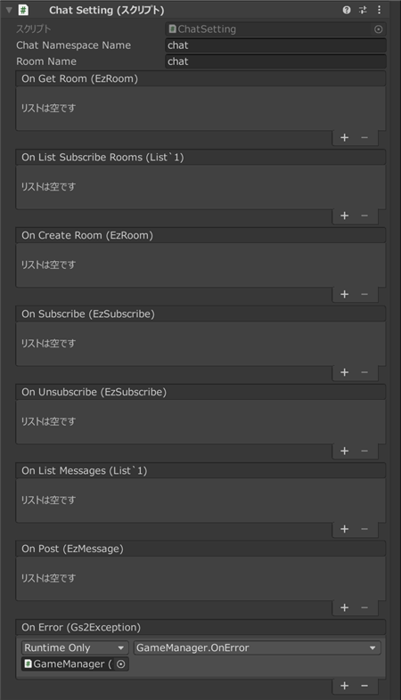

# 채팅 해설

[GS2-Chat](https://docs.gs2.io/ko/api_reference/chat/) 을 사용하여 채팅과 메시지의 송수신을 하는 샘플입니다.　　


## GS2-Deploy 템플릿

- [initialize_community_template.yaml - 채팅](../Templates/initialize_community_template.yaml)

## 채팅 설정 ChatSetting



| 설정 이름 | 설명 |
|---|---|
| chatNamespaceName | GS2-Chat 의 네임스페이스 이름 |
| roomName | GS2-Chat 의 룸 이름 |

| 이벤트 | 설명 |
|---|---|
| onGetRoom(EzRoom) | 룸 정보를 가져왔을 때 호출됩니다. |
| onListSubscribeRooms(List<EzSubscribe>) | 구독 중인 룸의 목록을 가져왔을 때 호출됩니다. |
| onCreateRoom(EzRoom) | 룸을 생성했을 때 호출됩니다. |
| onSubscribe(EzSubscribe) | 룸의 구독을 실행했을 때 호출됩니다. |
| onUnsubscribe(EzSubscribe) | 구독을 해제했을 때 호출됩니다. |
| onListMessages(List<EzMessage>) | 룸 내의 메시지 목록을 가져왔을 때 호출됩니다. |
| onPost(EzMessage) | 메시지를 게시했을 때 호출됩니다. |
| OnError(Gs2Exception error) | 오류가 발생했을 때 호출됩니다. |

## 메시지 전송

UniTask 활성화 시
```c#
var domain = gs2.Chat.Namespace(
    namespaceName: chatNamespaceName
).Me(
    gameSession: gameSession
).Room(
    roomName: roomName,
    password: null
);
try
{
    var result = await domain.PostAsync(
        metadata: message,
        category: null
    );
    var item = await result.ModelAsync();
    onPost.Invoke(item);
}
catch (Gs2Exception e)
{
    onError.Invoke(e);
}
```
코루틴 사용 시
```c#
var domain = gs2.Chat.Namespace(
    namespaceName: chatNamespaceName
).Me(
    gameSession: gameSession
).Room(
    roomName: roomName,
    password: null
);
var future = domain.PostFuture(
    metadata: message,
    category: null
);
yield return future;
if (future.Error != null)
{
    onError.Invoke(future.Error);
    yield break;
}

var result = future.Result;
var future2 = result.ModelFuture();
yield return future2;
if (future2.Error != null)
{
    onError.Invoke(future2.Error);
    yield break;
}

var item = future2.Result; 
onPost.Invoke(item);
```

## 메시지 수신

구독 중인 룸에 메시지가 게시되면 [GS2-Gateway](https://docs.gs2.io/ko/api_reference/gateway/) 로부터 알림이 도착합니다.
```c#
Gs2WebSocketSession
    public delegate void NotificationHandler(NotificationMessage message);
```

메시지를 가져옵니다.

UniTask 활성화 시
```c#
var domain = gs2.Chat.Namespace(
    namespaceName: chatNamespaceName
).Me(
    gameSession: gameSession
).Room(
    roomName: roomName,
    password: null
);
try
{
    List<EzMessage> massages = await domain.MessagesAsync().ToListAsync();
    
    onListMessages.Invoke(massages);
}
catch (Gs2Exception e)
{
    onError.Invoke(e);
}
```
코루틴 사용 시
```c#
var domain = gs2.Chat.Namespace(
    namespaceName: chatNamespaceName
).Me(
    gameSession: gameSession
).Room(
    roomName: roomName,
    password: null
);
var it = domain.Messages();
List<EzMessage> massages = new List<EzMessage>();
while (it.HasNext())
{
    yield return it.Next();
    if (it.Error != null)
    {
        onError.Invoke(it.Error);
        break;
    }

    if (it.Current != null)
    {
        massages.Add(it.Current);
    }
    else
    {
        break;
    }
}

onListMessages.Invoke(massages);
```

※ 수신한 다른 플레이어의 메시지 말풍선을 탭하면, 대상이 되는 다른 플레이어에 대한 팔로우, 친구 요청, 블랙리스트 추가를 할 수 있습니다.
이것은 GS2-Friend 를 사용한 친구 기능을 위한 기능입니다.
