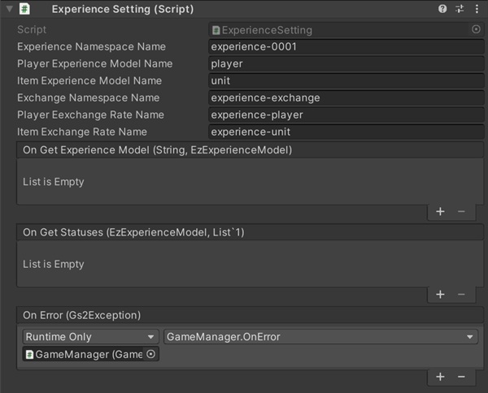

# Experience Explanation

This sample uses [GS2-Experience](https://app.gs2.io/docs/en/index.html#gs2-experience) to represent player experience and item growth in terms of experience.


## GS2-Deploy template

- [initialize_experience_template.yaml - experience](../Templates/initialize_experience_template.yaml)

## ExperienceSetting Experience Features Setting



| Setting Name | Description |
|---|---|
| experienceNamespaceName | Namespace name of GS2-Experience
| playerExperienceModelName | model name of player experience table in GS2-Experience
| itemExperienceModelName | Model name of the item experience table of GS2-Experience
| identifierIncreaseExperienceClientId | Client ID of the authority that can increase the experience level
| identifierIncreaseExperienceClientSecret | client secret of the authority that allows experience increase |

| Event | Description |
|---|---|
| onGetExperienceModel(string, EzExperienceModel) | Called when an experience model is retrieved. | onGetExperienceModel(string, EzExperienceModel)
| onGetStatuses(EzExperienceModel, List<EzStatus>) | Called when a list of status information is obtained. | onGetStatuses(EzExperienceModel, List<EzStatus>)
| onIncreaseExperience(EzExperienceModel, EzStatus, int) | Called when an experience increase is performed. | onIncreaseExperience(EzExperienceModel, int)
| OnError(Gs2Exception error) | Called when an error occurs. | OnError(Gs2Exception error)

## Get player experience

Gets the experience value of the player.

```c#
AsyncResult<EzListStatusesResult> result = null;
yield return client.Experience.ListStatuses(
    r =>
    {
        result = r;
    },
    session,
    experienceNamespaceName,
    PlayerExperienceModel.Name,
    pageToken
);
````

## Increase player experience

Performs an increase in the player's experience. Ranks are increased when the threshold for each rank is exceeded.  
Increases can be made up to a set rank cap, and the increase stops when the rank reaches the rank value.

```c#
{
    // *This process is for sample operation.
    // Implementations that actually increase experience directly by the client are deprecated.
    
    var restSession = new Gs2RestSession(
        new BasicGs2Credential(
            identifierIncreaseExperienceClientId,
            identifierIncreaseExperienceClientSecret
        )
    );
    var error = false;
    yield return restSession.Open(
        r =>
        {
            if (r.Error ! = null)
            {
                Invoke(r.Error);
                Invoke(r.Error); error = true;
            }
        }
    );

    if (error)
    {
        yield return restSession.Close(() => { });
        yield break;
    }

    var restClient = new Gs2ExperienceRestClient(
        restSession
    );

    yield return restClient.AddExperienceByUserId(
        new AddExperienceByUserIdRequest()
            .WithNamespaceName(experienceNamespaceName)
            WithUserId(session.AccessToken.UserId)
            WithExperienceName(experienceModel.Name)
            .WithPropertyId(propertyId)
            .WithExperienceValue(value),
        r =>
        {
            if (r.Error ! = null)
            {
                Invoke(r.Error);
                Invoke(r.Error); error = true;
            }
            else
            {
                onIncreaseExperience.Invoke(
                    experienceModel,
                    EzStatus.FromModel(r.Result.Item),
                    value
                );
            }
        }
    );
    
    yield return restSession.Close(() => { });
}
````

