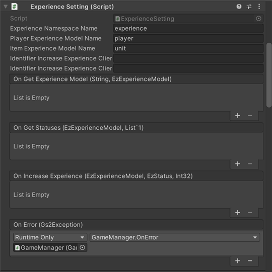

# 경험치 해설

[GS2-Experience](https://docs.gs2.io/ko/api_reference/experience/) 를 사용하여 플레이어의 경험치와 아이템의 성장을 경험치로 표현하는 샘플입니다.


## GS2-Deploy 템플릿

- [initialize_player_template.yaml - 경험치](../Templates/initialize_player_template.yaml)

## 경험치 기능 설정 ExperienceSetting



| 설정 이름 | 설명 |
|---|----------------------------------|
| experienceNamespaceName | GS2-Experience 의 네임스페이스 이름 |
| playerExperienceModelName | GS2-Experience 의 플레이어 경험치 테이블의 모델 이름 |
| itemExperienceModelName | GS2-Experience 의 아이템 경험치 테이블의 모델 이름 |
| exchangeNamespaceName | GS2-Exchange 의 네임스페이스 이름 |
| playerEexchangeRateName | GS2-Exchange 의 플레이어 경험치 획득 교환 레이트 이름 |
| itemExchangeRateName | GS2-Exchange 의 아이템 경험치 획득 교환 레이트 이름 |

| 이벤트 | 설명 |
|---|---|
| onGetExperienceModel(string, EzExperienceModel) | 경험치 모델을 가져왔을 때 호출됩니다. |
| onGetStatuses(EzExperienceModel, List<EzStatus>) | 스테이터스 정보의 목록을 가져왔을 때 호출됩니다. |
| onIncreaseExperience(EzExperienceModel, EzStatus, int) | 경험치의 증가를 실행했을 때 호출됩니다. |
| OnError(Gs2Exception error) | 오류가 발생했을 때 호출됩니다. |

## 플레이어의 경험치 가져오기

플레이어의 경험치를 가져옵니다.

UniTask 활성화 시
```c#
try
{
    var _statuses = await gs2.Experience.Namespace(
        namespaceName: experienceNamespaceName
    ).Me(
        gameSession: gameSession
    ).StatusesAsync().ToListAsync();

    playerStatuses = _statuses.ToDictionary(status => status.PropertyId);

    onGetStatuses.Invoke(playerExperienceModel, _statuses);
}
catch (Gs2Exception e)
{
    onError.Invoke(e);
}
```
코루틴 사용 시
```c#
var _statuses = new List<EzStatus>();
var it = gs2.Experience.Namespace(
    namespaceName: experienceNamespaceName
).Me(
    gameSession: gameSession
).Statuses();
while (it.HasNext())
{
    yield return it.Next();
    if (it.Error != null)
    {
        onError.Invoke(it.Error);
        break;
    }

    if (it.Current != null)
    {
        _statuses.Add(it.Current);
    }
}

playerStatuses = _statuses.ToDictionary(status => status.PropertyId);

onGetStatuses.Invoke(playerExperienceModel, _statuses);
```

## 플레이어의 경험치 증가

플레이어의 경험치 증가를 실행합니다. GS2-Exchange 로 경험치를 증가시키고 있습니다.  
랭크별 임계값을 넘으면 랭크가 증가합니다.    
설정된 랭크 캡까지 증가할 수 있으며, 랭크가 랭크 값에 도달하면 증가는 멈춥니다.

```c#
// ※이 처리는 샘플의 동작 확인을 위한 것입니다.
// 실제로 클라이언트가 직접 경험치를 증가시키는 구현은 권장되지 않습니다.

var domain = gs2.Exchange.Namespace(
    namespaceName: exchangeNamespaceName
).Me(
    gameSession: gameSession
).Exchange();
try
{
    var result = await domain.ExchangeAsync(
        rateName: exchangeRateName,
        count: value,
        config: new[]
        {
            new EzConfig
            {
                Key = "propertyId",
                Value = propertyId
            }
        }
    );
    // 트랜잭션의 자동 실행 완료를 대기(연쇄되는 트랜잭션도 포함하여 모두 대기)
    await result.WaitAsync(true);
}
catch (Gs2Exception e)
{
    onError.Invoke(e);
}
```

