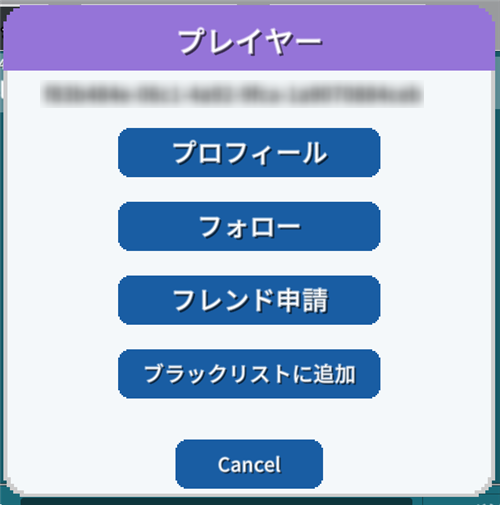

# フレンド機能　解説

[GS2-Friend](https://app.gs2.io/docs/index.html#gs2-friend) をつかったフレンド機能の実装のサンプルです。  
自プレイヤーのプロフィールの設定、フレンドリストの表示、送信したフレンドの登録リクエストの一覧の表示、  
受信したフレンドリクエストの一覧の表示、ブラックリストの表示、フォローしているユーザーの一覧の表示等を行います。

中央下の吹き出しアイコンからアクセスできるチャットウィンドウの、  
受信した他プレイヤーのメッセージの吹き出しをタップすると、  
対象となる他プレイヤーへのフォロー、フレンドリクエスト、ブラックリストへの追加が行えます。  
他プレイヤーのUserIdの取得に、チャットの送受信を利用しています。



## GS2-Deploy テンプレート

- [initialize_friend_template.yaml - フレンド機能](../Templates/initialize_friend_template.yaml)

## フレンド設定 FriendSetting


| 設定名 | 説明 |
|---|---|
| friendNamespaceName | GS2-Friend のネームスペース名 |

| イベント | 説明 |
|---|---|
| onGetProfile(EzProfile) | 自プレイヤーのプロフィールを取得したときに呼び出されます。 |
| onUpdateProfile(EzProfile) | 自プレイヤーのプロフィールを更新したときに呼び出されます。 |
| onDescribeFriends(List<EzFriendUser>) | フレンドの一覧を取得したときに呼び出されます。 |
| onSendRequest(EzFriendRequest) | フレンドリクエストを送信したときに呼び出されます。 |
| onAccept(EzFriendRequest) | フレンドリクエストを承認したときに呼び出されます。 |
| onReject(EzFriendRequest) | フレンドリクエストを拒否したときに呼び出されます。 |
| onDeleteRequest(EzFriendRequest) | 送信したフレンドリクエストを削除したときに呼び出されます。 |
| onDescribeSendRequests(List<EzFriendRequest>) | 送信したフレンドリクエストの一覧を取得したときに呼び出されます。 |
| onDescribeReceiveRequests(List<EzFriendRequest>) | 受信したフレンドリクエスト一覧を取得したときに呼び出されます。 |
| onGetFriend(EzFriendUser) | フレンド情報を取得したときに呼び出されます。 |
| onDeleteFriend(EzFriendUser) | フレンドを削除したときに呼び出されます。 |
| onGetPublicProfile(EzPublicProfile) | 他プレイヤーの公開プロフィールを取得したときに呼び出されます。 |
| onGetBlackList(List<string>) | ブラックリストを取得したときに呼び出されます。 |
| onRegisterBlackList(EzBlackList) | ブラックリストにユーザーを登録したときに呼び出されます。 |
| onUnregisterBlackList(EzBlackList) | ブラックリストからユーザーを削除したときに呼び出されます。 |
| onFollow(EzFollowUser) | 他プレイヤーをフォローしたときに呼び出されます。 |
| onUnfollow(EzFollowUser) | フォローしている相手をアンフォローしたときに呼び出されます。 |
| onDescribeFollowUsers(List<EzFollowUser>) | フォローしているユーザー一覧を取得したときに呼び出されます。 |
| OnError(Gs2Exception error) | エラーが発生したときに呼び出されます。 |

## 自分のプロフィールの編集

`プロフィール`ボタンをタップすると、自分のプロフィールを取得し`プロフィール`ダイアログを開きます。

・UniTask有効時
```c#
var domain = gs2.Friend.Namespace(
    namespaceName: friendNamespaceName
).Me(
    gameSession: gameSession
).Profile();
try
{
    myProfile = await domain.ModelAsync();
    
    onGetProfile.Invoke(myProfile);
}
catch (Gs2Exception e)
{
    onError.Invoke(e);
}
```
・コルーチン使用時
```c#
var domain = gs2.Friend.Namespace(
    namespaceName: friendNamespaceName
).Me(
    gameSession: gameSession
).Profile();
var future = domain.ModelFuture();
yield return future;
if (future.Error != null)
{
    onError.Invoke(future.Error);
    yield break;
}

myProfile = future.Result;

onGetProfile.Invoke(myProfile);
```

InputFieldでプロフィールの文言を編集後、`更新`ボタンをタップしプロフィールの更新を行います。

・UniTask有効時
```c#
var domain = gs2.Friend.Namespace(
    namespaceName: friendNamespaceName
).Me(
    gameSession: gameSession
).Profile();
try
{
    var result = await domain.UpdateProfileAsync(
	    publicProfile: publicProfile,
	    followerProfile: followerProfile,
	    friendProfile: friendProfile
    );
    myProfile = await result.ModelAsync();
    
    onUpdateProfile.Invoke(myProfile);
}
catch (Gs2Exception e)
{
    onError.Invoke(e);
}
```
・コルーチン使用時
```c#
var domain = gs2.Friend.Namespace(
    namespaceName: friendNamespaceName
).Me(
    gameSession: gameSession
).Profile(
);
var future = domain.UpdateProfileFuture(
    publicProfile: publicProfile,
    followerProfile: followerProfile,
    friendProfile: friendProfile
);
yield return future;
if (future.Error != null)
{
    onError.Invoke(future.Error);
    yield break;
}

var result = future.Result;
var future2 = result.Model();
yield return future2;
if (future2.Error != null)
{
    onError.Invoke(future2.Error);
    yield break;
}

myProfile = future2.Result;

onUpdateProfile.Invoke(myProfile);
```

## フレンドの一覧/削除

`フレンド`ボタンでフレンドの一覧を取得し`フレンドリスト`ダイアログを開きます。

・UniTask有効時
```c#
var domain = gs2.Friend.Namespace(
    namespaceName: friendNamespaceName
).Me(
    gameSession: gameSession
);
try
{
    Friends = await domain.FriendsAsync().ToListAsync();
    
    onDescribeFriends.Invoke(Friends);
}
catch (Gs2Exception e)
{
    onError.Invoke(e);
}
```
・コルーチン使用時
```c#
Friends.Clear();
var domain = gs2.Friend.Namespace(
    namespaceName: friendNamespaceName
).Me(
    gameSession: gameSession
);
var it = domain.Friends();
while (it.HasNext())
{
    yield return it.Next();
    if (it.Error != null)
    {
	    onError.Invoke(it.Error);
	    break;
    }

    if (it.Current != null)
    {
	    Friends.Add(it.Current);
    }
}

onDescribeFriends.Invoke(Friends);
```

`フレンドリスト`ダイアログのユーザー項目の`削除`で、フレンドを削除、フレンド登録を解除します。

・UniTask有効時
```c#
var domain = gs2.Friend.Namespace(
    namespaceName: friendNamespaceName
).Me(
    gameSession: gameSession
).Friend(
    withProfile: false // プロフィールも一緒に取得するか / get a profile together?
).FriendUser(
    targetUserId: targetUserId
);
try
{
    var result = await domain.DeleteFriendAsync();
    var item = await result.ModelAsync();
    
    onDeleteFriend.Invoke(item);
}
catch (Gs2Exception e)
{
    onError.Invoke(e);
}
```
・コルーチン使用時
```c#
var domain = gs2.Friend.Namespace(
    namespaceName: friendNamespaceName
).Me(
    gameSession: gameSession
).Friend(
    withProfile: false // プロフィールも一緒に取得するか / get a profile together?
).FriendUser(
    targetUserId: targetUserId
);
var future = domain.DeleteFriendFuture();
yield return future;
if (future.Error != null)
{
    onError.Invoke(future.Error);
    yield break;
}

var result = future.Result;
var future2 = result.Model();
yield return future2;
if (future2.Error != null)
{
    onError.Invoke(future2.Error);
    yield break;
}

var item = future2.Result;
onDeleteFriend.Invoke(item);
```

## フレンドリクエストの送信

チャットのメッセージをタップで開く`プレイヤー`ダイアログで`フレンド申請`をタップすると。  
対象となるユーザーに対してフレンドリクエストを送信します。  
相手ユーザーの承認/拒否を待っている状態になります。

・UniTask有効時
```c#
var domain = gs2.Friend.Namespace(
    namespaceName: friendNamespaceName
).Me(
    gameSession: gameSession
);
try
{
    var result = await domain.SendRequestAsync(
	    targetUserId: targetUserId
    );
    var item = await result.ModelAsync();

    onSendRequest.Invoke(item);
}
catch (Gs2Exception e)
{
    onError.Invoke(e);
}
```
・コルーチン使用時
```c#
var domain = gs2.Friend.Namespace(
    namespaceName: friendNamespaceName
).Me(
    gameSession: gameSession
);
var future = domain.SendRequestFuture(
    targetUserId: targetUserId
);
yield return future;
if (future.Error != null)
{
    onError.Invoke(future.Error);
    yield break;
}
var result = future.Result;
var future2 = result.Model();
yield return future2;
var item = future2.Result;
onSendRequest.Invoke(item);
```

## 送信/受信したフレンドリクエストリクエストの一覧取得 

`送信中リクエスト`ボタンをタップして、送信したフレンドリクエストの一覧を取得し  
`送信したフレンドリクエスト`ダイアログを開きます。

・UniTask有効時
```c#
var domain = gs2.Friend.Namespace(
    namespaceName: friendNamespaceName
).Me(
    gameSession: gameSession
);
try
{
    Requests = await domain.SendRequestsAsync().ToListAsync();
    
    onDescribeSendRequests.Invoke(Requests);
}
catch (Gs2Exception e)
{
    onError.Invoke(e);
}
```
・コルーチン使用時
```c#
Requests.Clear();
var domain = gs2.Friend.Namespace(
    namespaceName: friendNamespaceName
).Me(
    gameSession: gameSession
);
var it = domain.SendRequests();
while (it.HasNext())
{
    yield return it.Next();
    if (it.Error != null)
    {
	    onError.Invoke(it.Error);
	    break;
    }

    if (it.Current != null)
    {
	    Requests.Add(it.Current);
    }
}

onDescribeSendRequests.Invoke(Requests);
```

送信したフレンドリクエストは相手が承認/拒否を行う前であれば削除、取り下げることができます。  
`送信中リクエスト`ボタンから開く`送信したフレンドリクエスト`ダイアログのユーザー項目の`削除`で、リクエストを削除します。

・UniTask有効時
```c#
var domain = gs2.Friend.Namespace(
    namespaceName: friendNamespaceName
).Me(
    gameSession: gameSession
).SendFriendRequest(
    targetUserId: targetUserId
);
try
{
    var result = await domain.DeleteRequestAsync();
    var item = await result.ModelAsync();
    onDeleteRequest.Invoke(item);
}
catch (Gs2Exception e)
{
    onError.Invoke(e);
}
```
・コルーチン使用時
```c#
var domain = gs2.Friend.Namespace(
    namespaceName: friendNamespaceName
).Me(
    gameSession: gameSession
).SendFriendRequest(
    targetUserId: targetUserId
);
var future = domain.DeleteRequestFuture();
yield return future;
if (future.Error != null)
{
    onError.Invoke(future.Error);
    yield break;
}
var result = future.Result;
var future2 = result.Model();
yield return future2;
var item = future2.Result;
onDeleteRequest.Invoke(item);
```

`受信中リクエスト`ボタンをタップして、受信したフレンドリクエストの一覧を取得し  
`受信したフレンドリクエスト`ダイアログを開きます。

・UniTask有効時
```c#
var domain = gs2.Friend.Namespace(
    namespaceName: friendNamespaceName
).Me(
    gameSession: gameSession
);
try
{
    Requests = await domain.ReceiveRequestsAsync().ToListAsync();
    
    onDescribeReceiveRequests.Invoke(Requests);
}
catch (Gs2Exception e)
{
    onError.Invoke(e);
}
```
・コルーチン使用時
```c#
var domain = gs2.Friend.Namespace(
    namespaceName: friendNamespaceName
).Me(
    gameSession: gameSession
);
var it = domain.ReceiveRequests();
while (it.HasNext())
{
    yield return it.Next();
    if (it.Error != null)
    {
	    onError.Invoke(it.Error);
	    break;
    }

    if (it.Current != null)
    {
	    Requests.Add(it.Current);
    }
}

onDescribeReceiveRequests.Invoke(Requests);
```

## フレンドリクエストの承認/拒否

`受信中リクエスト`ボタンから開く`受信したフレンドリクエスト`ダイアログのユーザー項目の`承認`ボタンで、フレンドリクエストを承認します。

・UniTask有効時
```c#
var domain = gs2.Friend.Namespace(
    namespaceName: friendNamespaceName
).Me(
    gameSession: gameSession
).ReceiveFriendRequest(
    fromUserId: fromUserId
);
try
{
    var result  = await domain.AcceptAsync();
    var item = await result.ModelAsync();
    
    onAccept.Invoke(item);
}
catch (Gs2Exception e)
{
    onError.Invoke(e);
}
```
・コルーチン使用時
```c#
var domain = gs2.Friend.Namespace(
    namespaceName: friendNamespaceName
).Me(
    gameSession: gameSession
).ReceiveFriendRequest(
    fromUserId: fromUserId
);
var future = domain.AcceptFuture();
yield return future;
if (future.Error != null)
{
    onError.Invoke(future.Error);
    yield break;
}

var result = future.Result;
var future2 = result.Model();
yield return future2;
var item = future2.Result;
onAccept.Invoke(item);
```

`拒否`ボタンで、フレンドリクエストを拒否します。

・UniTask有効時
```c#
var domain = gs2.Friend.Namespace(
    namespaceName: friendNamespaceName
).Me(
    gameSession: gameSession
).ReceiveFriendRequest(
    fromUserId: fromUserId
);
try
{
    var result = await domain.RejectAsync();
    var item = await result.ModelAsync();
    onReject.Invoke(item);
}
catch (Gs2Exception e)
{
    onError.Invoke(e);
}
```
・コルーチン使用時
```c#
var domain = gs2.Friend.Namespace(
    namespaceName: friendNamespaceName
).Me(
    gameSession: gameSession
).ReceiveFriendRequest(
    fromUserId: fromUserId
);
var future = domain.RejectFuture();
yield return future;
if (future.Error != null)
{
    onError.Invoke(future.Error);
    yield break;
}

var result = future.Result;
var future2 = result.Model();
yield return future2;
var item = future2.Result;
onReject.Invoke(item);
```

## フレンド登録の解除

`フレンド`ボタンから開く`フレンドリスト`ダイアログのユーザー項目の`削除`で、フレンドを削除、フレンド登録を解除します。

・UniTask有効時
```c#
var domain = gs2.Friend.Namespace(
    namespaceName: friendNamespaceName
).Me(
    gameSession: gameSession
).Friend(
    withProfile: false // プロフィールも一緒に取得するか / get a profile together?
).FriendUser(
    targetUserId: targetUserId
);
try
{
    var result = await domain.DeleteFriendAsync();
    var item = await result.ModelAsync();
    
    onDeleteFriend.Invoke(item);
}
catch (Gs2Exception e)
{
    onError.Invoke(e);
}
```
・コルーチン使用時
```c#
var domain = gs2.Friend.Namespace(
    namespaceName: friendNamespaceName
).Me(
    gameSession: gameSession
).ReceiveFriendRequest(
    fromUserId: fromUserId
);
var future = domain.RejectFuture();
yield return future;
if (future.Error != null)
{
    onError.Invoke(future.Error);
    yield break;
}

var result = future.Result;
var future2 = result.Model();
yield return future2;
var item = future2.Result;
onReject.Invoke(item);
```

## ブラックリスト

チャットのメッセージから開く`プレイヤー`ダイアログで他プレイヤーを`ブラックリストに追加`します。

・UniTask有効時
```c#
var domain = gs2.Friend.Namespace(
    namespaceName: friendNamespaceName
).Me(
    gameSession: gameSession
).BlackList();
try
{
    var result = await domain.RegisterBlackListAsync(
	    targetUserId: targetUserId
    );
    var item = await result.ModelAsync();
    onRegisterBlackList.Invoke(item);
}
catch (Gs2Exception e)
{
    onError.Invoke(e);
}
```
・コルーチン使用時
```c#
var domain = gs2.Friend.Namespace(
    namespaceName: friendNamespaceName
).Me(
    gameSession: gameSession
).BlackList();
var future = domain.UnregisterBlackListFuture(
    targetUserId: targetUserId
);
yield return future;
if (future.Error != null)
{
    onError.Invoke(future.Error);
    yield break;
}

var result = future.Result;
var future2 = result.Model();
yield return future2;
if (future2.Error != null)
{
    onError.Invoke(future2.Error);
    yield break;
}

var item = future2.Result;
onUnregisterBlackList.Invoke(item);
```

`ブラックリスト`ボタンで、ブラックリストに登録しているユーザーの一覧を取得し表示します。

・UniTask有効時
```c#
var domain = gs2.Friend.Namespace(
    namespaceName: friendNamespaceName
).Me(
    gameSession: gameSession
);
try
{
    BlackList = await domain.BlackListsAsync().ToListAsync();
    onGetBlackList.Invoke(BlackList);
}
catch (Gs2Exception e)
{
    onError.Invoke(e);
}
```
・コルーチン使用時
```c#
BlackList.Clear();
var domain = gs2.Friend.Namespace(
    namespaceName: friendNamespaceName
).Me(
    gameSession: gameSession
);
var it = domain.BlackLists();
while (it.HasNext())
{
    yield return it.Next();
    if (it.Error != null)
    {
        onError.Invoke(it.Error);
        break;
    }

    if (it.Current != null)
    {
        BlackList.Add(it.Current);
    }
}

onGetBlackList.Invoke(BlackList);
```

`ブラックリスト`ダイアログのユーザー項目の`削除`で、ブラックリスト登録している相手を解除します。

・UniTask有効時
```c#
var domain = gs2.Friend.Namespace(
    namespaceName: friendNamespaceName
).Me(
    gameSession: gameSession
).BlackList();
try
{
    var result = await domain.UnregisterBlackListAsync(
	    targetUserId: targetUserId
    );
    var item = await result.ModelAsync();
    onUnregisterBlackList.Invoke(item);
}
catch (Gs2Exception e)
{
    onError.Invoke(e);
}
```
・コルーチン使用時
```c#
var domain = gs2.Friend.Namespace(
    namespaceName: friendNamespaceName
).Me(
    gameSession: gameSession
).BlackList();
var future = domain.RegisterBlackListFuture(
    targetUserId: targetUserId
);
yield return future;
if (future.Error != null)
{
    onError.Invoke(future.Error);
    yield break;
}
var result = future.Result;
var future2 = result.Model();
yield return future2;
var item = future2.Result;
onRegisterBlackList.Invoke(item);
```

## フォロー

チャットのメッセージから開く`プレイヤー`ダイアログで、他プレイヤーを`フォロー`します。

・UniTask有効時
```c#
var domain = gs2.Friend.Namespace(
    namespaceName: friendNamespaceName
).Me(
    gameSession: gameSession
).Follow(
    withProfile: false
).FollowUser(
    targetUserId: targetUserId
);
try
{
var result = await domain.FollowAsync(
    targetUserId: targetUserId
    );
    var item = await result.ModelAsync();
    onFollow.Invoke(item);
}
catch (Gs2Exception e)
{
    onError.Invoke(e);
}
```
・コルーチン使用時
```c#
var domain = gs2.Friend.Namespace(
    namespaceName: friendNamespaceName
).Me(
    gameSession: gameSession
);
var future = domain.FollowFuture(
    targetUserId: targetUserId
);
yield return future;
if (future.Error != null)
{
    onError.Invoke(future.Error);
    yield break;
}

var result = future.Result;
var future2 = result.Model();
yield return future2;
var item = future2.Result;
onFollow.Invoke(item);
```

`フォロー`ボタンからフォローしているユーザー一覧を取得し表示します。

・UniTask有効時
```c#
var domain = gs2.Friend.Namespace(
    namespaceName: friendNamespaceName
).Me(
    gameSession: gameSession
);
try
{
    FollowUsers = await domain.FollowsAsync().ToListAsync();

    onDescribeFollowUsers.Invoke(FollowUsers);
}
catch (Gs2Exception e)
{
    onError.Invoke(e);
}
```
・コルーチン使用時
```c#
FollowUsers.Clear();
var domain = gs2.Friend.Namespace(
    namespaceName: friendNamespaceName
).Me(
    gameSession: gameSession
).Follow(
    false
);
var it = domain.Follows();
while (it.HasNext())
{
    yield return it.Next();
    if (it.Error != null)
    {
        onError.Invoke(it.Error, null);
        break;
    }

    if (it.Current != null)
    {
        FollowUsers.Add(it.Current);
    }
}
```

`フォロー`ダイアログのユーザー項目の`削除`で、フォローしている相手をアンフォローします。

・UniTask有効時
```c#
var domain = gs2.Friend.Namespace(
    namespaceName: friendNamespaceName
).Me(
    gameSession: gameSession
).Follow(
    withProfile: false
).FollowUser(
    targetUserId: targetUserId
);
try
{
    var result = await domain.UnfollowAsync();
    onUnfollow.Invoke();
}
catch (Gs2Exception e)
{
    onError.Invoke(e);
}
```
・コルーチン使用時
```c#
var domain = gs2.Friend.Namespace(
    namespaceName: friendNamespaceName
).Me(
    gameSession: gameSession
).Follow(
    withProfile: false
).FollowUser(
    targetUserId: targetUserId
);
var future = domain.UnfollowFuture();
yield return future;
if (future.Error != null)
{
    onError.Invoke(future.Error);
    yield break;
}

var result = future.Result;
var future2 = result.Model();
yield return future2;
if (future2.Error != null)
{
    onError.Invoke(future2.Error);
    yield break;
}

var item = future2.Result;
onUnfollow.Invoke(item);
```
