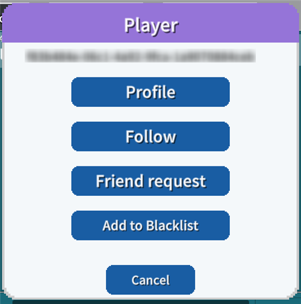
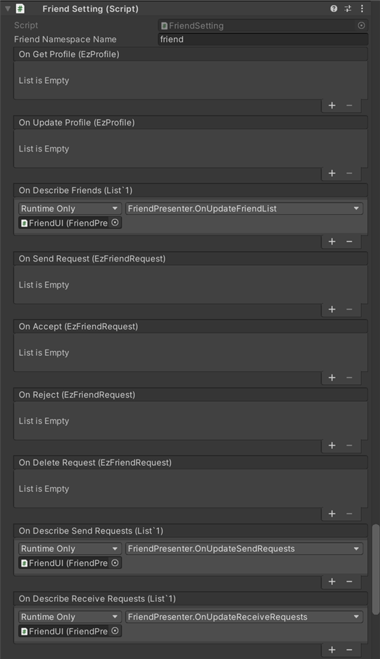
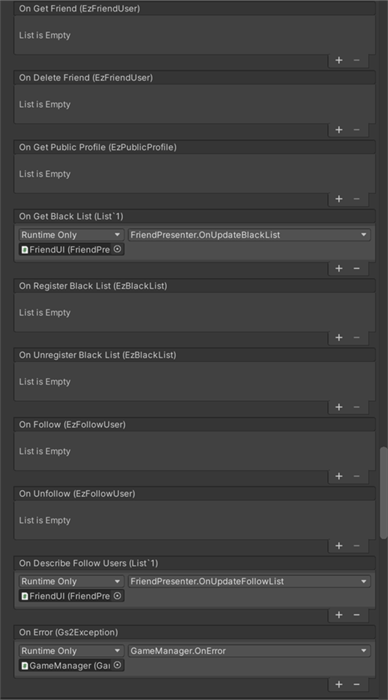

# Friend Explanation

This is a sample implementation of a friend function using [GS2-Friend](https://app.gs2.io/docs/en/index.html#gs2-friend).  
The following sample applications are available: setting up a player's profile, displaying a friend list, displaying a list of sent friend registration requests, and displaying a list of friends who are registered with the site.  
It displays a list of received friend requests, a blacklist, a list of users you are following, etc.

The chat window, accessible from the callout icon at the bottom center, displays  
Tap the message balloon of another player's message you received.  
You can follow, friend request, or blacklist the target player.  
The UserId of other players is obtained by sending and receiving chat messages.



## GS2-Deploy template

- [initialize_friend_template.yaml - friend feature](../Templates/initialize_friend_template.yaml)

## FriendSetting FriendSetting




| Setting Name | Description |
|---|---|
| friendNamespaceName | GS2-Friend's namespace name

| Event | Description |
|---|---|
| onGetProfile(EzProfile) | Called when a player's profile is obtained. |
| onUpdateProfile(EzProfile) | Called when a player's profile is updated. |
| onDescribeFriends(List<EzFriendUser>) | Called when a list of friends is obtained. |
| onSendRequest(EzFriendRequest) | Called when a friend request is sent. |
| onAccept(EzFriendRequest) | Called when a friend request is accepted. |
| onReject(EzFriendRequest) | Called when a friend request is rejected. |
| onDeleteRequest(EzFriendRequest) | Called when a sent friend request is deleted. |
| onDescribeSendRequests(List<EzFriendRequest>) | Called when a list of sent friend requests is obtained. |
| onDescribeReceiveRequests(List<EzFriendRequest>) | Called when the list of received friend requests is retrieved. |
| onGetFriend(EzFriendUser) | Called when friend information is obtained. |
| onDeleteFriend(EzFriendUser) | Called when a friend is deleted. |
| onGetPublicProfile(EzPublicProfile) | Called when a public profile of another player is obtained. |
| onGetBlackList(List<string>) | Called when a blacklist is retrieved. |
| onRegisterBlackList(EzBlackList) | Called when a user is registered on the blacklist. |
| onUnregisterBlackList(EzBlackList) | Called when a user is removed from the blacklist. |
| onFollow(EzFollowUser) | Called when a player follows another player. |
| onUnfollow(EzFollowUser) | Called when you unfollow someone you are following. |
| onDescribeFollowUsers(List<EzFollowUser>) | Called when a list of followers is obtained. |
| OnError(Gs2Exception error) | Called when an error occurs. |

## Edit my profile

Tap the `Profile` button to retrieve your profile and open the `Profile` dialog.

When UniTask is enabled
```c#
var domain = gs2.Friend.Namespace(
    namespaceName: friendNamespaceName
).Me(
    gameSession: gameSession
).Profile();
try
{
    myProfile = await domain.ModelAsync();
    
    onGetProfile.Invoke(myProfile);
}
catch (Gs2Exception e)
{
    onError.Invoke(e);
}
```
When coroutine is used
```c#
var domain = gs2.Friend.Namespace(
    namespaceName: friendNamespaceName
).Me(
    gameSession: gameSession
).Profile();
var future = domain.ModelFuture();
yield return future;
if (future.Error != null)
{
    onError.Invoke(future.Error);
    yield break;
}

myProfile = future.Result;

onGetProfile.Invoke(myProfile);
```

After editing the text of your profile in the InputField, tap the `Update` button to update your profile.

When UniTask is enabled
```c#
var domain = gs2.Friend.Namespace(
    namespaceName: friendNamespaceName
).Me(
    gameSession: gameSession
).Profile();
try
{
    var result = await domain.UpdateProfileAsync(
	    publicProfile: publicProfile,
	    followerProfile: followerProfile,
	    friendProfile: friendProfile
    );
    myProfile = await result.ModelAsync();
    
    onUpdateProfile.Invoke(myProfile);
}
catch (Gs2Exception e)
{
    onError.Invoke(e);
}
```
When coroutine is used
```c#
var domain = gs2.Friend.Namespace(
    namespaceName: friendNamespaceName
).Me(
    gameSession: gameSession
).Profile(
);
var future = domain.UpdateProfileFuture(
    publicProfile: publicProfile,
    followerProfile: followerProfile,
    friendProfile: friendProfile
);
yield return future;
if (future.Error != null)
{
    onError.Invoke(future.Error);
    yield break;
}

var result = future.Result;
var future2 = result.Model();
yield return future2;
if (future2.Error != null)
{
    onError.Invoke(future2.Error);
    yield break;
}

myProfile = future2.Result;

onUpdateProfile.Invoke(myProfile);
```

## List/Delete Friends

The `Friends` button retrieves the list of friends and opens the `Friends List` dialog.

When UniTask is enabled
```c#
var domain = gs2.Friend.Namespace(
    namespaceName: friendNamespaceName
).Me(
    gameSession: gameSession
);
try
{
    Friends = await domain.FriendsAsync().ToListAsync();
    
    onDescribeFriends.Invoke(Friends);
}
catch (Gs2Exception e)
{
    onError.Invoke(e);
}
```
When coroutine is used
```c#
Friends.Clear();
var domain = gs2.Friend.Namespace(
    namespaceName: friendNamespaceName
).Me(
    gameSession: gameSession
);
var it = domain.Friends();
while (it.HasNext())
{
    yield return it.Next();
    if (it.Error != null)
    {
	    onError.Invoke(it.Error);
	    break;
    }

    if (it.Current != null)
    {
	    Friends.Add(it.Current);
    }
}

onDescribeFriends.Invoke(Friends);
```

Delete a friend or unregister a friend using the `Delete` user item in the `Friends List` dialog.

When UniTask is enabled
```c#
var domain = gs2.Friend.Namespace(
    namespaceName: friendNamespaceName
).Me(
    gameSession: gameSession
).Friend(
    withProfile: false // get a profile together?
).FriendUser(
    targetUserId: targetUserId
);
try
{
    var result = await domain.DeleteFriendAsync();
    var item = await result.ModelAsync();
    
    onDeleteFriend.Invoke(item);
}
catch (Gs2Exception e)
{
    onError.Invoke(e);
}
```
When coroutine is used
```c#
var domain = gs2.Friend.Namespace(
    namespaceName: friendNamespaceName
).Me(
    gameSession: gameSession
).Friend(
    withProfile: false // get a profile together?
).FriendUser(
    targetUserId: targetUserId
);
var future = domain.DeleteFriendFuture();
yield return future;
if (future.Error != null)
{
    onError.Invoke(future.Error);
    yield break;
}

var result = future.Result;
var future2 = result.Model();
yield return future2;
if (future2.Error != null)
{
    onError.Invoke(future2.Error);
    yield break;
}

var item = future2.Result;
onDeleteFriend.Invoke(item);
```

## Sending a Friend Request

When you tap `Friend Request` in the `Player` dialog that opens by tapping a message in the chat.  
You will send a friend request to the target user.  
You will be waiting for the other user's approval/rejection.

When UniTask is enabled
```c#
var domain = gs2.Friend.Namespace(
    namespaceName: friendNamespaceName
).Me(
    gameSession: gameSession
);
try
{
    var result = await domain.SendRequestAsync(
	    targetUserId: targetUserId
    );
    var item = await result.ModelAsync();

    onSendRequest.Invoke(item);
}
catch (Gs2Exception e)
{
    onError.Invoke(e);
}
```
When coroutine is used
```c#
var domain = gs2.Friend.Namespace(
    namespaceName: friendNamespaceName
).Me(
    gameSession: gameSession
);
var future = domain.SendRequestFuture(
    targetUserId: targetUserId
);
yield return future;
if (future.Error != null)
{
    onError.Invoke(future.Error);
    yield break;
}
var result = future.Result;
var future2 = result.Model();
yield return future2;
var item = future2.Result;
onSendRequest.Invoke(item);
```

## Retrieve list of sent/received Friend Request requests 

Tap the `Requests being sent` button to retrieve the list of Friend Requests you have sent and  
Open the `Sent Friend Requests` dialog.

When UniTask is enabled
```c#
var domain = gs2.Friend.Namespace(
    namespaceName: friendNamespaceName
).Me(
    gameSession: gameSession
);
try
{
    Requests = await domain.SendRequestsAsync().ToListAsync();
    
    onDescribeSendRequests.Invoke(Requests);
}
catch (Gs2Exception e)
{
    onError.Invoke(e);
}
```
When coroutine is used
```c#
Requests.Clear();
var domain = gs2.Friend.Namespace(
    namespaceName: friendNamespaceName
).Me(
    gameSession: gameSession
);
var it = domain.SendRequests();
while (it.HasNext())
{
    yield return it.Next();
    if (it.Error != null)
    {
	    onError.Invoke(it.Error);
	    break;
    }

    if (it.Current != null)
    {
	    Requests.Add(it.Current);
    }
}

onDescribeSendRequests.Invoke(Requests);
```

You can delete or withdraw a Friend Request you have sent before the recipient accepts/rejects it.  
You can delete a request with the `Delete' user item in the `Sent Friend Requests` dialog, which opens with the `Sending Requests` button.

When UniTask is enabled
```c#
var domain = gs2.Friend.Namespace(
    namespaceName: friendNamespaceName
).Me(
    gameSession: gameSession
).SendFriendRequest(
    targetUserId: targetUserId
);
try
{
    var result = await domain.DeleteRequestAsync();
    var item = await result.ModelAsync();
    onDeleteRequest.Invoke(item);
}
catch (Gs2Exception e)
{
    onError.Invoke(e);
}
```
When coroutine is used
```c#
var domain = gs2.Friend.Namespace(
    namespaceName: friendNamespaceName
).Me(
    gameSession: gameSession
).SendFriendRequest(
    targetUserId: targetUserId
);
var future = domain.DeleteRequestFuture();
yield return future;
if (future.Error != null)
{
    onError.Invoke(future.Error);
    yield break;
}
var result = future.Result;
var future2 = result.Model();
yield return future2;
var item = future2.Result;
onDeleteRequest.Invoke(item);
```

Tap the `Receiving Requests` button to retrieve the list of received friend requests, and  
Open the `Received Friend Requests` dialog.

When UniTask is enabled
```c#
var domain = gs2.Friend.Namespace(
    namespaceName: friendNamespaceName
).Me(
    gameSession: gameSession
);
try
{
    Requests = await domain.ReceiveRequestsAsync().ToListAsync();
    
    onDescribeReceiveRequests.Invoke(Requests);
}
catch (Gs2Exception e)
{
    onError.Invoke(e);
}
```
When coroutine is used
```c#
var domain = gs2.Friend.Namespace(
    namespaceName: friendNamespaceName
).Me(
    gameSession: gameSession
);
var it = domain.ReceiveRequests();
while (it.HasNext())
{
    yield return it.Next();
    if (it.Error != null)
    {
	    onError.Invoke(it.Error);
	    break;
    }

    if (it.Current != null)
    {
	    Requests.Add(it.Current);
    }
}

onDescribeReceiveRequests.Invoke(Requests);
```

## Approve/Reject Friend Requests

Approve a friend request with the `Approve` button in the user section of the `Received Friend Requests` dialog that opens from the `Receiving Requests` button.

When UniTask is enabled
```c#
var domain = gs2.Friend.Namespace(
    namespaceName: friendNamespaceName
).Me(
    gameSession: gameSession
).ReceiveFriendRequest(
    fromUserId: fromUserId
);
try
{
    var result  = await domain.AcceptAsync();
    var item = await result.ModelAsync();
    
    onAccept.Invoke(item);
}
catch (Gs2Exception e)
{
    onError.Invoke(e);
}
```
When coroutine is used
```c#
var domain = gs2.Friend.Namespace(
    namespaceName: friendNamespaceName
).Me(
    gameSession: gameSession
).ReceiveFriendRequest(
    fromUserId: fromUserId
);
var future = domain.AcceptFuture();
yield return future;
if (future.Error != null)
{
    onError.Invoke(future.Error);
    yield break;
}

var result = future.Result;
var future2 = result.Model();
yield return future2;
var item = future2.Result;
onAccept.Invoke(item);
```

The `Deny` button rejects the friend request.

When UniTask is enabled
```c#
var domain = gs2.Friend.Namespace(
    namespaceName: friendNamespaceName
).Me(
    gameSession: gameSession
).ReceiveFriendRequest(
    fromUserId: fromUserId
);
try
{
    var result = await domain.RejectAsync();
    var item = await result.ModelAsync();
    onReject.Invoke(item);
}
catch (Gs2Exception e)
{
    onError.Invoke(e);
}
```
When coroutine is used
```c#
var domain = gs2.Friend.Namespace(
    namespaceName: friendNamespaceName
).Me(
    gameSession: gameSession
).ReceiveFriendRequest(
    fromUserId: fromUserId
);
var future = domain.Reject();
yield return future;
if (future.Error != null)
{
    onError.Invoke(future.Error);
    yield break;
}

var result = future.Result;
var future2 = result.Model();
yield return future2;
var item = future2.Result;
onReject.Invoke(item);
```

## Unsubscribe a friend

Delete a friend or unregister a friend using the `Delete` user item in the `Friends List` dialog that opens from the `Friends` button.

When UniTask is enabled
```c#
var domain = gs2.Friend.Namespace(
    namespaceName: friendNamespaceName
).Me(
    gameSession: gameSession
).Friend(
    withProfile: false // get a profile together?
).FriendUser(
    targetUserId: targetUserId
);
try
{
    var result = await domain.DeleteFriendAsync();
    var item = await result.ModelAsync();
    
    onDeleteFriend.Invoke(item);
}
catch (Gs2Exception e)
{
    onError.Invoke(e);
}
```
When coroutine is used
```c#
var domain = gs2.Friend.Namespace(
    namespaceName: friendNamespaceName
).Me(
    gameSession: gameSession
).ReceiveFriendRequest(
    fromUserId: fromUserId
);
var future = domain.Reject();
yield return future;
if (future.Error != null)
{
    onError.Invoke(future.Error);
    yield break;
}

var result = future.Result;
var future2 = result.Model();
yield return future2;
var item = future2.Result;
onReject.Invoke(item);
```

## Blacklist

Add another player to the `blacklist` in the `player` dialog that opens from a message in chat.

When UniTask is enabled
```c#
var domain = gs2.Friend.Namespace(
    namespaceName: friendNamespaceName
).Me(
    gameSession: gameSession
).BlackList();
try
{
    var result = await domain.RegisterBlackListAsync(
	    targetUserId: targetUserId
    );
    var item = await result.ModelAsync();
    onRegisterBlackList.Invoke(item);
}
catch (Gs2Exception e)
{
    onError.Invoke(e);
}
```
When coroutine is used
```c#
var domain = gs2.Friend.Namespace(
    namespaceName: friendNamespaceName
).Me(
    gameSession: gameSession
).BlackList();
var future = domain.UnregisterBlackListFuture(
    targetUserId: targetUserId
);
yield return future;
if (future.Error != null)
{
    onError.Invoke(future.Error);
    yield break;
}

var result = future.Result;
var future2 = result.Model();
yield return future2;
if (future2.Error != null)
{
    onError.Invoke(future2.Error);
    yield break;
}

var item = future2.Result;
onUnregisterBlackList.Invoke(item);
```

The `Blacklist` button retrieves and displays a list of users on the blacklist.

When UniTask is enabled
```c#
var domain = gs2.Friend.Namespace(
    namespaceName: friendNamespaceName
).Me(
    gameSession: gameSession
);
try
{
    BlackList = await domain.BlackListsAsync().ToListAsync();
    onGetBlackList.Invoke(BlackList);
}
catch (Gs2Exception e)
{
    onError.Invoke(e);
}
```
When coroutine is used
```c#
BlackList.Clear();
var domain = gs2.Friend.Namespace(
    namespaceName: friendNamespaceName
).Me(
    gameSession: gameSession
);
var it = domain.BlackLists();
while (it.HasNext())
{
    yield return it.Next();
    if (it.Error != null)
    {
        onError.Invoke(it.Error);
        break;
    }

    if (it.Current != null)
    {
        BlackList.Add(it.Current);
    }
}

onGetBlackList.Invoke(BlackList);
```

Delete the blacklisted partner by using the `Delete` user item in the `Blacklist` dialog.

When UniTask is enabled
```c#
var domain = gs2.Friend.Namespace(
    namespaceName: friendNamespaceName
).Me(
    gameSession: gameSession
).BlackList();
try
{
    var result = await domain.UnregisterBlackListAsync(
	    targetUserId: targetUserId
    );
    var item = await result.ModelAsync();
    onUnregisterBlackList.Invoke(item);
}
catch (Gs2Exception e)
{
    onError.Invoke(e);
}
```
When coroutine is used
```c#
var domain = gs2.Friend.Namespace(
    namespaceName: friendNamespaceName
).Me(
    gameSession: gameSession
).BlackList();
var future = domain.RegisterBlackListFuture(
    targetUserId: targetUserId
);
yield return future;
if (future.Error != null)
{
    onError.Invoke(future.Error);
    yield break;
}
var result = future.Result;
var future2 = result.Model();
yield return future2;
var item = future2.Result;
onRegisterBlackList.Invoke(item);
```

## Follow

Follows another player in the `player` dialog that opens from a message in chat.

When UniTask is enabled
```c#
var domain = gs2.Friend.Namespace(
    namespaceName: friendNamespaceName
).Me(
    gameSession: gameSession
).Follow(
    withProfile: false
).FollowUser(
    targetUserId: targetUserId
);
try
{
var result = await domain.FollowAsync(
    targetUserId: targetUserId
    )
    var item = await result.ModelAsync();
    onFollow.Invoke(item);
}
catch (Gs2Exception e)
{
    onError.Invoke(e);
}
```
When coroutine is used
```c#
var domain = gs2.Friend.Namespace(
    namespaceName: friendNamespaceName
).Me(
    gameSession: gameSession
).Follow(
    withProfile: false
);
var future = domain.FollowFuture(
    targetUserId: targetUserId
);
yield return future;
if (future.Error != null)
{
    onError.Invoke(future.Error);
    yield break;
}

var result = future.Result;
var future2 = result.Model();
yield return future2;
var item = future2.Result;
onFollow.Invoke(item);
```

The `Follow` button retrieves and displays the list of users you are following.

When UniTask is enabled
```c#
var domain = gs2.Friend.Namespace(
    namespaceName: friendNamespaceName
).Me(
    gameSession: gameSession
);
try
{
    FollowUsers = await domain.FollowsAsync().ToListAsync();

    onDescribeFollowUsers.Invoke(FollowUsers);
}
catch (Gs2Exception e)
{
    onError.Invoke(e);
}
```
When coroutine is used
```c#
FollowUsers.Clear();
var domain = gs2.Friend.Namespace(
    namespaceName: friendNamespaceName
).Me(
    gameSession: gameSession
).Follow(
    false
);
var it = domain.Follows();
while (it.HasNext())
{
    yield return it.Next();
    if (it.Error != null)
    {
        onError.Invoke(it.Error, null);
        break;
    }

    if (it.Current != null)
    {
        FollowUsers.Add(it.Current);
    }
}
```

Unfollow the person you are following by using the `Delete` user item in the `Follow` dialog.

When UniTask is enabled
```c#
var domain = gs2.Friend.Namespace(
    namespaceName: friendNamespaceName
).Me(
    gameSession: gameSession
).Follow(
    withProfile: false
).FollowUser(
    targetUserId: targetUserId
);
try
{
    var result = await domain.UnfollowAsync();
    onUnfollow.Invoke();
}
catch (Gs2Exception e)
{
    onError.Invoke(e);
}
```
When coroutine is used
```c#
var domain = gs2.Friend.Namespace(
    namespaceName: friendNamespaceName
).Me(
    gameSession: gameSession
).Follow(
    withProfile: false
).FollowUser(
    targetUserId: targetUserId
);
var future = domain.UnfollowFuture();
yield return future;
if (future.Error != null)
{
    onError.Invoke(future.Error);
    yield break;
}

var result = future.Result;
var future2 = result.Model();
yield return future2;
if (future2.Error != null)
{
    onError.Invoke(future2.Error);
    yield break;
}

var item = future2.Result;
onUnfollow.Invoke(item);
```
