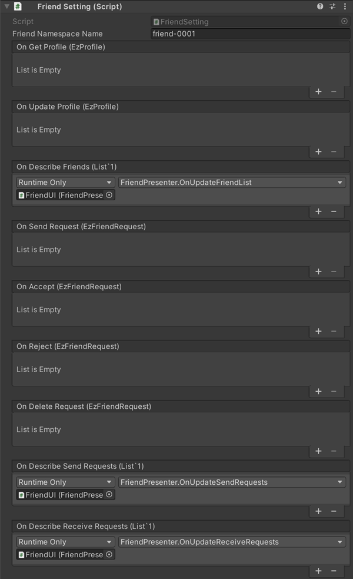

# Friend function Description

This is a sample implementation of a friend function using [GS2-Friend](https://app.gs2.io/docs/en/index.html#gs2-friend).  
The following sample applications are available: setting up a player's profile, displaying a friend list, displaying a list of sent friend registration requests, and displaying a list of friends who are registered with the site.  
It displays a list of received friend requests, a blacklist, a list of users you are following, etc.

The chat window, accessible from the callout icon at the bottom center, displays  
Tap the message balloon of another player's message you received.  
You can follow, friend request, or blacklist the target player.  
The UserId of other players is obtained by sending and receiving chat messages.


## GS2-Deploy template

- [initialize_friend_template.yaml - friend feature](../Templates/initialize_friend_template.yaml)

## FriendSetting FriendSetting




| Setting Name | Description |
|---|---|
| friendNamespaceName | GS2-Friend's namespace name

| Event | Description |
|---|---|
| onGetProfile(EzProfile) | Called when a player's profile is obtained. | onGetProfile(EzProfile)
| onUpdateProfile(EzProfile) | Called when a player's profile is updated. | onUpdateProfile(EzProfile)
| onDescribeFriends(List<EzFriendUser>) | Called when a list of friends is obtained. | onDescribeFriends(List<EzFriendUser>)
| onSendRequest(EzFriendRequest) | Called when a friend request is sent. | onSendRequest(EzFriendRequest)
| onAccept(EzFriendRequest) | Called when a friend request is accepted. | onAccept(EzFriendRequest)
| onReject(EzFriendRequest) | Called when a friend request is rejected. | onReject(EzFriendRequest)
| onDeleteRequest(EzFriendRequest) | Called when a sent friend request is deleted. | onDeleteRequest(EzFriendRequest)
| onDescribeSendRequests(List<EzFriendRequest>) | Called when a list of sent friend requests is obtained. | onDescribeSendRequests(List<EzFriendRequest>)
| onDescribeReceiveRequests(List<EzFriendRequest>) | Called when the list of received friend requests is retrieved. | onDescribeReceiveRequests(List<EzFriendRequest>)
| onGetFriend(EzFriendUser) | Called when friend information is obtained. | onGetFriend(EzFriendUser)
| onDeleteFriend(EzFriendUser) | Called when a friend is deleted. | onDeleteFriend(EzFriendUser)
| onGetPublicProfile(EzPublicProfile) | Called when a public profile of another player is obtained. | onGetPublicProfile(EzPublicProfile)
| onGetBlackList(List<string>) | Called when a blacklist is retrieved. | onGetBlackList(List<string>)
| onRegisterBlackList(EzBlackList) | Called when a user is registered on the blacklist. | onRegisterBlackList(EzBlackList)
| onUnregisterBlackList(EzBlackList) | Called when a user is removed from the blacklist. | onUnregisterBlackList(EzBlackList)
| onFollow(EzFollowUser) | Called when a player follows another player. | onFollow(EzFollowUser)
| onUnfollow(EzFollowUser) | Called when you unfollow someone you are following. | onUnfollow(EzFollowUser)
| onDescribeFollowUsers(List<EzFollowUser>) | Called when a list of followers is obtained. | onDescribeFollowUsers(List<EzFollowUser>)
| OnError(Gs2Exception error) | Called when an error occurs. | OnError(Gs2Exception error)

## Edit my profile

Tap the `Profile` button to retrieve your profile and open the `Profile` dialog.

```c#
AsyncResult<EzGetProfileResult> result = null;
yield return client.Friend.GetProfile(
callback: r => { result = r; }
session,
friendNamespaceName
);
```

After editing the text of the profile in the InputField, tap the `Update` button to update the profile.

```c#
AsyncResult<EzUpdateProfileResult> result = null;
yield return client.Friend.UpdateProfile(
    callback: r => { result = r; }
    session,
    friendNamespaceName,
    publicProfile,
    followerProfile,
    friendProfile
);
```

## List/delete friends

The `friends` button retrieves the list of friends and opens the `friends list` dialog.

```c#
AsyncResult<EzDescribeFriendsResult> result = null;
yield return client.Friend.DescribeFriends(
    callback: r => { result = r; }
    session,
    friendNamespaceName,
    false,
    30,
    null
);
```

Delete a friend or unregister a friend in the `Remove Friend` user item in the `Friends List` dialog.

```c#
AsyncResult<EzDeleteFriendResult> result = null;
yield return client.Friend.DeleteFriend(
    callback: r => { result = r; }
    session,
    friendNamespaceName,
    targetUserId
);
```

## Send a friend request

When you tap `Apply Friend` in the `Player` dialog that opens by tapping a message in the chat.  
A friend request will be sent to the target user.  
You will be waiting for the other user's approval/rejection.

```c#
AsyncResult<EzSendRequestResult> result = null;
yield return client.Friend.SendRequest(
callback: r => { result = r; }
session,
friendNamespaceName,
targetUserId
);
```

## Get list of sent/received friend request requests 

Tap the `Requests being sent` button to get a list of sent friend requests and  
Open the `Sent Friend Requests` dialog.

```c#
AsyncResult<EzDescribeSendRequestsResult> result = null;
yield return client.Friend.DescribeSendRequests(
    callback: r => { result = r; }
    session,
    friendNamespaceName
);
````

A friend request that has been sent can be deleted or withdrawn before the recipient accepts/rejects it.  
You can delete a request in the `Delete` user field of the `Sent Friend Requests` dialog, which opens with the `Sending Requests` button.

```c#
AsyncResult<EzDeleteRequestResult> result = null;
yield return client.Friend.DeleteRequest(
    callback: r => { result = r; }
    session,
    friendNamespaceName,
    targetUserId
);
```

Tap the `Receiving Requests` button to get a list of received friend requests and  
Open the `Received Friend Requests` dialog.

```c#
AsyncResult<EzDescribeReceiveRequestsResult> result = null;
yield return client.Friend.DescribeReceiveRequests(
    callback: r => { result = r; }
    session,
    friendNamespaceName
);
```

## Accept/deny friend request

Approve a friend request with the `Approve` button in the user item of the `Received Friend Requests` dialog that opens from the `Receiving Requests` button.

```c#
AsyncResult<EzAcceptResult> result = null;
yield return client.Friend.Accept(
    callback: r => { result = r; }
    session,
    friendNamespaceName,
    fromUserId
);
````

The `Deny` button rejects the friend request.

```c#
AsyncResult<EzRejectResult> result = null;
yield return client.Friend.Reject(
    callback: r => { result = r; }
    session,
    friendNamespaceName,
    fromUserId
);
```

## Unsubscribe a friend

Delete a friend or unregister a friend using the `Delete` user item in the `Friends List` dialog that opens from the `Friends` button.

```c#
AsyncResult<EzDeleteFriendResult> result = null;
yield return client.Friend.DeleteFriend(
callback: r => { result = r; }
session,
friendNamespaceName,
targetUserId
);
```

## Blacklist

Add another player to the `blacklist` in the `player` dialog that opens from a chat message.

```c#
AsyncResult<EzRegisterBlackListResult> result = null;
yield return client.Friend.RegisterBlackList(
    callback: r => { result = r; }
    session,
    friendNamespaceName,
    targetUserId
);
```

The `blacklist` button retrieves and displays a list of users on the blacklist.

```c#
AsyncResult<EzGetBlackListResult> result = null;
yield return client.Friend.GetBlackList(
callback: r => { result = r; }
session,
friendNamespaceName
);
```

Delete a blacklisted peer by `deleting` the user item in the `blacklist` dialog.

```c#
AsyncResult<EzUnregisterBlackListResult> result = null;
yield return client.Friend.UnregisterBlackList(
    callback: r => { result = r; }
    session,
    friendNamespaceName,
    targetUserId
);
```

## Follow

Follows another player in the `player` dialog that opens from a chat message.

```c#
AsyncResult<EzFollowResult> result = null;
yield return client.Friend.Follow(
callback: r => { result = r; }
session,
friendNamespaceName,
targetUserId
);
```

Retrieve and display the list of users you are following from the `Follow` button.

```c#
AsyncResult<EzDescribeFollowUsersResult> result = null;
yield return client.Friend.DescribeFollowUsers(
    callback: r => { result = r; }
    session,
    friendNamespaceName,
    true
);
```

Unfollow the person you are following by `deleting` the user item in the `Follow` dialog.

```c#
AsyncResult<EzUnfollowResult> result = null;
yield return client.Friend.Unfollow(
    callback: r => { result = r; }
    session,
    friendNamespaceName,
    targetUserId
);
````

