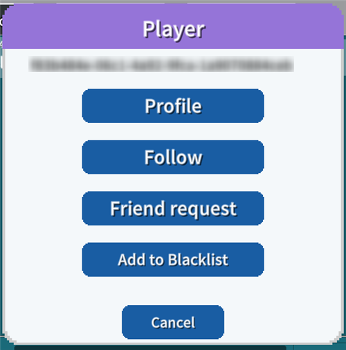
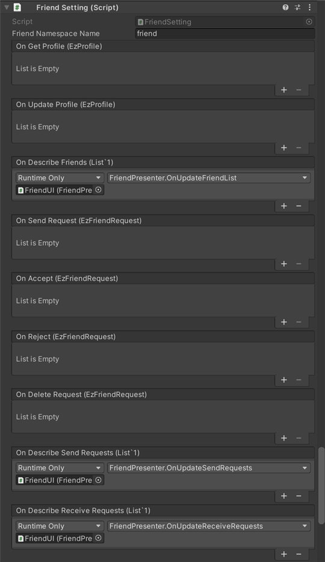
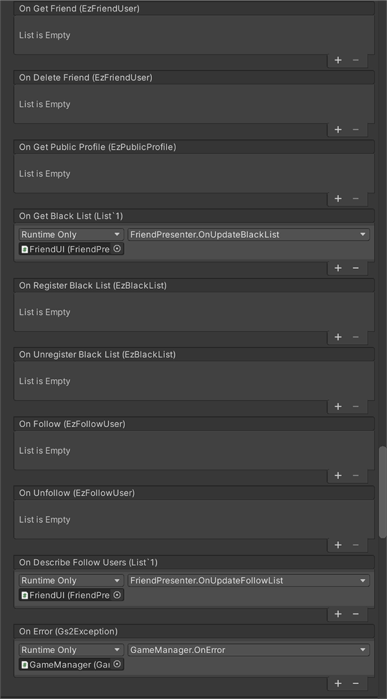

# 친구 기능 해설

[GS2-Friend](https://docs.gs2.io/ko/api_reference/friend/) 를 사용한 친구 기능 구현의 샘플입니다.  
자기 플레이어의 프로필 설정, 친구 목록의 표시, 보낸 친구 등록 요청의 목록 표시,  
받은 친구 요청의 목록 표시, 블랙리스트의 표시, 팔로우 중인 사용자의 목록 표시 등을 수행합니다.

중앙 하단의 말풍선 아이콘에서 접근할 수 있는 채팅 창에서,  
수신한 다른 플레이어의 메시지 말풍선을 탭하면,  
대상이 되는 다른 플레이어에 대한 팔로우, 친구 요청, 블랙리스트 추가를 할 수 있습니다.  
다른 플레이어의 UserId 를 가져오는 데 채팅의 송수신을 이용하고 있습니다.



## GS2-Deploy 템플릿

- [initialize_community_template.yaml - 친구 기능](../Templates/initialize_community_template.yaml)

## 친구 설정 FriendSetting




| 설정 이름 | 설명 |
|---|---|
| friendNamespaceName | GS2-Friend 의 네임스페이스 이름 |

| 이벤트 | 설명 |
|---|---|
| onGetProfile(EzProfile) | 자기 플레이어의 프로필을 가져왔을 때 호출됩니다. |
| onUpdateProfile(EzProfile) | 자기 플레이어의 프로필을 갱신했을 때 호출됩니다. |
| onDescribeFriends(List<EzFriendUser>) | 친구의 목록을 가져왔을 때 호출됩니다. |
| onSendRequest(EzFriendRequest) | 친구 요청을 보냈을 때 호출됩니다. |
| onAccept(EzFriendRequest) | 친구 요청을 수락했을 때 호출됩니다. |
| onReject(EzFriendRequest) | 친구 요청을 거절했을 때 호출됩니다. |
| onDeleteRequest(EzFriendRequest) | 보낸 친구 요청을 삭제했을 때 호출됩니다. |
| onDescribeSendRequests(List<EzFriendRequest>) | 보낸 친구 요청의 목록을 가져왔을 때 호출됩니다. |
| onDescribeReceiveRequests(List<EzFriendRequest>) | 받은 친구 요청 목록을 가져왔을 때 호출됩니다. |
| onGetFriend(EzFriendUser) | 친구 정보를 가져왔을 때 호출됩니다. |
| onDeleteFriend(EzFriendUser) | 친구를 삭제했을 때 호출됩니다. |
| onGetPublicProfile(EzPublicProfile) | 다른 플레이어의 공개 프로필을 가져왔을 때 호출됩니다. |
| onGetBlackList(List<string>) | 블랙리스트를 가져왔을 때 호출됩니다. |
| onRegisterBlackList(EzBlackList) | 블랙리스트에 사용자를 등록했을 때 호출됩니다. |
| onUnregisterBlackList(EzBlackList) | 블랙리스트에서 사용자를 삭제했을 때 호출됩니다. |
| onFollow(EzFollowUser) | 다른 플레이어를 팔로우했을 때 호출됩니다. |
| onUnfollow(EzFollowUser) | 팔로우 중인 상대를 언팔로우했을 때 호출됩니다. |
| onDescribeFollowUsers(List<EzFollowUser>) | 팔로우 중인 사용자 목록을 가져왔을 때 호출됩니다. |
| OnError(Gs2Exception error) | 오류가 발생했을 때 호출됩니다. |

## 자신의 프로필 편집

`프로필` 버튼을 탭하면, 자신의 프로필을 가져와 `프로필` 다이얼로그를 엽니다.

UniTask 활성화 시
```c#
var domain = gs2.Friend.Namespace(
    namespaceName: friendNamespaceName
).Me(
    gameSession: gameSession
).Profile();
try
{
    myProfile = await domain.ModelAsync();
    
    onGetProfile.Invoke(myProfile);
}
catch (Gs2Exception e)
{
    onError.Invoke(e);
}
```
코루틴 사용 시
```c#
var domain = gs2.Friend.Namespace(
    namespaceName: friendNamespaceName
).Me(
    gameSession: gameSession
).Profile();
var future = domain.ModelFuture();
yield return future;
if (future.Error != null)
{
    onError.Invoke(future.Error);
    yield break;
}

myProfile = future.Result;

onGetProfile.Invoke(myProfile);
```

InputField 에서 프로필의 문구를 편집한 후, `업데이트` 버튼을 탭하여 프로필을 갱신합니다.

UniTask 활성화 시
```c#
var domain = gs2.Friend.Namespace(
    namespaceName: friendNamespaceName
).Me(
    gameSession: gameSession
).Profile();
try
{
    var result = await domain.UpdateProfileAsync(
	    publicProfile: publicProfile,
	    followerProfile: followerProfile,
	    friendProfile: friendProfile
    );
    myProfile = await result.ModelAsync();
    
    onUpdateProfile.Invoke(myProfile);
}
catch (Gs2Exception e)
{
    onError.Invoke(e);
}
```
코루틴 사용 시
```c#
var domain = gs2.Friend.Namespace(
    namespaceName: friendNamespaceName
).Me(
    gameSession: gameSession
).Profile(
);
var future = domain.UpdateProfileFuture(
    publicProfile: publicProfile,
    followerProfile: followerProfile,
    friendProfile: friendProfile
);
yield return future;
if (future.Error != null)
{
    onError.Invoke(future.Error);
    yield break;
}

var result = future.Result;
var future2 = result.Model();
yield return future2;
if (future2.Error != null)
{
    onError.Invoke(future2.Error);
    yield break;
}

myProfile = future2.Result;

onUpdateProfile.Invoke(myProfile);
```

## 친구의 목록/삭제

`친구` 버튼으로 친구의 목록을 가져와 `친구 목록` 다이얼로그를 엽니다.

UniTask 활성화 시
```c#
var domain = gs2.Friend.Namespace(
    namespaceName: friendNamespaceName
).Me(
    gameSession: gameSession
);
try
{
    Friends = await domain.FriendsAsync().ToListAsync();
    
    onDescribeFriends.Invoke(Friends);
}
catch (Gs2Exception e)
{
    onError.Invoke(e);
}
```
코루틴 사용 시
```c#
Friends.Clear();
var domain = gs2.Friend.Namespace(
    namespaceName: friendNamespaceName
).Me(
    gameSession: gameSession
);
var it = domain.Friends();
while (it.HasNext())
{
    yield return it.Next();
    if (it.Error != null)
    {
	    onError.Invoke(it.Error);
	    break;
    }

    if (it.Current != null)
    {
	    Friends.Add(it.Current);
    }
}

onDescribeFriends.Invoke(Friends);
```

`친구 목록` 다이얼로그의 사용자 항목의 `삭제` 로, 친구를 삭제하고 친구 등록을 해제합니다.

UniTask 활성화 시
```c#
var domain = gs2.Friend.Namespace(
    namespaceName: friendNamespaceName
).Me(
    gameSession: gameSession
).Friend(
    withProfile: false // 프로필도 함께 가져올지?
).FriendUser(
    targetUserId: targetUserId
);
try
{
    var result = await domain.DeleteFriendAsync();
    var item = await result.ModelAsync();
    
    onDeleteFriend.Invoke(item);
}
catch (Gs2Exception e)
{
    onError.Invoke(e);
}
```
코루틴 사용 시
```c#
var domain = gs2.Friend.Namespace(
    namespaceName: friendNamespaceName
).Me(
    gameSession: gameSession
).Friend(
    withProfile: false // 프로필도 함께 가져올지?
).FriendUser(
    targetUserId: targetUserId
);
var future = domain.DeleteFriendFuture();
yield return future;
if (future.Error != null)
{
    onError.Invoke(future.Error);
    yield break;
}

var result = future.Result;
var future2 = result.Model();
yield return future2;
if (future2.Error != null)
{
    onError.Invoke(future2.Error);
    yield break;
}

var item = future2.Result;
onDeleteFriend.Invoke(item);
```

## 친구 요청의 전송

채팅 메시지를 탭하여 여는 `플레이어` 다이얼로그에서 `친구 요청` 을 탭하면,  
대상이 되는 사용자에게 친구 요청을 보냅니다.  
상대 사용자의 수락/거절을 기다리는 상태가 됩니다.

UniTask 활성화 시
```c#
var domain = gs2.Friend.Namespace(
    namespaceName: friendNamespaceName
).Me(
    gameSession: gameSession
);
try
{
    var result = await domain.SendRequestAsync(
	    targetUserId: targetUserId
    );
    var item = await result.ModelAsync();

    onSendRequest.Invoke(item);
}
catch (Gs2Exception e)
{
    onError.Invoke(e);
}
```
코루틴 사용 시
```c#
var domain = gs2.Friend.Namespace(
    namespaceName: friendNamespaceName
).Me(
    gameSession: gameSession
);
var future = domain.SendRequestFuture(
    targetUserId: targetUserId
);
yield return future;
if (future.Error != null)
{
    onError.Invoke(future.Error);
    yield break;
}
var result = future.Result;
var future2 = result.Model();
yield return future2;
var item = future2.Result;
onSendRequest.Invoke(item);
```

## 보낸/받은 친구 요청의 목록 가져오기 

`보낸 요청` 버튼을 탭하여, 보낸 친구 요청의 목록을 가져와  
`보낸 친구 요청` 다이얼로그를 엽니다.

UniTask 활성화 시
```c#
var domain = gs2.Friend.Namespace(
    namespaceName: friendNamespaceName
).Me(
    gameSession: gameSession
);
try
{
    Requests = await domain.SendRequestsAsync().ToListAsync();
    
    onDescribeSendRequests.Invoke(Requests);
}
catch (Gs2Exception e)
{
    onError.Invoke(e);
}
```
코루틴 사용 시
```c#
Requests.Clear();
var domain = gs2.Friend.Namespace(
    namespaceName: friendNamespaceName
).Me(
    gameSession: gameSession
);
var it = domain.SendRequests();
while (it.HasNext())
{
    yield return it.Next();
    if (it.Error != null)
    {
	    onError.Invoke(it.Error);
	    break;
    }

    if (it.Current != null)
    {
	    Requests.Add(it.Current);
    }
}

onDescribeSendRequests.Invoke(Requests);
```

보낸 친구 요청은 상대가 수락/거절을 하기 전이라면 삭제하여 철회할 수 있습니다.  
`보낸 요청` 버튼에서 여는 `보낸 친구 요청` 다이얼로그의 사용자 항목의 `삭제` 로, 요청을 삭제합니다.

UniTask 활성화 시
```c#
var domain = gs2.Friend.Namespace(
    namespaceName: friendNamespaceName
).Me(
    gameSession: gameSession
).SendFriendRequest(
    targetUserId: targetUserId
);
try
{
    var result = await domain.DeleteRequestAsync();
    var item = await result.ModelAsync();
    onDeleteRequest.Invoke(item);
}
catch (Gs2Exception e)
{
    onError.Invoke(e);
}
```
코루틴 사용 시
```c#
var domain = gs2.Friend.Namespace(
    namespaceName: friendNamespaceName
).Me(
    gameSession: gameSession
).SendFriendRequest(
    targetUserId: targetUserId
);
var future = domain.DeleteRequestFuture();
yield return future;
if (future.Error != null)
{
    onError.Invoke(future.Error);
    yield break;
}
var result = future.Result;
var future2 = result.Model();
yield return future2;
var item = future2.Result;
onDeleteRequest.Invoke(item);
```

`받은 요청` 버튼을 탭하여, 받은 친구 요청의 목록을 가져와  
`받은 친구 요청` 다이얼로그를 엽니다.

UniTask 활성화 시
```c#
var domain = gs2.Friend.Namespace(
    namespaceName: friendNamespaceName
).Me(
    gameSession: gameSession
);
try
{
    Requests = await domain.ReceiveRequestsAsync().ToListAsync();
    
    onDescribeReceiveRequests.Invoke(Requests);
}
catch (Gs2Exception e)
{
    onError.Invoke(e);
}
```
코루틴 사용 시
```c#
var domain = gs2.Friend.Namespace(
    namespaceName: friendNamespaceName
).Me(
    gameSession: gameSession
);
var it = domain.ReceiveRequests();
while (it.HasNext())
{
    yield return it.Next();
    if (it.Error != null)
    {
	    onError.Invoke(it.Error);
	    break;
    }

    if (it.Current != null)
    {
	    Requests.Add(it.Current);
    }
}

onDescribeReceiveRequests.Invoke(Requests);
```

## 친구 요청의 수락/거절

`받은 요청` 버튼에서 여는 `받은 친구 요청` 다이얼로그의 사용자 항목의 `수락` 버튼으로, 친구 요청을 수락합니다.

UniTask 활성화 시
```c#
var domain = gs2.Friend.Namespace(
    namespaceName: friendNamespaceName
).Me(
    gameSession: gameSession
).ReceiveFriendRequest(
    fromUserId: fromUserId
);
try
{
    var result  = await domain.AcceptAsync();
    var item = await result.ModelAsync();
    
    onAccept.Invoke(item);
}
catch (Gs2Exception e)
{
    onError.Invoke(e);
}
```
코루틴 사용 시
```c#
var domain = gs2.Friend.Namespace(
    namespaceName: friendNamespaceName
).Me(
    gameSession: gameSession
).ReceiveFriendRequest(
    fromUserId: fromUserId
);
var future = domain.AcceptFuture();
yield return future;
if (future.Error != null)
{
    onError.Invoke(future.Error);
    yield break;
}

var result = future.Result;
var future2 = result.Model();
yield return future2;
var item = future2.Result;
onAccept.Invoke(item);
```

`거절` 버튼으로, 친구 요청을 거절합니다.

UniTask 활성화 시
```c#
var domain = gs2.Friend.Namespace(
    namespaceName: friendNamespaceName
).Me(
    gameSession: gameSession
).ReceiveFriendRequest(
    fromUserId: fromUserId
);
try
{
    var result = await domain.RejectAsync();
    var item = await result.ModelAsync();
    onReject.Invoke(item);
}
catch (Gs2Exception e)
{
    onError.Invoke(e);
}
```
코루틴 사용 시
```c#
var domain = gs2.Friend.Namespace(
    namespaceName: friendNamespaceName
).Me(
    gameSession: gameSession
).ReceiveFriendRequest(
    fromUserId: fromUserId
);
var future = domain.RejectFuture();
yield return future;
if (future.Error != null)
{
    onError.Invoke(future.Error);
    yield break;
}

var result = future.Result;
var future2 = result.Model();
yield return future2;
var item = future2.Result;
onReject.Invoke(item);
```

## 친구 등록의 해제

`친구` 버튼에서 여는 `친구 목록` 다이얼로그의 사용자 항목의 `삭제` 로, 친구를 삭제하고 친구 등록을 해제합니다.

UniTask 활성화 시
```c#
var domain = gs2.Friend.Namespace(
    namespaceName: friendNamespaceName
).Me(
    gameSession: gameSession
).Friend(
    withProfile: false // 프로필도 함께 가져올지?
).FriendUser(
    targetUserId: targetUserId
);
try
{
    var result = await domain.DeleteFriendAsync();
    var item = await result.ModelAsync();
    
    onDeleteFriend.Invoke(item);
}
catch (Gs2Exception e)
{
    onError.Invoke(e);
}
```
코루틴 사용 시
```c#
var domain = gs2.Friend.Namespace(
    namespaceName: friendNamespaceName
).Me(
    gameSession: gameSession
).ReceiveFriendRequest(
    fromUserId: fromUserId
);
var future = domain.RejectFuture();
yield return future;
if (future.Error != null)
{
    onError.Invoke(future.Error);
    yield break;
}

var result = future.Result;
var future2 = result.Model();
yield return future2;
var item = future2.Result;
onReject.Invoke(item);
```

## 블랙리스트

채팅 메시지에서 여는 `플레이어` 다이얼로그에서 다른 플레이어를 `블랙리스트에 추가` 합니다.

UniTask 활성화 시
```c#
var domain = gs2.Friend.Namespace(
    namespaceName: friendNamespaceName
).Me(
    gameSession: gameSession
).BlackList();
try
{
    var result = await domain.RegisterBlackListAsync(
	    targetUserId: targetUserId
    );
    var item = await result.ModelAsync();
    onRegisterBlackList.Invoke(item);
}
catch (Gs2Exception e)
{
    onError.Invoke(e);
}
```
코루틴 사용 시
```c#
var domain = gs2.Friend.Namespace(
    namespaceName: friendNamespaceName
).Me(
    gameSession: gameSession
).BlackList();
var future = domain.UnregisterBlackListFuture(
    targetUserId: targetUserId
);
yield return future;
if (future.Error != null)
{
    onError.Invoke(future.Error);
    yield break;
}

var result = future.Result;
var future2 = result.Model();
yield return future2;
if (future2.Error != null)
{
    onError.Invoke(future2.Error);
    yield break;
}

var item = future2.Result;
onUnregisterBlackList.Invoke(item);
```

`블랙리스트` 버튼으로, 블랙리스트에 등록한 사용자의 목록을 가져와 표시합니다.

UniTask 활성화 시
```c#
var domain = gs2.Friend.Namespace(
    namespaceName: friendNamespaceName
).Me(
    gameSession: gameSession
);
try
{
    BlackList = await domain.BlackListsAsync().ToListAsync();
    onGetBlackList.Invoke(BlackList);
}
catch (Gs2Exception e)
{
    onError.Invoke(e);
}
```
코루틴 사용 시
```c#
BlackList.Clear();
var domain = gs2.Friend.Namespace(
    namespaceName: friendNamespaceName
).Me(
    gameSession: gameSession
);
var it = domain.BlackLists();
while (it.HasNext())
{
    yield return it.Next();
    if (it.Error != null)
    {
        onError.Invoke(it.Error);
        break;
    }

    if (it.Current != null)
    {
        BlackList.Add(it.Current);
    }
}

onGetBlackList.Invoke(BlackList);
```

`블랙리스트` 다이얼로그의 사용자 항목의 `삭제` 로, 블랙리스트에 등록한 상대를 해제합니다.

UniTask 활성화 시
```c#
var domain = gs2.Friend.Namespace(
    namespaceName: friendNamespaceName
).Me(
    gameSession: gameSession
).BlackList();
try
{
    var result = await domain.UnregisterBlackListAsync(
	    targetUserId: targetUserId
    );
    var item = await result.ModelAsync();
    onUnregisterBlackList.Invoke(item);
}
catch (Gs2Exception e)
{
    onError.Invoke(e);
}
```
코루틴 사용 시
```c#
var domain = gs2.Friend.Namespace(
    namespaceName: friendNamespaceName
).Me(
    gameSession: gameSession
).BlackList();
var future = domain.RegisterBlackListFuture(
    targetUserId: targetUserId
);
yield return future;
if (future.Error != null)
{
    onError.Invoke(future.Error);
    yield break;
}
var result = future.Result;
var future2 = result.Model();
yield return future2;
var item = future2.Result;
onRegisterBlackList.Invoke(item);
```

## 팔로우

채팅 메시지에서 여는 `플레이어` 다이얼로그에서, 다른 플레이어를 `팔로우` 합니다.

UniTask 활성화 시
```c#
var domain = gs2.Friend.Namespace(
    namespaceName: friendNamespaceName
).Me(
    gameSession: gameSession
).Follow(
    withProfile: false
).FollowUser(
    targetUserId: targetUserId
);
try
{
var result = await domain.FollowAsync(
    targetUserId: targetUserId
    );
    var item = await result.ModelAsync();
    onFollow.Invoke(item);
}
catch (Gs2Exception e)
{
    onError.Invoke(e);
}
```
코루틴 사용 시
```c#
var domain = gs2.Friend.Namespace(
    namespaceName: friendNamespaceName
).Me(
    gameSession: gameSession
);
var future = domain.FollowFuture(
    targetUserId: targetUserId
);
yield return future;
if (future.Error != null)
{
    onError.Invoke(future.Error);
    yield break;
}

var result = future.Result;
var future2 = result.Model();
yield return future2;
var item = future2.Result;
onFollow.Invoke(item);
```

`팔로우` 버튼에서 팔로우 중인 사용자 목록을 가져와 표시합니다.

UniTask 활성화 시
```c#
var domain = gs2.Friend.Namespace(
    namespaceName: friendNamespaceName
).Me(
    gameSession: gameSession
);
try
{
    FollowUsers = await domain.FollowsAsync().ToListAsync();

    onDescribeFollowUsers.Invoke(FollowUsers);
}
catch (Gs2Exception e)
{
    onError.Invoke(e);
}
```
코루틴 사용 시
```c#
FollowUsers.Clear();
var domain = gs2.Friend.Namespace(
    namespaceName: friendNamespaceName
).Me(
    gameSession: gameSession
).Follow(
    false
);
var it = domain.Follows();
while (it.HasNext())
{
    yield return it.Next();
    if (it.Error != null)
    {
        onError.Invoke(it.Error, null);
        break;
    }

    if (it.Current != null)
    {
        FollowUsers.Add(it.Current);
    }
}
```

`팔로우` 다이얼로그의 사용자 항목의 `삭제` 로, 팔로우 중인 상대를 언팔로우합니다.

UniTask 활성화 시
```c#
var domain = gs2.Friend.Namespace(
    namespaceName: friendNamespaceName
).Me(
    gameSession: gameSession
).Follow(
    withProfile: false
).FollowUser(
    targetUserId: targetUserId
);
try
{
    var result = await domain.UnfollowAsync();
    onUnfollow.Invoke();
}
catch (Gs2Exception e)
{
    onError.Invoke(e);
}
```
코루틴 사용 시
```c#
var domain = gs2.Friend.Namespace(
    namespaceName: friendNamespaceName
).Me(
    gameSession: gameSession
).Follow(
    withProfile: false
).FollowUser(
    targetUserId: targetUserId
);
var future = domain.UnfollowFuture();
yield return future;
if (future.Error != null)
{
    onError.Invoke(future.Error);
    yield break;
}

var result = future.Result;
var future2 = result.Model();
yield return future2;
if (future2.Error != null)
{
    onError.Invoke(future2.Error);
    yield break;
}

var item = future2.Result;
onUnfollow.Invoke(item);
```
