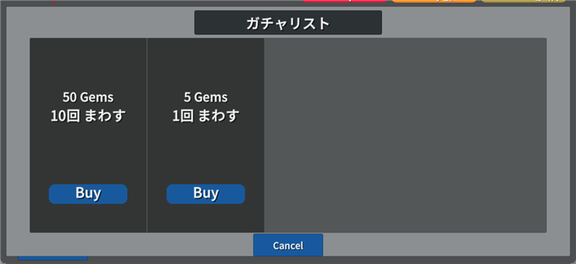
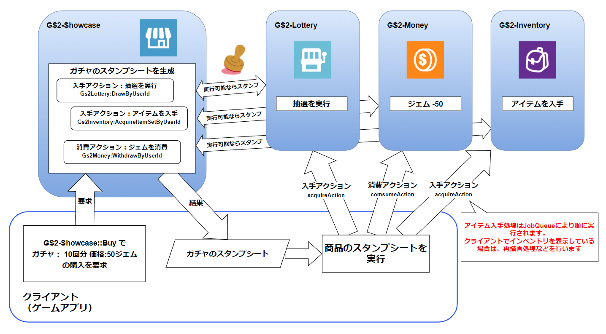

# ガチャ機能　解説

GS2-Showcase でガチャ商品を販売、GS2-Lotteryによる抽選を行い、  
専用のインベントリーにアイテムの払い出しを行うサンプルです。

# GS2-Deploy テンプレート

- [initialize_gacha_template.yaml - ガチャ機能](../Templates/initialize_gacha_template.yaml)

## Unity IAPの有効化、インポート

GS2-Moneyを使用したサンプルの動作には、Unity IAPの有効化が必要になります。  
( https://docs.unity3d.com/ja/2019.4/Manual/UnityIAPSettingUp.html )  
サービスウィンドウでのIn-App Purchasingの有効化、  
IAP パッケージのインポートを行います。

## ガチャ機能設定 GachaSetting


| 設定名 | 説明 |
|---|---|
| lotteryNamespaceName | GS2-Lottery のネームスペース名 |
| jobQueueNamespaceName | GS2-JobQueue のネームスペース名 |
| showcaseNamespaceName | GS2-Showcase のネームスペース名 |
| showcaseName | GS2-Showcase の陳列棚名 |
| showcaseKeyId | GS2-Showcase で商品購入時に発行するスタンプシートの署名計算に使用する暗号鍵 |
| lotteryKeyId | GS2-Lottery で抽選実行時に発行するスタンプシートの署名計算に使用する暗号鍵 |

| イベント | 説明 |
|---|---|
| OnGetShowcase(EzShowcase) | 商品棚情報を取得したときに呼び出されます。 |
| OnBuy(EzRoom room) | リアルタイムゲームサーバのIPアドレス・ポート情報を取得したときに呼び出されます。 |
| OnJoinPlayer(Player player) | リアルタイムゲームサーバに新しいプレイヤーが参加したときに呼び出されます。 |
| OnError(Gs2Exception error) | エラーが発生したときに呼び出されます。 |

## ガチャ商品購入処理の流れ

## ガチャストアの表示



商品リストを取得し、ストアを表示します。
```c#
AsyncResult<EzGetShowcaseResult> result = null;
yield return client.Showcase.GetShowcase(
    r =>
    {
        result = r;
    },
    session,
    showcaseNamespaceName,
    showcaseName
);
```

## 購入処理

モバイル環境であれば、Unity IAP を使用して AppStore や GooglePlay でのコンテンツの購入を行います  
（商品の登録、設定が必要になります）。  
エディター環境ではFake Storeのレシートが発行されます。  
得られたレシートを後続の処理で参照できるよう保持しておきます。
```c#
IStoreController controller = null;
UnityEngine.Purchasing.Product product = null;
string receipt = null;
if (contentsId != null)
{
    AsyncResult<Gs2.Unity.Util.PurchaseParameters> result = null;
    yield return new IAPUtil().Buy(
        r => { result = r; },
        contentsId
    );

    if (result.Error != null)
    {
        onError.Invoke(
            result.Error
        );
        yield break;
    }

    receipt = result.Result.receipt;
    controller = result.Result.controller;
    product = result.Result.product;
}
```

購入したレシートを使って、GS2-Showcase の商品を購入する処理を実行します。  
Config には GS2-Money のウォレットスロットと、レシートの内容を渡します。
```c#
// ガチャ購入 レシート情報
if (receipt != null)
{
    tempConfig.Add(
        new EzConfig
        {
            Key = "receipt", 
            Value = receipt
        }
    );

    UIManager.Instance.AddLog("receipt:" + receipt);
}
```

```c#
// Showcase 商品の購入をリクエスト
AsyncResult<EzBuyResult> result = null;
yield return client.Showcase.Buy(
    r => { result = r; },
    session,
    showcaseNamespaceName,
    showcaseName,
    displayItemId,
    tempConfig
);

if (result.Error != null)
{
    onError.Invoke(
        result.Error
    );
    yield break;
}
                
// スタンプシートを取得
stampSheet = result.Result.StampSheet;
```
取得したスタンプシートを実行します。  
GS2 SDK for Unity ではスタンプシート実行用のステートマシンが用意されていますので、そちらを利用します。  
ステートマシンの実行には GS2-Distributor と スタンプシートの署名計算に使用した暗号鍵が必要となります。

```c#
StartCoroutine(
    _stampSheetRunner.Run(
    stampSheet,
    _gachaSetting.showcaseKeyId,
    _gachaSetting.onError
    )
);
```

通常の課金通貨商品の購入スタンプシートの流れは以下になります。



発行されたスタンプシートに含まれている抽選結果をつかい、必要であればクライアントはガチャ演出等を再生したのち、  
取得したアイテムの一覧表示可能です。  
スタンプシートの実行後、サーバ側でGS2-JobQueueを使用して順にインベントリーへのアイテム入手処理が実行されます。

```c#
// Lottery 抽選処理の結果を取得
if (sheet.Action == "Gs2Lottery:DrawByUserId")
{
    // 抽選によって取得したアイテムがインベントリに追加される
    var json = JsonMapper.ToObject(sheetResult.Result);
    var result = DrawByUserIdResult.FromJson(json);
    var mergedAcquireRequests = new List<AcquireItemSetByUserIdRequest>();
    foreach (var acquireRequests in result.Items.Select(item => (
        from acquireAction in item.AcquireActions 
        where acquireAction.Action == "Gs2Inventory:AcquireItemSetByUserId" 
        select JsonMapper.ToObject(acquireAction.Request) into acquireJson 
        select AcquireItemSetByUserIdRequest.FromJson(acquireJson)
    ).ToList()))
    {
        mergedAcquireRequests.AddRange(acquireRequests);
    }
    _gachaSetting.onAcquireInventoryItem.Invoke(
        mergedAcquireRequests
    );
    // スタンプシートを実行
    StartCoroutine(
        _stampSheetRunner.Run(
            result.StampSheet,
            _gachaSetting.lotteryKeyId,
            _gachaSetting.onError
        )
    );
}
```