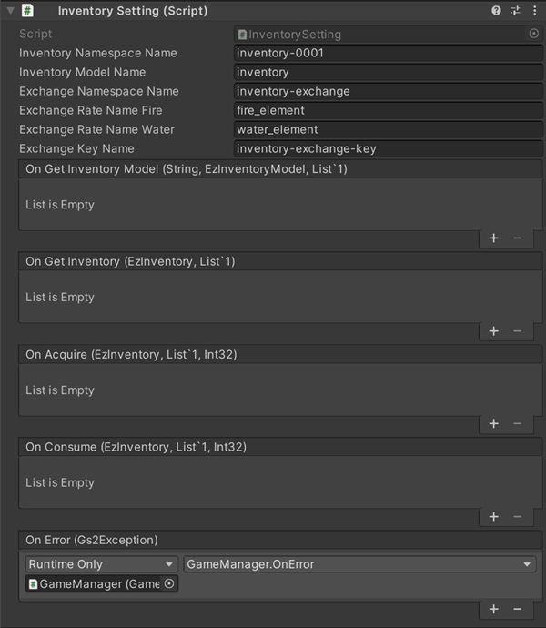

# ゴールド/インベントリ　解説

[GS2-Inventory](https://app.gs2.io/docs/index.html#gs2-inventory) によるインベントリ、アイテムを格納するバッグの実装と、  
ゴールド(ゲーム内の通貨)の管理に使用するサンプルです。  

## GS2-Deploy テンプレート

- [initialize_gold_template.yaml - ゴールド](../Templates/initialize_gold_template.yaml)
- [initialize_inventory_template.yaml - インベントリ](../Templates/initialize_inventory_template.yaml)

## ゴールド設定 GoldSetting


| 設定名 | 説明                                              |
---|-------------------------------------------------
| inventoryNamespaceName | GS2-Inventory のネームスペース名                         |
| inventoryModelName | GS2-Inventory のモデル名                             |
| ItemModelName | GS2-Inventory のCurrentItemModelMasterでのゴールドの種類名 |
| exchangeNamespaceName | GS2-Exchangeのネームスペース名                           |
| exchangeRateName | GS2-Exchangeのゴールド入手交換レート名               |

| イベント | 説明 |
---------|------
| onGetInventoryModel(string inventoryName, EzInventoryModel, List<EzItemModel>) | インベントリーモデルを取得したときに呼び出されます。 |
| onGetInventory(EzInventory inventory, List<EzItemSet> itemSets) | インベントリーの情報を取得したときに呼び出されます。 |
| onAcquire(Product product) | ゴールドを入手したときに呼び出されます。 |
| onConsume(Product product) | ゴールドを消費したときに呼び出されます。 |
| onError(Gs2Exception error) | エラーが発生したときに呼び出されます。 |

## インベントリ設定 InventorySetting



| 設定名 | 説明                                |
---|-----------------------------------
| inventoryNamespaceName | GS2-Inventory のインベントリのネームスペース名    |
| inventoryModelName | GS2-Inventoryのインベントリのモデルのネームスペース名 |
| exchangeNamespaceName | GS2-Exchangeのネームスペース名             |
| exchangeRateNameFire | GS2-Exchangeのアイテム入手交換レート名（火）      |
| exchangeRateNameWater | GS2-Exchangeのアイテム入手交換レート名（水）      |

| イベント | 説明                         |
---|----------------------------
| onGetInventoryModel(string inventoryName, EzInventoryModel, List<EzItemModel>) | インベントリーモデルを取得したときに呼び出されます。 |
| onGetInventory(EzInventory inventory, List<EzItemSet> itemSets) | インベントリーの情報を取得したときに呼び出されます。 |
| onAcquire(Product product) | アイテムを入手したときに呼び出されます。       |
| onConsume(Product product) | アイテムを消費したときに呼び出されます。       |
| OnError(Gs2Exception error) | エラーが発生したときに呼び出されます。        |

## インベントリモデル/アイテムモデルの取得

インベントリモデル及びアイテムモデルを取得します。

・UniTask有効時
```c#
{
    var domain = gs2.Inventory.Namespace(
        namespaceName: inventoryNamespaceName
    ).InventoryModel(
        inventoryName: inventoryModelName
    );
    try
    {
        Model = await domain.ModelAsync();
    }
    catch (Gs2Exception e)
    {
        onError.Invoke(e);
        return;
    }
}
{
    ItemModels.Clear();
    var domain = gs2.Inventory.Namespace(
        namespaceName: inventoryNamespaceName
    ).InventoryModel(
        inventoryName: inventoryModelName
    );
    ItemModels = await domain.ItemModelsAsync().ToListAsync();

}

onGetInventoryModel.Invoke(inventoryModelName, Model, ItemModels);
```
・コルーチン使用時
```c#
{
    var domain = gs2.Inventory.Namespace(
        namespaceName: inventoryNamespaceName
    ).InventoryModel(
        inventoryName: inventoryModelName
    );
    var future = domain.ModelFuture();
    yield return future;
    if (future.Error != null)
    {
        onError.Invoke(future.Error);
        yield break;
    }

    Model = future.Result;
}
{
    ItemModels.Clear();
    var it = gs2.Inventory.Namespace(
        namespaceName: inventoryNamespaceName
    ).InventoryModel(
        inventoryName: inventoryModelName
    ).ItemModels();
    while (it.HasNext())
    {
        yield return it.Next();
        if (it.Error != null)
        {
            onError.Invoke(it.Error);
            break;
        }

        if (it.Current != null)
        {
            ItemModels.Add(it.Current);
        }
    }
}

onGetInventoryModel.Invoke(inventoryModelName, Model, ItemModels);
```

## インベントリの取得

インベントリの情報を取得します。  
ゴールド（ゲーム内通貨）として扱うインベントリの場合は、  
対象の ItemSet の Count がゴールドの量を表しています。  

・UniTask有効時
```c#
var domain = gs2.Inventory.Namespace(
    namespaceName: inventoryNamespaceName
).Me(
    gameSession: gameSession
).Inventory(
    inventoryName: inventoryName
);
try
{
    Inventory = await domain.ModelAsync();
}
catch (Gs2Exception e)
{
    onError.Invoke(e);
}
```
・コルーチン使用時
```c#
var domain = gs2.Inventory.Namespace(
    namespaceName: inventoryNamespaceName
).Me(
    gameSession: gameSession
).Inventory(
    inventoryName: inventoryName
);
var future = domain.ModelFuture();
yield return future;
if (future.Error != null)
{
    onError.Invoke(future.Error);
    yield break;
}

Inventory = future.Result;
```

## ゴールド/アイテムの消費

ゴールド/アイテムを消費、量を減らします。

・UniTask有効時
```c#
var domain = gs2.Inventory.Namespace(
    namespaceName: inventoryNamespaceName
).Me(
    gameSession: gameSession
).Inventory(
    inventoryName: inventoryName
);
var domain2 = domain.ItemSet(
    itemName: itemName,
    itemSetName: null
);
try
{
    var result = await domain2.ConsumeAsync(
        consumeCount: consumeValue
    );
    
    itemSets  = await result.ModelAsync();

    onConsume.Invoke(Inventory, itemSets.ToList(), consumeValue);
}
catch (Gs2Exception e)
{
    onError.Invoke(e);
    return;
}
```
・コルーチン使用時
```c#
var domain = gs2.Inventory.Namespace(
    namespaceName: inventoryNamespaceName
).Me(
    gameSession: gameSession
).Inventory(
    inventoryName: inventoryName
);
var future = domain.ItemSetFuture(
    itemName: itemName,
    itemSetName: null
).Consume(
    consumeCount: consumeValue
);
yield return future;
if (future.Error != null)
{
    onError.Invoke(future.Error);
    yield break;
}
```

## ゴールド/アイテムの入手

ゴールド/アイテムを入手、量を増やします。

ゴールド/アイテムを増やすGS2-Exchangeによる交換処理を呼び出しています。
デバッグ目的の使用のサンプルです。  

```c#
// ※この処理はサンプルの動作確認のためものです。
// 実際にクライアントが直接アイテムの増加を行う実装は非推奨となります。
// *This process is only for sample confirmation.
// The actual implementation in which the client directly increases the number of items is deprecated.

{
    var domain = gs2.Exchange.Namespace(
        namespaceName: exchangeNamespaceName
    ).Me(
        gameSession: gameSession
    ).Exchange();
    try
    {
        await domain.ExchangeAsync(
            rateName: exchangeRateName,
            count: value,
            config: null
        );
    }
    catch (Gs2Exception e)
    {
        onError.Invoke(e);
        return;
    }
}
```