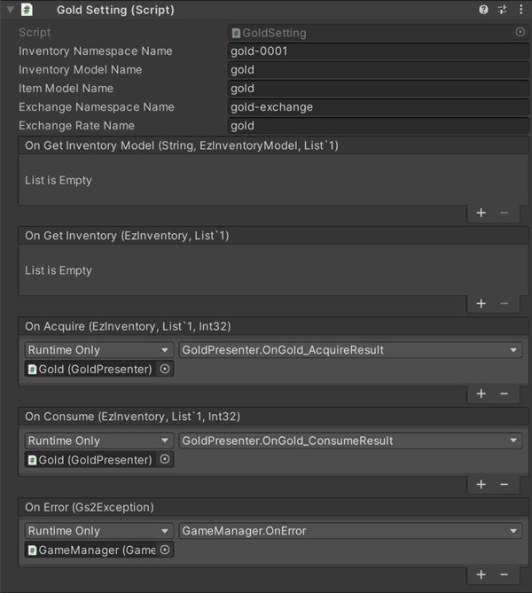

# Gold/Inventory Explanation

Inventory by [GS2-Inventory](https://app.gs2.io/docs/en/index.html#gs2-inventory), implementation of a bag to store items and  
This sample is used to manage gold (in-game currency).

## GS2-Deploy template

- [initialize_gold_template.yaml - gold](../Templates/initialize_gold_template.yaml)
- [initialize_inventory_template.yaml - inventory](../Templates/initialize_inventory_template.yaml)

## GoldSetting



| Setting Name | Description |
---|---
| inventoryNamespaceName | GS2-Inventory's namespace name
| inventoryModelName | model name of GS2-Inventory
| ItemModelName | Gold type name in GS2-Inventory's CurrentItemModelMaster |
| identifierAcquireGoldClientId | client ID of the authority that can increase gold
| identifierAcquireGoldClientSecret | client secret of the authority that can increase gold |

| Event | Description |
---------|------
| onGetInventoryModel(string inventoryName, EzInventoryModel, List<EzItemModel>) | Called when an inventory model is obtained. | onGetInventoryModel(string inventoryName, List<EzItemModel>)
| onGetInventory(EzInventory inventory, List<EzItemSet> itemSets) | Called when inventory information is retrieved. | onGetInventory(EzInventory inventory, List<EzItemSet> itemSets)
| onAcquire(Product product) | Called when gold is added. | onAcquire(Product product)
| onConsume(Product product) | Called when gold is consumed. | onConsume(Product product)
| onError(Gs2Exception error) | Called when an error occurs. | onError(Gs2Exception error)

## InventorySetting


| Setting Name | Description |
---|---
| inventoryNamespaceName | inventory namespace name for GS2-Inventory
| inventoryModelName | namespace name of the model in GS2-Inventory's inventory
| identifierAcquireItemClientId | client ID of the authority that can increase items__ |
| identifierAcquireItemClientSecret | client secret of the authority that allows item increase |

| Event | Description |
---|---
| onGetInventoryModel(string inventoryName, EzInventoryModel, List<EzItemModel>) | Called when an inventory model is obtained. | onGetInventoryModel(string inventoryName, List<EzItemModel>)
| onGetInventory(EzInventory inventory, List<EzItemSet> itemSets) | Called when inventory information is retrieved. | onGetInventory(EzInventory inventory, List<EzItemSet> itemSets)
| onAcquire(Product product) | Called when an item is added. | onAcquire(Product product)
| onConsume(Product product) | Called when an item is consumed. | onConsume(Product product)
| OnError(Gs2Exception error) | Called when an error occurs. | OnError(Gs2Exception error)

## Get inventory model

Retrieve the inventory model.

```c#
AsyncResult<EzGetInventoryModelResult> result = null;
yield return client.Inventory.GetInventoryModel(
    r => { result = r; }
    inventoryNamespaceName,
    inventoryModelName
);
```

## Get Gold/Inventory

Retrieves inventory information.  
For inventory that is handled as gold (in-game currency), the  
The Count of the target ItemSet represents the amount of gold.

```c#
AsyncResult<EzGetInventoryResult> result = null;
yield return client.Inventory.GetInventory(
    r => { result = r; }
    session,
    inventoryNamespaceName,
    inventoryName
);
```

## Consuming gold/items

Consume gold/items, reduce quantity.

```c#
AsyncResult<EzConsumeResult> result = null;
yield return client.Inventory.Consume(
    r => { result = r; }
    session,
    inventoryNamespaceName,
    inventoryModelName,
    itemModelName,
    consumeValue,
    itemSetName
);
```

## Obtain gold/items

Obtain gold/items and increase quantity.

Add a [GS2-Identifier](https://app.gs2.io/docs/en/index.html#gs2-identifier) user authorized to increase gold/items and  
from the client.  
Sample use for debugging purposes.

```c#
{
    // *This process is just to confirm that the sample works.
    // Implementations that actually increase items directly by the client are deprecated.
    
    var restSession = new Gs2RestSession(
        new BasicGs2Credential(
            identifierAcquireItemClientId,
            identifierAcquireItemClientSecret
        )
    );
    var error = false;
    yield return restSession.Open(
        r =>
        {
            if (r.Error ! = null)
            {
                Invoke(r.Error);
                Invoke(r.Error); error = true;
            }
        }
    );

    if (error)
    {
        yield return restSession.Close(() => { });
        yield break;
    }

    var restClient = new Gs2InventoryRestClient(
        restSession
    );

    yield return restClient.AcquireItemSetByUserId(
        new AcquireItemSetByUserIdRequest()
            .WithNamespaceName(inventoryNamespaceName)
            WithUserId(session.AccessToken.UserId)
            WithInventoryName(inventoryModelName)
            .WithItemName(itemModelName)
            .WithAcquireCount(value),
        r =>
        {
            if (r.Error ! = null)
            {
                Invoke(r.Error);
                Invoke(r.Error); error = true;
            }
            else
            {
                onAcquire.Invoke(
                    EzInventory.FromModel(r.Result.Inventory),
                    ToList(). r.Result.Items.Select(item => EzItemSet.FromModel(item)).ToList(),
                    value
                );
            }
        }
    );

    yield return restSession.Close(() => { });
}
```