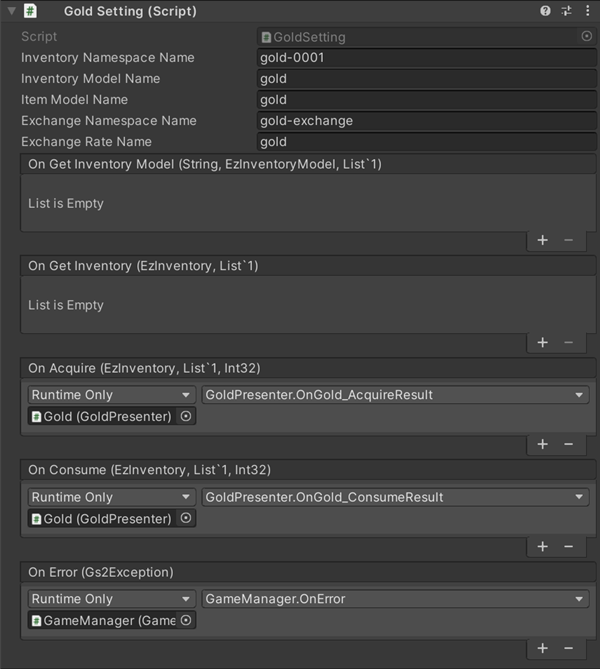
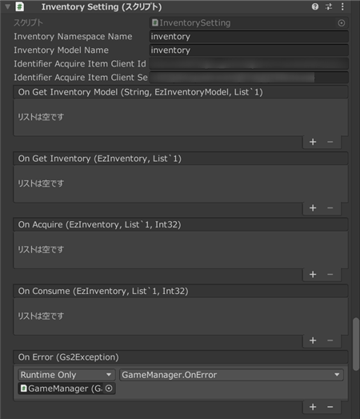

# 골드/인벤토리 해설

[GS2-Inventory](https://docs.gs2.io/ko/api_reference/inventory/) 에 의한 인벤토리, 아이템을 보관하는 가방의 구현과,  
골드(게임 내의 통화)의 관리에 사용하는 샘플입니다.  

## GS2-Deploy 템플릿

- [initialize_player_template.yaml - 골드/인벤토리](../Templates/initialize_player_template.yaml)

## 골드 설정 GoldSetting



| 설정 이름 | 설명 |
---|-------------------------------------------------
| inventoryNamespaceName | GS2-Inventory 의 네임스페이스 이름 |
| inventoryModelName | GS2-Inventory 의 모델 이름 |
| ItemModelName | GS2-Inventory 의 CurrentItemModelMaster 에서의 골드의 종류 이름 |
| exchangeNamespaceName | GS2-Exchange 의 네임스페이스 이름 |
| exchangeRateName | GS2-Exchange 의 골드 획득 교환 레이트 이름 |

| 이벤트 | 설명 |
---------|------
| onGetInventoryModel(string inventoryName, EzInventoryModel, List<EzItemModel>) | 인벤토리 모델을 가져왔을 때 호출됩니다. |
| onGetInventory(EzInventory inventory, List<EzItemSet> itemSets) | 인벤토리의 정보를 가져왔을 때 호출됩니다. |
| onAcquire(Product product) | 골드를 획득했을 때 호출됩니다. |
| onConsume(Product product) | 골드를 소비했을 때 호출됩니다. |
| onError(Gs2Exception error) | 오류가 발생했을 때 호출됩니다. |

## 인벤토리 설정 InventorySetting



| 설정 이름 | 설명 |
---|-----------------------------------
| inventoryNamespaceName | GS2-Inventory 의 인벤토리의 네임스페이스 이름 |
| inventoryModelName | GS2-Inventory 의 인벤토리의 모델의 네임스페이스 이름 |
| exchangeNamespaceName | GS2-Exchange 의 네임스페이스 이름 |
| exchangeRateNameFire | GS2-Exchange 의 아이템 획득 교환 레이트 이름(불) |
| exchangeRateNameWater | GS2-Exchange 의 아이템 획득 교환 레이트 이름(물) |

| 이벤트 | 설명 |
---|----------------------------
| onGetInventoryModel(string inventoryName, EzInventoryModel, List<EzItemModel>) | 인벤토리 모델을 가져왔을 때 호출됩니다. |
| onGetInventory(EzInventory inventory, List<EzItemSet> itemSets) | 인벤토리의 정보를 가져왔을 때 호출됩니다. |
| onAcquire(Product product) | 아이템을 획득했을 때 호출됩니다. |
| onConsume(Product product) | 아이템을 소비했을 때 호출됩니다. |
| OnError(Gs2Exception error) | 오류가 발생했을 때 호출됩니다. |

## 인벤토리 모델/아이템 모델 가져오기

인벤토리 모델 및 아이템 모델을 가져옵니다.

UniTask 활성화 시
```c#
{
    var domain = gs2.Inventory.Namespace(
        namespaceName: inventoryNamespaceName
    ).InventoryModel(
        inventoryName: inventoryModelName
    );
    try
    {
        Model = await domain.ModelAsync();
    }
    catch (Gs2Exception e)
    {
        onError.Invoke(e);
        return;
    }
}
{
    ItemModels.Clear();
    var domain = gs2.Inventory.Namespace(
        namespaceName: inventoryNamespaceName
    ).InventoryModel(
        inventoryName: inventoryModelName
    );
    ItemModels = await domain.ItemModelsAsync().ToListAsync();

}

onGetInventoryModel.Invoke(inventoryModelName, Model, ItemModels);
```
코루틴 사용 시
```c#
{
    var domain = gs2.Inventory.Namespace(
        namespaceName: inventoryNamespaceName
    ).InventoryModel(
        inventoryName: inventoryModelName
    );
    var future = domain.ModelFuture();
    yield return future;
    if (future.Error != null)
    {
        onError.Invoke(future.Error);
        yield break;
    }

    Model = future.Result;
}
{
    ItemModels.Clear();
    var it = gs2.Inventory.Namespace(
        namespaceName: inventoryNamespaceName
    ).InventoryModel(
        inventoryName: inventoryModelName
    ).ItemModels();
    while (it.HasNext())
    {
        yield return it.Next();
        if (it.Error != null)
        {
            onError.Invoke(it.Error);
            break;
        }

        if (it.Current != null)
        {
            ItemModels.Add(it.Current);
        }
    }
}

onGetInventoryModel.Invoke(inventoryModelName, Model, ItemModels);
```

## 인벤토리 가져오기

인벤토리의 정보를 가져옵니다.  
골드(게임 내 통화)로 다루는 인벤토리의 경우에는,  
대상 ItemSet 의 Count 가 골드의 양을 나타냅니다.  

UniTask 활성화 시
```c#
var domain = gs2.Inventory.Namespace(
    namespaceName: inventoryNamespaceName
).Me(
    gameSession: gameSession
).Inventory(
    inventoryName: inventoryName
);
try
{
    Inventory = await domain.ModelAsync();
}
catch (Gs2Exception e)
{
    onError.Invoke(e);
}
```
코루틴 사용 시
```c#
var domain = gs2.Inventory.Namespace(
    namespaceName: inventoryNamespaceName
).Me(
    gameSession: gameSession
).Inventory(
    inventoryName: inventoryName
);
var future = domain.ModelFuture();
yield return future;
if (future.Error != null)
{
    onError.Invoke(future.Error);
    yield break;
}

Inventory = future.Result;
```

## 골드/아이템의 소비

골드/아이템을 소비하여 양을 줄입니다.

UniTask 활성화 시
```c#
var domain = gs2.Inventory.Namespace(
    namespaceName: inventoryNamespaceName
).Me(
    gameSession: gameSession
).Inventory(
    inventoryName: inventoryName
);
var domain2 = domain.ItemSet(
    itemName: itemName,
    itemSetName: null
);
try
{
    var result = await domain2.ConsumeAsync(
        consumeCount: consumeValue
    );
    
    itemSets  = await result.ModelAsync();

    onConsume.Invoke(Inventory, itemSets.ToList(), consumeValue);
}
catch (Gs2Exception e)
{
    onError.Invoke(e);
    return;
}
```
코루틴 사용 시
```c#
var domain = gs2.Inventory.Namespace(
    namespaceName: inventoryNamespaceName
).Me(
    gameSession: gameSession
).Inventory(
    inventoryName: inventoryName
);
var future = domain.ItemSetFuture(
    itemName: itemName,
    itemSetName: null
).Consume(
    consumeCount: consumeValue
);
yield return future;
if (future.Error != null)
{
    onError.Invoke(future.Error);
    yield break;
}
```

## 골드/아이템의 획득

골드/아이템을 획득하여 양을 늘립니다.

골드/아이템을 늘리는 GS2-Exchange 에 의한 교환 처리를 호출하고 있습니다.
디버그 목적의 사용 샘플입니다.  

```c#
// ※이 처리는 샘플의 동작 확인을 위한 것입니다.
// 실제로 클라이언트가 직접 아이템을 늘리는 구현은 권장되지 않습니다.

{
    var domain = gs2.Exchange.Namespace(
        namespaceName: exchangeNamespaceName
    ).Me(
        gameSession: gameSession
    ).Exchange();
    try
    {
        var result = await domain.ExchangeAsync(
            rateName: exchangeRateName,
            count: value,
            config: null
        );
        // 트랜잭션의 자동 실행 완료를 대기(연쇄되는 트랜잭션도 포함하여 모두 대기)
        await result.WaitAsync(true);
    }
    catch (Gs2Exception e)
    {
        onError.Invoke(e);
        return;
    }
}
```
