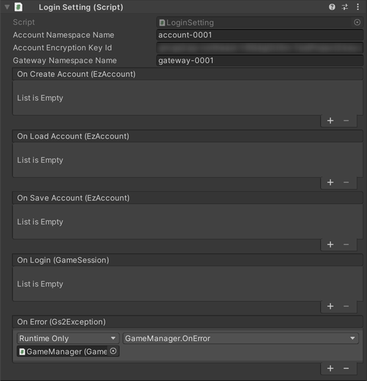

# アカウントの作成・ログイン　解説

[GS2-Account](https://app.gs2.io/docs/index.html#gs2-account) を使用してログインする機能のサンプルです。

## GS2-Deploy テンプレート

- [initialize_account_template.yaml](../Templates/initialize_account_template.yaml)

## ログイン設定 LoginSetting



| 設定名 | 説明 |
--------|-----
| accountNamespaceName | GS2-Account のネームスペース名 |
| accountEncryptionKeyId | GS2-Account でアカウント情報の暗号化に使用する GS2-Key の暗号鍵GRN |
| gatewayNamespaceName | GS2-Gateway のネームスペース名 |

| イベント | 説明 |
---------|------
| OnLoadAccount(EzAccount account) | アカウントがロードされたときに呼び出されます。 |
| OnSaveAccount(EzAccount account) | アカウントがセーブされたときに呼び出されます。 |
| OnCreateAccount(EzAccount account) | アカウントが作成されたときに呼び出されます。 |
| OnLogin(EzAccount account, GameSession session) | ログインに成功したときに呼び出されます。 |
| OnError(Gs2Exception error) | エラーが発生したときに呼び出されます。 |

## ログインの流れ

PlayerPrefsから保存済みのアカウント情報を読み込みます。  
すでに保存済みのアカウント情報があれば、ログインを実行します。  
初回起動時等、保存済みアカウント情報がないときはアカウントの新規作成を行います。

### アカウント作成

__GS2-Account__ に新規アカウントを作成します。

・UniTask有効時
```c#
var domain = gs2.Account.Namespace(
    namespaceName: accountNamespaceName
);
var result = await domain.CreateAsync();
try
{
    _account = await result.ModelAsync();
}
catch (Gs2Exception e)
{
    onError.Invoke(e);
    return;
}

onCreateAccount.Invoke(_account);
```
・コルーチン使用時
```c#
var domain = gs2.Account.Namespace(
    namespaceName: accountNamespaceName
);
var future = domain.Create();
yield return future;
if (future.Error != null)
{
    onError.Invoke(future.Error);
    yield break;
}

var future2 = future.Result.Model();
yield return future2;
if (future2.Error != null)
{
    onError.Invoke(future2.Error);
    yield break;
}

_account = future2.Result;

onCreateAccount.Invoke(_account);
```

PlayerPrefsに新規作成したアカウント情報を保存します。  

### アカウント削除

アカウント情報をローカルストレージから削除します。  
主にデバッグ目的の機能です。  
クライアント(PlayerPrefs)にすでに保存済みのアカウント情報がある状態で、それまでと異なったプロジェクト、  
ネームスペースの環境にログインを実行した場合、あるいはGS2-Deployでアカウントのスタックを削除して作成しなおした場合、  
サーバ側にアカウント情報が存在しないためログインに失敗します。  
その場合はアカウント情報を削除し、ログインを実行することで新規アカウントが作成され、ログイン可能となります。

### ログイン処理

・UniTask有効時
```c#
GameSession gameSession;
try
{
    gameSession = await _profile.LoginAsync(
        new Gs2AccountAuthenticator(
            _profile.Gs2RestSession,
            accountNamespaceName,
            accountEncryptionKeyId,
            userId,
            password
        )
    );
}
catch (Gs2Exception e)
{
    onError.Invoke(e);
    return;
}
```
・コルーチン使用
```c#
var future = _profile.LoginFuture(
    new Gs2AccountAuthenticator(
        _profile.Gs2RestSession,
        accountNamespaceName,
        accountEncryptionKeyId,
        userId,
        password
    )
);
yield return future;
if (future.Error != null)
{
    onError.Invoke(future.Error);
    yield break;
}

gameSession = future.Result;
```

ユーティリティクラスProfile でログインを行います。  
Gs2AccountAuthenticator という認証クラスに以下の引数を渡し、LoginFuture/LoginAsyncを呼び出します。  
Profile はAPIへのアクセス時、アクセストークンの期限が切れていることがエラーとして返されたときにはGs2AccountAuthenticatorを使用して再認証を自動で試みます。
アクセストークンの更新が成功したときは継続してAPIにアクセスを行うことができます。

| 引数 | 説明 |
------|-----
| Gs2RestSession session | ProfileがGS2との接続に使用するセッションクラス |
| string accountNamespaceName | GS2-Accountのネームスペース名                          |
| string keyId | GS2-Account でアカウント情報の暗号化に使用する GS2-Key の暗号鍵GRN |
| string userId | EzAccount　アカウント情報のユーザーID                      |
| string password | EzAccount　アカウント情報のパスワード                       |

アクセストークンを保持する GameSessionを受け取ります。

・UniTask有効時
```c#
var domain = gs2.Gateway.Namespace(
    namespaceName: gatewayNamespaceName
).Me(
    gameSession: gameSession
).WebSocketSession();
var result = await domain.SetUserIdAsync(
    allowConcurrentAccess: null
);
var item = await result.ModelAsync();

onLogin.Invoke(gameSession);
```
・コルーチン使用時
```c#
var domain = gs2.Gateway.Namespace(
    namespaceName: gatewayNamespaceName
).Me(
    gameSession: gameSession
).WebSocketSession();
var future = domain.SetUserId(
    allowConcurrentAccess: null
);
yield return future;
if (future.Error != null)
{
    onError.Invoke(future.Error);
    yield break;
}
var result = future.Result;
var future2 = result.Model();
yield return future2;
if (future2.Error != null)
{
    onError.Invoke(future2.Error);
    yield break;
}
var item = future2.Result;
```

[GS2-Gateway](https://app.gs2.io/docs/index.html#gs2-gateway) にログインした自分のユーザーIDを設定し、このユーザークライアントに対するプッシュ通知を受け取れるようにしています。  
チャット([GS2-Chat](Chat.md))のメッセージ投稿の通知、フレンド申請([GS2-Friend](Friend.md))等の通知、マッチメイキング([GS2-Matchmaking](Matchmaking.md))の遷移の通知を受けとるために使用します。


