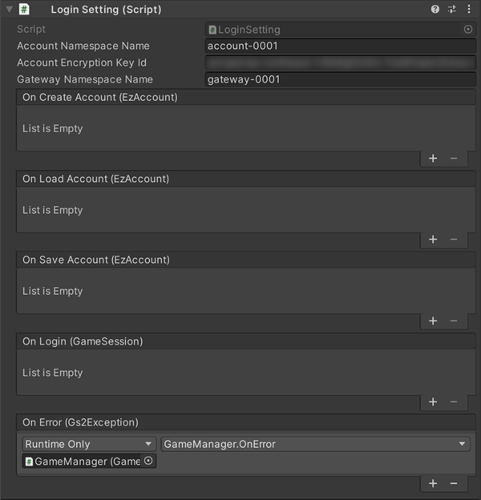

# Create and login account Explanation

Sample function to login using [GS2-Account](https://app.gs2.io/docs/en/index.html#gs2-account).

## GS2-Deploy template

- [initialize_account_template.yaml](../Templates/initialize_account_template.yaml)

## LoginSetting LoginSetting



| Setting Name           | Description                                                                      |
|------------------------|----------------------------------------------------------------------------------|
| accountNamespaceName   | GS2-Account's namespace name                                                     
| accountEncryptionKeyId | encryption key GRN of GS2-Key used to encrypt account information in GS2-Account 
| gatewayNamespaceName   | namespace name of GS2-Gateway                                                    

| Event                                           | Description                                     |                                                  |
--------------------------------------------------|-------------------------------------------------|--------------------------------------------------|
| OnLoadAccount(EzAccount account)                | Called when an account is loaded.               | OnLoadAccount(EzAccount account)                 
| OnSaveAccount(EzAccount account)                | Called when an account is saved.                | OnSaveAccount(EzAccount account)                 
| OnCreateAccount(EzAccount account)              | Called when an account is created.              | OnCreateAccount(EzAccount account)               
| OnLogin(EzAccount account, GameSession session) | Called when login succeeds.                     | OnLogin(EzAccount account, GameSession session)  
| OnError(Gs2Exception error)                     | Called when an error occurs.                    | OnError(Gs2Exception error)                      

## Login Flow

Loads the saved account information from PlayerPrefs.  
If the account information has already been saved, login is performed.  
If there is no saved account information, such as at first startup, a new account is created.

### Create Account

Create an account with __GS2-Account__.

When UniTask is enabled
```c#
var domain = gs2.Account.Namespace(
    namespaceName: accountNamespaceName
);
var result = await domain.CreateAsync();
try
{
    _account = await result.ModelAsync();
}
catch (Gs2Exception e)
{
    onError.Invoke(e);
    return;
}

onCreateAccount.Invoke(_account);
```
When coroutine is used
```c#
var domain = gs2.Account.Namespace(
    namespaceName: accountNamespaceName
);
var future = domain.Create();
yield return future;
if (future.Error != null)
{
    onError.Invoke(future.Error);
    yield break;
}

var future2 = future.Result.Model();
yield return future2;
if (future2.Error != null)
{
    onError.Invoke(future2.Error);
    yield break;
}

_account = future2.Result;

onCreateAccount.Invoke(_account);
```

Save the newly created account information in PlayerPrefs.  

### delete account

Deletes account information from local storage.  
This function is mainly for debugging purposes.  
If a login is performed to an environment with a different project or namespace from the account information already stored on the client, the account information will be deleted from local storage.  
The login will fail because the account information does not exist on the server side. In such a case, delete the account information, and then click  
A new account will be created and login will be possible.

### Login Process

When UniTask is enabled
```c#
GameSession gameSession;
try
{
    gameSession = await _domain.LoginAsync(
        new Gs2AccountAuthenticator(
            accountSetting: new AccountSetting
            {
                accountNamespaceName = accountNamespaceName,
                keyId = accountEncryptionKeyId
            },
            // Set user ID to receive push notifications from the server
            gatewaySetting: new GatewaySetting
            {
                gatewayNamespaceName = gatewayNamespaceName,
                allowConcurrentAccess = false
            }
        ),
        userId,
        password
    );
}
catch (Gs2Exception e)
{
    onError.Invoke(e, null);
    return;
}

onLogin.Invoke(gameSession);
```
When coroutine is used
```c#
var future = _domain.LoginFuture(
    new Gs2AccountAuthenticator(
        accountSetting: new AccountSetting
        {
            accountNamespaceName = accountNamespaceName,
            keyId = accountEncryptionKeyId
        },
        // Set user ID to receive push notifications from the server
        gatewaySetting: new GatewaySetting
        {
            gatewayNamespaceName = gatewayNamespaceName,
            allowConcurrentAccess = false
        }
    ),
    userId,
    password
);
yield return future;
if (future.Error != null)
{
    onError.Invoke(future.Error, null);
    yield break;
}

gameSession = future.Result;
```

Log in with the utility class Profile.  
Pass the following arguments to an authentication class called Gs2AccountAuthenticator and call LoginFuture/LoginAsync.  
Profile will automatically attempt to re-authenticate using Gs2AccountAuthenticator when an error is returned that the access token has expired when accessing the API.
When the access token is successfully renewed, access to the API can be continued.

| Arguments                     | Description                                                                                             |
|-------------------------------|---------------------------------------------------------------------------------------------------------|
| AccountSetting accountSetting | Information for authentication with GS2-Account |
|  string accountNamespaceName   | Namespace name of GS2-Account                                                                           |
|  string keyId                  | The encryption key GRN of the GS2-Key used to encrypt account information in GS2-Account                |
| GatewaySetting gatewaySetting | Call Gs2Gateway.SetUserId after login to set the user ID to receive push notifications from the server  |
|  string gatewayNamespaceName |  Namespace Name of GS2-Gateway                                   |
|  string allowConcurrentAccess |  Whether to allow multiple logins with the same user ID          |
| VersionSetting versionSetting | Call Gs2Version.CheckVersion after login to perform version check    
|  string versionNamespaceName | GS2-Version namespace name      |
|  EzTargetVersion targetVersions | Game Version Information      |
| string userId                 | User ID for EzAccount account information                                                               |
| string password               | Password for EzAccount account information                                                              |

Receive a GameSession that holds an access token.  
Set your own user ID logged into [GS2-Gateway](https://app.gs2.io/docs/index.html#gs2-gateway) to receive push notifications for this user client.  
To receive notifications of chat ([GS2-Chat](Chat.md)) message posts, friend requests ([GS2-Friend](Friend.md)), etc., and matchmaking ([GS2-Matchmaking](Matchmaking.md)) transitions Use.


