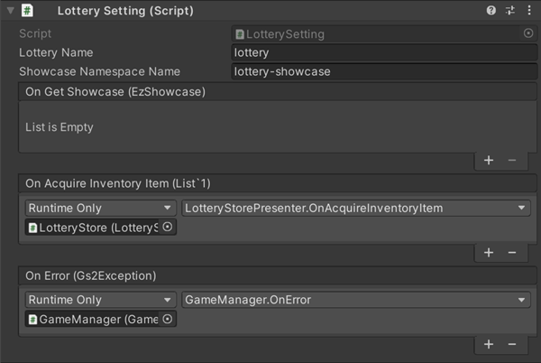
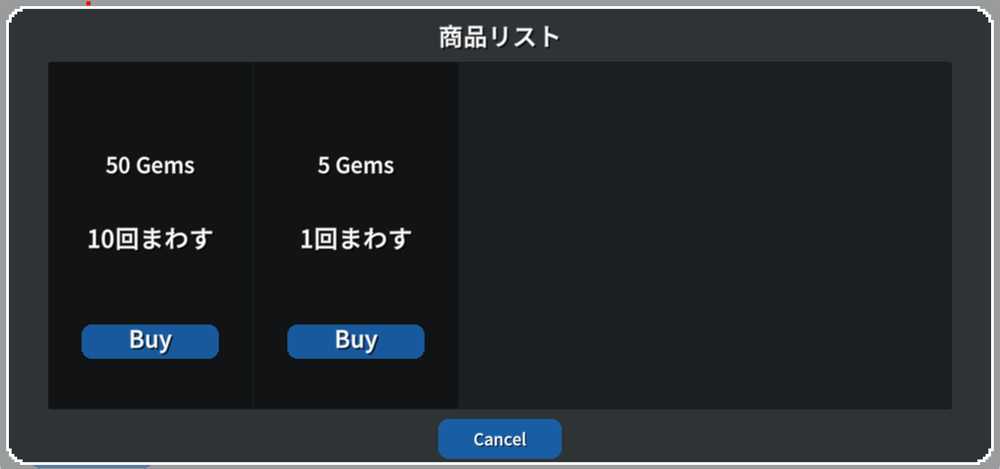
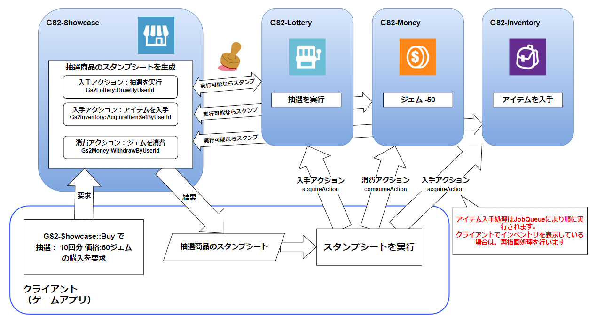

# 抽選機能　解説

[GS2-Showcase](https://app.gs2.io/docs/index.html#gs2-showcase) で商品を販売、[GS2-Lottery](https://app.gs2.io/docs/index.html#gs2-lottery) による抽選を行い、  
専用のインベントリーにアイテムの払い出しを行うサンプルです。

## GS2-Deploy テンプレート

- [initialize_lottery_template.yaml - 抽選機能](../Templates/initialize_lottery_template.yaml)

## Unity IAPの有効化、インポート

GS2-Moneyを使用したサンプルの動作には、Unity IAPの有効化が必要になります。  
( https://docs.unity3d.com/ja/2019.4/Manual/UnityIAPSettingUp.html )  
サービスウィンドウでのIn-App Purchasingの有効化、  
IAP パッケージのインポートを行います。

## 抽選機能設定 LotterySetting



| 設定名 | 説明                                                     |
|---|--------------------------------------------------------|
| lotteryName | GS2-Lotteryの抽選マスターデータの種類名, GS2-Showcaseの商品棚マスターデータの商品名 |
| ShowcaseNamespaceName | GS2-Showcaseのネームスペース名                                 |

| イベント                                                        | 説明 |
|-------------------------------------------------------------|---|
| OnGetShowcase(EzShowcase)                                   | 商品棚情報を取得したときに呼び出されます。 |
| OnAcquireInventoryItem(List<AcquireItemSetByUserIdRequest>) | 抽選でアイテムを入手したときに呼び出されます。 |
| OnError(Gs2Exception error)                                 | エラーが発生したときに呼び出されます。 |

## 抽選商品購入処理の流れ

### ストアの表示



商品リストを取得し、ストアを表示します。

・UniTask有効時
```c#
var domain = gs2.Showcase.Namespace(
    namespaceName: showcaseNamespaceName
).Me(
    gameSession: gameSession
).Showcase(
    showcaseName: showcaseName
);
try
{
    Showcase = await domain.ModelAsync();
    
    onGetShowcase.Invoke(Showcase);
}
catch (Gs2Exception e)
{
    onError.Invoke(e);
    return e;
}
return null;
```
・コルーチン使用時
```c#
var domain = gs2.Showcase.Namespace(
    namespaceName: showcaseNamespaceName
).Me(
    gameSession: gameSession
).Showcase(
    showcaseName: showcaseName
);
var future = domain.Model();
yield return future;
if (future.Error != null)
{
    onError.Invoke(
        future.Error
    );
    callback.Invoke(future.Error);
    yield break;
}

Showcase = future.Result;

onGetShowcase.Invoke(Showcase);

callback.Invoke(null);
```

### 購入処理

GS2-Showcaseに商品の購入をリクエストします。  
displayItemId　に購入する商品の陳列商品IDを指定します。  
quantity　に購入する数量を指定します。  

・UniTask有効時
```c#
// 商品の購入をリクエスト
// Request to purchase an item
var domain = gs2.Showcase.Namespace(
    namespaceName: showcaseNamespaceName
).Me(
    gameSession: gameSession
).Showcase(
    showcaseName: showcaseName
);
try
{
    var result = await domain.BuyAsync(
        displayItemId: displayItemId,
        quantity: null,
        config: tempConfig.ToArray()
    );
}
catch (Gs2Exception e)
{
    onError.Invoke(e);
    return;
}
```
・コルーチン使用時
```c#
// 商品の購入をリクエスト
// Request to purchase an item
var domain = gs2.Showcase.Namespace(
    namespaceName: showcaseNamespaceName
).Me(
    gameSession: gameSession
).Showcase(
    showcaseName: showcaseName
);
var future = domain.Buy(
    displayItemId: displayItemId,
    config: tempConfig.ToArray()
);
yield return future;
if (future.Error != null)
{
    onError.Invoke(
        future.Error
    );
}
```

GS2-Showcaseで抽選商品購入スタンプシートが発行されます。  
GS2Domainクラス（ソース内で "gs2" ）を使用した実装ではクライアント側でのスタンプシートの処理は __自動実行__ されます。  

抽選結果の商品リストは以下のコールバックで取得できます。

```c#
// 抽選処理の結果を取得
// Obtain the results of the lottery process
void LotteryResult(
    string _namespace,
    string lotteryName,
    DrawnPrize[] prizes
)
{
    // 抽選で獲得したアイテム
    // Items won in the lottery
    var DrawnPrizes = new List<EzDrawnPrize>();
    foreach (var prize in prizes)
    {
        var item = EzDrawnPrize.FromModel(prize);
        DrawnPrizes.Add(item);
    }

    onAcquireInventoryItem.Invoke(
        DrawnPrizes
    );
}

// 抽選結果取得コールバックを登録
// Register lottery result acquisition callback
Gs2Lottery.Domain.Gs2Lottery.DrawnResult = LotteryResult;
```

抽選結果が取得できたタイミングで、実際のゲーム内では必要であればクライアントは抽選演出、取得したアイテムの一覧表示等を行います。  
スタンプシートの実行後、[GS2-JobQueue](https://app.gs2.io/docs/index.html#gs2-jobqueue) が順にインベントリーへのアイテム入手処理を実行します。
クライアントがジョブキューを実行することで、実際に報酬を受け取る処理が実行されます。

ジョブキューを進行させる処理、Gs2Domain.Dispatch を実行しておくことで、ジョブキューを自動で継続進行できます。

・UniTask有効時
```c#
async UniTask Impl()
{
    while (true)
    {
        await _domain.DispatchAsync(_session);

        await UniTask.Yield();
    }
}

_stampSheetDispatchCoroutine = StartCoroutine(Impl().ToCoroutine());
```
・コルーチン使用時
```c#
IEnumerator Impl()
{
    while (true)
    {
        var future = _domain.Dispatch(_session);
        yield return future;
        if (future != null)
        {
            yield break;
        }
        if (future.Result)
        {
            break;
        }
        yield return null;
    }
}
_stampSheetDispatchCoroutine = StartCoroutine(Impl());
```

抽選商品の購入スタンプシートの流れは以下のようになります。


