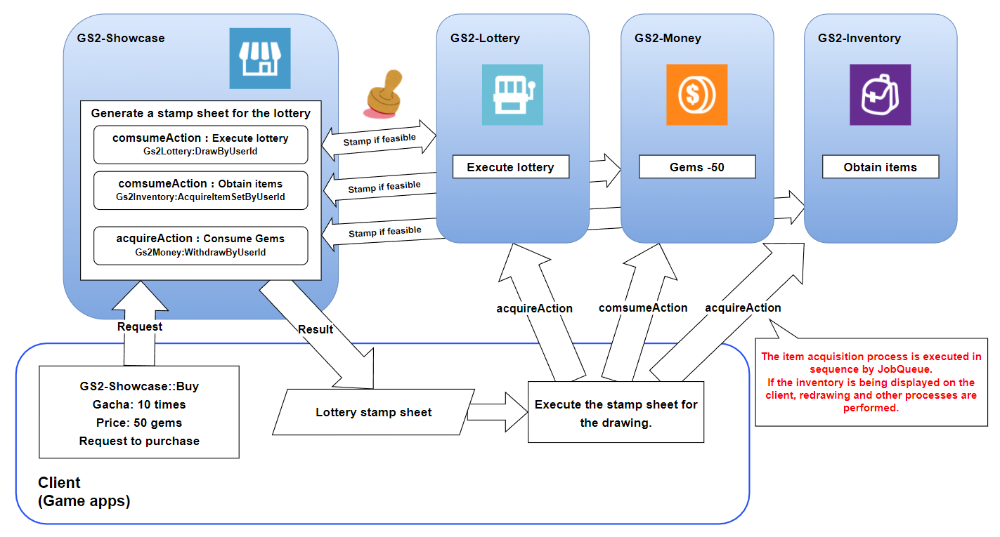

# Lottery Function Explanation

[GS2-Showcase](https://app.gs2.io/docs/en/index.html#gs2-showcase) sells lottery products, [GS2-Lottery](https://app.gs2.io/docs/en/index.html#gs2-lottery), and then the lottery is drawn by the  
This sample shows the payout of items to a dedicated inventory.

## GS2-Deploy template

- [initialize_lottery_template.yaml - lottery function](../Templates/initialize_lottery_template.yaml)

## Enable and import Unity IAPs

Unity IAP must be enabled for the sample to work with GS2-Money.  
( https://docs.unity3d.com/ja/2019.4/Manual/UnityIAPSettingUp.html )  
Enable In-App Purchasing in the Services window, and  
Import the IAP package.

## Lottery Function Setting


| Setting Name | Description |
|---|---|
| lotteryNamespaceName | namespace name of GS2-Lottery
| jobQueueNamespaceName | GS2-JobQueue's namespace name
| showcaseNamespaceName | GS2-Showcase namespace name
| showcaseName | GS2-Showcase display shelf name |
| showcaseKeyId | cryptographic key used for signature calculation for stamp sheets issued at GS2-Showcase for merchandise purchases
| lotteryKeyId | cryptographic key used for signature calculation of stamp sheets issued at the time of lottery execution in GS2-Lottery

| Event | Description |
|---|---|
| OnGetShowcase(EzShowcase) | Called when the product shelf information is obtained. | OnGetShowcase(EzShowcase)
| OnBuy(EzRoom room) | Called when IP address and port information of the Realtime game server is obtained. | OnBuy(EzRoom room)
| OnJoinPlayer(Player player) | Called when a new player joins the Realtime game server. | OnJoinPlayer(Player player)
| OnError(Gs2Exception error) | Called when an error occurs. | OnError(Gs2Exception error)

## Process flow for purchasing lottery products

### Display of lottery store

Retrieves the product list and displays the store.

```c#
AsyncResult<EzGetShowcaseResult> result = null;
yield return client.Showcase.GetShowcase(
    r =>
    {
        result = r;
    },
    session,
    showcaseNamespaceName,
    showcaseName
);
````

### Purchase Processing

If you are in a mobile environment, use the Unity IAP to purchase content from the AppStore or GooglePlay  
(The product must be registered and configured).  
In the editor environment, a Fake Store receipt will be issued.  
The resulting receipt is retained for reference in subsequent processing.

```c#
IStoreController controller = null;
UnityEngine.Purchasing.Product product = null;
Product product = null; string receipt = null;
if (contentsId ! = null)
{
    AsyncResult<Gs2.Unity.Util.PurchaseParameters> result = null;
    yield return new IAPUtil().Buy(
        r => { result = r; }
        contentsId
    );

    if (result.Error ! = null)
    {
        onError.Invoke(
            Error
        );
        yield break;
    }

    receipt = result.result.receipt;
    controller = result.Result.controller;
    product = result.Result.product;
}
```

Execute the process of purchasing an item from __GS2-Showcase__ using the purchase receipt.  
Config is passed a __GS2-Money__ wallet slot and the contents of the receipt.

```c#
// Lottery purchase receipt information
if (receipt ! = null)
{
    tempConfig.Add(
        new EzConfig
        {
            Key = "receipt", 
            Value = receipt
        }
    );

    UIManager.Instance.AddLog("receipt:" + receipt);
}
```

```c#
// Request the purchase of Showcase products.
AsyncResult<EzBuyResult> result = null;
yield return client.Showcase.Buy(
    r => { result = r; }
    session,
    showcaseNamespaceName,
    showcaseName,
    displayItemId,
    tempConfig
);

if (result.Error ! = null)
{
    onError.Invoke(
        Error
    );
    yield break;
}
                
// Get the stamp sheet
StampSheet = result.Result.StampSheet;
```

The obtained stamp sheet is executed.  
GS2 SDK for Unity provides a state machine for stamp sheet execution.  
To run the state machine, you will need [GS2-Distributor](https://app.gs2.io/docs/en/index.html#gs2-distributor) and the encryption key used to calculate the stamp sheet signature.

```c#
StartCoroutine(
    _stampSheetRunner.Run(
    stampSheet,
    _lotterySetting.showcaseKeyId,
    _lotterySetting.onError
    )
);
```

The normal flow of a stamp sheet for the purchase of billed currency items is as follows



Using the lottery results included in the issued stamp sheet, the client can play the lottery performance, etc., if necessary, and then use the  
The list of acquired items can be displayed.  
After the stamp sheet is executed, the server uses [GS2-JobQueue](https://app.gs2.io/docs/en/index.html#gs2-jobqueue) to process the items in the inventory in order.

```c#
// Get the result of the Lottery drawing process
if (sheet.Action == "Gs2Lottery:DrawByUserId")
{
    // Items acquired by lottery are added to the inventory
    var json = JsonMapper.ToObject(sheetResult.Result);
    var result = DrawByUserIdResult.FromJson(json);
    var mergedAcquireRequests = new List<AcquireItemSetByUserIdRequest>();
    foreach (var acquireRequests in result.Items.Select(item => (
        from acquireAction in item.AcquireActions 
        where acquireAction.Action == "Gs2Inventory:AcquireItemSetByUserId" 
        select JsonMapper.ToObject(acquireAction.Request) into acquireJson 
        select AcquireItemSetByUserIdRequest.FromJson(acquireJson)
    ).ToList()))
    {
        AddRange(acquireRequests);
    }
    _lotterySetting.onAcquireInventoryItem.Invoke(
        mergedAcquireRequests
    );
    // Execute stamp sheet
    StartCoroutine(
        _stampSheetRunner.Run(
            StampSheet,
            _lotterySetting.lotteryKeyId,
            _lotterySetting.onError
        )
    );
}
```