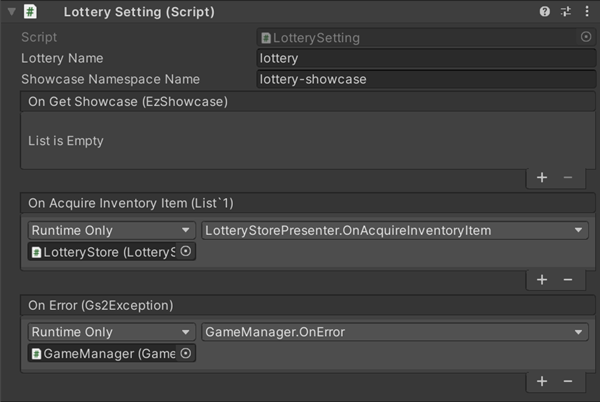

# Lottery Function Explanation

[GS2-Showcase](https://app.gs2.io/docs/en/index.html#gs2-showcase) sells lottery products, [GS2-Lottery](https://app.gs2.io/docs/en/index.html#gs2-lottery), and then the lottery is drawn by the  
This sample shows the payout of items to a dedicated inventory.

## GS2-Deploy template

- [initialize_lottery_template.yaml - lottery function](../Templates/initialize_lottery_template.yaml)

## Enable and import Unity IAPs

Unity IAP must be enabled for the sample to work with GS2-Money2.  
( https://docs.unity3d.com/ja/2019.4/Manual/UnityIAPSettingUp.html )  
Enable In-App Purchasing in the Services window, and  
Import the IAP package.

## Lottery Function Setting



| Setting Name | Description |
|---|---|
| lotteryName | type name of lottery master data in GS2-Lottery, product name of merchandise shelf master data in GS2-Showcase |
| showcaseNamespaceName | GS2-Showcase namespace name |

| Event | Description |
|---|---|
| OnGetShowcase(EzShowcase) | Called when the product shelf information is obtained. |
| OnAcquireInventoryItem(List<AcquireItemSetByUserIdRequest>) | It is called when an item is obtained in the lottery. |
| OnError(Gs2Exception error) | Called when an error occurs. |

## Process flow for purchasing lottery products

### Display of lottery store


Retrieves the product list and displays the store.

When UniTask is enabled
```c#
var domain = gs2.Showcase.Namespace(
    namespaceName: showcaseNamespaceName
).Me(
    gameSession: gameSession
).Showcase(
    showcaseName: showcaseName
);
try
{
    Showcase = await domain.ModelAsync();
    
    onGetShowcase.Invoke(Showcase);
}
catch (Gs2Exception e)
{
    onError.Invoke(e);
    return e;
}
return null;
```
When coroutine is used
```c#
var domain = gs2.Showcase.Namespace(
    namespaceName: showcaseNamespaceName
).Me(
    gameSession: gameSession
).Showcase(
    showcaseName: showcaseName
);
var future = domain.ModelFuture();
yield return future;
if (future.Error != null)
{
    onError.Invoke(
        future.Error
    );
    callback.Invoke(future.Error);
    yield break;
}

Showcase = future.Result;

onGetShowcase.Invoke(Showcase);

callback.Invoke(null);
```

### Purchase Processing

Requests GS2-Showcase to purchase an item.  
Specify the display item ID of the item to be purchased in displayItemId.  
Specify the quantity to be purchased in quantity.  

When UniTask is enabled
```c#
// Request to purchase an item
var domain = gs2.Showcase.Namespace(
    namespaceName: showcaseNamespaceName
).Me(
    gameSession: gameSession
).Showcase(
    showcaseName: showcaseName
);
try
{
    var result = await domain.BuyAsync(
        displayItemId: displayItemId,
        quantity: null,
        config: tempConfig.ToArray()
    );
}
catch (Gs2Exception e)
{
    onError.Invoke(e);
    return;
}
```
When coroutine is used
```c#
// Request to purchase an item
var domain = gs2.Showcase.Namespace(
    namespaceName: showcaseNamespaceName
).Me(
    gameSession: gameSession
).Showcase(
    showcaseName: showcaseName
);
var future = domain.BuyFuture(
    displayItemId: displayItemId,
    config: tempConfig.ToArray()
);
yield return future;
if (future.Error != null)
{
    onError.Invoke(
        future.Error
    );
}
```

A stamp sheet for purchasing lottery items is issued by GS2-Showcase.  
In implementations using the GS2Domain class ("gs2" in the source), stamp sheet processing on the client side is __auto-executed__.  
In the initialize_lottery_template.yaml template, stamp sheet execution is set to client execution.

```yaml
      TransactionSetting:
        EnableAutoRun: false
```

The list of products resulting from the lottery can be retrieved with the following callback.

```c#
// Obtain the results of the lottery process
void LotteryResult(
    string _namespace,
    DrawByUserIdRequest request,
    DrawByUserIdResult result
)
{
    // Items won in the lottery
    var DrawnPrizes = new List<EzDrawnPrize>();
    if (result == null) return;
    var prizes = result.Items;
    foreach (var prize in prizes)
    {
        var item = EzDrawnPrize.FromModel(prize);
        DrawnPrizes.Add(item);
    }

    onAcquireInventoryItem.Invoke(
        DrawnPrizes
    );
}

// Register lottery result acquisition callback
Gs2Lottery.Domain.Gs2Lottery.DrawByUserIdComplete.AddListener( LotteryResult );
```

At the time the lottery results are obtained, the client performs the lottery production, displays the list of items obtained, etc., if necessary in the actual game.  
After the stamp sheet is executed, [GS2-JobQueue](https://app.gs2.io/docs/index.html#gs2-jobqueue) in turn executes the process of acquiring items to the inventory.
When the client executes the job queue, the process of actually receiving the reward is executed.

The job queue can be continued automatically by running Gs2Domain.Dispatch, a process that advances the job queue.

When UniTask is enabled
```c#
async UniTask Impl()
{
    while (true)
    {
        await _domain.DispatchAsync(_session);

        await UniTask.Yield();
    }
}

_stampSheetDispatchCoroutine = StartCoroutine(Impl().ToCoroutine());
```
When coroutine is used
```c#
IEnumerator Impl()
{
    while (true)
    {
        var future = _domain.DispatchFuture(_session);
        yield return future;
        if (future != null)
        {
            yield break;
        }
        if (future.Result)
        {
            break;
        }
        yield return null;
    }
}
_stampSheetDispatchCoroutine = StartCoroutine(Impl());
```

The purchase stamp sheet process for raffle items is as follows


