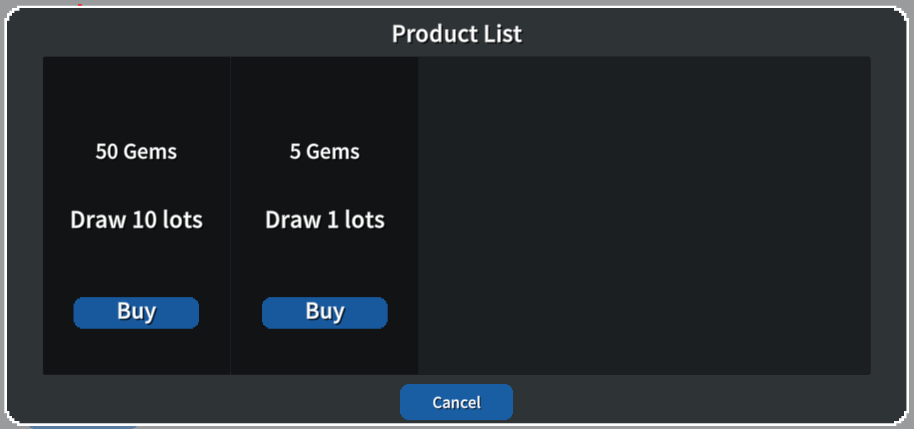
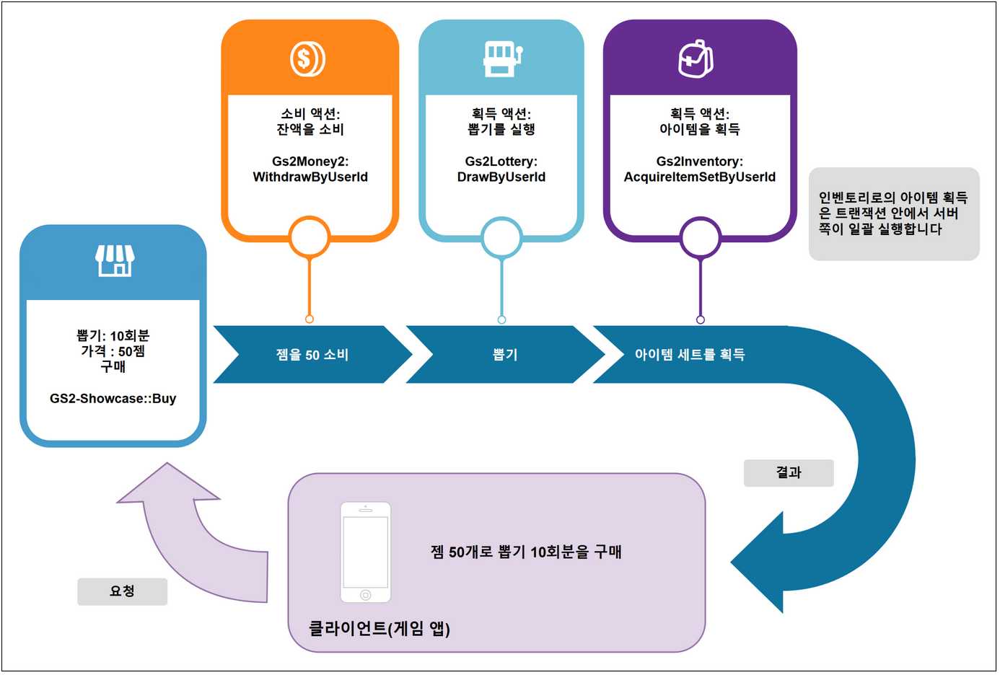

# 뽑기 기능 해설

[GS2-Showcase](https://docs.gs2.io/ko/api_reference/showcase/) 로 상품을 판매하고, [GS2-Lottery](https://docs.gs2.io/ko/api_reference/lottery/) 에 의한 뽑기를 수행하여,  
전용 인벤토리에 아이템을 지급하는 샘플입니다.

## GS2-Deploy 템플릿

- [initialize_gamecycle_template.yaml - 뽑기 기능](../Templates/initialize_gamecycle_template.yaml)

## Unity IAP 의 활성화, 임포트

GS2-Money2 를 사용한 샘플의 동작에는 Unity IAP 의 활성화가 필요합니다.  
[Unity IAP 설정](https://docs.unity3d.com/Manual/UnityIAPSettingUp.html)  
서비스 창에서 In-App Purchasing 을 활성화하고,  
IAP 패키지를 임포트합니다.

## 뽑기 기능 설정 LotterySetting


| 설정 이름 | 설명 |
|-----------------------|--------------------------------------------------------------------------|
| lotteryName           | GS2-Lottery 의 뽑기 마스터 데이터의 종류 이름, GS2-Showcase 의 상품 진열대 마스터 데이터의 상품 이름 |
| ShowcaseNamespaceName | GS2-Showcase 의 네임스페이스 이름 |

| 이벤트 | 설명 |
|-------------------------------------------------------------|---------------------------------------|
| OnGetShowcase(EzShowcase)                                   | 상품 진열대 정보를 가져왔을 때 호출됩니다. |
| OnAcquireInventoryItem(List<AcquireItemSetByUserIdRequest>) | 뽑기로 아이템을 획득했을 때 호출됩니다. |
| OnError(Gs2Exception error)                                 | 오류가 발생했을 때 호출됩니다. |

## 뽑기 상품 구매 처리의 흐름

### 상점의 표시



상품 목록을 가져와 상점을 표시합니다.

UniTask 활성화 시
```c#
var domain = gs2.Showcase.Namespace(
    namespaceName: showcaseNamespaceName
).Me(
    gameSession: gameSession
).Showcase(
    showcaseName: showcaseName
);
try
{
    Showcase = await domain.ModelAsync();
    
    onGetShowcase.Invoke(Showcase);
}
catch (Gs2Exception e)
{
    onError.Invoke(e);
    return e;
}
return null;
```
코루틴 사용 시
```c#
var domain = gs2.Showcase.Namespace(
    namespaceName: showcaseNamespaceName
).Me(
    gameSession: gameSession
).Showcase(
    showcaseName: showcaseName
);
var future = domain.ModelFuture();
yield return future;
if (future.Error != null)
{
    onError.Invoke(
        future.Error
    );
    callback.Invoke(future.Error);
    yield break;
}

Showcase = future.Result;

onGetShowcase.Invoke(Showcase);

callback.Invoke(null);
```

### 구매 처리

GS2-Showcase 에 상품의 구매를 요청합니다.  
displayItemId 에 구매할 상품의 진열 상품 ID 를 지정합니다.  
quantity 에 구매할 수량을 지정합니다.  

UniTask 활성화 시
```c#
// 상품의 구매를 요청
var domain = gs2.Showcase.Namespace(
    namespaceName: showcaseNamespaceName
).Me(
    gameSession: gameSession
).Showcase(
    showcaseName: showcaseName
);
try
{
    var result = await domain.BuyAsync(
        displayItemId: displayItemId,
        quantity: null,
        config: tempConfig.ToArray()
    );
}
catch (Gs2Exception e)
{
    onError.Invoke(e);
    return;
}
```
코루틴 사용 시
```c#
// 상품의 구매를 요청
var domain = gs2.Showcase.Namespace(
    namespaceName: showcaseNamespaceName
).Me(
    gameSession: gameSession
).Showcase(
    showcaseName: showcaseName
);
var future = domain.BuyFuture(
    displayItemId: displayItemId,
    config: tempConfig.ToArray()
);
yield return future;
if (future.Error != null)
{
    onError.Invoke(
        future.Error
    );
}
```

GS2-Showcase 에서 뽑기 상품 구매의 트랜잭션이 발행됩니다.  
initialize_gamecycle_template.yaml 템플릿에서는 트랜잭션의 실행이 __자동 실행__ 으로 설정되어 있어,  
발행된 트랜잭션은 서버 쪽에서 자동으로 실행됩니다.  

```yaml
      TransactionSetting:
        EnableAutoRun: true
```

클라이언트는 구매 트랜잭션의 완료를 `WaitAsync(true)` / `WaitFuture(true)` 로 대기합니다(연쇄되는 뽑기·보상 획득의 트랜잭션도 포함하여 모두 대기합니다).

뽑기 결과의 상품 목록은 아래 콜백으로 가져올 수 있습니다.

```c#
// 뽑기 처리의 결과를 가져오기
void LotteryResult(
    string _namespace,
    DrawByUserIdRequest request,
    DrawByUserIdResult result
)
{
    // 뽑기로 획득한 아이템
    var DrawnPrizes = new List<EzDrawnPrize>();
    if (result == null) return;
    var prizes = result.Items;
    foreach (var prize in prizes)
    {
        var item = EzDrawnPrize.FromModel(prize);
        DrawnPrizes.Add(item);
    }

    onAcquireInventoryItem.Invoke(
        DrawnPrizes
    );
}

// 뽑기 결과 취득 콜백을 등록
Gs2Lottery.Domain.Gs2Lottery.DrawByUserIdComplete.AddListener( LotteryResult );
```

뽑기 결과를 가져온 시점에, 실제 게임 내에서는 필요하다면 클라이언트가 뽑기 연출이나 획득한 아이템의 목록 표시 등을 수행합니다.  
본 샘플의 GS2-Lottery / GS2-Showcase 네임스페이스는 `TransactionSetting.EnableAtomicCommit: true` 를 설정하고 있기 때문에,  
인벤토리로의 아이템 획득은 트랜잭션 안에서 서버 쪽이 일괄 실행합니다(잡 큐를 거치지 않습니다).

`TransactionSetting.QueueNamespaceId` 를 설정한 경우에는, 획득 처리가  
[GS2-JobQueue](https://docs.gs2.io/ko/api_reference/job_queue/) 의 잡으로 등록되어,  
클라이언트가 잡 큐를 실행함으로써 배포됩니다.  
그 경우에는 잡 큐를 진행시키는 처리인 Gs2Domain.Dispatch 를 실행해 두면 자동으로 계속 진행할 수 있습니다.

UniTask 활성화 시
```c#
async UniTask Impl()
{
    while (true)
    {
        await _domain.DispatchAsync(_session);

        await UniTask.Yield();
    }
}

_stampSheetDispatchCoroutine = StartCoroutine(Impl().ToCoroutine());
```
코루틴 사용 시
```c#
IEnumerator Impl()
{
    while (true)
    {
        var future = _domain.DispatchFuture(_session);
        yield return future;
        if (future != null)
        {
            yield break;
        }
        if (future.Result)
        {
            break;
        }
        yield return null;
    }
}
_stampSheetDispatchCoroutine = StartCoroutine(Impl());
```

뽑기 상품의 구매 트랜잭션 처리의 흐름은 아래와 같습니다.


