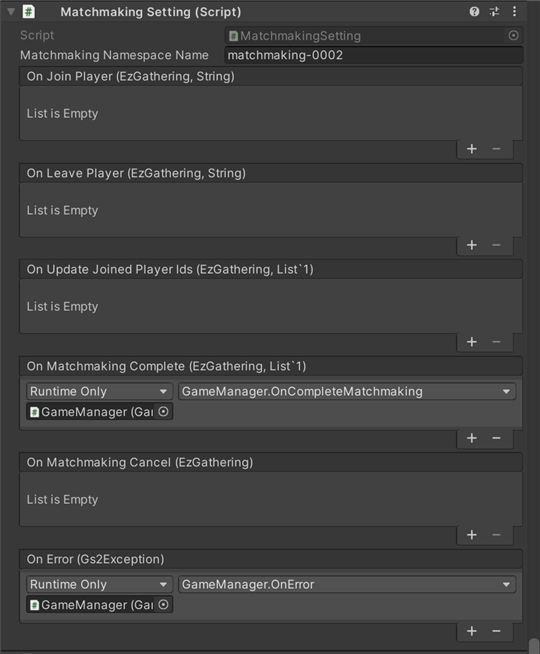
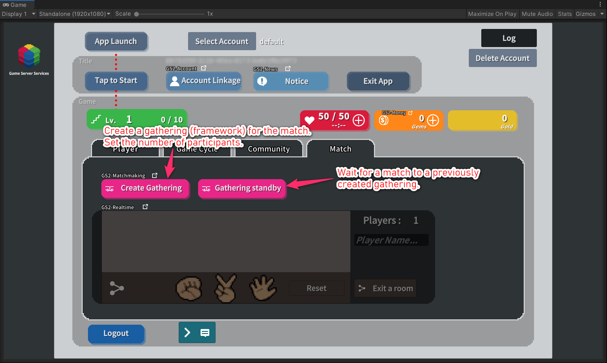

# Matchmaking Explanation

This is a sample of using [GS2-Matchmaking](https://app.gs2.io/docs/en/index.html#gs2-matchmaking) to find players for competitive and cooperative play.

## GS2-Deploy template

- [initialize_matchmaking_template.yaml](../Templates/initialize_matchmaking_template.yaml)

## MatchmakingSetting MatchmakingSetting



| Setting Name | Description |
---|---
| matchmakingNamespaceName | GS2-Matchmaking Namespace Name |

| Event | Description |
---|---
| OnJoinPlayer(EzGathering gathering, string userId) | Called when a new participant arrives at a gathering in which you are participating. |
| OnLeavePlayer(EzGathering gathering, string userId) | Called when a participant leaves a gathering in which he/she is participating. |
| OnUpdateJoinedPlayerIds(EzGathering gathering, List<string> joinedPlayerIds) | Called when an account is created. |
| OnLogin(EzAccount account, GameSession session) | Called when the list of player IDs in a participating Gathering is updated. This callback is always called at the same time as either OnJoinPlayer or OnLeavePlayer. |
| OnMatchmakingComplete(EzGathering gathering, List<string> joinedPlayerIds) | Called when matchmaking is complete. |
| OnError(Gs2Exception error) | Called when an error occurs. |

## Matchmaking flow



Create a gathering (unit of matching) by setting the number of participants at `Gathering creation`.  
Request to join the Gathering with `Gathering Waiting`.

### Create a new Gathering

Enter the number of players including yourself and select `Create` to create a new gathering.

When UniTask is enabled
```c#
            var domain = gs2.Matchmaking.Namespace(
                namespaceName: matchmakingNamespaceName
            ).Me(
                gameSession: gameSession
            );
            try
            {
                var result = await domain.CreateGatheringAsync(
                    player: new EzPlayer
                    {
                        RoleName = "default"
                    },
                    attributeRanges: null,
                    capacityOfRoles: new[]
                    {
                        new EzCapacityOfRole
                        {
                            RoleName = "default",
                            Capacity = Capacity
                        }
                    },
                    allowUserIds: null,
                    expiresAt: null,
                    expiresAtTimeSpan: null
                );
                Gathering = await result.ModelAsync();

                JoinedPlayerIds.Clear();
                JoinedPlayerIds.Add(gameSession.AccessToken.UserId);

                onUpdateJoinedPlayerIds.Invoke(Gathering, JoinedPlayerIds);
            }
            catch (Gs2Exception e)
            {
                onError.Invoke(e);
            }
```
When coroutine is used
```c#
            var domain = gs2.Matchmaking.Namespace(
                namespaceName: matchmakingNamespaceName
            ).Me(
                gameSession: gameSession
            );
            var future = domain.CreateGatheringFuture(
                player: new EzPlayer
                {
                    RoleName = "default"
                },
                attributeRanges: null,
                capacityOfRoles: new [] {
                    new EzCapacityOfRole
                    {
                        RoleName = "default",
                        Capacity = Capacity
                    }
                },
                allowUserIds: null,
                expiresAt: null,
                expiresAtTimeSpan: null
            );
            yield return future;
            if (future.Error != null)
            {
                onError.Invoke(
                    future.Error
                );
                yield break;
            }

            var future2 = future.Result.Model();
            yield return future2;
            if (future2.Error != null)
            {
                onError.Invoke(
                    future2.Error
                );
                yield break;
            }
            
            JoinedPlayerIds.Clear();
            Gathering = future2.Result;
            JoinedPlayerIds.Add(gameSession.AccessToken.UserId);

            onUpdateJoinedPlayerIds.Invoke(Gathering, JoinedPlayerIds);
```

The recruitment criteria are set by the `default` role for all participants, creating a Gathering that is open to everyone.  
The number of participants is specified in `Capacity`.  
If the Gathering is successfully created, the `Waiting for Matching` dialog box is displayed, showing a list of user IDs who are currently participating.

### Joining an existing Gathering

Request to join an existing Gathering.

When UniTask is enabled
```c#
            ResultGatherings.Clear();
            Gathering = null;
            var domain = gs2.Matchmaking.Namespace(
                namespaceName: matchmakingNamespaceName
            ).Me(
                gameSession: gameSession
            );
            try
            {
                ResultGatherings = await domain.DoMatchmakingAsync(
                    new EzPlayer
                    {
                        RoleName = "default"
                    }
                ).ToListAsync();
                JoinedPlayerIds.Clear();
            }
            catch (Gs2Exception e)
            {
                onError.Invoke(e);
            }
```
When coroutine is used
```c#
            ResultGatherings.Clear();
            var domain = gs2.Matchmaking.Namespace(
                namespaceName: matchmakingNamespaceName
            ).Me(
                gameSession: gameSession
            );
            var it = domain.DoMatchmaking(
                new EzPlayer
                {
                    RoleName = "default"
                }
            );
            while (it.HasNext())
            {
                yield return it.Next();
                if (it.Error != null)
                {
                    onError.Invoke(it.Error);
                    break;
                }

                if (it.Current != null)
                {
                    ResultGatherings.Add(it.Current);
                }
            }
                
            JoinedPlayerIds.Clear();
```

This sample joins a gathering that is looking for a `default` role.  
If no gathering is found, a `NotFoundException` is returned.

If a timeout occurs during the matchmaking process, a
Normal response with `EzDoMatchmakingResult.Result.Item` returns null.  
In that case, the `MatchmakingContextToken` in the return value is used to determine  
Request to continue the process of finding the gathering again.

If the Gathering is successfully created, the user is taken to the `Waiting for Matching` dialog, which displays a list of participating user IDs.

### Cancel Matchmaking

Cancels matchmaking.

When UniTask is enabled
```c#
            var domain = gs2.Matchmaking.Namespace(
                namespaceName: matchmakingNamespaceName
            ).Me(
                gameSession: gameSession
            ).Gathering(
                gatheringName: Gathering.Name
            );
            try
            {
                var result = await domain.CancelMatchmakingAsync();
                Gathering = await result.ModelAsync();
                
                onMatchmakingCancel.Invoke(Gathering);
                Gathering = null;
                JoinedPlayerIds.Clear();
            }
            catch (Gs2Exception e)
            {
                onError.Invoke(e);
            }
```
When coroutine is used
```c#
            var domain = gs2.Matchmaking.Namespace(
                namespaceName: matchmakingNamespaceName
            ).Me(
                gameSession: gameSession
            ).Gathering(
                gatheringName: Gathering.Name
            );
            var future = domain.CancelMatchmaking();
            yield return future;
            if (future.Error != null)
            {
                onError.Invoke(future.Error);
                yield break;
            }
 
            var domain2 = future.Result;
            var future2 = domain2.Model();
            yield return future2;
            if (future.Error != null)
            {
                onError.Invoke(future.Error);
                yield break;
            }
            
            onMatchmakingCancel.Invoke(future2.Result);
            
            Gathering = null;
            JoinedPlayerIds.Clear();
```

### Notification of participant increase/decrease/matchmaking completion

Use [GS2-Gateway](https://app.gs2.io/docs/en/index.html#gs2-gateway) to receive notifications from the server.
The server will send you a message as follows

| Message | Explanation |
---|---
Gs2Matchmaking:Join | A new player has joined the Gathering
Gs2Matchmaking:Leave | Player has left the gathering
Gs2Matchmaking:Complete | Matching is complete

```c#
        public void PushNotificationHandler(NotificationMessage message)
        {
            if (!message.issuer.StartsWith("Gs2Matchmaking:")) return;

            _issuer = message.issuer;

            if (message.issuer.EndsWith(":Join"))
            {
                var notification = JsonMapper.ToObject<JoinNotification>(message.payload);
                if (!_matchmakingModel.JoinedPlayerIds.Contains(notification.joinUserId))
                {
                    _matchmakingModel.JoinedPlayerIds.Add(notification.joinUserId);
                    _userId = notification.joinUserId;
                    _recievedNotification = true;
                }
            }
            else if (message.issuer.EndsWith(":Leave"))
            {
                var notification = JsonMapper.ToObject<LeaveNotification>(message.payload);
                _matchmakingModel.JoinedPlayerIds.Remove(notification.leaveUserId);
                _userId = notification.leaveUserId;
                _recievedNotification = true;
            }
            else if (message.issuer.EndsWith(":Complete"))
            {
                _recievedNotification = true;
                _complete = true;
            }
        }
```

Registering a notification handler

```c#
GameManager.Instance.Profile.Gs2Session.OnNotificationMessage += PushNotificationHandler;
```

