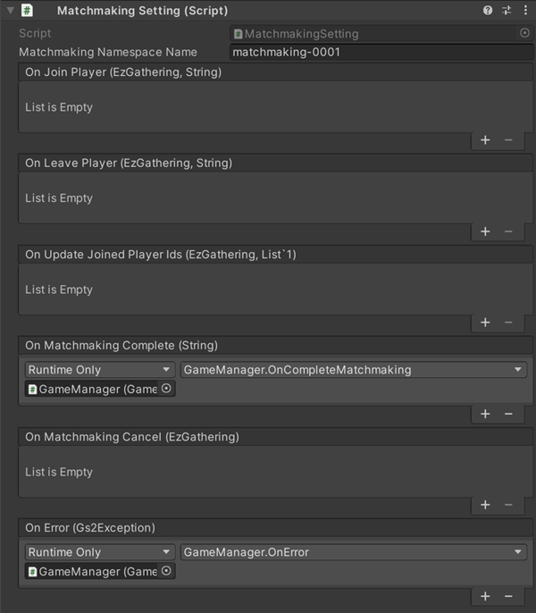

# Matchmaking Description

This is a sample of using [GS2-Matchmaking](https://app.gs2.io/docs/en/index.html#gs2-matchmaking) to find players for competitive and cooperative play.

## GS2-Deploy template

- [initialize_matchmaking_template.yaml](../Templates/initialize_matchmaking_template.yaml)

## MatchmakingSetting MatchmakingSetting



| Setting Name | Description |
---|---
| matchmakingNamespaceName | GS2-Matchmaking Namespace Name |

| Event | Description |
---|---
| OnJoinPlayer(EzGathering gathering, string userId) | Called when a new participant arrives at a gathering in which you are participating. | OnJoinPlayer(EzGathering gathering, string userId)
| OnLeavePlayer(EzGathering gathering, string userId) | Called when a participant leaves a gathering in which he/she is participating. | OnLeavePlayer(EzGatheringgathering, string userId)
| OnUpdateJoinedPlayerIds(EzGathering gathering, List<string> joinedPlayerIds) | Called when an account is created. | OnUpdateJoinedPlayerIds
| OnLogin(EzAccount account, GameSession session) | Called when the list of player IDs in a participating Gathering is updated. This callback is always called at the same time as either OnJoinPlayer or OnLeavePlayer. | OnJoinPlayer
| OnMatchmakingComplete(EzGathering gathering, List<string> joinedPlayerIds) | Called when matchmaking is complete. | OnMatchmakingComplete(EzGathering gathering, List<string> joinedPlayerIds)
| OnError(Gs2Exception error) | Called when an error occurs. | OnError(Gs2Exception error)

## Matchmaking flow

Create a gathering (unit of matching) by setting the number of participants at `Gathering creation`.  
Request to join the Gathering with `Gathering Waiting`.

### Create a new Gathering

Enter the number of players including yourself and select `Create` to create a new gathering.

```c#
AsyncResult<EzCreateGatheringResult> result = null;
yield return gs2Client.client.Matchmaking.CreateGathering(
    r => { result = r; }
    request.gameSession,
    gs2MatchmakingSetting.matchmakingNamespaceName,
    new EzPlayer
    {
        RoleName = "default"
    },
    new List<EzCapacityOfRole>
    {
        new EzCapacityOfRole
        {
            RoleName = "default",
            Capacity = capacity
        },
    },
    new List<string>(),
    new List<EzAttributeRange>()
);
```

The recruitment criteria are set by the `default` role for all participants, creating a Gathering that is open to everyone.  
The number of participants is specified in `Capacity`.  
If the Gathering is successfully created, the `Waiting for Matching` dialog box is displayed, showing a list of user IDs who are currently participating.

### Joining an existing Gathering

Request to join an existing Gathering.

```c#
yield return gs2Client.client.Matchmaking.DoMatchmaking(
    r => { result = r; }
    request.gameSession,
    gs2MatchmakingSetting.matchmakingNamespaceName,
    new EzPlayer
    {
        RoleName = "default"
    },
    contextToken
);
````

This sample joins a gathering that is looking for a `default` role.  
If no gathering is found, a `NotFoundException` is returned.

If a timeout occurs during the matchmaking process, a
Normal response with `EzDoMatchmakingResult.Result.Item` returns null.  
In that case, the `MatchmakingContextToken` in the return value is used to determine  
Request to continue the process of finding the gathering again.

If the Gathering is successfully created, the `Wait for Matching` dialog box will appear, displaying a list of participating user IDs.

### Cancel Matchmaking

Cancels matchmaking.

```c#
AsyncResult<EzCancelMatchmakingResult> result = null;
yield return gs2Client.client.Matchmaking.CancelMatchmaking(
    r => { result = r; }
    request.gameSession,
    gs2MatchmakingSetting.matchmakingNamespaceName,
    _gathering.Name
);
```

### Notification of participant increase/decrease/matchmaking completion

Use [GS2-Gateway](https://app.gs2.io/docs/en/index.html#gs2-gateway) to receive notifications from the server.
The server will send you a message as follows

| Message | Explanation |
---|---
Gs2Matchmaking:Join | A new player has joined the Gathering
Gs2Matchmaking:Leave | Player has left the gathering
Gs2Matchmaking:Complete | Matching is complete

```c#
        public void PushNotificationHandler(NotificationMessage message)
        {
            if (!message.issuer.StartsWith("Gs2Matchmaking:")) return;

            _issuer = message.issuer;

            if (message.issuer.EndsWith(":Join"))
            {
                var notification = JsonMapper.ToObject<JoinNotification>(message.payload);
                if (! _matchmakingModel.JoinedPlayerIds.Contains(notification.joinUserId))
                {
                    _matchmakingModel.JoinedPlayerIds.Add(notification.joinUserId);
                    _userId = notification.joinUserId;
                    _recievedNotification = true;
                }
            }
            else if (message.issuer.EndsWith(":Leave"))
            {
                var notification = JsonMapper.ToObject<LeaveNotification>(message.payload);
                _matchmakingModel.JoinedPlayerIds.Remove(notification.leaveUserId);
                _userId = notification.leaveUserId;
                _recievedNotification = true;
            }
            else if (message.issuer.EndsWith(":Complete"))
            {
                _recievedNotification = true;
                _complete = true;
            }
        }
```

Registering a notification handler

```c#
GameManager.Instance.Client.Profile.Gs2Session.OnNotificationMessage += PushNotificationHandler;
```

