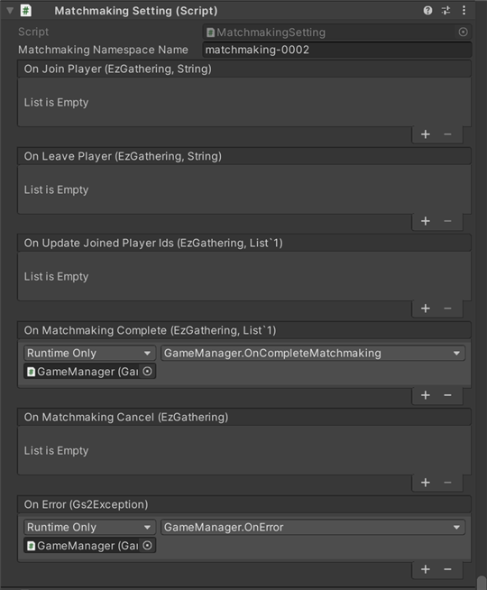

# 매치메이킹 해설

[GS2-Matchmaking](https://docs.gs2.io/ko/api_reference/matchmaking/) 을 사용하여 대전·협력 플레이를 할 플레이어를 찾는 샘플입니다.

## GS2-Deploy 템플릿

- [initialize_match_template.yaml](../Templates/initialize_match_template.yaml)

## 매치메이킹 설정 MatchmakingSetting



| 설정 이름 | 설명 |
---|---
| matchmakingNamespaceName | GS2-Matchmaking 의 네임스페이스 이름 |

| 이벤트 | 설명 |
---|---
| OnJoinPlayer(EzGathering gathering, string userId) | 참가 중인 개더링에 새로운 참가자가 왔을 때 호출됩니다. |
| OnLeavePlayer(EzGathering gathering, string userId) | 참가 중인 개더링에서 참가자가 이탈했을 때 호출됩니다. |
| OnUpdateJoinedPlayerIds(EzGathering gathering, List<string> joinedPlayerIds) | 계정이 생성되었을 때 호출됩니다. |
| OnLogin(EzAccount account, GameSession session) | 참가 중인 개더링의 플레이어 ID 목록이 갱신되었을 때 호출됩니다. 이 콜백은 반드시 OnJoinPlayer / OnLeavePlayer 중 하나와 같은 타이밍에 호출됩니다. |
| OnMatchmakingComplete(EzGathering gathering, List<string> joinedPlayerIds) | 매치메이킹이 완료되었을 때 호출됩니다. |
| OnError(Gs2Exception error) | 오류가 발생했을 때 호출됩니다. |

## 매치메이킹의 흐름


`개더링 생성` 으로 참가 인원을 설정하여 개더링(매칭의 단위)을 생성합니다.  
`개더링 대기` 로 개더링에 대한 참가를 요청합니다.  

### 개더링의 신규 생성

자신을 포함한 플레이어 인원을 입력하고 `Create` 를 선택하면 개더링을 새로 생성합니다.

UniTask 활성화 시
```c#
            var domain = gs2.Matchmaking.Namespace(
                namespaceName: matchmakingNamespaceName
            ).Me(
                gameSession: gameSession
            );
            try
            {
                var result = await domain.CreateGatheringAsync(
                    player: new EzPlayer
                    {
                        RoleName = "default"
                    },
                    attributeRanges: null,
                    capacityOfRoles: new[]
                    {
                        new EzCapacityOfRole
                        {
                            RoleName = "default",
                            Capacity = Capacity
                        }
                    },
                    allowUserIds: null,
                    expiresAt: null,
                    expiresAtTimeSpan: null
                );
                Gathering = await result.ModelAsync();

                JoinedPlayerIds.Clear();
                JoinedPlayerIds.Add(gameSession.AccessToken.UserId);

                onUpdateJoinedPlayerIds.Invoke(Gathering, JoinedPlayerIds);
            }
            catch (Gs2Exception e)
            {
                onError.Invoke(e);
            }
```
코루틴 사용 시
```c#
            var domain = gs2.Matchmaking.Namespace(
                namespaceName: matchmakingNamespaceName
            ).Me(
                gameSession: gameSession
            );
            var future = domain.CreateGatheringFuture(
                player: new EzPlayer
                {
                    RoleName = "default"
                },
                attributeRanges: null,
                capacityOfRoles: new [] {
                    new EzCapacityOfRole
                    {
                        RoleName = "default",
                        Capacity = Capacity
                    }
                },
                allowUserIds: null,
                expiresAt: null,
                expiresAtTimeSpan: null
            );
            yield return future;
            if (future.Error != null)
            {
                onError.Invoke(
                    future.Error
                );
                yield break;
            }

            var future2 = future.Result.ModelFuture();
            yield return future2;
            if (future2.Error != null)
            {
                onError.Invoke(
                    future2.Error
                );
                yield break;
            }
            
            JoinedPlayerIds.Clear();
            Gathering = future2.Result;
            JoinedPlayerIds.Add(gameSession.AccessToken.UserId);

            onUpdateJoinedPlayerIds.Invoke(Gathering, JoinedPlayerIds);
```

모집 조건을 참가자 전원이 `default` 롤로 설정하여, 누구나 참가할 수 있는 개더링을 생성하고 있습니다.  
Capacity 에 참가 인원을 지정하고 있습니다.  
개더링의 생성에 성공하면 `매칭 대기` 다이얼로그가 되어, 참가 중인 사용자 ID 의 목록을 표시합니다.

### 기존 개더링에 참가

기존 개더링에 대한 참가를 요청합니다.

UniTask 활성화 시
```c#
            ResultGatherings.Clear();
            Gathering = null;
            var domain = gs2.Matchmaking.Namespace(
                namespaceName: matchmakingNamespaceName
            ).Me(
                gameSession: gameSession
            );
            try
            {
                ResultGatherings = await domain.DoMatchmakingAsync(
                    new EzPlayer
                    {
                        RoleName = "default"
                    }
                ).ToListAsync();
                JoinedPlayerIds.Clear();
            }
            catch (Gs2Exception e)
            {
                onError.Invoke(e);
            }
```
코루틴 사용 시
```c#
            ResultGatherings.Clear();
            var domain = gs2.Matchmaking.Namespace(
                namespaceName: matchmakingNamespaceName
            ).Me(
                gameSession: gameSession
            );
            var it = domain.DoMatchmaking(
                new EzPlayer
                {
                    RoleName = "default"
                }
            );
            while (it.HasNext())
            {
                yield return it.Next();
                if (it.Error != null)
                {
                    onError.Invoke(it.Error);
                    break;
                }

                if (it.Current != null)
                {
                    ResultGatherings.Add(it.Current);
                }
            }
                
            JoinedPlayerIds.Clear();
```

이 샘플에서는 `default` 롤을 모집하고 있는 개더링에 참가합니다.  
개더링을 찾지 못한 경우에는 `NotFoundException` 이 반환됩니다.  

매치메이킹 처리 도중에 타임아웃이 되었을 때에는,
정상적인 응답으로 `EzDoMatchmakingResult.Result.Item` 에 null 이 반환됩니다.  
그 경우에는 반환값에 포함된 `MatchmakingContextToken` 을 사용하여  
다시 개더링을 찾는 처리를 계속하도록 요청합니다.  

개더링의 생성에 성공하면 `매칭 대기` 다이얼로그로 전환되어, 참가 중인 사용자 ID 의 목록을 표시합니다.

### 매치메이킹의 취소

매치메이킹을 취소합니다.

UniTask 활성화 시
```c#
            var domain = gs2.Matchmaking.Namespace(
                namespaceName: matchmakingNamespaceName
            ).Me(
                gameSession: gameSession
            ).Gathering(
                gatheringName: Gathering.Name
            );
            try
            {
                var result = await domain.CancelMatchmakingAsync();
                Gathering = await result.ModelAsync();
                
                onMatchmakingCancel.Invoke(Gathering);
                Gathering = null;
                JoinedPlayerIds.Clear();
            }
            catch (Gs2Exception e)
            {
                onError.Invoke(e);
            }
```
코루틴 사용 시
```c#
            var domain = gs2.Matchmaking.Namespace(
                namespaceName: matchmakingNamespaceName
            ).Me(
                gameSession: gameSession
            ).Gathering(
                gatheringName: Gathering.Name
            );
            var future = domain.CancelMatchmaking();
            yield return future;
            if (future.Error != null)
            {
                onError.Invoke(future.Error);
                yield break;
            }
 
            var domain2 = future.Result;
            var future2 = domain2.Model();
            yield return future2;
            if (future.Error != null)
            {
                onError.Invoke(future.Error);
                yield break;
            }
            
            onMatchmakingCancel.Invoke(future2.Result);
            
            Gathering = null;
            JoinedPlayerIds.Clear();
```

### 참가자의 증감/매치메이킹 완료의 알림

[GS2-Gateway](https://docs.gs2.io/ko/api_reference/gateway/) 를 사용하여 서버로부터의 알림을 받습니다.
서버로부터는 아래와 같은 메시지가 전송됩니다.

| 메시지 | 설명 |
---|---
Gs2Matchmaking:Join | 개더링에 새로 플레이어가 참가했다
Gs2Matchmaking:Leave | 개더링에서 플레이어가 이탈했다
Gs2Matchmaking:Complete | 매칭이 완료되었다

```c#
        public void PushNotificationHandler(NotificationMessage message)
        {
            if (!message.issuer.StartsWith("Gs2Matchmaking:")) return;

            _issuer = message.issuer;

            if (message.issuer.EndsWith(":Join"))
            {
                var notification = JsonMapper.ToObject<JoinNotification>(message.payload);
                if (!_matchmakingModel.JoinedPlayerIds.Contains(notification.joinUserId))
                {
                    _matchmakingModel.JoinedPlayerIds.Add(notification.joinUserId);
                    _userId = notification.joinUserId;
                    _recievedNotification = true;
                }
            }
            else if (message.issuer.EndsWith(":Leave"))
            {
                var notification = JsonMapper.ToObject<LeaveNotification>(message.payload);
                _matchmakingModel.JoinedPlayerIds.Remove(notification.leaveUserId);
                _userId = notification.leaveUserId;
                _recievedNotification = true;
            }
            else if (message.issuer.EndsWith(":Complete"))
            {
                _recievedNotification = true;
                _complete = true;
            }
        }
```

알림 핸들러의 등록
```c#
GameManager.Instance.Profile.Gs2Session.OnNotificationMessage += PushNotificationHandler;
```

