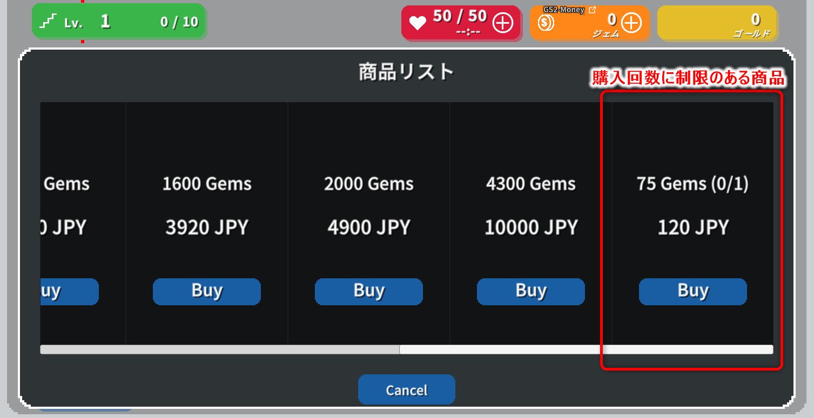
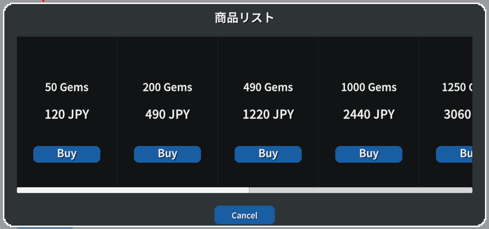
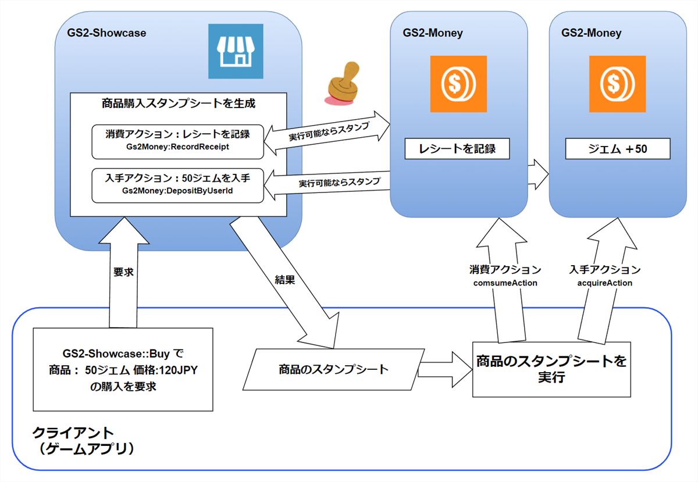
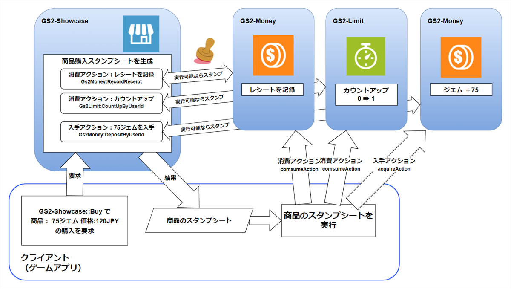

# 課金通貨ストア　解説

GS2-Money を使って管理されている課金通貨を、GS2-Showcase で販売するサンプルです。

サンプルにで定義されている商品のうち１つには GS2-Limit による購入回数の制限がついており、１回のみ購入が可能になっています。



# GS2-Deploy テンプレート

- [initialize_money_template.yaml - 課金通貨/課金通貨ストア](../Templates/initialize_money_template.yaml)

## Unity IAPの有効化、インポート

GS2-Moneyを使用したサンプルの動作には、Unity IAPの有効化が必要になります。  
( https://docs.unity3d.com/ja/2019.4/Manual/UnityIAPSettingUp.html )  
サービスウィンドウでのIn-App Purchasingの有効化、  
IAP パッケージのインポートを行います。

## 課金通貨/課金通貨ストア設定 MoneySetting


| 設定名 | 説明 | 
|---|---|
| moneyNamespaceName | GS2-Money のネームスペース名 |
| showcaseNamespaceName | GS2-Showcase のネームスペース名 |
| showcaseName | GS2-Showcase の陳列棚名 |
| showcaseKeyId | GS2-Showcase で商品購入時に発行するスタンプシートの署名計算に使用する暗号鍵 |
| limitNamespaceName | 購入回数制限を実現する GS2-Limit のネームスペース名 |
| distributorNamespaceName | 購入した商品を配送する GS2-Distributor のネームスペース名 |

| イベント | 説明 |
|---|---|
| OnGetWallet(EzWalletDetail wallet) | ウォレットの情報を取得したときに呼び出されます。 |
| OnGetProducts(List<Product> products) | 販売中の商品一覧を取得したときに呼び出されます。 |
| OnBuy(Product product) | 商品の購入が完了したときに呼び出されます。 |
| OnError(Gs2Exception error) | エラーが発生したときに呼び出されます。 |

## ウォレットの表示


ログイン後、以下で最新のウォレットの状態を取得します。
```c#
            AsyncResult<EzGetResult> result = null;
            yield return client.Money.Get(
                r =>
                {
                    result = r;
                },
                session,
                moneyNamespaceName,
                Slot
            );
```

## 課金通貨ストアの表示


商品リストを取得し、ストアを表示します。
```c#
            AsyncResult<EzGetShowcaseResult> result = null;
            yield return client.Showcase.GetShowcase(
                r =>
                {
                    result = r;
                },
                session,
                showcaseNamespaceName,
                showcaseName
            );
```
取得した商品情報をパースし、販売価格や入手できる課金通貨の数量を取得します。  
購入回数制限が設定されている場合は、購入回数カウンターの状態も取得しています。

```c#
            var products = new List<Product>();
            foreach (var displayItem in result.Result.Item.DisplayItems)
            {
                var depositRequest = GetAcquireAction<DepositByUserIdRequest>(
                    displayItem.SalesItem, 
                    "Gs2Money:DepositByUserId"
                );
                var recordReceiptRequest = GetConsumeAction<RecordReceiptRequest>(
                    displayItem.SalesItem, 
                    "Gs2Money:RecordReceipt"
                );
                var countUpRequest = GetConsumeAction<CountUpByUserIdRequest>(
                    displayItem.SalesItem, 
                    "Gs2Limit:CountUpByUserId"
                );
                var price = depositRequest.Price;
                var count = depositRequest.Count;

                int? boughtCount = null;
                if(countUpRequest != null) {
                    AsyncResult<EzGetCounterResult> result2 = null;
                    yield return client.Limit.GetCounter(
                        r => { result2 = r; },
                        session,
                        countUpRequest.NamespaceName,
                        countUpRequest.LimitName,
                        countUpRequest.CounterName
                    );
                    if (result2.Error == null)
                    {
                        boughtCount = result2.Result.Item.Count;
                    }
                    else if (result2.Error is NotFoundException)
                    {
                        boughtCount = 0;
                    }
                }
                products.Add(new Product
                {
                    Id = displayItem.DisplayItemId,
                    ContentsId = recordReceiptRequest.ContentsId,
                    Price = price,
                    CurrencyCount = count,
                    BoughtCount = boughtCount,
                    BoughtLimit = countUpRequest == null ? null : countUpRequest.MaxValue,
                });
            }
```

## 購入処理

モバイル環境であれば、Unity IAP を使用して AppStore や GooglePlay でのコンテンツの購入を行います  
（商品の登録、設定が必要になります）。  
エディター環境ではFake Storeのレシートが発行されます。  
得られたレシートを後続の処理で参照できるよう保持しておきます。
```c#
                AsyncResult<PurchaseParameters> result = null;
                yield return new IAPUtil().Buy(
                    r => { result = r; },
                    selectedProduct.ContentsId
                );
                if (result.Error != null)
                {
                    onError.Invoke(
                        result.Error
                    );
                    callback.Invoke(new AsyncResult<object>(null, result.Error));
                    yield break;
                }
```
購入したレシートを使って、GS2-Showcase の商品を購入する処理を実行します。  
Config には GS2-Money のウォレットスロットと、レシートの内容を渡します。

```c#
                // Showcase 商品の購入をリクエスト
                AsyncResult<EzBuyResult> result = null;
                yield return client.Showcase.Buy(
                    r => { result = r; },
                    session,
                    showcaseNamespaceName,
                    showcaseName,
                    selectedProduct.Id,
                    new List<EzConfig>
                    {
                        new EzConfig
                        {
                            Key = "slot",
                            Value = Slot.ToString(),
                        },
                        new EzConfig
                        {
                            Key = "receipt",
                            Value = receipt,
                        },
                    }
                );
                
                if (result.Error != null)
                {
                    onError.Invoke(
                        result.Error
                    );
                    callback.Invoke(new AsyncResult<object>(null, result.Error));
                    yield break;
                }

                // スタンプシートを取得
                stampSheet = result.Result.StampSheet;
```
取得したスタンプシートを実行します。  
GS2 SDK for Unity ではスタンプシート実行用のステートマシンが用意されていますので、そちらを利用します。  
ステートマシンの実行には GS2-Distributor と スタンプシートの署名計算に使用した暗号鍵が必要となります。

```c#
            {
                // スタンプシート ステートマシンを生成
                var machine = new StampSheetStateMachine(
                    stampSheet,
                    client,
                    distributorNamespaceName,
                    showcaseKeyId
                );

                Gs2Exception exception = null;
                void OnError(Gs2Exception e)
                {
                    exception = e;
                }
                
                onError.AddListener(OnError);
                
                // スタンプシートの実行
                yield return machine.Execute(onError);
                
                onError.RemoveListener(OnError);
                
                if (exception != null)
                {
                    // スタンプシート実行エラー
                    callback.Invoke(new AsyncResult<object>(null, exception));
                    yield break;
                }
            }
            // 商品購入に成功
```

通常の課金通貨商品の購入スタンプシートの流れは以下になります。



購入制限のある課金通貨商品の購入スタンプシートの流れは以下になります。




