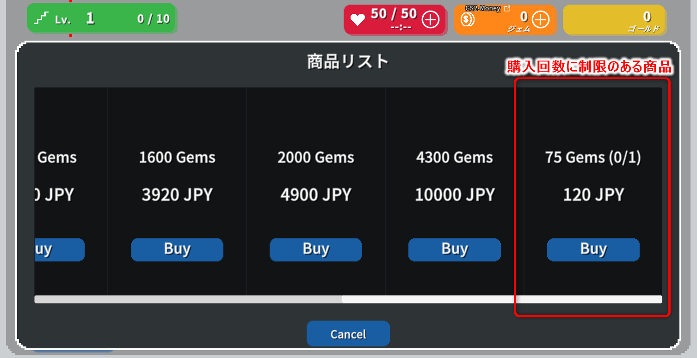
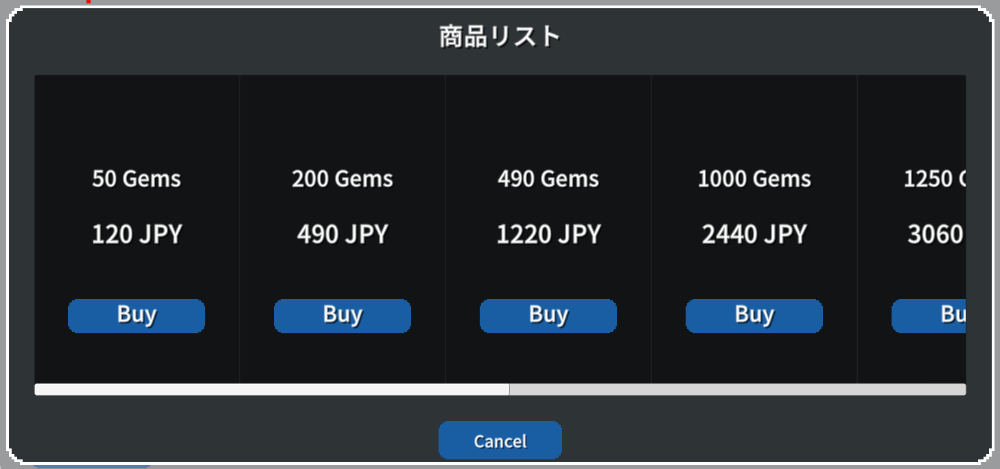
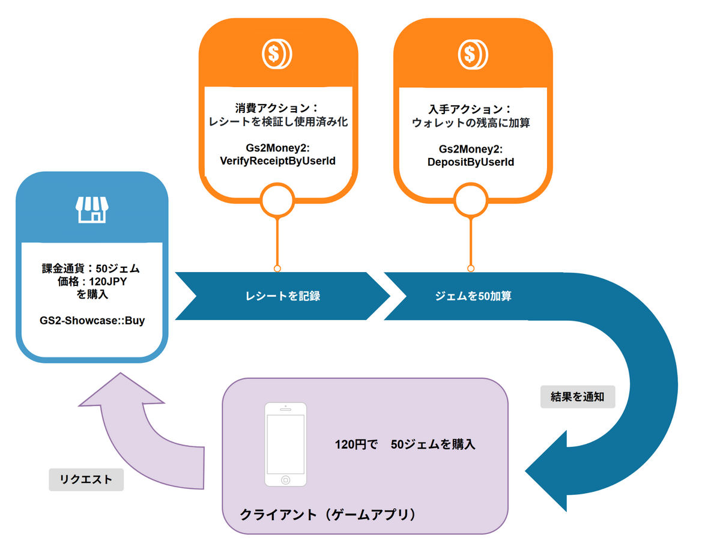
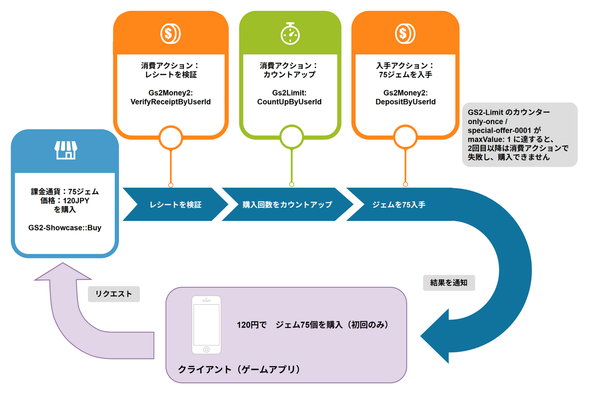

# 課金通貨/課金通貨ストア　解説

[GS2-Money2](https://docs.gs2.io/ja/api_reference/money2/) を使って管理されている課金通貨を、  
[GS2-Showcase](https://docs.gs2.io/ja/api_reference/showcase/) で販売するサンプルです。

サンプルで定義されている商品のうち１つには [GS2-Limit](https://docs.gs2.io/ja/api_reference/limit/) による  
購入回数の制限がついており、１回のみ購入が可能になっています。



## GS2-Deploy テンプレート

- [initialize_core_template.yaml - 課金通貨/課金通貨ストア](../Templates/initialize_core_template.yaml)

GS2-Money2 のネームスペースには、ストアプラットフォーム設定（`PlatformSetting`）と  
レシート検証に使用するストアコンテンツモデル（`storeContentModels`）を定義しています。  
本サンプルでは実機課金を行わないため、`PlatformSetting.fake.acceptFakeReceipt: Accept` を設定し、  
フェイクレシートでの購入を受け入れるようにしています。

## Unity IAPの有効化、インポート

実機（AppStore / GooglePlay）での課金を行う場合は、Unity IAPの有効化が必要になります。  

[Unity IAP の設定](https://docs.unity3d.com/ja/current/Manual/UnityIAPSettingUp.html)  

サービスウィンドウでのIn-App Purchasingの有効化、  
IAP パッケージのインポートを行います。  
（本サンプルはフェイクレシートでも動作するため、IAP無効のままでも購入フローを確認できます。）

## 課金通貨/課金通貨ストア設定 Money2Setting


| 設定名 | 説明 | 
|---|---|
| moneyNamespaceName | GS2-Money2 のネームスペース名 |
| showcaseNamespaceName | GS2-Showcase のネームスペース名 |
| showcaseName | GS2-Showcase の陳列棚名 |

| イベント | 説明 |
|---|---|
| OnGetWallet(EzWallet wallet) | ウォレットの情報を取得したときに呼び出されます。 |
| OnGetProducts(List<Product> products) | 販売中の商品一覧を取得したときに呼び出されます。 |
| OnBuy(Product product) | 商品の購入が完了したときに呼び出されます。 |
| OnError(Gs2Exception error) | エラーが発生したときに呼び出されます。 |

## ウォレットの取得


ログイン後、以下で最新のウォレットの状態を取得します。  
GS2-Money2 のウォレットでは、残高は `Wallet.Summary`（`Paid` / `Free` / `Total`）から取得します。

・UniTask有効時
```c#
var domain = gs2.Money2.Namespace(
    namespaceName: moneyNamespaceName
).Me(
    gameSession: gameSession
).Wallet(
    slot: Slot
);
try
{
    Wallet = await domain.ModelAsync();

    onGetWallet.Invoke(Wallet);
}
catch (Gs2Exception e)
{
    onError.Invoke(e);
}
```
・コルーチン使用時
```c#
var domain = gs2.Money2.Namespace(
    namespaceName: moneyNamespaceName
).Me(
    gameSession: gameSession
).Wallet(
    slot: Slot
);
var future = domain.ModelFuture();
yield return future;
if (future.Error != null)
{
    onError.Invoke(future.Error);
    yield break;
}

Wallet = future.Result;

onGetWallet.Invoke(Wallet);
```

取得したウォレットの残高は以下のように参照します。

```c#
var balance = Wallet.Summary.Free + Wallet.Summary.Paid;
```

## 課金通貨ストアの商品取得



商品リストを取得し、ストアを表示します。

・UniTask有効時
```c#
var domain = gs2.Showcase.Namespace(
    namespaceName: showcaseNamespaceName
).Me(
    gameSession: gameSession
).Showcase(
    showcaseName: showcaseName
);
try
{
    var showcase = await domain.ModelAsync();

    onGetProducts.Invoke(Products);

    return Products;
}
catch (Gs2Exception e)
{
    onError.Invoke(e);
}
```
・コルーチン使用時
```c#
var domain = gs2.Showcase.Namespace(
    namespaceName: showcaseNamespaceName
).Me(
    gameSession: gameSession
).Showcase(
    showcaseName: showcaseName
);
var future = domain.ModelFuture();
yield return future;
if (future.Error != null)
{
    onError.Invoke(
        future.Error
    );
    yield break;
}
```

取得した商品情報をパースし、販売価格や入手できる課金通貨の数量を取得します。  
購入回数制限が設定されている場合は、購入回数カウンターの状態も取得しています。  
GS2-Money2 では、入手アクション `Gs2Money2:DepositByUserId` の価格・通貨量は `depositTransactions` に格納されており、  
レシート検証アクション `Gs2Money2:VerifyReceiptByUserId` の `contentName` でストアコンテンツを指定します。  
`depositTransactions` の `currency`（通貨コード。本サンプルでは `JPY`）は必須項目です。

```c#
var products = new List<Product>();
foreach (var displayItem in showcase.DisplayItems)
{
    var depositRequest = GetAcquireAction<DepositByUserIdRequest>(
        displayItem.SalesItem, 
        "Gs2Money2:DepositByUserId"
    );
    var verifyReceiptRequest = GetConsumeAction<VerifyReceiptByUserIdRequest>(
        displayItem.SalesItem, 
        "Gs2Money2:VerifyReceiptByUserId"
    );
    var countUpRequest = GetConsumeAction<CountUpByUserIdRequest>(
        displayItem.SalesItem, 
        "Gs2Limit:CountUpByUserId"
    );
    // Money2 では価格・通貨量は depositTransactions に格納される
    var depositTransaction = depositRequest.DepositTransactions != null && depositRequest.DepositTransactions.Length > 0
        ? depositRequest.DepositTransactions[0]
        : null;
    var price = (float?)depositTransaction?.Price;
    var count = depositTransaction?.Count;

    int? boughtCount = null;
    if(countUpRequest != null) {
        var counterDomain = gs2.Limit.Namespace(
            namespaceName: countUpRequest.NamespaceName
        ).Me(
            gameSession: gameSession
        ).Counter(
            limitName: countUpRequest.LimitName,
            counterName: countUpRequest.CounterName
        );
        try
        {
            var item = await counterDomain.ModelAsync();
            boughtCount = item.Count;
        }
        catch (NotFoundException)
        {
            boughtCount = 0;
        }
    }
    products.Add(new Product
    {
        Id = displayItem.DisplayItemId,
        ContentsId = verifyReceiptRequest.ContentName,
        Price = price,
        CurrencyCount = count,
        BoughtCount = boughtCount,
        BoughtLimit = countUpRequest == null ? null : countUpRequest.MaxValue,
    });
}
```

## 購入処理

モバイル環境であれば、Unity IAP を使用して AppStore や GooglePlay でのコンテンツの購入を行います   
（商品の登録、設定が必要になります）。  
購入機能（`GS2_ENABLE_PURCHASING`）が無効な場合や、エディター環境では、フェイクレシートを使用します。  
GS2-Money2 のレシートは `{ "Store", "TransactionID", "Payload" }` 形式の __オブジェクト__ です。  
後続のスタンプシート処理（`Gs2Money2:VerifyReceiptByUserId`）へ Config で渡せるよう、  
ストア名とペイロードを保持しておきます。  
（テンプレートで acceptFakeReceipt: Accept を設定しているため Store="fake" を受け入れます）

・UniTask有効時
```c#
// 既定はフェイクレシート（購入機能が無効な場合に使用）
string store = "fake";
string payload = "fake";
{
#if GS2_ENABLE_PURCHASING
    try
    {
        PurchaseParameters result = await new IAPUtil().BuyAsync(
            selectedProduct.ContentsId
        );

        // 実ストアのレシートの内容を保持
        store = StoreName;
        payload = result.receipt;
    }
    catch (Gs2Exception e)
    {
        onError.Invoke(e);
        return e;
    }
#endif
}
```
・コルーチン使用時
```c#
// 既定はフェイクレシート（購入機能が無効な場合に使用）
string store = "fake";
string payload = "fake";
{
#if GS2_ENABLE_PURCHASING
    AsyncResult<PurchaseParameters> result = null;
    yield return new IAPUtil().Buy(
        r => { result = r; },
        selectedProduct.ContentsId
    );
    if (result.Error != null)
    {
        onError.Invoke(
            result.Error
        );
        callback.Invoke(
            result.Error
        );
        yield break;
    }

    // 実ストアのレシートの内容を保持
    store = StoreName;
    payload = result.Result.receipt;
#endif
}
```

購入したレシートを使って、[GS2-Showcase](https://docs.gs2.io/ja/api_reference/showcase/) の商品を購入する処理を実行します。  
購入により発行されたトランザクション（スタンプシート）は、`WaitAsync(true)` / `WaitFuture(true)` で完了を待機します。

・UniTask有効時
```c#
// Showcase 商品の購入をリクエスト
// Request to purchase an item
var domain = gs2.Showcase.Namespace(
    namespaceName: showcaseNamespaceName
).Me(
    gameSession: gameSession
).Showcase(
    showcaseName: showcaseName
).DisplayItem(
    displayItemId: selectedProduct.Id
);
try
{
    var result = await domain.BuyAsync(
        quantity: 1,
        config: new[]
        {
            new EzConfig
            {
                Key = "slot",
                Value = Slot.ToString(),
            },
            new EzConfig
            {
                Key = "store",
                Value = store,
            },
            new EzConfig
            {
                Key = "transactionId",
                Value = System.Guid.NewGuid().ToString(),
            },
            new EzConfig
            {
                Key = "payload",
                Value = payload,
            },
        }
    );
    // トランザクションの自動実行の完了を待機（連鎖するトランザクションも含めて全て待つ）
    await result.WaitAsync(true);
}
catch (Gs2Exception e)
{
    onError.Invoke(e);
    return e;
}

// 商品購入に成功
// Successful product purchase
onBuy.Invoke(selectedProduct);
return null;
```
・コルーチン使用時
```c#
// Showcase 商品の購入をリクエスト
// Request to purchase an item
var domain = gs2.Showcase.Namespace(
    namespaceName: showcaseNamespaceName
).Me(
    gameSession: gameSession
).Showcase(
    showcaseName: showcaseName
).DisplayItem(
    displayItemId: selectedProduct.Id
);
var future = domain.BuyFuture(
    quantity: 1,
    config: new []
    {
        new EzConfig
        {
            Key = "slot",
            Value = Slot.ToString(),
        },
        new EzConfig
        {
            Key = "store",
            Value = store,
        },
        new EzConfig
        {
            Key = "transactionId",
            Value = System.Guid.NewGuid().ToString(),
        },
        new EzConfig
        {
            Key = "payload",
            Value = payload,
        },
    }
);
yield return future;
if (future.Error != null)
{
    onError.Invoke(
        future.Error
    );
    callback.Invoke(
        future.Error
    );
    yield break;
}

// トランザクションの自動実行の完了を待機（連鎖するトランザクションも含めて全て待つ）
yield return future.Result.WaitFuture(true);

// 商品購入に成功
// Successful product purchase

onBuy.Invoke(selectedProduct);

callback.Invoke(null);
```
Config には [GS2-Money2](https://docs.gs2.io/ja/api_reference/money2/) のウォレットスロット番号 __slot__ と、
レシートの内容 __store__ / __transactionId__ / __payload__ を渡します。
ウォレットスロット番号はこのサンプルで参考のためにプラットフォーム別に割り振った課金通貨の種別で、以下のように定義しています。

| プラットフォーム      | 番号 |
|---------------|---|
| スタンドアローン(その他) | 0 |
| iOS           | 1 |
| Android       | 2 |

Config はスタンプシートに動的なパラメータを渡すための仕組みです。  
[⇒スタンプシート発行時のパラメータ設定]( https://docs.gs2.io/ja/articles/tech/stamp_sheet/#%e3%82%b9%e3%82%bf%e3%83%b3%e3%83%97%e3%82%b7%e3%83%bc%e3%83%88%e7%99%ba%e8%a1%8c%e6%99%82%e3%81%ae%e3%83%91%e3%83%a9%e3%83%a1%e3%83%bc%e3%82%bf%e8%a8%ad%e5%ae%9a )  
Config(EzConfig) はキー・バリュー形式で、渡したパラメータで #{Config で指定したキー値} のプレースホルダー文字列を置換することができます。
以下のスタンプシートの定義中の　#{slot}　はウォレットスロット番号、#{store} / #{transactionId} / #{payload} はレシートの各項目に置換されます。  
レシートは文字列ではなく __オブジェクト__ として渡す必要があるため、項目ごとにプレースホルダーを配置します。

```yaml
consumeActions:
  - action: Gs2Money2:VerifyReceiptByUserId
    request:
      namespaceName: ${MoneyNamespaceName}
      userId: "#{userId}"
      contentName: currency-120
      receipt:
        Store: "#{store}"
        TransactionID: "#{transactionId}"
        Payload: "#{payload}"
acquireActions:
  - action: Gs2Money2:DepositByUserId
    request:
      namespaceName: ${MoneyNamespaceName}
      userId: "#{userId}"
      slot: "#{slot}"
      depositTransactions:
        - price: 120
          currency: JPY
          count: 50
```

購入処理により、GS2-Showcaseで課金通貨商品購入のトランザクションが発行されます。  
GS2-Showcase のネームスペースは __トランザクションの自動実行__（`TransactionSetting.EnableAutoRun: true`）に設定されており、  
発行されたトランザクションはサーバー側で自動的に実行されます。クライアントは `WaitAsync(true)` / `WaitFuture(true)` で  
連鎖するトランザクションも含めた完了を待機します。  

通常の課金通貨商品の購入トランザクション処理の流れは以下になります。



購入制限のある課金通貨商品の購入トランザクション処理の流れは以下になります。


