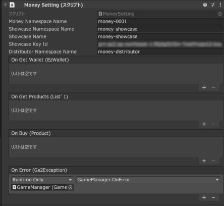
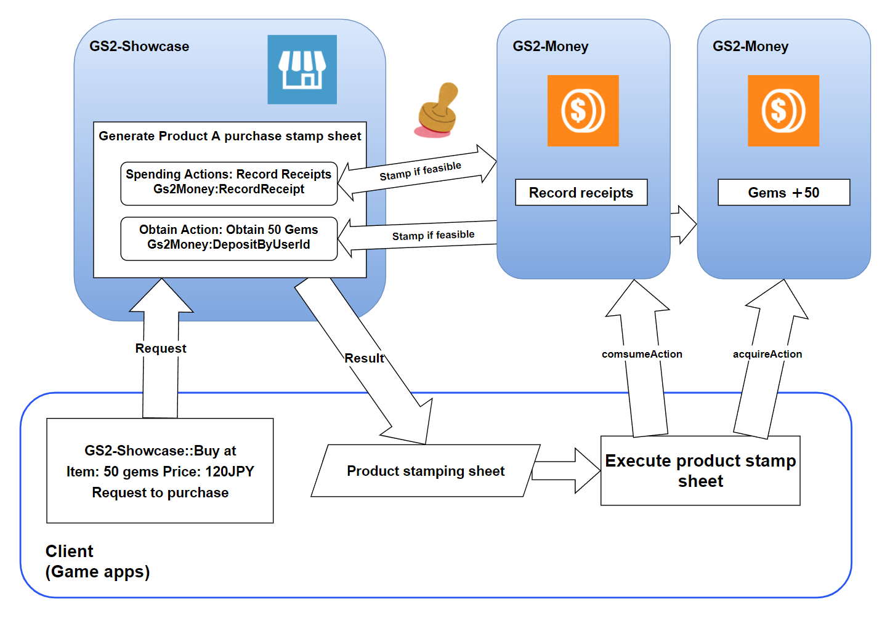
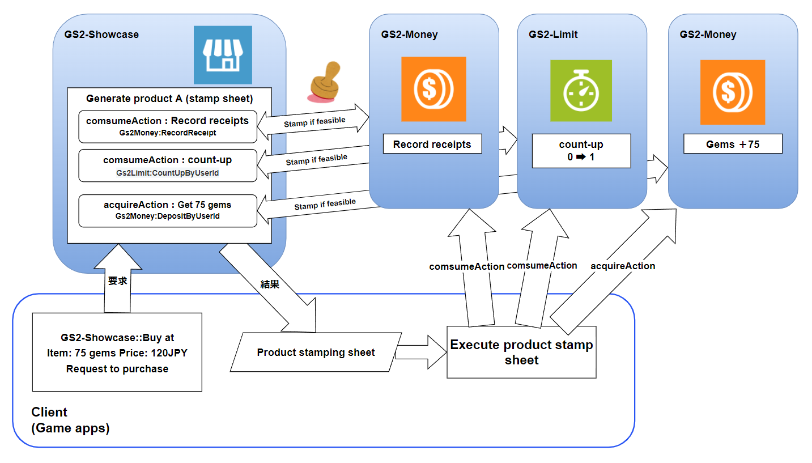

# Billing Currency/ Billing Currency Store Description

The billing currency managed using [GS2-Money](https://app.gs2.io/docs/en/index.html#gs2-money) can be used to  
This is a sample of selling on [GS2-Showcase](https://app.gs2.io/docs/en/index.html#gs2-showcase).

One of the products defined in the sample has a [GS2-Limit](https://app.gs2.io/docs/en/index.html#gs2-limit)  
The number of purchases is limited, allowing only one purchase.

## GS2-Deploy template

- [initialize_money_template.yaml - Billing Currency/Billing Currency Store](../Templates/initialize_money_template.yaml)

## Enable and import Unity IAPs

[GS2-Money](https://app.gs2.io/docs/en/index.html#gs2-money) requires Unity IAP to be enabled for the sample to work.  
( https://docs.unity3d.com/ja/2019.4/Manual/UnityIAPSettingUp.html )  
Enable In-App Purchasing in the Services window, and  
Import the IAP package.

## Billing Currency/Billing Currency Store Settings



| Setting Name | Description | 
|---|---|
| moneyNamespaceName | GS2-Money namespace name |
| showcaseNamespaceName | GS2-Showcase NamespaceName | GS2-Showcase NamespaceName
| showcaseName | GS2-Showcase display shelf name |
| showcaseKeyId | cryptographic key used for signature calculation for stamp sheets issued at GS2-Showcase for merchandise purchases
| limitNamespaceName | Namespace name of GS2-Limit that realizes the purchase count limit
| distributorNamespaceName | namespace name of the GS2-Distributor who delivers the purchased goods

| Event | Description |
|---|---|
| OnGetWallet(EzWalletDetail wallet) | Called when wallet information is retrieved. | OnGetWallet(EzWalletDetail wallet)
| OnGetProducts(List<Product> products) | Called when a list of products for sale is retrieved. | OnGetProducts(List<Product> products)
| OnBuy(Product product) | Called when the purchase of a product is completed. | OnBuy(Product)
| OnError(Gs2Exception error) | Called when an error occurs. | OnError(Gs2Exception error)

## Get Wallet

After login, the latest wallet status is retrieved below.

```c#
AsyncResult<EzGetResult> result = null;
yield return client.Money.Get(
    r =>
    {
        result = r;
    },
    session,
    moneyNamespaceName,
    Slot
);
```

## Retrieve items from the billing currency store

Retrieves the product list and displays the store.

```c#
AsyncResult<EzGetShowcaseResult> result = null;
yield return client.Showcase.GetShowcase(
    r =>
    {
        result = r;
    },
    session,
    showcaseNamespaceName,
    showcaseName
);
```

Parses the retrieved product information to obtain the selling price and the quantity of billable currency available.  
If a purchase limit is set, the status of the purchase counter is also retrieved.

```c#
var products = new List<Product>();
foreach (var displayItem in result.Result.Item.DisplayItems)
{
    var depositRequest = GetAcquireAction<DepositByUserIdRequest>(
        SalesItem, 
        "Gs2Money:DepositByUserId".
    );
    var recordReceiptRequest = GetConsumeAction<RecordReceiptRequest>(
        displayItem.SalesItem, 
        "Gs2Money:RecordReceipt".
    );
    var countUpRequest = GetConsumeAction<CountUpByUserIdRequest>(
        SalesItem, 
        "Gs2Limit:CountUpByUserId".
    );
    var price = depositRequest.Price;
    var count = depositRequest.Count;

    Count; int? boughtCount = null;
    if(countUpRequest ! = null) {
        AsyncResult<EzGetCounterResult> result2 = null;
        yield return client.Limit.GetCounter(
            r => { result2 = r; }
            session,
            countUpRequest.NamespaceName,
            LimitName,
            CounterName
        );
        if (result2.Error == null)
        {
            Item.Count;
        }
        else if (result2.Error is NotFoundException)
        {
            boughtCount = 0;
        }
    }
    Add(new Product
    {
        Id = displayItem.DisplayItemId,
        ContentsId = recordReceiptRequest.ContentsId,
        Price = price,
        CurrencyCount = count,
        BoughtCount = boughtCount,
        BoughtLimit = countUpRequest == null ? null : countUpRequest.MaxValue,
    });
}
```

## Purchase process

If you are in a mobile environment, use the Unity IAP to purchase content from the AppStore or GooglePlay   
(The product must be registered and configured).  
In the editor environment, a Fake Store receipt will be issued.  
The resulting receipt is retained for reference in subsequent processing.

```c#
AsyncResult<PurchaseParameters> result = null;
yield return new IAPUtil().Buy(
    r => { result = r; }
    selectedProduct.ContentsId
);
if (result.Error ! = null)
{
    onError.Invoke(
        Error
    );
    callback.Invoke(new AsyncResult<object>(null, result.Error));
    yield break;
}
```

Executes a process to purchase an item from [GS2-Showcase](https://app.gs2.io/docs/en/index.html#gs2-showcase) using a purchased receipt.  
Config is passed the [GS2-Money](https://app.gs2.io/docs/en/index.html#gs2-money) wallet slot and the contents of the receipt.

```c#
// Request to purchase Showcase products
AsyncResult<EzBuyResult> result = null;
yield return client.Showcase.Buy(
    r => { result = r; }
    session,
    showcaseNamespaceName,
    showcaseName,
    selectedProduct.Id,
    new List<EzConfig>
    {
        new EzConfig
        {
            Key = "slot",
            Value = Slot.ToString(),
        },
        new EzConfig
        {
            Key = "receipt",
            Value = receipt,
        },
    }
);

if (result.Error ! = null)
{
    onError.Invoke(
        Error
    );
    callback.Invoke(new AsyncResult<object>(null, result.Error));
    yield break;
}

// Get stamp sheet
StampSheet = result.Result.StampSheet;
```

The obtained stamp sheet is executed.  
GS2 SDK for Unity provides a state machine for stamp sheet execution.  
To run the state machine, you will need [GS2-Distributor](https://app.gs2.io/docs/en/index.html#gs2-distributor) and the encryption key used to calculate the stamp sheet signature.

```c#
{
    // Generate stamp sheet state machine
    var machine = new StampSheetStateMachine(
        stampSheet,
        client,
        distributorNamespaceName,
        showcaseKeyId
     );

    Gs2Exception exception = null;
    void OnError(Gs2Exception e)
    {
        exception = e;
    }
    
    AddListener(OnError);
    
    // Stamp sheet execution
    yield return machine.Execute(onError);
    
    RemoveListener(OnError);
    
    if (exception ! = null)
    {
        // Stamp sheet execution error
        callback.Invoke(new AsyncResult<object>(null, exception));
        yield break;
    }
}
// Successful purchase of product
```

The normal flow of a stamp sheet for the purchase of a chargeable currency item is as follows



The following is the flow of the purchase stamp sheet for a restricted purchase billed currency item.




