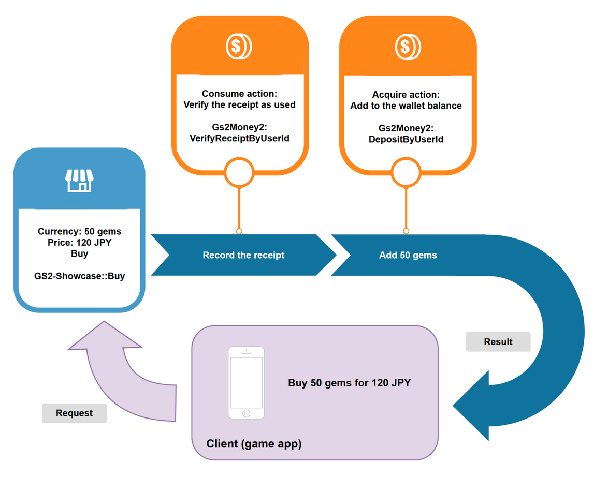
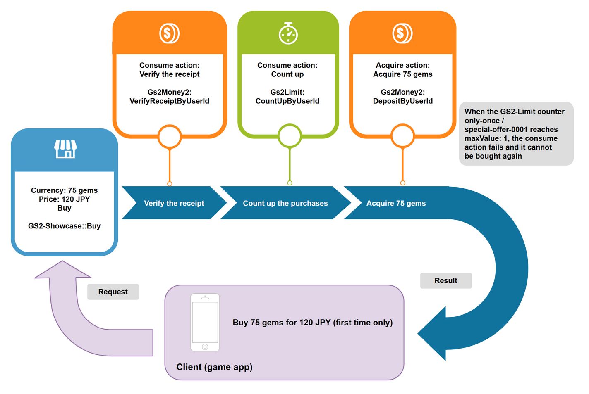

# Billing Currency/ Billing Currency Store Explanation

The billing currency managed using [GS2-Money2](https://docs.gs2.io/api_reference/money2/) can be used to  
This is a sample of selling on [GS2-Showcase](https://docs.gs2.io/api_reference/showcase/).

One of the products defined in the sample has a [GS2-Limit](https://docs.gs2.io/api_reference/limit/)  
The number of purchases is limited, allowing only one purchase.


## GS2-Deploy template

- [initialize_core_template.yaml - Billing Currency/Billing Currency Store](../Templates/initialize_core_template.yaml)

The GS2-Money2 namespace defines the store platform settings (`PlatformSetting`) and  
the store content models (`storeContentModels`) used for receipt verification.  
Because this sample does not perform real in-app purchases, it sets  
`PlatformSetting.fake.acceptFakeReceipt: Accept` to accept purchases with fake receipts.

## Enable and import Unity IAPs

To purchase on a real device (AppStore / GooglePlay), Unity IAP must be enabled.  
[Unity IAP Setup](https://docs.unity3d.com/Manual/UnityIAPSettingUp.html)  
Enable In-App Purchasing in the Services window, and  
Import the IAP package.  
(Since this sample also works with fake receipts, you can verify the purchase flow even with IAP disabled.)  
(This sample is verified with Unity IAP 5.4.3. IAP 5.x requires the purchase to be confirmed explicitly, see "Purchase process" below.)

## Billing Currency/Billing Currency Store Settings


| Setting Name | Description | 
|---|---|
| moneyNamespaceName | GS2-Money2 namespace name |
| showcaseNamespaceName | GS2-Showcase NamespaceName |
| showcaseName | GS2-Showcase display shelf name |

| Event | Description |
|---|---|
| OnGetWallet(EzWallet wallet) | Called when wallet information is retrieved. |
| OnGetProducts(List<Product> products) | Called when a list of products for sale is retrieved. |
| OnBuy(Product product) | Called when the purchase of a product is completed. |
| OnError(Gs2Exception error) | Called when an error occurs. |

## Get Wallet


After login, the latest wallet status is retrieved below.  
In a GS2-Money2 wallet, the balance is obtained from `Wallet.Summary` (`Paid` / `Free` / `Total`).

When UniTask is enabled
```c#
var domain = gs2.Money2.Namespace(
    namespaceName: moneyNamespaceName
).Me(
    gameSession: gameSession
).Wallet(
    slot: Slot
);
try
{
    Wallet = await domain.ModelAsync();

    onGetWallet.Invoke(Wallet);
}
catch (Gs2Exception e)
{
    onError.Invoke(e);
}
```
When coroutine is used
```c#
var domain = gs2.Money2.Namespace(
    namespaceName: moneyNamespaceName
).Me(
    gameSession: gameSession
).Wallet(
    slot: Slot
);
var future = domain.ModelFuture();
yield return future;
if (future.Error != null)
{
    onError.Invoke(future.Error);
    yield break;
}

Wallet = future.Result;

onGetWallet.Invoke(Wallet);
```

The retrieved wallet balance is referenced as follows.

```c#
var balance = Wallet.Summary.Free + Wallet.Summary.Paid;
```

## Retrieve items from the billing currency store


Retrieves the product list and displays the store.

When UniTask is enabled
```c#
var domain = gs2.Showcase.Namespace(
    namespaceName: showcaseNamespaceName
).Me(
    gameSession: gameSession
).Showcase(
    showcaseName: showcaseName
);
try
{
    var showcase = await domain.ModelAsync();

    onGetProducts.Invoke(Products);

    return Products;
}
catch (Gs2Exception e)
{
    onError.Invoke(e);
}
```
When coroutine is used
```c#
var domain = gs2.Showcase.Namespace(
    namespaceName: showcaseNamespaceName
).Me(
    gameSession: gameSession
).Showcase(
    showcaseName: showcaseName
);
var future = domain.ModelFuture();
yield return future;
if (future.Error != null)
{
    onError.Invoke(
        future.Error
    );
    yield break;
}
```

Parses the retrieved product information to obtain the selling price and the quantity of billable currency available.  
If a purchase limit is set, the status of the purchase counter is also retrieved.  
In GS2-Money2, the price and currency amount of the acquire action `Gs2Money2:DepositByUserId` are stored in `depositTransactions`,  
and the store content is specified by the `contentName` of the receipt verification action `Gs2Money2:VerifyReceiptByUserId`.  
The `currency` of each `depositTransactions` entry (the currency code, `JPY` in this sample) is required.

```c#
var products = new List<Product>();
foreach (var displayItem in showcase.DisplayItems)
{
    var depositRequest = GetAcquireAction<DepositByUserIdRequest>(
        displayItem.SalesItem, 
        "Gs2Money2:DepositByUserId"
    );
    var verifyReceiptRequest = GetConsumeAction<VerifyReceiptByUserIdRequest>(
        displayItem.SalesItem, 
        "Gs2Money2:VerifyReceiptByUserId"
    );
    var countUpRequest = GetConsumeAction<CountUpByUserIdRequest>(
        displayItem.SalesItem, 
        "Gs2Limit:CountUpByUserId"
    );
    // In Money2, the price and currency amount are stored in depositTransactions
    var depositTransaction = depositRequest.DepositTransactions != null && depositRequest.DepositTransactions.Length > 0
        ? depositRequest.DepositTransactions[0]
        : null;
    var price = (float?)depositTransaction?.Price;
    var count = depositTransaction?.Count;

    int? boughtCount = null;
    if(countUpRequest != null) {
        var counterDomain = gs2.Limit.Namespace(
            namespaceName: countUpRequest.NamespaceName
        ).Me(
            gameSession: gameSession
        ).Counter(
            limitName: countUpRequest.LimitName,
            counterName: countUpRequest.CounterName
        );
        try
        {
            var item = await counterDomain.ModelAsync();
            boughtCount = item.Count;
        }
        catch (NotFoundException)
        {
            boughtCount = 0;
        }
    }
    products.Add(new Product
    {
        Id = displayItem.DisplayItemId,
        ContentsId = verifyReceiptRequest.ContentName,
        Price = price,
        CurrencyCount = count,
        BoughtCount = boughtCount,
        BoughtLimit = countUpRequest == null ? null : countUpRequest.MaxValue,
    });
}
```

## Purchase process

If you are in a mobile environment, use the Unity IAP to purchase content from the AppStore or GooglePlay   
(The product must be registered and configured).  
When the purchasing feature (`GS2_ENABLE_PURCHASING`) is disabled, or in the editor environment, a fake receipt is used.  
A GS2-Money2 receipt is an __object__ of the form `{ "Store", "TransactionID", "Payload" }`.  
The store name and payload are retained so they can be passed via Config to the subsequent  
stamp sheet process (`Gs2Money2:VerifyReceiptByUserId`).  
(Because the template sets acceptFakeReceipt: Accept, Store="fake" is accepted.)

When UniTask is enabled
```c#
// Default is a fake receipt (used when the purchasing feature is disabled)
string store = "fake";
string payload = "fake";
#if GS2_ENABLE_PURCHASING
// Keep the purchase result so that the store purchase can be confirmed afterwards
PurchaseParameters purchaseParameters = null;
#endif
{
#if GS2_ENABLE_PURCHASING
    try
    {
        purchaseParameters = await new IAPUtil().BuyAsync(
            selectedProduct.ContentsId
        );

        // Retain the contents of the real store receipt
        store = StoreName;
        payload = purchaseParameters.receipt;
    }
    catch (Gs2Exception e)
    {
        onError.Invoke(e);
        return e;
    }
#endif
}
```
When coroutine is used
```c#
// Default is a fake receipt (used when the purchasing feature is disabled)
string store = "fake";
string payload = "fake";
#if GS2_ENABLE_PURCHASING
// Keep the purchase result so that the store purchase can be confirmed afterwards
PurchaseParameters purchaseParameters = null;
#endif
{
#if GS2_ENABLE_PURCHASING
    AsyncResult<PurchaseParameters> result = null;
    yield return new IAPUtil().Buy(
        r => { result = r; },
        selectedProduct.ContentsId
    );
    if (result.Error != null)
    {
        onError.Invoke(
            result.Error
        );
        callback.Invoke(
            result.Error
        );
        yield break;
    }

    // Retain the contents of the real store receipt
    purchaseParameters = result.Result;
    store = StoreName;
    payload = purchaseParameters.receipt;
#endif
}
```

Executes a process to purchase an item from [GS2-Showcase](https://docs.gs2.io/api_reference/showcase/) using the purchase receipt.  
The transaction (stamp sheet) issued by the purchase is awaited for completion with `WaitAsync(true)` / `WaitFuture(true)`.

In Unity IAP 5.x, a purchase has two steps: pending, and then confirmed.  
After waiting for the transaction that contains the receipt verification (`Gs2Money2:VerifyReceiptByUserId`) to complete,  
the purchase is confirmed on the store side with `ConfirmPendingPurchase`.  
This order matters: confirming before the verification would complete the store purchase even when the verification fails.  

When UniTask is enabled
```c#
// Request to purchase an item
var domain = gs2.Showcase.Namespace(
    namespaceName: showcaseNamespaceName
).Me(
    gameSession: gameSession
).Showcase(
    showcaseName: showcaseName
).DisplayItem(
    displayItemId: selectedProduct.Id
);
try
{
    var result = await domain.BuyAsync(
        quantity: 1,
        config: new[]
        {
            new EzConfig
            {
                Key = "slot",
                Value = Slot.ToString(),
            },
            new EzConfig
            {
                Key = "store",
                Value = store,
            },
            new EzConfig
            {
                Key = "transactionId",
                Value = System.Guid.NewGuid().ToString(),
            },
            new EzConfig
            {
                Key = "payload",
                Value = payload,
            },
        }
    );
    // Wait for automatic transaction execution to complete (including all chained transactions)
    await result.WaitAsync(true);
}
catch (Gs2Exception e)
{
    onError.Invoke(e);
    return e;
}

#if GS2_ENABLE_PURCHASING
if (purchaseParameters != null)
{
    // Confirm the purchase on the store side now that the receipt verification has completed
    purchaseParameters.controller.ConfirmPendingPurchase(purchaseParameters.product);
}
#endif

// Successful product purchase
onBuy.Invoke(selectedProduct);
return null;
```
When coroutine is used
```c#
// Request to purchase an item
var domain = gs2.Showcase.Namespace(
    namespaceName: showcaseNamespaceName
).Me(
    gameSession: gameSession
).Showcase(
    showcaseName: showcaseName
).DisplayItem(
    displayItemId: selectedProduct.Id
);
var future = domain.BuyFuture(
    quantity: 1,
    config: new []
    {
        new EzConfig
        {
            Key = "slot",
            Value = Slot.ToString(),
        },
        new EzConfig
        {
            Key = "store",
            Value = store,
        },
        new EzConfig
        {
            Key = "transactionId",
            Value = System.Guid.NewGuid().ToString(),
        },
        new EzConfig
        {
            Key = "payload",
            Value = payload,
        },
    }
);
yield return future;
if (future.Error != null)
{
    onError.Invoke(
        future.Error
    );
    callback.Invoke(
        future.Error
    );
    yield break;
}

// Wait for automatic transaction execution to complete (including all chained transactions)
yield return future.Result.WaitFuture(true);

#if GS2_ENABLE_PURCHASING
if (purchaseParameters != null)
{
    // Confirm the purchase on the store side now that the receipt verification has completed
    purchaseParameters.controller.ConfirmPendingPurchase(purchaseParameters.product);
}
#endif

// Successful product purchase

onBuy.Invoke(selectedProduct);

callback.Invoke(null);
```
Config is passed the wallet slot number __slot__ of [GS2-Money2](https://docs.gs2.io/api_reference/money2/) and the
and the contents of the receipt __store__ / __transactionId__ / __payload__.
The wallet slot number is the type of billing currency assigned by platform for reference in this sample, and is defined as follows

| Platform | Number |
|---------------|---|
| Standalone (Other) | 0 |
| iOS | 1 |
| Android | 2 |

Config is a mechanism for passing dynamic parameters to the stamp sheet.  
[⇒Setting Parameters when Issuing Stamp Sheets]( https://docs.gs2.io/articles/tech/stamp_sheet/#setting-parameters-when-issuing-stamp-sheets )  
Config(EzConfig) is a key-value format that allows you to substitute a placeholder string of #{key value specified in Config} with the parameters you pass.
In the following stamp sheet definition #{slot} will be replaced by the wallet slot number, and #{store} / #{transactionId} / #{payload} by each field of the receipt.  
The receipt must be passed as an __object__ rather than a string, so a placeholder is placed for each field.

```yaml
consumeActions:
  - action: Gs2Money2:VerifyReceiptByUserId
    request:
      namespaceName: ${MoneyNamespaceName}
      userId: "#{userId}"
      contentName: currency-120
      receipt:
        Store: "#{store}"
        TransactionID: "#{transactionId}"
        Payload: "#{payload}"
acquireActions:
  - action: Gs2Money2:DepositByUserId
    request:
      namespaceName: ${MoneyNamespaceName}
      userId: "#{userId}"
      slot: "#{slot}"
      depositTransactions:
        - price: 120
          currency: JPY
          count: 50
```

The purchase process issues a transaction for the purchase of the charged currency item in GS2-Showcase.  
The GS2-Showcase namespace is configured for __automatic transaction execution__ (`TransactionSetting.EnableAutoRun: true`),  
so the issued transaction is executed automatically on the server side. The client waits for completion, including  
chained transactions, with `WaitAsync(true)` / `WaitFuture(true)`.

The flow of the transaction for the normal purchase of billed currency items is as follows



The flow of the transaction for the purchase of purchase-restricted billed currency items is as follows


