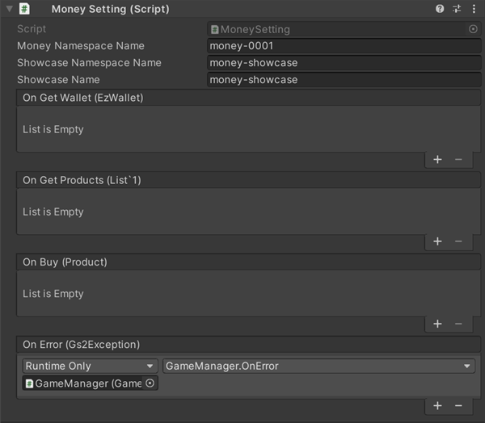

# Billing Currency/ Billing Currency Store Explanation

The billing currency managed using [GS2-Money](https://app.gs2.io/docs/en/index.html#gs2-money) can be used to  
This is a sample of selling on [GS2-Showcase](https://app.gs2.io/docs/en/index.html#gs2-showcase).

One of the products defined in the sample has a [GS2-Limit](https://app.gs2.io/docs/en/index.html#gs2-limit)  
The number of purchases is limited, allowing only one purchase.


## GS2-Deploy template

- [initialize_money_template.yaml - Billing Currency/Billing Currency Store](../Templates/initialize_money_template.yaml)

## Enable and import Unity IAPs

[GS2-Money](https://app.gs2.io/docs/en/index.html#gs2-money) requires Unity IAP to be enabled for the sample to work.  
( https://docs.unity3d.com/ja/2019.4/Manual/UnityIAPSettingUp.html )  
Enable In-App Purchasing in the Services window, and  
Import the IAP package.

## Billing Currency/Billing Currency Store Settings



| Setting Name | Description | 
|---|---|
| moneyNamespaceName | GS2-Money namespace name |
| showcaseNamespaceName | GS2-Showcase NamespaceName |
| showcaseName | GS2-Showcase display shelf name |

| Event | Description |
|---|---|
| OnGetWallet(EzWalletDetail wallet) | Called when wallet information is retrieved. |
| OnGetProducts(List<Product> products) | Called when a list of products for sale is retrieved. |
| OnBuy(Product product) | Called when the purchase of a product is completed. |
| OnError(Gs2Exception error) | Called when an error occurs. |

## Get Wallet


After login, the latest wallet status is retrieved below.

When UniTask is enabled
```c#
var domain = gs2.Money.Namespace(
    namespaceName: moneyNamespaceName
).Me(
    gameSession: gameSession
).Wallet(
    slot: Slot
);
try
{
    Wallet = await domain.ModelAsync();

    onGetWallet.Invoke(Wallet);
}
catch (Gs2Exception e)
{
    onError.Invoke(e);
}
```
When coroutine is used
```c#
var domain = gs2.Money.Namespace(
    namespaceName: moneyNamespaceName
).Me(
    gameSession: gameSession
).Wallet(
    slot: Slot
);
var future = domain.Model();
yield return future;
if (future.Error != null)
{
    onError.Invoke(future.Error);
    yield break;
}

Wallet = future.Result;

onGetWallet.Invoke(Wallet);
```

## Retrieve items from the billing currency store


Retrieves the product list and displays the store.

When UniTask is enabled
```c#
var domain = gs2.Showcase.Namespace(
    namespaceName: showcaseNamespaceName
).Me(
    gameSession: gameSession
).Showcase(
    showcaseName: showcaseName
);
try
{
    var showcase = await domain.ModelAsync();

    onGetProducts.Invoke(Products);

    return Products;
}
catch (Gs2Exception e)
{
    onError.Invoke(e);
}
```
When coroutine is used
```c#
var domain = gs2.Showcase.Namespace(
    namespaceName: showcaseNamespaceName
).Me(
    gameSession: gameSession
).Showcase(
    showcaseName: showcaseName
);
var future = domain.Model();
yield return future;
if (future.Error != null)
{
    onError.Invoke(
        future.Error
    );
    yield break;
}
```

Parses the retrieved product information to obtain the selling price and the quantity of billable currency available.  
If a purchase limit is set, the status of the purchase counter is also retrieved.

```c#
var products = new List<Product>();
foreach (var displayItem in result.Result.Item.DisplayItems)
{
    var depositRequest = GetAcquireAction<DepositByUserIdRequest>(
        displayItem.SalesItem, 
        "Gs2Money:DepositByUserId"
    );
    var recordReceiptRequest = GetConsumeAction<RecordReceiptRequest>(
        displayItem.SalesItem, 
        "Gs2Money:RecordReceipt"
    );
    var countUpRequest = GetConsumeAction<CountUpByUserIdRequest>(
        displayItem.SalesItem, 
        "Gs2Limit:CountUpByUserId"
    );
    var price = depositRequest.Price;
    var count = depositRequest.Count;

    int? boughtCount = null;
    if(countUpRequest != null) {
        AsyncResult<EzGetCounterResult> result2 = null;
        yield return client.Limit.GetCounter(
            r => { result2 = r; },
            session,
            countUpRequest.NamespaceName,
            countUpRequest.LimitName,
            countUpRequest.CounterName
        );
        if (result2.Error == null)
        {
            boughtCount = result2.Result.Item.Count;
        }
        else if (result2.Error is NotFoundException)
        {
            boughtCount = 0;
        }
    }
    products.Add(new Product
    {
        Id = displayItem.DisplayItemId,
        ContentsId = recordReceiptRequest.ContentsId,
        Price = price,
        CurrencyCount = count,
        BoughtCount = boughtCount,
        BoughtLimit = countUpRequest == null ? null : countUpRequest.MaxValue,
    });
}
```

## Purchase process

If you are in a mobile environment, use the Unity IAP to purchase content from the AppStore or GooglePlay   
(The product must be registered and configured).  
In the editor environment, a Fake Store receipt will be issued.  
The resulting receipt is retained for reference in subsequent processing.

When UniTask is enabled
```c#
string receipt;
{
#if GS2_ENABLE_PURCHASING
    try
    {
        PurchaseParameters result = await new IAPUtil().BuyAsync(
            selectedProduct.ContentsId
        );
        
        // Billed Currency Product Purchase Receipt Information
        receipt = result.receipt;
    }
    catch (Gs2Exception e)
    {
        onError.Invoke(e);
        return e;
    }
#endif
}
```
When coroutine is used
```c#
string receipt;
{
#if GS2_ENABLE_PURCHASING
    AsyncResult<PurchaseParameters> result = null;
    yield return new IAPUtil().Buy(
        r => { result = r; },
        selectedProduct.ContentsId
    );
    if (result.Error != null)
    {
        onError.Invoke(
            result.Error
        );
        callback.Invoke(
            result.Error
        );
        yield break;
    }

    // Billed Currency Product Purchase Receipt Information
    receipt = result.Result.receipt;
#endif
}
```

Executes a process to purchase an item from [GS2-Showcase](https://app.gs2.io/docs/en/index.html#gs2-showcase) using the purchase receipt.  

When UniTask is enabled
```c#
// Request to purchase an item
var domain = gs2.Showcase.Namespace(
    namespaceName: showcaseNamespaceName
).Me(
    gameSession: gameSession
).Showcase(
    showcaseName: showcaseName
).DisplayItem(
    displayItemId: selectedProduct.Id
);
try
{
    var result = await domain.BuyAsync(
        quantity: 1,
        config: new[]
        {
            new EzConfig
            {
                Key = "slot",
                Value = Slot.ToString(),
            },
            new EzConfig
            {
                Key = "receipt",
                Value = receipt,
            },
        }
    );
}
catch (Gs2Exception e)
{
    onError.Invoke(e);
    return e;
}

// Successful product purchase
onBuy.Invoke(selectedProduct);
return null;
```
When coroutine is used
```c#
// Request to purchase an item
var domain = gs2.Showcase.Namespace(
    namespaceName: showcaseNamespaceName
).Me(
    gameSession: gameSession
).Showcase(
    showcaseName: showcaseName
).DisplayItem(
    displayItemId: selectedProduct.Id
);
var future = domain.Buy(
    quantity: 1,
    config: new []
    {
        new EzConfig
        {
            Key = "slot",
            Value = Slot.ToString(),
        },
        new EzConfig
        {
            Key = "receipt",
            Value = receipt,
        },
    }
);
yield return future;
if (future.Error != null)
{
    onError.Invoke(
        future.Error
    );
    callback.Invoke(
        future.Error
    );
    yield break;
}

// Successful product purchase

onBuy.Invoke(selectedProduct);

callback.Invoke(null);
```
Config is passed the wallet slot number __slot__ of [GS2-Money](https://app.gs2.io/docs/en/index.html#gs2-money) and the
and the contents of the receipt __receipt__.
The wallet slot number is the type of billing currency assigned by platform for reference in this sample, and is defined as follows

| Platform | Number |
|---------------|---|
| Standalone (Other) | 0 |
| iOS | 1 |
| Android | 2 |

Config is a mechanism for passing dynamic parameters to the stamp sheet.  
[⇒Stamp Sheet Variables](https://app.gs2.io/docs/en/index.html#d7e97677c7)  
Config(EzConfig) is a key-value format that allows you to substitute a placeholder string of #{key value specified in Config} with the parameters you pass.
In the following stamp sheet definition #{slot} will be replaced by the wallet slot number and #{receipt} by the receipt.

```yaml
consumeActions:
  - action: Gs2Money:RecordReceipt
    request:
      namespaceName: ${MoneyNamespaceName}
      contentsId: io.gs2.sample.currency120
      userId: "#{userId}"
      receipt: "#{receipt}"
acquireActions:
  - action: Gs2Money:DepositByUserId
    request:
      namespaceName: ${MoneyNamespaceName}
      userId: "#{userId}"
      slot: "#{slot}"
      price: 120
      count: 50
```

The purchase process issues a stamp sheet for the purchase of the charged currency item in GS2-Showcase.  
In implementations using GS2Domain Class ("gs2" in the source), the stamp sheet process is __automatically executed__ on the client side.  

The normal process for stamp sheets for the purchase of billed currency items is as follows


The purchase stamp sheet process for restricted purchase billed currency items is as follows


