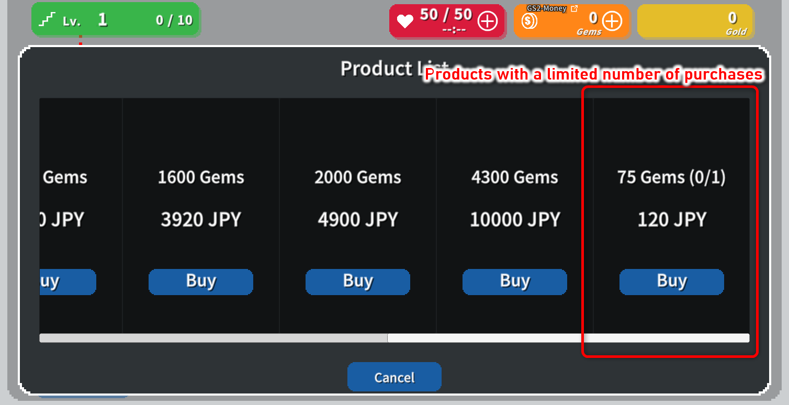
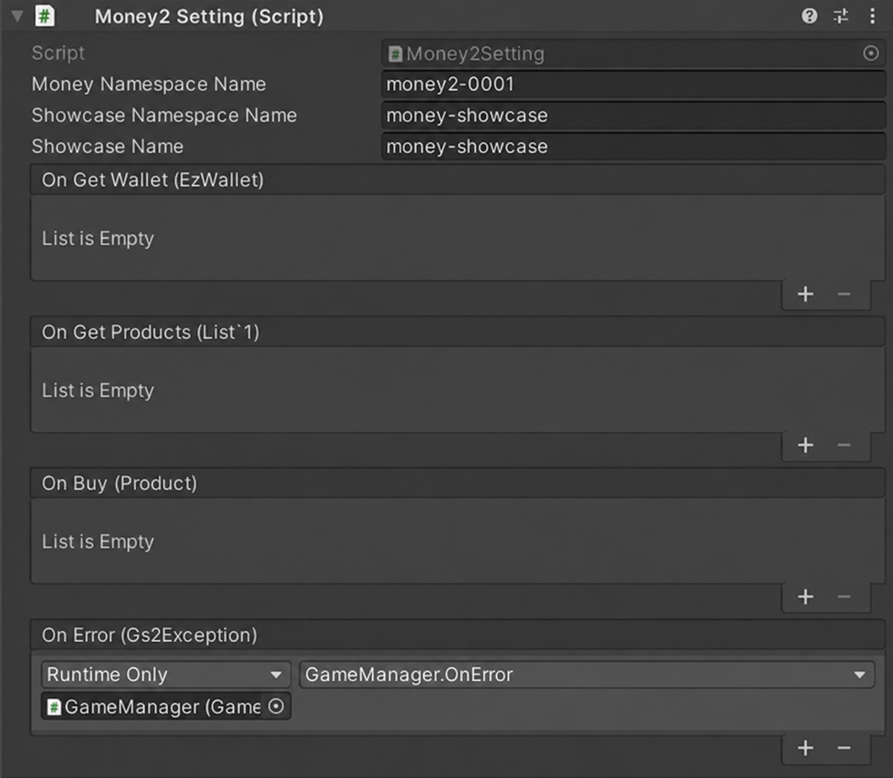
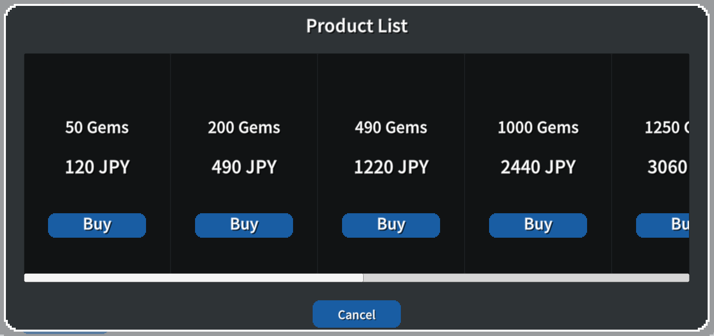
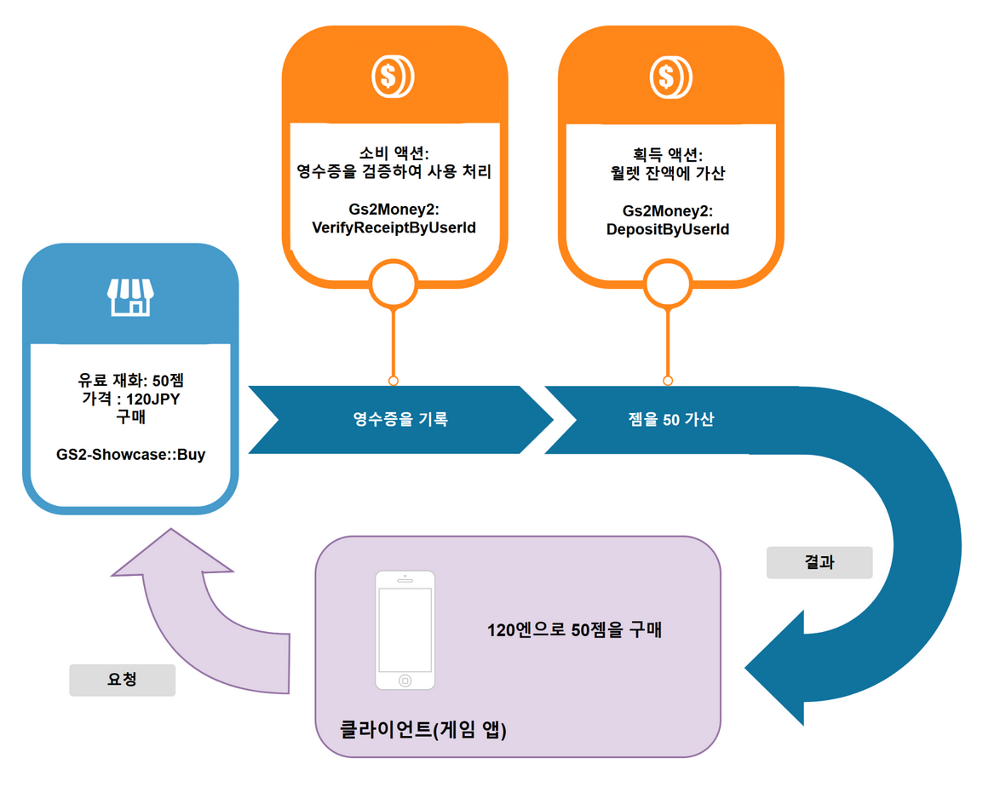
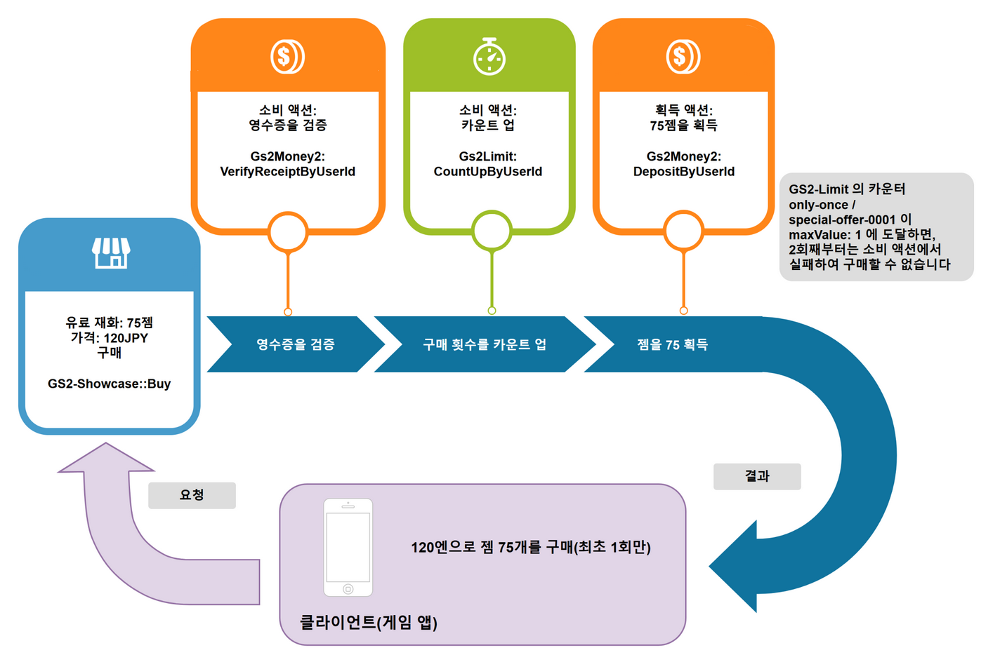

# 유료 재화/유료 재화 상점 해설

[GS2-Money2](https://docs.gs2.io/ko/api_reference/money2/) 로 관리되는 유료 재화를,  
[GS2-Showcase](https://docs.gs2.io/ko/api_reference/showcase/) 로 판매하는 샘플입니다.

샘플에서 정의된 상품 중 하나에는 [GS2-Limit](https://docs.gs2.io/ko/api_reference/limit/) 에 의한  
구매 횟수 제한이 붙어 있어, 1 회만 구매가 가능합니다.



## GS2-Deploy 템플릿

- [initialize_core_template.yaml - 유료 재화/유료 재화 상점](../Templates/initialize_core_template.yaml)

GS2-Money2 의 네임스페이스에는 스토어 플랫폼 설정(`PlatformSetting`)과  
영수증 검증에 사용하는 스토어 콘텐츠 모델(`storeContentModels`)을 정의하고 있습니다.  
본 샘플에서는 실제 기기 결제를 하지 않기 때문에, `PlatformSetting.fake.acceptFakeReceipt: Accept` 를 설정하여  
페이크 영수증으로의 구매를 받아들이도록 하고 있습니다.

## Unity IAP 의 활성화, 임포트

실제 기기(AppStore / GooglePlay)에서 결제를 하는 경우에는 Unity IAP 의 활성화가 필요합니다.  

[Unity IAP 설정](https://docs.unity3d.com/Manual/UnityIAPSettingUp.html)  

서비스 창에서 In-App Purchasing 을 활성화하고,  
IAP 패키지를 임포트합니다.  
(본 샘플은 페이크 영수증으로도 동작하므로, IAP 가 비활성화된 상태에서도 구매 흐름을 확인할 수 있습니다.)

## 유료 재화/유료 재화 상점 설정 Money2Setting



| 설정 이름 | 설명 | 
|---|---|
| moneyNamespaceName | GS2-Money2 의 네임스페이스 이름 |
| showcaseNamespaceName | GS2-Showcase 의 네임스페이스 이름 |
| showcaseName | GS2-Showcase 의 진열대 이름 |

| 이벤트 | 설명 |
|---|---|
| OnGetWallet(EzWallet wallet) | 월렛의 정보를 가져왔을 때 호출됩니다. |
| OnGetProducts(List<Product> products) | 판매 중인 상품 목록을 가져왔을 때 호출됩니다. |
| OnBuy(Product product) | 상품의 구매가 완료되었을 때 호출됩니다. |
| OnError(Gs2Exception error) | 오류가 발생했을 때 호출됩니다. |

## 월렛 가져오기


로그인 후, 아래와 같이 최신 월렛의 상태를 가져옵니다.  
GS2-Money2 의 월렛에서는 잔액을 `Wallet.Summary`(`Paid` / `Free` / `Total`)에서 가져옵니다.

UniTask 활성화 시
```c#
var domain = gs2.Money2.Namespace(
    namespaceName: moneyNamespaceName
).Me(
    gameSession: gameSession
).Wallet(
    slot: Slot
);
try
{
    Wallet = await domain.ModelAsync();

    onGetWallet.Invoke(Wallet);
}
catch (Gs2Exception e)
{
    onError.Invoke(e);
}
```
코루틴 사용 시
```c#
var domain = gs2.Money2.Namespace(
    namespaceName: moneyNamespaceName
).Me(
    gameSession: gameSession
).Wallet(
    slot: Slot
);
var future = domain.ModelFuture();
yield return future;
if (future.Error != null)
{
    onError.Invoke(future.Error);
    yield break;
}

Wallet = future.Result;

onGetWallet.Invoke(Wallet);
```

가져온 월렛의 잔액은 아래와 같이 참조합니다.

```c#
var balance = Wallet.Summary.Free + Wallet.Summary.Paid;
```

## 유료 재화 상점의 상품 가져오기



상품 목록을 가져와 상점을 표시합니다.

UniTask 활성화 시
```c#
var domain = gs2.Showcase.Namespace(
    namespaceName: showcaseNamespaceName
).Me(
    gameSession: gameSession
).Showcase(
    showcaseName: showcaseName
);
try
{
    var showcase = await domain.ModelAsync();

    onGetProducts.Invoke(Products);

    return Products;
}
catch (Gs2Exception e)
{
    onError.Invoke(e);
}
```
코루틴 사용 시
```c#
var domain = gs2.Showcase.Namespace(
    namespaceName: showcaseNamespaceName
).Me(
    gameSession: gameSession
).Showcase(
    showcaseName: showcaseName
);
var future = domain.ModelFuture();
yield return future;
if (future.Error != null)
{
    onError.Invoke(
        future.Error
    );
    yield break;
}
```

가져온 상품 정보를 파싱하여, 판매 가격이나 획득할 수 있는 유료 재화의 수량을 가져옵니다.  
구매 횟수 제한이 설정되어 있는 경우에는 구매 횟수 카운터의 상태도 가져오고 있습니다.  
GS2-Money2 에서는 획득 액션 `Gs2Money2:DepositByUserId` 의 가격·통화량이 `depositTransactions` 에 저장되어 있으며,  
영수증 검증 액션 `Gs2Money2:VerifyReceiptByUserId` 의 `contentName` 으로 스토어 콘텐츠를 지정합니다.  
`depositTransactions` 의 `currency`(통화 코드. 본 샘플에서는 `JPY`)는 필수 항목입니다.

```c#
var products = new List<Product>();
foreach (var displayItem in showcase.DisplayItems)
{
    var depositRequest = GetAcquireAction<DepositByUserIdRequest>(
        displayItem.SalesItem, 
        "Gs2Money2:DepositByUserId"
    );
    var verifyReceiptRequest = GetConsumeAction<VerifyReceiptByUserIdRequest>(
        displayItem.SalesItem, 
        "Gs2Money2:VerifyReceiptByUserId"
    );
    var countUpRequest = GetConsumeAction<CountUpByUserIdRequest>(
        displayItem.SalesItem, 
        "Gs2Limit:CountUpByUserId"
    );
    // Money2 에서는 가격·통화량이 depositTransactions 에 저장된다
    var depositTransaction = depositRequest.DepositTransactions != null && depositRequest.DepositTransactions.Length > 0
        ? depositRequest.DepositTransactions[0]
        : null;
    var price = (float?)depositTransaction?.Price;
    var count = depositTransaction?.Count;

    int? boughtCount = null;
    if(countUpRequest != null) {
        var counterDomain = gs2.Limit.Namespace(
            namespaceName: countUpRequest.NamespaceName
        ).Me(
            gameSession: gameSession
        ).Counter(
            limitName: countUpRequest.LimitName,
            counterName: countUpRequest.CounterName
        );
        try
        {
            var item = await counterDomain.ModelAsync();
            boughtCount = item.Count;
        }
        catch (NotFoundException)
        {
            boughtCount = 0;
        }
    }
    products.Add(new Product
    {
        Id = displayItem.DisplayItemId,
        ContentsId = verifyReceiptRequest.ContentName,
        Price = price,
        CurrencyCount = count,
        BoughtCount = boughtCount,
        BoughtLimit = countUpRequest == null ? null : countUpRequest.MaxValue,
    });
}
```

## 구매 처리

모바일 환경이라면 Unity IAP 를 사용하여 AppStore 나 GooglePlay 에서 콘텐츠를 구매합니다   
(상품의 등록과 설정이 필요합니다).  
구매 기능(`GS2_ENABLE_PURCHASING`)이 비활성화된 경우나 에디터 환경에서는 페이크 영수증을 사용합니다.  
GS2-Money2 의 영수증은 `{ "Store", "TransactionID", "Payload" }` 형식의 __오브젝트__ 입니다.  
후속 스탬프 시트 처리(`Gs2Money2:VerifyReceiptByUserId`)에 Config 로 전달할 수 있도록,  
스토어 이름과 페이로드를 보관해 둡니다.  
(템플릿에서 acceptFakeReceipt: Accept 를 설정하고 있기 때문에 Store="fake" 를 받아들입니다)

UniTask 활성화 시
```c#
// 기본은 페이크 영수증(구매 기능이 비활성화된 경우에 사용)
string store = "fake";
string payload = "fake";
{
#if GS2_ENABLE_PURCHASING
    try
    {
        PurchaseParameters result = await new IAPUtil().BuyAsync(
            selectedProduct.ContentsId
        );

        // 실제 스토어의 영수증 내용을 보관
        store = StoreName;
        payload = result.receipt;
    }
    catch (Gs2Exception e)
    {
        onError.Invoke(e);
        return e;
    }
#endif
}
```
코루틴 사용 시
```c#
// 기본은 페이크 영수증(구매 기능이 비활성화된 경우에 사용)
string store = "fake";
string payload = "fake";
{
#if GS2_ENABLE_PURCHASING
    AsyncResult<PurchaseParameters> result = null;
    yield return new IAPUtil().Buy(
        r => { result = r; },
        selectedProduct.ContentsId
    );
    if (result.Error != null)
    {
        onError.Invoke(
            result.Error
        );
        callback.Invoke(
            result.Error
        );
        yield break;
    }

    // 실제 스토어의 영수증 내용을 보관
    store = StoreName;
    payload = result.Result.receipt;
#endif
}
```

구매한 영수증을 사용하여 [GS2-Showcase](https://docs.gs2.io/ko/api_reference/showcase/) 의 상품을 구매하는 처리를 실행합니다.  
구매로 발행된 트랜잭션(스탬프 시트)은 `WaitAsync(true)` / `WaitFuture(true)` 로 완료를 대기합니다.

UniTask 활성화 시
```c#
// Showcase 상품의 구매를 요청
var domain = gs2.Showcase.Namespace(
    namespaceName: showcaseNamespaceName
).Me(
    gameSession: gameSession
).Showcase(
    showcaseName: showcaseName
).DisplayItem(
    displayItemId: selectedProduct.Id
);
try
{
    var result = await domain.BuyAsync(
        quantity: 1,
        config: new[]
        {
            new EzConfig
            {
                Key = "slot",
                Value = Slot.ToString(),
            },
            new EzConfig
            {
                Key = "store",
                Value = store,
            },
            new EzConfig
            {
                Key = "transactionId",
                Value = System.Guid.NewGuid().ToString(),
            },
            new EzConfig
            {
                Key = "payload",
                Value = payload,
            },
        }
    );
    // 트랜잭션의 자동 실행 완료를 대기(연쇄되는 트랜잭션도 포함하여 모두 대기)
    await result.WaitAsync(true);
}
catch (Gs2Exception e)
{
    onError.Invoke(e);
    return e;
}

// 상품 구매에 성공
onBuy.Invoke(selectedProduct);
return null;
```
코루틴 사용 시
```c#
// Showcase 상품의 구매를 요청
var domain = gs2.Showcase.Namespace(
    namespaceName: showcaseNamespaceName
).Me(
    gameSession: gameSession
).Showcase(
    showcaseName: showcaseName
).DisplayItem(
    displayItemId: selectedProduct.Id
);
var future = domain.BuyFuture(
    quantity: 1,
    config: new []
    {
        new EzConfig
        {
            Key = "slot",
            Value = Slot.ToString(),
        },
        new EzConfig
        {
            Key = "store",
            Value = store,
        },
        new EzConfig
        {
            Key = "transactionId",
            Value = System.Guid.NewGuid().ToString(),
        },
        new EzConfig
        {
            Key = "payload",
            Value = payload,
        },
    }
);
yield return future;
if (future.Error != null)
{
    onError.Invoke(
        future.Error
    );
    callback.Invoke(
        future.Error
    );
    yield break;
}

// 트랜잭션의 자동 실행 완료를 대기(연쇄되는 트랜잭션도 포함하여 모두 대기)
yield return future.Result.WaitFuture(true);

// 상품 구매에 성공

onBuy.Invoke(selectedProduct);

callback.Invoke(null);
```
Config 에는 [GS2-Money2](https://docs.gs2.io/ko/api_reference/money2/) 의 월렛 슬롯 번호 __slot__ 과,
영수증의 내용 __store__ / __transactionId__ / __payload__ 를 전달합니다.
월렛 슬롯 번호는 이 샘플에서 참고를 위해 플랫폼별로 할당한 유료 재화의 종류로, 아래와 같이 정의하고 있습니다.

| 플랫폼 | 번호 |
|---------------|---|
| 스탠드얼론(기타) | 0 |
| iOS           | 1 |
| Android       | 2 |

Config 는 스탬프 시트에 동적인 파라미터를 전달하기 위한 구조입니다.  
[⇒스탬프 시트 발행 시의 파라미터 설정]( https://docs.gs2.io/ko/articles/tech/stamp_sheet/ )  
Config(EzConfig) 는 키·값 형식으로, 전달한 파라미터로 #{Config 에서 지정한 키 값} 의 플레이스홀더 문자열을 치환할 수 있습니다.
아래 스탬프 시트의 정의 중 　#{slot}　은 월렛 슬롯 번호, #{store} / #{transactionId} / #{payload} 는 영수증의 각 항목으로 치환됩니다.  
영수증은 문자열이 아니라 __오브젝트__ 로 전달해야 하므로, 항목마다 플레이스홀더를 배치합니다.

```yaml
consumeActions:
  - action: Gs2Money2:VerifyReceiptByUserId
    request:
      namespaceName: ${MoneyNamespaceName}
      userId: "#{userId}"
      contentName: currency-120
      receipt:
        Store: "#{store}"
        TransactionID: "#{transactionId}"
        Payload: "#{payload}"
acquireActions:
  - action: Gs2Money2:DepositByUserId
    request:
      namespaceName: ${MoneyNamespaceName}
      userId: "#{userId}"
      slot: "#{slot}"
      depositTransactions:
        - price: 120
          currency: JPY
          count: 50
```

구매 처리에 의해 GS2-Showcase 에서 유료 재화 상품 구매의 트랜잭션이 발행됩니다.  
GS2-Showcase 의 네임스페이스는 __트랜잭션의 자동 실행__(`TransactionSetting.EnableAutoRun: true`)으로 설정되어 있어,  
발행된 트랜잭션은 서버 쪽에서 자동으로 실행됩니다. 클라이언트는 `WaitAsync(true)` / `WaitFuture(true)` 로  
연쇄되는 트랜잭션도 포함한 완료를 대기합니다.  

일반적인 유료 재화 상품의 구매 트랜잭션 처리의 흐름은 아래와 같습니다.



구매 제한이 있는 유료 재화 상품의 구매 트랜잭션 처리의 흐름은 아래와 같습니다.


