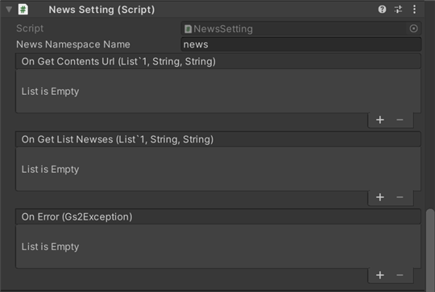

# お知らせ　解説

[GS2-News](https://app.gs2.io/docs/index.html#gs2-news) でお知らせをWebView(アプリ内ブラウザ)に表示するサンプルです。

## GS2-Deploy テンプレート

- [initialize_news_template.yaml - ガチャ機能](../Templates/initialize_news_template.yaml)

## お知らせ設定 NewsSetting



| 設定名 | 説明 |
|---|---|
| newsNamespaceName | GS2-News のネームスペース名 |

| イベント | 説明 |
|---|---|
| onGetContentsUrl(List<EzSetCookieRequestEntry>, string, string) | お知らせ記事へのアクセスに設定が必要なクッキーのリストを取得したときに呼び出されます。 |
| onGetListNewses(List<EzNews>, string, string>) | お知らせ記事の一覧を取得したときに呼び出されます。 |
| OnError(Gs2Exception error) | エラーが発生したときに呼び出されます。 |

## お知らせの配信コンテンツの準備

お知らせで表示するコンテンツのサンプルが、githubの  
[gs2-news-sample](https://github.com/gs2io/gs2-news-sample) にありますので、  
こちらのページからダウンロードしたコンテンツファイル群をZIP形式で圧縮し、  
マネージメントコンソールの __GS2-News__ の項目の`マスターデータのインポート`よりアップロードしてください。  

```
フォルダの構成

gs2-news-sample
 |- archetypes
 |- content
     |- news
     |- events
     |- maintenance
 |- layouts
 |- config.toml
```

## WebViewについて

サンプルで使用しているWebViewは　unity-webview(https://github.com/gree/unity-webview) です。  
対応プラットフォームは iOS/Android/mac となっており、Windowsでの動作には対応しておりません。  
パッケージマネージャーからインストールされます。  

## お知らせの表示の流れ

### URLとクッキー値の取得

GS2-Newsから、展開された配信コンテンツへの接続URLと、アクセス権限の検証のために使用するクッキーのキーと値を取得します。

・UniTask有効時
```c#
var domain = gs2.News.Namespace(
    namespaceName: newsNamespaceName
).Me(
    gameSession: gameSession
).News();
var result = await domain.GetContentsUrlAsync();

var items = result.ToList();
foreach (var item in items)
{
    var entry = await item.ModelAsync();
    cookies.Add(entry);
}
browserUrl = domain.BrowserUrl;
zipUrl = domain.ZipUrl;

onGetContentsUrl.Invoke(cookies, browserUrl, zipUrl);
```
・コルーチン使用時
```c#
 var domain = gs2.News.Namespace(
    namespaceName: newsNamespaceName
).Me(
    gameSession: gameSession
).News(
);
var future = domain.GetContentsUrl();
yield return future;
if (future.Error != null)
{
    onError.Invoke(
        future.Error
    );
    yield break;
}

var items = future.Result.ToList();
foreach (var item in items)
{
    var future2 = item.Model();
    yield return future2;
    var entry = future2.Result;
    cookies.Add(entry);
}
browserUrl = domain.BrowserUrl;
zipUrl = domain.ZipUrl;

onGetContentsUrl.Invoke(cookies, browserUrl, zipUrl);
```

### WebViewでコンテンツを開く

取得したそれぞれのクッキー値をWebView側に設定します。unity-webview の場合は EvaluateJS() から渡します。

```c#
 webViewObject.EvaluateJS("document.cookie = '" + key + "=" + value + "';");
```

WebViewで接続URLを開きます。

```c#
webViewObject.LoadURL(url);
```