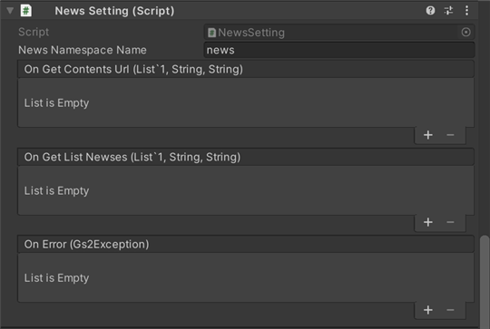

# 공지사항 해설

[GS2-News](https://docs.gs2.io/ko/api_reference/news/) 로 공지사항을 WebView(앱 내 브라우저)에 표시하는 샘플입니다.

## GS2-Deploy 템플릿

- [initialize_option_template.yaml - 공지사항](../Templates/initialize_option_template.yaml)

## 공지사항 설정 NewsSetting



| 설정 이름 | 설명 |
|---|---|
| newsNamespaceName | GS2-News 의 네임스페이스 이름 |

| 이벤트 | 설명 |
|---|---|
| onGetContentsUrl(List<EzSetCookieRequestEntry>, string, string) | 공지사항 기사에 접근하는 데 설정이 필요한 쿠키의 목록을 가져왔을 때 호출됩니다. |
| onGetListNewses(List<EzNews>, string, string>) | 공지사항 기사의 목록을 가져왔을 때 호출됩니다. |
| OnError(Gs2Exception error) | 오류가 발생했을 때 호출됩니다. |

## 공지사항 배포 콘텐츠의 준비

공지사항으로 표시할 콘텐츠의 샘플이 GitHub 의  
[gs2-news-sample](https://github.com/gs2io/gs2-news-sample) 에 있으므로,  
이 페이지에서 다운로드한 콘텐츠 파일들을 Zip 형식으로 압축하여,  
매니지먼트 콘솔의 __GS2-News__ 항목의 `마스터 데이터 임포트` 에서 업로드해 주세요.  

```
폴더 구성

gs2-news-sample
 |- archetypes
 |- content
     |- news
     |- events
     |- maintenance
 |- layouts
 |- config.toml
```

## WebView 에 대하여

샘플에서는 GS2-News 의 동작을 시험해 볼 환경으로, 무료 WebView 플러그인 [unity-webview](https://github.com/gree/unity-webview) 를 사용하고 있습니다.  
대응 플랫폼은 iOS/Android/mac 이며, Windows 에서의 동작은 지원하지 않습니다.  
샘플의 manifest.json 에 의해 패키지 매니저에서 설치됩니다.  

※ 다만 unity-webview 에는 쿠키의 처리에서 기능이 부족한 부분이 있어, 권장되지 않는 환경입니다.
유료 플러그인인 [UniWebView](https://uniwebview.com/) 를 권장 환경으로 하고 있습니다
(외부 플러그인의 지원에 대해서는 GS2 의 서비스 범위 밖입니다).

UniWebView 를 이미 보유하고 계신 분은 Assets 폴더에 설치한 다음,
WebViewDialog.cs 의 1 행째에 있는
```c#
//#define USE_UNIWEBVIEW
```
의 주석을 해제하면 UniWebView 로 동작하게 되어 있습니다.

## 공지사항 표시의 흐름

### URL 과 쿠키 값 가져오기

GS2-News 로부터 정적으로 생성된 배포 콘텐츠에 대한 접속 URL 과, 접근 권한 검증에 사용하는 Cookie 의 Key 와 Value 를 가져옵니다.

UniTask 활성화 시
```c#
var domain = gs2.News.Namespace(
    namespaceName: newsNamespaceName
).Me(
    gameSession: gameSession
).News();
var result = await domain.GetContentsUrlAsync();

var items = result.ToList();
foreach (var item in items)
{
    var entry = await item.ModelAsync();
    cookies.Add(entry);
}
browserUrl = domain.BrowserUrl;
zipUrl = domain.ZipUrl;

onGetContentsUrl.Invoke(cookies, browserUrl, zipUrl);
```
코루틴 사용 시
```c#
 var domain = gs2.News.Namespace(
    namespaceName: newsNamespaceName
).Me(
    gameSession: gameSession
).News(
);
var future = domain.GetContentsUrlFuture();
yield return future;
if (future.Error != null)
{
    onError.Invoke(
        future.Error
    );
    yield break;
}

var items = future.Result.ToList();
foreach (var item in items)
{
    var future2 = item.Model();
    yield return future2;
    var entry = future2.Result;
    cookies.Add(entry);
}
browserUrl = domain.BrowserUrl;
zipUrl = domain.ZipUrl;

onGetContentsUrl.Invoke(cookies, browserUrl, zipUrl);
```

### WebView 에서 콘텐츠 열기

가져온 3 개의 Cookie 를 WebView 쪽에 설정합니다.  
unity-webview 의 경우에는 JavaScript 의 cookie 설정용 페이지를 생성하여 loadHTML 에 전달함으로써 설정한 뒤, 목적의 페이지를 로드하고 있습니다.

```c#
string html = "<html lang=\"utf-8\"><head><title></title><script>\n";
foreach (var cookie in _newsModel.cookies)
{
    html += String.Format("document.cookie = '{0}={1}; path=/'; \n", cookie.Key, cookie.Value);
}
html += "</script></head><body></body></html>";
UIManager.Instance.LoadHTML(html, _newsModel.browserUrl);
```

WebView 에서 접속 URL 을 엽니다.

```c#
webViewObject.LoadURL(url);
```


UniWebView 라면 cookie 설정을 UniWebView 쪽에 설정합니다.


```c#
UniWebView.SetCookie(url, key + "=" + value + "; path=/;");
```

WebView 에서 접속 URL 을 엽니다.

```c#
webViewObject.Load(url);
```
