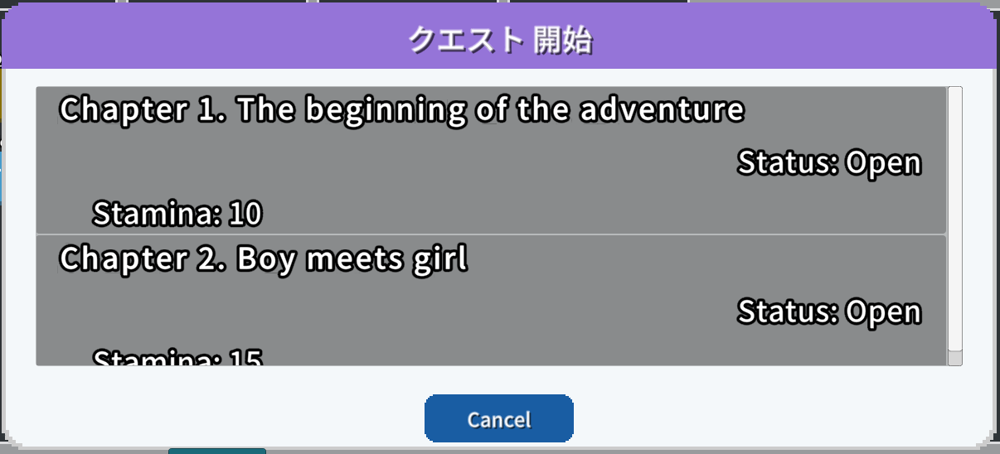

# クエスト　解説

[GS2-Quest](https://app.gs2.io/docs/index.html#gs2-quest) を使ってクエストを管理するサンプルです。

クエストには、メインシナリオクエストとキャラクターシナリオクエストの2種類（2グループ）があります。  
クエストには、クエストに挑戦するために必要なコストと、クリア報酬を設定できますが、  
このサンプルでは、必要コストにスタミナ、クリア報酬に課金通貨を設定しています。  
クエストに失敗した場合は報酬にコストとして費やしたスタミナを返すよう設定されています。

## GS2-Deploy テンプレート

- [initialize_quest_template.yaml - クエスト](../Templates/initialize_quest_template.yaml)

## クエスト設定 QuestSetting


| 設定名 | 説明 |
---|---
| questNamespaceName | GS2-Quest のネームスペース名 |
| questKeyId | GS2-Quest で報酬の付与処理に発行するスタンプシートの署名計算に使用する暗号鍵 |
| distributorNamespaceName | 報酬を配送する GS2-Distributor のネームスペース名 |
| queueNamespaceName | 報酬の付与に使用するGS2-JobQueue のネームスペース名 |

| イベント | 説明 |
---|---
| OnListCompletedQuestModel(List<EzCompletedQuestList> completedQuests) | クリア済みのクエスト一覧を取得したとき。 |
| OnListGroupQuestModel(List<EzQuestGroupModel> questGroups) | クエストグループの一覧を取得したとき。 |
| OnListQuestModel(List<EzQuestModel> quests) | クエストの一覧を取得したとき。 |
| OnGetProgress(EzProgress progress) | 進行中で中断されたクエストを取得したとき。 |
| OnStart(EzProgress progress) | クエストを開始したとき。 |
| OnEnd(EzProgress progress, List<EzReward> rewards, bool isComplete) | クエストを完了したとき。 |
| OnError(Gs2Exception error) | エラーが発生したときに呼び出されます。 |

## クエストの流れ

ログイン後、進行中のクエストが存在しないかを取得します。  
QUEST STATE は、存在しなければ `None` 、存在すれば `QuestStarted` になります。  
クエストを何も開始していない状態であれば、`クエストを開始`⇒クエストグループ選択⇒クエストを選択し、  
クエストを開始します。

`クエストを完了`から、クエストの完了、もしくは失敗（破棄）を選択し、報酬を受け取るか、  
必要コストの払い戻しを受けます。

### クエストの状態取得

```c#
AsyncResult<EzGetProgressResult> result = null;
yield return client.Quest.GetProgress(
    r => { result = r; },
    session,
    questNamespaceName
);
```

### クエストグループの一覧を取得


クエストグループの一覧を取得します。

```c#
AsyncResult<EzListQuestGroupsResult> result = null;
yield return client.Quest.ListQuestGroups(
    r => { result = r; },
    questNamespaceName
);
```

完了済みのクエストを取得します、

```c#
AsyncResult<EzDescribeCompletedQuestListsResult> result = null;
yield return client.Quest.DescribeCompletedQuestLists(
    r => { result = r; },
    session,
    questNamespaceName,
    null,
    30
);
```

### クエストの一覧を取得



クエストの一覧を取得します。

```c#
AsyncResult<EzListQuestsResult> result = null;
yield return client.Quest.ListQuests(
    r => { result = r; },
    questNamespaceName,
    SelectedQuestGroup.Name
);
```

### クエストの開始

クエストを開始します。
戻り値にはスタンプシートが返ります。
スタンプシートを実行することで必要なコストとしてクエストに設定された量のスタミナを消費し  
クエストを開始します。

```c#
AsyncResult<EzStartResult> result = null;
yield return client.Quest.Start(
    r => { result = r; },
    session,
    questNamespaceName,
    SelectedQuestGroup.Name,
    SelectedQuest.Name,
    false,
    config: new List<EzConfig>
    {
        new EzConfig
        {
            Key = "slot",
            Value = MoneyModel.Slot.ToString(),
        }
    }
);

stampSheet = result.Result.StampSheet;
```

```c#
EzProgress progress = null;
var machine = new StampSheetStateMachine(
    stampSheet,
    client,
    distributorNamespaceName,
    questKeyId
);

Gs2Exception exception = null;
void OnError(Gs2Exception e)
{
    exception = e;
};

void OnComplete(EzStampSheet sheet, Gs2.Unity.Gs2Distributor.Result.EzRunStampSheetResult stampResult)
{
    var json = JsonMapper.ToObject(stampResult.Result);
    var result = CreateProgressByStampSheetResult.FromJson(json);
    progress = EzProgress.FromModel(result.Item);
};

yield return machine.Execute(onError);
```

クエストの開始スタンプシートの流れは以下になります。


### クエストの完了

クエストを完了/失敗（破棄）します。  
rewards には Start の戻り値 EzProgress の Rewards のうち、  
実際に入手した報酬を設定します。

End の戻り値にはスタンプシートが返ります。  
スタンプシートを実行することでクエストを終了状態にし、報酬を受け取れます。

```c#
AsyncResult<EzEndResult> result = null;
yield return client.Quest.End(
    r => { result = r; },
    session,
    questNamespaceName,
    isComplete,
    rewards,
    Progress.TransactionId,
    new List<EzConfig>
    {
        new EzConfig
        {
            Key = "slot",
            Value = slot.ToString(),
        }
    }
);
``````c#
var machine = new StampSheetStateMachine(
    stampSheet,
    client,
    distributorNamespaceName,
    questKeyId
);

// スタンプシートの実行
yield return machine.Execute(onError);
```

クエストの完了スタンプシートの流れは以下になります。


クエストの失敗スタンプシートの流れは以下になります。


#### 報酬配布処理の遅延実行

クエスト完了時の報酬に複数のリソース入手を設定した場合、  
スタンプシートによってジョブキュー( [GS2-JobQueue](https://app.gs2.io/docs/index.html#gs2-jobqueue) )に報酬を入手するジョブが登録されます。  
クライアントがジョブキューを実行することで、実際に報酬を受け取る処理が実行されます。

スタンプシートによるジョブ登録
```c#
public UnityAction<EzStampSheet, EzRunStampSheetResult> GetSheetCompleteAction()
{
    return (sheet, sheetResult) =>
    {
        //スタンプシートによるジョブ登録
        if (sheet.Action == "Gs2JobQueue:PushByUserId")
        {
            OnPushJob();
        }
    };
}
```

ジョブキューの実行

```c#
AsyncResult<EzRunResult> result = null;
yield return _client.JobQueue.Run(
    r => { result = r; },
    _gameSession,
    _jobQueueNamespaceName
);
```
