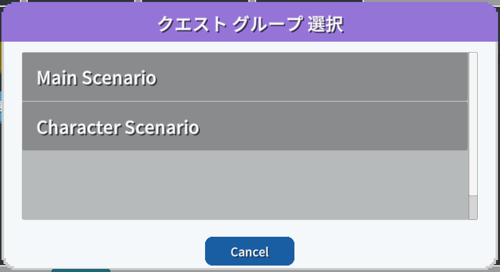

# クエスト　解説

[GS2-Quest](https://app.gs2.io/docs/index.html#gs2-quest) を使ってクエストを管理するサンプルです。

クエストには、メインシナリオクエストとキャラクターシナリオクエストの2種類（2グループ）があります。  
クエストには、クエストに挑戦するために必要なコストと、クリア報酬を設定できますが、  
このサンプルでは、必要コストにスタミナ、クリア報酬に課金通貨を設定しています。  
クエストに失敗した場合は報酬にコストとして費やしたスタミナを返すよう設定されています。

## GS2-Deploy テンプレート

- [initialize_quest_template.yaml - クエスト](../Templates/initialize_quest_template.yaml)

## クエスト設定 QuestSetting


| 設定名 | 説明 |
---|---
| questNamespaceName | GS2-Quest のネームスペース名 |

| イベント | 説明 |
---|---
| OnListCompletedQuestModel(List<EzCompletedQuestList> completedQuests) | クリア済みのクエスト一覧を取得したとき。 |
| OnListGroupQuestModel(List<EzQuestGroupModel> questGroups) | クエストグループの一覧を取得したとき。 |
| OnListQuestModel(List<EzQuestModel> quests) | クエストモデルを取得したとき。 |
| OnGetProgress(EzProgress progress) | 進行中のクエストを取得したとき。 |
| OnStart(EzProgress progress) | クエストを開始したとき。 |
| OnEnd(EzProgress progress, List<EzReward> rewards, bool isComplete) | クエストを完了したとき。 |
| OnError(Gs2Exception error) | エラーが発生したときに呼び出されます。 |

## クエストの流れ

ログイン後、進行中のクエストが存在しないかを取得します。  
QUEST STATE は、存在しなければ `None` 、存在すれば `QuestStarted` になります。  
クエストを何も開始していない状態であれば、`クエストを開始`⇒クエストグループ選択⇒クエストを選択し、  
クエストを開始します。

`クエストを完了`から、クエストの完了、もしくは失敗（破棄）を選択し、報酬を受け取るか、  
必要コストの払い戻しを受けます。

### クエストの状態取得

・UniTask有効時
```c#
var domain = gs2.Quest.Namespace(
    namespaceName: questNamespaceName
).Me(
    gameSession: gameSession
).Progress();
try
{
    progress = await domain.ModelAsync();

    onGetProgress.Invoke(progress);
}
catch (Gs2Exception e)
{
    onError.Invoke(e);
    return null;
}
```
・コルーチン使用時
```c#
var domain = gs2.Quest.Namespace(
    namespaceName: questNamespaceName
).Me(
    gameSession: gameSession
).Progress();
var future = domain.ModelFuture();
yield return future;
if (future.Error != null)
{
    onError.Invoke(future.Error);
    yield break;
}

progress = future.Result;
```

### クエストグループの一覧を取得



クエストグループの一覧を取得し選択ダイアログに表示します。

・UniTask有効時
```c#
questGroups.Clear();
var domain = gs2.Quest.Namespace(
    namespaceName: questNamespaceName
);
try
{
    questGroups = await domain.QuestGroupModelsAsync().ToListAsync();

    onListGroupQuestModel.Invoke(questGroups);
}
catch (Gs2Exception e)
{
    onError.Invoke(e);
}

return questGroups;
```
・コルーチン使用時
```c#
questGroups.Clear();
var domain = gs2.Quest.Namespace(
    namespaceName: questNamespaceName
);
var it = domain.QuestGroupModels();
while (it.HasNext())
{
    yield return it.Next();
    if (it.Error != null)
    {
        onError.Invoke(it.Error);
        callback.Invoke(null);
        yield break;
    }

    if (it.Current != null)
    {
        questGroups.Add(it.Current);
    }
}

onListGroupQuestModel.Invoke(questGroups);
callback.Invoke(questGroups);
```

完了済みのクエストを取得します、

・UniTask有効時
```c#
var domain = gs2.Quest.Namespace(
    namespaceName: questNamespaceName
).Me(
    gameSession: gameSession
);
try
{
    completedQuests = await domain.CompletedQuestListsAsync().ToListAsync();

    onListCompletedQuestsModel.Invoke(completedQuests);
}
catch (Gs2Exception e)
{
    onError.Invoke(e);
}

return completedQuests;
```
・コルーチン使用時
```c#
completedQuests.Clear();
var domain = gs2.Quest.Namespace(
    namespaceName: questNamespaceName
).Me(
    gameSession: gameSession
);
var it = domain.CompletedQuestLists();
while (it.HasNext())
{
    yield return it.Next();
    if (it.Error != null)
    {
        onError.Invoke(it.Error);
        callback.Invoke(null);
        yield break;
    }

    if (it.Current != null)
    {
        completedQuests.Add(it.Current);
    }
}

onListCompletedQuestsModel.Invoke(completedQuests);
callback.Invoke(completedQuests);
```

### クエストの一覧を取得


クエストの一覧を取得します。

・UniTask有効時
```c#
var domain = gs2.Quest.Namespace(
    namespaceName: questNamespaceName
).QuestGroupModel(
    questGroupName: selectedQuestGroup.Name
);
try
{
    quests = await domain.QuestModelsAsync().ToListAsync();

    onListQuestModel.Invoke(quests);
}
catch (Gs2Exception e)
{
    onError.Invoke(e);
}

return quests;
```
・コルーチン使用時
```c#
quests.Clear();
var domain = gs2.Quest.Namespace(
    namespaceName: questNamespaceName
).QuestGroupModel(
    questGroupName: selectedQuestGroup.Name
);
var it = domain.QuestModels();
while (it.HasNext())
{
    yield return it.Next();
    if (it.Error != null)
    {
        onError.Invoke(it.Error);
        callback.Invoke(null);
        yield break;
    }

    if (it.Current != null)
    {
        quests.Add(it.Current);
    }
}

onListQuestModel.Invoke(quests);
callback.Invoke(quests);
```

### クエストの開始

クエストを開始します。
GS2-QuestのCurrentQuestMasterにはconsumeActionsにクエスト開始に必要な消費アクションが設定されています。
GS2Domainクラス（ソース内で "gs2" ）を使用した実装ではクライアント側でのスタンプシートの処理は __自動実行__ されます。  
スタンプシートでクエスト開始に必要なコストとして設定された量のスタミナを消費し、クエストが開始状態になります。

・UniTask有効時
```c#
var domain = gs2.Quest.Namespace(
    namespaceName: questNamespaceName
).Me(
    gameSession: gameSession
);
try
{
    var result = await domain.StartAsync(
        questGroupName: selectedQuestGroup.Name,
        questName: selectedQuest.Name,
        force: null,
        config: new[]
        {
            new EzConfig
            {
                Key = "slot",
                Value = slot.ToString()
            }
        }
    );
}
catch (Gs2Exception e)
{
    onError.Invoke(e);
    return null;
}
```
・コルーチン使用時
```c#
var domain = gs2.Quest.Namespace(
    namespaceName: questNamespaceName
).Me(
    gameSession: gameSession
);
var future = domain.StartFuture(
    questGroupName: selectedQuestGroup.Name,
    questName: selectedQuest.Name,
    force: null,
    config: new[]
    {
        new EzConfig
        {
            Key = "slot",
            Value = MoneyModel.Slot.ToString()
        }
    }
);
yield return future;
if (future.Error != null)
{
    onError.Invoke(future.Error);
    callback.Invoke(null);
    yield break;
}
```

クエストの開始スタンプシートの流れは以下のようになります。


### クエストの完了

クエストを完了/失敗（破棄）します。  
rewards には Start の戻り値 EzProgress の Rewards のうち、  
実際のゲーム進行上で入手できた報酬を設定します。

GS2-Quest の CurrentQuestMaster の completeAcquireActions にクエスト完了時の報酬の入手アクションが設定されています。
GS2Domainクラス（ソース内で "gs2" ）を使用した実装ではクライアント側のスタンプシートの処理は __自動実行__ されます。  
スタンプシートでクエスト報酬を入手し、クエストは未受注の状態になります。

・UniTask有効時
```c#
var domain = gs2.Quest.Namespace(
    namespaceName: questNamespaceName
).Me(
    gameSession: gameSession
).Progress();
try
{
    var domain2 = await domain.EndAsync(
        isComplete: isComplete,
        rewards: rewards.ToArray(),
        config: new []
        {
            new EzConfig
            {
                Key = "slot",
                Value = slot.ToString(),
            }
        }
        );
    progress = await domain.ModelAsync();
    onEnd.Invoke(progress, rewards, isComplete);
}
catch (Gs2Exception e)
{
    onError.Invoke(e);
    return e;
}

return null;
```
・コルーチン使用時
```c#
var domain = gs2.Quest.Namespace(
    namespaceName: questNamespaceName
).Me(
    gameSession: gameSession
).Progress();
var future = domain.EndFuture(
    isComplete: isComplete,
    rewards: rewards.ToArray(),
    config: new []
    {
        new EzConfig
        {
            Key = "slot",
            Value = slot.ToString(),
        }
    }
);
yield return future;
if (future.Error != null)
{
    onError.Invoke(future.Error);
    callback.Invoke(null);
    yield break;
}

onEnd.Invoke(progress, rewards, isComplete);
callback.Invoke(progress);
```
Config には [GS2-Money](https://app.gs2.io/docs/index.html#gs2-money)  のウォレットスロット番号 __slot__ を渡します。
ウォレットスロット番号はこのサンプルのためにプラットフォーム別に割り振った課金通貨の種別で、以下のように定義しています。

| プラットフォーム      | 番号 |
|---------------|---|
| スタンドアローン(その他) | 0 |
| iOS           | 1 |
| Android       | 2 |

Config はスタンプシートに動的なパラメータを渡すための仕組みです。  
[⇒スタンプシートの変数](https://app.gs2.io/docs/index.html#d7e97677c7)  
Config(EzConfig) はキー・バリュー形式で、渡したパラメータで #{Config で指定したキー値} のプレースホルダー文字列を置換することができます。
以下のスタンプシートの定義中の　#{slot}　はウォレットスロット番号に置換されます。

```yaml
completeAcquireActions:
  - action: Gs2Money:DepositByUserId
    request:
      namespaceName: ${MoneyNamespaceName}
      userId: "#{userId}"
      slot: "#{slot}"
      price: 0
      count: 10
```

クエストの完了スタンプシートの流れは以下になります。


クエストの失敗スタンプシートの流れは以下になります。


#### 報酬配布処理の遅延実行

クエスト完了時の報酬に複数のリソース入手を設定した場合、  
スタンプシートによってジョブキュー( [GS2-JobQueue](https://app.gs2.io/docs/index.html#gs2-jobqueue) )に報酬を入手するジョブが登録されます。  
クライアントがジョブキューを実行することで、実際に報酬を受け取る処理が実行されます。

ジョブキューを進行させる処理、Gs2Domain.Dispatch を実行しておくことで、ジョブキューを自動で継続進行できます。

・UniTask有効時
```c#
async UniTask Impl()
{
    while (true)
    {
        await _domain.DispatchAsync(_session);

        await UniTask.Yield();
    }
}

_dispatchCoroutine = StartCoroutine(Impl().ToCoroutine());
```
・コルーチン使用時
```c#
IEnumerator Impl()
{
    while (true)
    {
        var future = _domain.Dispatch(_session);
        yield return future;
        if (future != null)
        {
            yield break;
        }
        if (future.Result)
        {
            break;
        }
        yield return null;
    }
}
_dispatchCoroutine = StartCoroutine(Impl());
```
