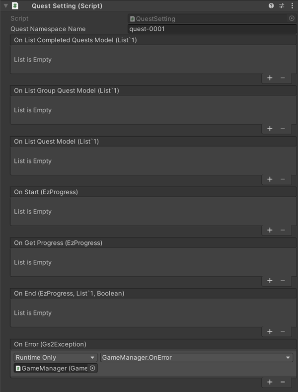

# Quest Explanation

This is a sample of using [GS2-Quest](https://app.gs2.io/docs/en/index.html#gs2-quest) to manage quests.

There are two types (two groups) of quests: main scenario quests and character scenario quests.  
Quests can have a cost to attempt the quest and a reward for completing the quest, but  
In this sample, the required cost is set to stamina and the clear reward is set to the currency charged.  
If the quest fails, the reward is set to return the stamina spent as cost.

## GS2-Deploy template

- [initialize_quest_template.yaml - Quest](../Templates/initialize_quest_template.yaml)

## QuestSetting QuestSetting



| Setting Name | Description |
---|---
| questNamespaceName | GS2-Quest Namespace name |

| Event | Description |
---|---
| OnListCompletedQuestModel(List<EzCompletedQuestList> completedQuests) | When the list of completed quests is retrieved. |
| OnListGroupQuestModel(List<EzQuestGroupModel> questGroups) | When a list of quest groups is retrieved. |
| OnListQuestModel(List<EzQuestModel> quests) | When retrieving the quest model. |
| OnGetProgress(EzProgress progress) | When retrieving a quest in progress |
| OnStart(EzProgress progress) | When a quest is started. |
| OnEnd(EzProgress progress, List<EzReward> rewards, bool isComplete) | When a quest is completed. |
| OnError(Gs2Exception error) | Called when an error occurs. |

## Quest Flow

After login, get if there are any quests in progress.  
The QUEST STATE will be `None` if it does not exist and `QuestStarted` if it does.  
If no quests have been started, then `Start Quest` => Select Quest Group => Select Quest and press  
Start the quest.

From `Complete Quest', choose to complete or fail (discard) the quest and receive a reward or  
Receive a refund of the required cost.

### Get Quest Status

When UniTask is enabled
```c#
var domain = gs2.Quest.Namespace(
    namespaceName: questNamespaceName
).Me(
    gameSession: gameSession
).Progress();
try
{
    progress = await domain.ModelAsync();

    onGetProgress.Invoke(progress);
}
catch (Gs2Exception e)
{
    onError.Invoke(e);
    return null;
}
```
When coroutine is used
```c#
var domain = gs2.Quest.Namespace(
    namespaceName: questNamespaceName
).Me(
    gameSession: gameSession
).Progress();
var future = domain.Model();
yield return future;
if (future.Error != null)
{
    onError.Invoke(future.Error);
    yield break;
}

progress = future.Result;
```

### Get list of quest groups


Obtains a list of quest groups.

When UniTask is enabled
```c#
questGroups.Clear();
var domain = gs2.Quest.Namespace(
    namespaceName: questNamespaceName
);
try
{
    questGroups = await domain.QuestGroupModelsAsync().ToListAsync();

    onListGroupQuestModel.Invoke(questGroups);
}
catch (Gs2Exception e)
{
    onError.Invoke(e);
}

return questGroups;
```
When coroutine is used
```c#
questGroups.Clear();
var domain = gs2.Quest.Namespace(
    namespaceName: questNamespaceName
);
var it = domain.QuestGroupModels();
while (it.HasNext())
{
    yield return it.Next();
    if (it.Error != null)
    {
        onError.Invoke(it.Error);
        callback.Invoke(null);
        yield break;
    }

    if (it.Current != null)
    {
        questGroups.Add(it.Current);
    }
}

onListGroupQuestModel.Invoke(questGroups);
callback.Invoke(questGroups);
```

Retrieve completed quests.

When UniTask is enabled
```c#
var domain = gs2.Quest.Namespace(
    namespaceName: questNamespaceName
).Me(
    gameSession: gameSession
);
try
{
    completedQuests = await domain.CompletedQuestListsAsync().ToListAsync();

    onListCompletedQuestsModel.Invoke(completedQuests);
}
catch (Gs2Exception e)
{
    onError.Invoke(e);
}

return completedQuests;
```
When coroutine is used
```c#
completedQuests.Clear();
var domain = gs2.Quest.Namespace(
    namespaceName: questNamespaceName
).Me(
    gameSession: gameSession
);
var it = domain.CompletedQuestLists();
while (it.HasNext())
{
    yield return it.Next();
    if (it.Error != null)
    {
        onError.Invoke(it.Error);
        callback.Invoke(null);
        yield break;
    }

    if (it.Current != null)
    {
        completedQuests.Add(it.Current);
    }
}

onListCompletedQuestsModel.Invoke(completedQuests);
callback.Invoke(completedQuests);
```

### Get list of quests


Obtains a list of quests.

When UniTask is enabled
```c#
var domain = gs2.Quest.Namespace(
    namespaceName: questNamespaceName
).QuestGroupModel(
    questGroupName: selectedQuestGroup.Name
);
try
{
    quests = await domain.QuestModelsAsync().ToListAsync();

    onListQuestModel.Invoke(quests);
}
catch (Gs2Exception e)
{
    onError.Invoke(e);
}

return quests;
```
When coroutine is used
```c#
quests.Clear();
var domain = gs2.Quest.Namespace(
    namespaceName: questNamespaceName
).QuestGroupModel(
    questGroupName: selectedQuestGroup.Name
);
var it = domain.QuestModels();
while (it.HasNext())
{
    yield return it.Next();
    if (it.Error != null)
    {
        onError.Invoke(it.Error);
        callback.Invoke(null);
        yield break;
    }

    if (it.Current != null)
    {
        quests.Add(it.Current);
    }
}

onListQuestModel.Invoke(quests);
callback.Invoke(quests);
```

### Starting a quest

Starts a quest.
GS2-Quest's CurrentQuestMaster has consumeActions set to consume actions required to start the quest.
In implementations using the GS2Domain class ("gs2" in the source), the processing of the stamp sheet on the client side is __auto-executed__.  
The amount of stamina set as the cost to start the quest in the stamp sheet is consumed, and the quest is placed in the start state.

When UniTask is enabled
```c#
var domain = gs2.Quest.Namespace(
    namespaceName: questNamespaceName
).Me(
    gameSession: gameSession
);
try
{
    var result = await domain.StartAsync(
        questGroupName: selectedQuestGroup.Name,
        questName: selectedQuest.Name,
        force: null,
        config: new[]
        {
            new EzConfig
            {
                Key = "slot",
                Value = slot.ToString()
            }
        }
    );
}
catch (Gs2Exception e)
{
    onError.Invoke(e);
    return null;
}
```
When coroutine is used
```c#
var domain = gs2.Quest.Namespace(
    namespaceName: questNamespaceName
).Me(
    gameSession: gameSession
);
var future = domain.Start(
    questGroupName: selectedQuestGroup.Name,
    questName: selectedQuest.Name,
    force: null,
    config: new[]
    {
        new EzConfig
        {
            Key = "slot",
            Value = MoneyModel.Slot.ToString()
        }
    }
);
yield return future;
if (future.Error != null)
{
    onError.Invoke(future.Error);
    callback.Invoke(null);
    yield break;
}
```

The flow of the starting stamp sheet for the quest is as follows


### Completion of quest

Complete/fail (discard) the quest.  
rewards is the value of Rewards in EzProgress, the return value of Start.  
Set the reward actually obtained.

The action to obtain the reward upon completion of the quest is set in completeAcquireActions of CurrentQuestMaster in GS2-Quest.
In implementations using the GS2Domain class ("gs2" in the source), the client-side stamp sheet process is __auto-executed__.  
The quest reward is obtained from the stamp sheet, and the quest remains unclaimed.

When UniTask is enabled
```c#
var domain = gs2.Quest.Namespace(
    namespaceName: questNamespaceName
).Me(
    gameSession: gameSession
).Progress();
try
{
    var domain2 = await domain.EndAsync(
        isComplete: isComplete,
        rewards: rewards.ToArray(),
        config: new []
        {
            new EzConfig
            {
                Key = "slot",
                Value = slot.ToString(),
            }
        }
        );
    progress = await domain.ModelAsync();
    onEnd.Invoke(progress, rewards, isComplete);
}
catch (Gs2Exception e)
{
    onError.Invoke(e);
    return e;
}

return null;
```
When coroutine is used
```c#
var domain = gs2.Quest.Namespace(
    namespaceName: questNamespaceName
).Me(
    gameSession: gameSession
).Progress();
var future = domain.End(
    isComplete: isComplete,
    rewards: rewards.ToArray(),
    config: new []
    {
        new EzConfig
        {
            Key = "slot",
            Value = slot.ToString(),
        }
    }
);
yield return future;
if (future.Error != null)
{
    onError.Invoke(future.Error);
    callback.Invoke(null);
    yield break;
}

onEnd.Invoke(progress, rewards, isComplete);
callback.Invoke(progress);
```
Config is passed the wallet slot number __slot__ of [GS2-Money](https://app.gs2.io/docs/en/index.html#gs2-money).
The wallet slot number is the type of billing currency assigned by platform for this sample and is defined as follows

| Platform | Number |
|---------------|---|
| Standalone (Other) | 0 |
| iOS | 1 |
| Android | 2 |

Config is a mechanism for passing dynamic parameters to the stamp sheet.  
[⇒Stamp Sheet Variables](https://app.gs2.io/docs/en/index.html#d7e97677c7)  
Config(EzConfig) is a key-value format that allows you to replace the placeholder string for #{key value specified in Config} with the parameters you pass.
In the following stamp sheet definition #{slot} will be replaced by the wallet slot number.

```yaml
completeAcquireActions:
  - action: Gs2Money:DepositByUserId
    request:
      namespaceName: ${MoneyNamespaceName}
      userId: "#{userId}"
      slot: "#{slot}"
      price: 0
      count: 10
```

The flow of the quest completion stamp sheet is as follows


The flow of the quest failure stamp sheet is as follows


#### Delayed execution of reward distribution process

If you set up multiple resource acquisitions as rewards for completing a quest, you can use the  
The job queue ([GS2-JobQueue](https://app.gs2.io/docs/en/index.html#gs2-jobqueue)) is registered by the stamp sheet for the job to obtain the reward.  
When the client executes the job queue, the process of actually receiving the reward is executed.

The job queue can be continued automatically by running Gs2Domain.Dispatch, a process that advances the job queue.

When UniTask is enabled
```c#
async UniTask Impl()
{
    while (true)
    {
        await _domain.DispatchAsync(_session);

        await UniTask.Yield();
    }
}

_dispatchCoroutine = StartCoroutine(Impl().ToCoroutine());
```
When coroutine is used
```c#
IEnumerator Impl()
{
    while (true)
    {
        var future = _domain.Dispatch(_session);
        yield return future;
        if (future != null)
        {
            yield break;
        }
        if (future.Result)
        {
            break;
        }
        yield return null;
    }
}
_dispatchCoroutine = StartCoroutine(Impl());
```
