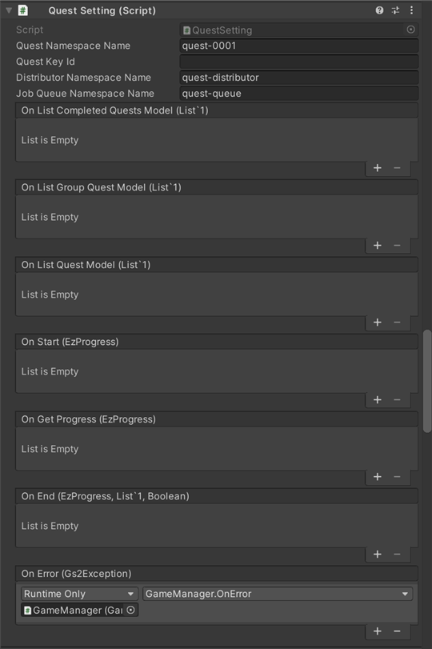
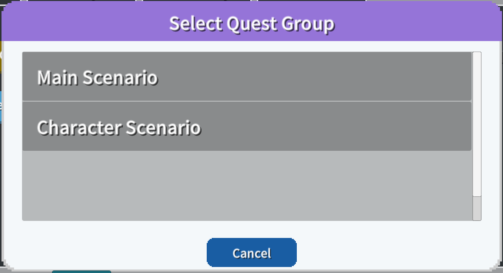
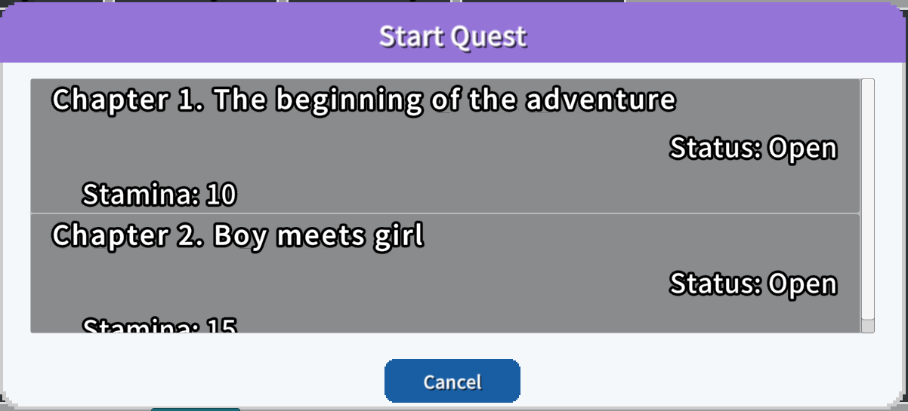
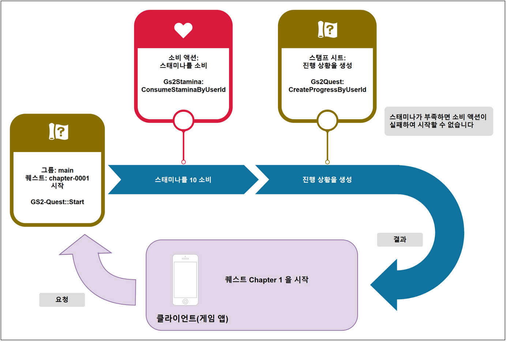
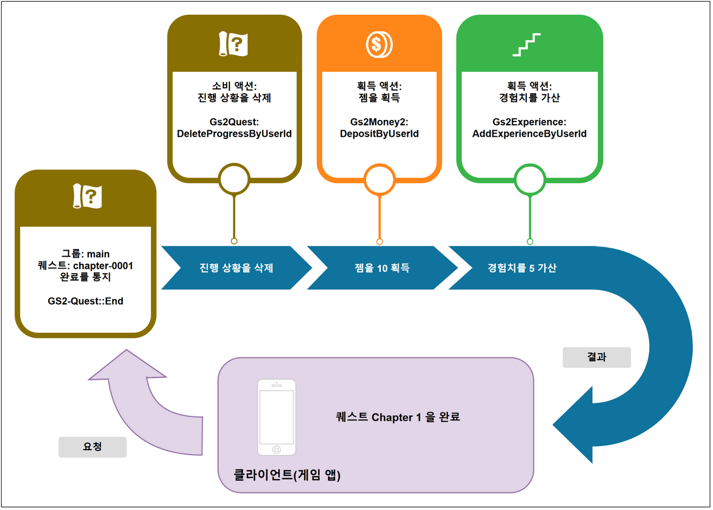
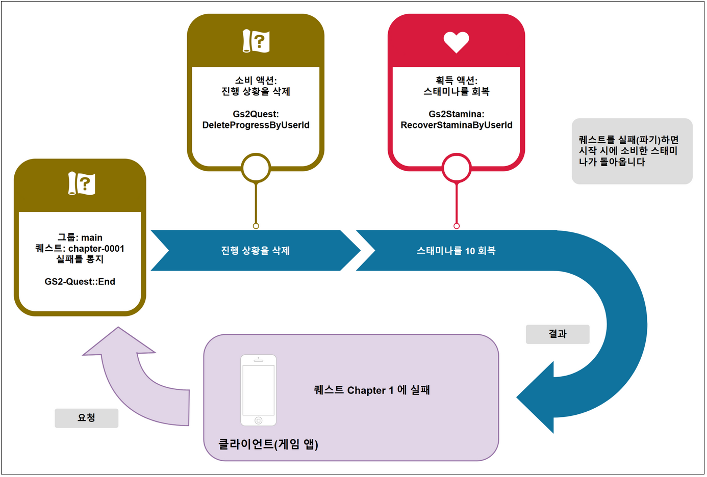

# 퀘스트 해설

[GS2-Quest](https://docs.gs2.io/ko/api_reference/quest/) 를 사용하여 퀘스트를 관리하는 샘플입니다.

퀘스트에는 메인 시나리오 퀘스트와 캐릭터 시나리오 퀘스트의 2 종류(2 그룹)가 있습니다.  
퀘스트에는 퀘스트에 도전하기 위해 필요한 비용과 클리어 보상을 설정할 수 있는데,  
이 샘플에서는 필요 비용에 스태미나를, 클리어 보상에 유료 재화를 설정하고 있습니다.  
퀘스트에 실패한 경우에는 보상으로 비용으로 소비한 스태미나를 돌려주도록 설정되어 있습니다.

## GS2-Deploy 템플릿

- [initialize_gamecycle_template.yaml - 퀘스트](../Templates/initialize_gamecycle_template.yaml)

## 퀘스트 설정 QuestSetting



| 설정 이름 | 설명 |
---|---
| questNamespaceName | GS2-Quest 의 네임스페이스 이름 |

| 이벤트 | 설명 |
---|---
| OnListCompletedQuestModel(List<EzCompletedQuestList> completedQuests) | 클리어한 퀘스트 목록을 가져왔을 때. |
| OnListGroupQuestModel(List<EzQuestGroupModel> questGroups) | 퀘스트 그룹의 목록을 가져왔을 때. |
| OnListQuestModel(List<EzQuestModel> quests) | 퀘스트 모델을 가져왔을 때. |
| OnGetProgress(EzProgress progress) | 진행 중인 퀘스트를 가져왔을 때. |
| OnStart(EzProgress progress) | 퀘스트를 시작했을 때. |
| OnEnd(EzProgress progress, List<EzReward> rewards, bool isComplete) | 퀘스트를 완료했을 때. |
| OnError(Gs2Exception error) | 오류가 발생했을 때 호출됩니다. |

## 퀘스트의 흐름

로그인 후, 진행 중인 퀘스트가 존재하지 않는지 가져옵니다.  
QUEST STATE 는 존재하지 않으면 `None`, 존재하면 `QuestStarted` 가 됩니다.  
퀘스트를 아무것도 시작하지 않은 상태라면, `퀘스트 시작` ⇒ 퀘스트 그룹 선택 ⇒ 퀘스트를 선택하여,  
퀘스트를 시작합니다.

`퀘스트 완료` 에서 퀘스트의 완료 또는 실패(파기)를 선택하여, 보상을 받거나  
필요 비용을 환급받습니다.

### 퀘스트의 상태 가져오기

UniTask 활성화 시
```c#
var domain = gs2.Quest.Namespace(
    namespaceName: questNamespaceName
).Me(
    gameSession: gameSession
).Progress();
try
{
    progress = await domain.ModelAsync();

    onGetProgress.Invoke(progress);
}
catch (Gs2Exception e)
{
    onError.Invoke(e);
    return null;
}
```
코루틴 사용 시
```c#
var domain = gs2.Quest.Namespace(
    namespaceName: questNamespaceName
).Me(
    gameSession: gameSession
).Progress();
var future = domain.ModelFuture();
yield return future;
if (future.Error != null)
{
    onError.Invoke(future.Error);
    yield break;
}

progress = future.Result;
```

### 퀘스트 그룹의 목록 가져오기



퀘스트 그룹의 목록을 가져와 선택 다이얼로그에 표시합니다.

UniTask 활성화 시
```c#
questGroups.Clear();
var domain = gs2.Quest.Namespace(
    namespaceName: questNamespaceName
);
try
{
    questGroups = await domain.QuestGroupModelsAsync().ToListAsync();

    onListGroupQuestModel.Invoke(questGroups);
}
catch (Gs2Exception e)
{
    onError.Invoke(e);
}

return questGroups;
```
코루틴 사용 시
```c#
questGroups.Clear();
var domain = gs2.Quest.Namespace(
    namespaceName: questNamespaceName
);
var it = domain.QuestGroupModels();
while (it.HasNext())
{
    yield return it.Next();
    if (it.Error != null)
    {
        onError.Invoke(it.Error);
        callback.Invoke(null);
        yield break;
    }

    if (it.Current != null)
    {
        questGroups.Add(it.Current);
    }
}

onListGroupQuestModel.Invoke(questGroups);
callback.Invoke(questGroups);
```

완료한 퀘스트를 가져옵니다.

UniTask 활성화 시
```c#
var domain = gs2.Quest.Namespace(
    namespaceName: questNamespaceName
).Me(
    gameSession: gameSession
);
try
{
    completedQuests = await domain.CompletedQuestListsAsync().ToListAsync();

    onListCompletedQuestsModel.Invoke(completedQuests);
}
catch (Gs2Exception e)
{
    onError.Invoke(e);
}

return completedQuests;
```
코루틴 사용 시
```c#
completedQuests.Clear();
var domain = gs2.Quest.Namespace(
    namespaceName: questNamespaceName
).Me(
    gameSession: gameSession
);
var it = domain.CompletedQuestLists();
while (it.HasNext())
{
    yield return it.Next();
    if (it.Error != null)
    {
        onError.Invoke(it.Error);
        callback.Invoke(null);
        yield break;
    }

    if (it.Current != null)
    {
        completedQuests.Add(it.Current);
    }
}

onListCompletedQuestsModel.Invoke(completedQuests);
callback.Invoke(completedQuests);
```

### 퀘스트의 목록 가져오기



퀘스트의 목록을 가져옵니다.

UniTask 활성화 시
```c#
var domain = gs2.Quest.Namespace(
    namespaceName: questNamespaceName
).QuestGroupModel(
    questGroupName: selectedQuestGroup.Name
);
try
{
    quests = await domain.QuestModelsAsync().ToListAsync();

    onListQuestModel.Invoke(quests);
}
catch (Gs2Exception e)
{
    onError.Invoke(e);
}

return quests;
```
코루틴 사용 시
```c#
quests.Clear();
var domain = gs2.Quest.Namespace(
    namespaceName: questNamespaceName
).QuestGroupModel(
    questGroupName: selectedQuestGroup.Name
);
var it = domain.QuestModels();
while (it.HasNext())
{
    yield return it.Next();
    if (it.Error != null)
    {
        onError.Invoke(it.Error);
        callback.Invoke(null);
        yield break;
    }

    if (it.Current != null)
    {
        quests.Add(it.Current);
    }
}

onListQuestModel.Invoke(quests);
callback.Invoke(quests);
```

### 퀘스트의 시작

퀘스트를 시작합니다.
GS2-Quest 의 CurrentQuestMaster 에는 consumeActions 에 퀘스트 시작에 필요한 소비 액션이 설정되어 있습니다.
GS2Domain 클래스(소스 내에서 "gs2")를 사용한 구현에서는 클라이언트 쪽의 트랜잭션 처리가 __자동 실행__ 됩니다.  
트랜잭션 처리로 퀘스트 시작에 필요한 비용으로 설정된 양의 스태미나를 소비하고, 퀘스트가 시작 상태가 됩니다.

UniTask 활성화 시
```c#
var domain = gs2.Quest.Namespace(
    namespaceName: questNamespaceName
).Me(
    gameSession: gameSession
);
try
{
    var result = await domain.StartAsync(
        questGroupName: selectedQuestGroup.Name,
        questName: selectedQuest.Name,
        force: null,
        config: new[]
        {
            new EzConfig
            {
                Key = "slot",
                Value = slot.ToString()
            }
        }
    );
}
catch (Gs2Exception e)
{
    onError.Invoke(e);
    return null;
}
```
코루틴 사용 시
```c#
var domain = gs2.Quest.Namespace(
    namespaceName: questNamespaceName
).Me(
    gameSession: gameSession
);
var future = domain.StartFuture(
    questGroupName: selectedQuestGroup.Name,
    questName: selectedQuest.Name,
    force: null,
    config: new[]
    {
        new EzConfig
        {
            Key = "slot",
            Value = Money2Model.Slot.ToString()
        }
    }
);
yield return future;
if (future.Error != null)
{
    onError.Invoke(future.Error);
    callback.Invoke(null);
    yield break;
}
```

퀘스트의 시작 트랜잭션 처리의 흐름은 아래와 같습니다.



### 퀘스트의 완료

퀘스트를 완료/실패(파기)합니다.  
rewards 에는 Start 의 반환값 EzProgress 의 Rewards 중,  
실제 게임 진행상 획득할 수 있었던 보상을 설정합니다.

GS2-Quest 의 CurrentQuestMaster 의 completeAcquireActions 에 퀘스트 완료 시의 보상 획득 액션이 설정되어 있습니다.
GS2Domain 클래스(소스 내에서 "gs2")를 사용한 구현에서는 클라이언트 쪽의 트랜잭션 처리가 __자동 실행__ 됩니다.  
트랜잭션 처리로 퀘스트 보상을 획득하고, 퀘스트는 미수주 상태가 됩니다.

UniTask 활성화 시
```c#
var domain = gs2.Quest.Namespace(
    namespaceName: questNamespaceName
).Me(
    gameSession: gameSession
).Progress();
try
{
    var domain2 = await domain.EndAsync(
        isComplete: isComplete,
        rewards: rewards.ToArray(),
        config: new []
        {
            new EzConfig
            {
                Key = "slot",
                Value = slot.ToString(),
            }
        }
        );
    progress = await domain.ModelAsync();
    onEnd.Invoke(progress, rewards, isComplete);
}
catch (Gs2Exception e)
{
    onError.Invoke(e);
    return e;
}

return null;
```
코루틴 사용 시
```c#
var domain = gs2.Quest.Namespace(
    namespaceName: questNamespaceName
).Me(
    gameSession: gameSession
).Progress();
var future = domain.EndFuture(
    isComplete: isComplete,
    rewards: rewards.ToArray(),
    config: new []
    {
        new EzConfig
        {
            Key = "slot",
            Value = slot.ToString(),
        }
    }
);
yield return future;
if (future.Error != null)
{
    onError.Invoke(future.Error);
    callback.Invoke(null);
    yield break;
}

onEnd.Invoke(progress, rewards, isComplete);
callback.Invoke(progress);
```
Config 에는 [GS2-Money2](https://docs.gs2.io/ko/api_reference/money2/) 의 월렛 슬롯 번호 __slot__ 을 전달합니다.
월렛 슬롯 번호는 이 샘플을 위해 플랫폼별로 할당한 유료 재화의 종류로, 아래와 같이 정의하고 있습니다.

| 플랫폼 | 번호 |
|---------------|---|
| 스탠드얼론(기타) | 0 |
| iOS           | 1 |
| Android       | 2 |

Config 는 스탬프 시트에 동적인 파라미터를 전달하기 위한 구조입니다.  
[⇒스탬프 시트의 변수](https://docs.gs2.io/ko/articles/tech/stamp_sheet/)  
Config(EzConfig) 는 키·값 형식으로, 전달한 파라미터로 #{Config 에서 지정한 키 값} 의 플레이스홀더 문자열을 치환할 수 있습니다.
아래 스탬프 시트의 정의 중 　#{slot}　은 월렛 슬롯 번호로 치환됩니다.

```yaml
completeAcquireActions:
  - action: Gs2Money2:DepositByUserId
    request:
      namespaceName: ${MoneyNamespaceName}
      userId: "#{userId}"
      slot: "#{slot}"
      depositTransactions:
        - price: 0
          count: 10
```

퀘스트의 완료 트랜잭션 처리의 흐름은 아래와 같습니다.



퀘스트의 실패 트랜잭션 처리의 흐름은 아래와 같습니다.



#### 보상 배포 처리의 지연 실행

본 샘플의 GS2-Quest 네임스페이스는 `TransactionSetting.EnableAtomicCommit: true` 를 설정하고 있기 때문에,  
보상의 획득은 퀘스트 완료 요청 안에서 서버 쪽이 일괄 실행합니다(잡 큐를 거치지 않습니다).

`TransactionSetting.QueueNamespaceId` 를 설정한 경우에는, 보상을 획득하는 잡이  
잡 큐( [GS2-JobQueue](https://docs.gs2.io/ko/api_reference/job_queue/) )에 등록되어,  
클라이언트가 잡 큐를 실행함으로써 실제로 보상을 받는 처리가 실행됩니다.  
그 경우에는 잡 큐를 진행시키는 처리인 Gs2Domain.Dispatch 를 실행해 두면 자동으로 계속 진행할 수 있습니다.

UniTask 활성화 시
```c#
async UniTask Impl()
{
    while (true)
    {
        await _domain.DispatchAsync(_session);

        await UniTask.Yield();
    }
}

_dispatchCoroutine = StartCoroutine(Impl().ToCoroutine());
```
코루틴 사용 시
```c#
IEnumerator Impl()
{
    while (true)
    {
        var future = _domain.Dispatch(_session);
        yield return future;
        if (future != null)
        {
            yield break;
        }
        if (future.Result)
        {
            break;
        }
        yield return null;
    }
}
_dispatchCoroutine = StartCoroutine(Impl());
```
