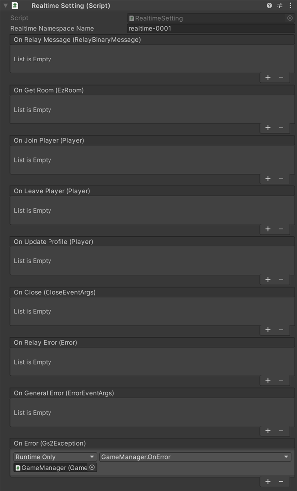

# リアルタイム対戦 解説

[GS2-Realtime](https://app.gs2.io/docs/index.html#gs2-realtime) を使用してプレイヤー間で通信対戦するサンプルです。

## GS2-Deploy テンプレート

- [initialize_realtime_template.yaml - マッチメイキング/リアルタイム対戦](../Templates/initialize_realtime_template.yaml)

## リアルタイム設定　RealtimeSetting



| 設定名 | 説明 |
---|---
| realtimeNamespaceName | GS2-Realtime のネームスペース名 |

| イベント | 説明 |
---------|------
| OnRelayMessage(RelayBinaryMessage message) | Realtimeゲームサーバからメッセージを受信したときに呼び出されます。 |
| OnGetRoom(EzRoom room) | リアルタイムゲームサーバのIPアドレス・ポート情報を取得したときに呼び出されます。 |
| OnJoinPlayer(Player player) | リアルタイムゲームサーバに新しいプレイヤーが参加したときに呼び出されます。ルームに参加した直後にはそれまでに参加済みのプレイヤーの分が呼び出されます。 |
| OnLeavePlayer(Player player) | リアルタイムゲームサーバからプレイヤーが離脱したときに呼び出されます。 このコールバックは必ず OnJoinPlayer / OnLeavePlayer のいずれかと同じタイミングで呼び出されます。 |
| OnUpdateProfile(Player player) | 誰かがプレイヤープロフィールを更新したときに呼び出されます。 |
| OnRelayError(Error error) | リアルタイムゲームサーバでエラーが発生したときに呼び出されます。 |
| OnClose(CloseEventArgs error) | リアルタイムゲームサーバから切断されたときに呼び出されます。 |
| OnGeneralError(ErrorEventArgs error) | コネクション関連でエラーが発生したときに呼び出されます。 |
| OnError(Gs2Exception error) | エラーが発生したときに呼び出されます。 |

### ルーム情報の取得

GS2-Realtime からルームの情報を取得します。  

・UniTask有効時
```c#
var domain = gs2.Realtime.Namespace(
    namespaceName: realtimeNamespaceName
).Room(
    roomName: gatheringName
);
try
{
    room = await domain.ModelAsync();
    
    onGetRoom.Invoke(room);
    
    return room;
}
catch (Gs2Exception e)
{
    onError.Invoke(e);
    throw;
}
```
・コルーチン使用時
```c#
var domain = gs2.Realtime.Namespace(
    namespaceName: realtimeNamespaceName
).Room(
    roomName: gatheringName
);
var future = domain.Model();
yield return future;
if (future.Error != null)
{
    onError.Invoke(
        future.Error
    );
    callback.Invoke(null);
    yield break;
}

room = future.Result;

onGetRoom.Invoke(room);

callback.Invoke(room);
```

### ルームへの接続

ルーム情報に記載されたゲームサーバの `IPアドレス` `ポート` へ接続します。  
RelayRealtimeSessionを生成したのち、各種イベントハンドラを設定、  
ルームへの接続 `realtimeSession.Connect` を実行します。

・UniTask有効時
```c#
var realtimeSession = new RelayRealtimeSession(
    GameManager.Instance.Session.AccessToken.Token,
    ipAddress,
    port,
    encryptionKey,
    ByteString.CopyFrom()
);

realtimeSession.OnRelayMessage += message =>
{
    _realtimeSetting.onRelayMessage.Invoke(message);
}; 
realtimeSession.OnJoinPlayer += player =>
{
    _realtimeSetting.onJoinPlayer.Invoke(player);
};
realtimeSession.OnLeavePlayer += player =>
{
    _realtimeSetting.onLeavePlayer.Invoke(player);
};
realtimeSession.OnGeneralError += args => 
{
    _realtimeSetting.onGeneralError.Invoke(args);
};
realtimeSession.OnError += error =>
{
    _realtimeSetting.onRelayError.Invoke(error);
};
realtimeSession.OnUpdateProfile += player =>
{
    _realtimeSetting.onUpdateProfile.Invoke(player);
};
realtimeSession.OnClose += args =>
{
    _realtimeSetting.onClose.Invoke(args);
};

try
{
    await realtimeSession.ConnectAsync(
        this
    );
}
catch (Gs2Exception e)
{
    _realtimeSetting.onError.Invoke(
        e
    );
    return null;
}

return realtimeSession;
```
・コルーチン使用時
```c#
var realtimeSession = new RelayRealtimeSession(
    GameManager.Instance.Session.AccessToken.Token,
    ipAddress,
    port,
    encryptionKey,
    ByteString.CopyFrom()
);

realtimeSession.OnRelayMessage += message =>
{
    _realtimeSetting.onRelayMessage.Invoke(message);
}; 
realtimeSession.OnJoinPlayer += player =>
{
    _realtimeSetting.onJoinPlayer.Invoke(player);
};
realtimeSession.OnLeavePlayer += player =>
{
    _realtimeSetting.onLeavePlayer.Invoke(player);
};
realtimeSession.OnGeneralError += args => 
{
    _realtimeSetting.onGeneralError.Invoke(args);
};
realtimeSession.OnError += error =>
{
    _realtimeSetting.onRelayError.Invoke(error);
};
realtimeSession.OnUpdateProfile += player =>
{
    _realtimeSetting.onUpdateProfile.Invoke(player);
};
realtimeSession.OnClose += args =>
{
    _realtimeSetting.onClose.Invoke(args);
};

AsyncResult<bool> result = null;
yield return realtimeSession.Connect(
    this,
    r =>
    {
        result = r;
    }
);

if (realtimeSession.Connected)
{
    callback.Invoke(
        new AsyncResult<RelayRealtimeSession>(realtimeSession, null)
    );
}
else
{
    if (result.Error != null)
    {
        _realtimeSetting.onError.Invoke(
            result.Error
        );
        callback.Invoke(
            new AsyncResult<RelayRealtimeSession>(null, result.Error)
        );
    }
}
```

### ゲームプレイ中の同期

プレイヤーのプロフィール情報として、Inputfieldに入力された名前を定期的に送信し、他のプレイヤーで受け取ります。  
他プレイヤーからプロフィール情報を受け取った場合は、そのプレイヤー情報の同期を行います。

> 送信

・UniTask有効時
```c#
public async UniTask UpdateProfileAsync()
{
    while (true)
    {
        await UniTask.Delay(300);

        ByteString binary = null;
        try
        {
            binary = ByteString.CopyFrom(ProfileSerialize());
        }
        catch (Exception e)
        {
            Debug.Log(e);
            continue;
        }

        if (Session != null && Session.Connected)
        {
            bool lockWasTaken = false;
            try
            {
                System.Threading.Monitor.TryEnter(this, ref lockWasTaken);

                if (lockWasTaken)
                {
                    await Session.UpdateProfileAsync(
                        binary
                    );
                }
            }
            finally
            {
                if (lockWasTaken) System.Threading.Monitor.Exit(this);
            }
        }
        else
        {
            break;
        }
    }
}
```
・コルーチン使用時
```c#
public IEnumerator UpdateProfile()
{
    while (true)
    {
        yield return new WaitForSeconds(0.3f);

        ByteString binary = null;
        try
        {
            binary = ByteString.CopyFrom(ProfileSerialize());
        }
        catch (Exception e)
        {
            Debug.Log(e);
            continue;
        }

        if (Session != null)
        {
            bool lockWasTaken = false;
            try
            {
                System.Threading.Monitor.TryEnter(this, ref lockWasTaken);

                if (lockWasTaken)
                {
                    yield return Session.UpdateProfile(
                        r => { },
                        binary
                    );
                }
            }
            finally
            {
                if (lockWasTaken) System.Threading.Monitor.Exit(this);
            }
        }
    }
}
```

> 受信

```c#
_realtimeSetting.onUpdateProfile.AddListener(
    player => 
    {
        if (players.ContainsKey(player.ConnectionId))
        {
            var data = player.Profile.ToByteArray();
            var p = players[player.ConnectionId];
            if (p != null)
                p.Deserialize(data);
        }
        else
        {
            JoinPlayerHandler(player);
        }
    }
);
```

### バイナリーデータの送信

`Send` で他のプレイヤーに選択しているじゃんけんの手等の情報を送信します。  
`Send` の第三引数に宛先の `コネクションID` の配列を指定した場合は、指定したプレイヤーにデータを送信されます。  
他プレイヤーから情報を受信したら、そのプレイヤーの情報でUIを更新します。

> 送信

・UniTask有効時
```c#
public async UniTask SendAsync()
{
    ByteString binary = null;
    try
    {
        binary = ByteString.CopyFrom(StateSerialize());
    }
    catch (Exception e)
    {
        Debug.Log(e);
    }

    await Session.SendAsync(
        binary
    );
}
```
・コルーチン使用時
```c#
public IEnumerator Send()
{
    ByteString binary = null;
    try
    {
        binary = ByteString.CopyFrom(StateSerialize());
    }
    catch (Exception e)
    {
        Debug.Log(e);
    }

    yield return Session.Send(
        r => { },
        binary
    );
}
```

> 受信
```c#
_realtimeSetting.onRelayMessage.AddListener(
    message => 
    {
        if (players.ContainsKey(message.ConnectionId))
        {
            var data = message.Data.ToByteArray();
            var p = players[message.ConnectionId];
            if (p != null)
                p.StateDeserialize(data);
        }
    }
);
```
