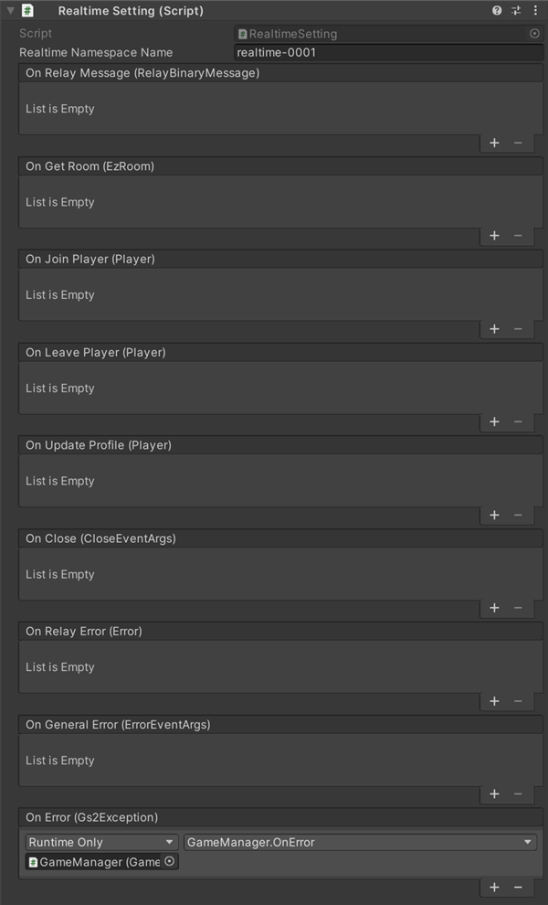

# 실시간 대전 해설

[GS2-Realtime](https://docs.gs2.io/ko/api_reference/realtime/) 을 사용하여 플레이어 간에 통신 대전을 하는 샘플입니다.

## GS2-Deploy 템플릿

- [initialize_match_template.yaml - 매치메이킹/실시간 대전](../Templates/initialize_match_template.yaml)

## 실시간 설정　RealtimeSetting



| 설정 이름 | 설명 |
---|---
| realtimeNamespaceName | GS2-Realtime 의 네임스페이스 이름 |

| 이벤트 | 설명 |
---------|------
| OnRelayMessage(RelayBinaryMessage message) | Realtime 게임 서버로부터 메시지를 수신했을 때 호출됩니다. |
| OnGetRoom(EzRoom room) | 실시간 게임 서버의 IP 주소·포트 정보를 가져왔을 때 호출됩니다. |
| OnJoinPlayer(Player player) | 실시간 게임 서버에 새로운 플레이어가 참가했을 때 호출됩니다. 룸에 참가한 직후에는 그때까지 참가해 있던 플레이어의 수만큼 호출됩니다. |
| OnLeavePlayer(Player player) | 실시간 게임 서버에서 플레이어가 이탈했을 때 호출됩니다. 이 콜백은 반드시 OnJoinPlayer / OnLeavePlayer 중 하나와 같은 타이밍에 호출됩니다. |
| OnUpdateProfile(Player player) | 누군가가 플레이어 프로필을 갱신했을 때 호출됩니다. |
| OnRelayError(Error error) | 실시간 게임 서버에서 오류가 발생했을 때 호출됩니다. |
| OnClose(CloseEventArgs error) | 실시간 게임 서버에서 연결이 끊겼을 때 호출됩니다. |
| OnGeneralError(ErrorEventArgs error) | 커넥션 관련으로 오류가 발생했을 때 호출됩니다. |
| OnError(Gs2Exception error) | 오류가 발생했을 때 호출됩니다. |

### 룸 정보 가져오기

GS2-Realtime 에서 룸의 정보를 가져옵니다.  

UniTask 활성화 시
```c#
var domain = gs2.Realtime.Namespace(
    namespaceName: realtimeNamespaceName
).Room(
    roomName: gatheringName
);
try
{
    room = await domain.ModelAsync();
    
    onGetRoom.Invoke(room);
    
    return room;
}
catch (Gs2Exception e)
{
    onError.Invoke(e);
    throw;
}
```
코루틴 사용 시
```c#
var domain = gs2.Realtime.Namespace(
    namespaceName: realtimeNamespaceName
).Room(
    roomName: gatheringName
);
var future = domain.ModelFuture();
yield return future;
if (future.Error != null)
{
    onError.Invoke(
        future.Error
    );
    callback.Invoke(null);
    yield break;
}

room = future.Result;

onGetRoom.Invoke(room);

callback.Invoke(room);
```

### 룸에 접속

룸 정보에 기재된 게임 서버의 `IP 주소` `포트` 에 접속합니다.  
RelayRealtimeSession 을 생성한 다음, 각종 이벤트 핸들러를 설정하고,  
룸에 접속하는 `realtimeSession.Connect` 를 실행합니다.

UniTask 활성화 시
```c#
var realtimeSession = new RelayRealtimeSession(
    GameManager.Instance.Session.AccessToken.Token,
    ipAddress,
    port,
    encryptionKey,
    ByteString.CopyFrom()
);

realtimeSession.OnRelayMessage += message =>
{
    _realtimeSetting.onRelayMessage.Invoke(message);
}; 
realtimeSession.OnJoinPlayer += player =>
{
    _realtimeSetting.onJoinPlayer.Invoke(player);
};
realtimeSession.OnLeavePlayer += player =>
{
    _realtimeSetting.onLeavePlayer.Invoke(player);
};
realtimeSession.OnGeneralError += args => 
{
    _realtimeSetting.onGeneralError.Invoke(args);
};
realtimeSession.OnError += error =>
{
    _realtimeSetting.onRelayError.Invoke(error);
};
realtimeSession.OnUpdateProfile += player =>
{
    _realtimeSetting.onUpdateProfile.Invoke(player);
};
realtimeSession.OnClose += args =>
{
    _realtimeSetting.onClose.Invoke(args);
};

try
{
    await realtimeSession.ConnectAsync(
        this
    );
}
catch (Gs2Exception e)
{
    _realtimeSetting.onError.Invoke(
        e
    );
    return null;
}

return realtimeSession;
```
코루틴 사용 시
```c#
var realtimeSession = new RelayRealtimeSession(
    GameManager.Instance.Session.AccessToken.Token,
    ipAddress,
    port,
    encryptionKey,
    ByteString.CopyFrom()
);

realtimeSession.OnRelayMessage += message =>
{
    _realtimeSetting.onRelayMessage.Invoke(message);
}; 
realtimeSession.OnJoinPlayer += player =>
{
    _realtimeSetting.onJoinPlayer.Invoke(player);
};
realtimeSession.OnLeavePlayer += player =>
{
    _realtimeSetting.onLeavePlayer.Invoke(player);
};
realtimeSession.OnGeneralError += args => 
{
    _realtimeSetting.onGeneralError.Invoke(args);
};
realtimeSession.OnError += error =>
{
    _realtimeSetting.onRelayError.Invoke(error);
};
realtimeSession.OnUpdateProfile += player =>
{
    _realtimeSetting.onUpdateProfile.Invoke(player);
};
realtimeSession.OnClose += args =>
{
    _realtimeSetting.onClose.Invoke(args);
};

AsyncResult<bool> result = null;
yield return realtimeSession.Connect(
    this,
    r =>
    {
        result = r;
    }
);

if (realtimeSession.Connected)
{
    callback.Invoke(
        new AsyncResult<RelayRealtimeSession>(realtimeSession, null)
    );
}
else
{
    if (result.Error != null)
    {
        _realtimeSetting.onError.Invoke(
            result.Error
        );
        callback.Invoke(
            new AsyncResult<RelayRealtimeSession>(null, result.Error)
        );
    }
}
```

### 게임 플레이 중의 동기화

플레이어의 프로필 정보로서, Inputfield 에 입력된 이름을 주기적으로 전송하고 다른 플레이어가 받습니다.  
다른 플레이어로부터 프로필 정보를 받은 경우에는, 그 플레이어 정보의 동기화를 수행합니다.

> 전송

UniTask 활성화 시
```c#
public async UniTask UpdateProfileAsync()
{
    while (true)
    {
        await UniTask.Delay(300);

        ByteString binary = null;
        try
        {
            binary = ByteString.CopyFrom(ProfileSerialize());
        }
        catch (Exception e)
        {
            Debug.Log(e);
            continue;
        }

        if (Session != null && Session.Connected)
        {
            bool lockWasTaken = false;
            try
            {
                System.Threading.Monitor.TryEnter(this, ref lockWasTaken);

                if (lockWasTaken)
                {
                    await Session.UpdateProfileAsync(
                        binary
                    );
                }
            }
            finally
            {
                if (lockWasTaken) System.Threading.Monitor.Exit(this);
            }
        }
        else
        {
            break;
        }
    }
}
```
코루틴 사용 시
```c#
public IEnumerator UpdateProfile()
{
    while (true)
    {
        yield return new WaitForSeconds(0.3f);

        ByteString binary = null;
        try
        {
            binary = ByteString.CopyFrom(ProfileSerialize());
        }
        catch (Exception e)
        {
            Debug.Log(e);
            continue;
        }

        if (Session != null)
        {
            bool lockWasTaken = false;
            try
            {
                System.Threading.Monitor.TryEnter(this, ref lockWasTaken);

                if (lockWasTaken)
                {
                    yield return Session.UpdateProfile(
                        r => { },
                        binary
                    );
                }
            }
            finally
            {
                if (lockWasTaken) System.Threading.Monitor.Exit(this);
            }
        }
    }
}
```

> 수신

```c#
_realtimeSetting.onUpdateProfile.AddListener(
    player => 
    {
        if (players.ContainsKey(player.ConnectionId))
        {
            var data = player.Profile.ToByteArray();
            var p = players[player.ConnectionId];
            if (p != null)
                p.Deserialize(data);
        }
        else
        {
            JoinPlayerHandler(player);
        }
    }
);
```

### 바이너리 데이터의 전송

`Send` 로 다른 플레이어에게 선택한 가위바위보의 수 등의 정보를 전송합니다.  
`Send` 의 세 번째 인자에 목적지의 `커넥션 ID` 배열을 지정한 경우에는, 지정한 플레이어에게 데이터가 전송됩니다.  
다른 플레이어로부터 정보를 수신하면, 그 플레이어의 정보로 UI 를 갱신합니다.

> 전송

UniTask 활성화 시
```c#
public async UniTask SendAsync()
{
    ByteString binary = null;
    try
    {
        binary = ByteString.CopyFrom(StateSerialize());
    }
    catch (Exception e)
    {
        Debug.Log(e);
    }

    await Session.SendAsync(
        binary
    );
}
```
코루틴 사용 시
```c#
public IEnumerator Send()
{
    ByteString binary = null;
    try
    {
        binary = ByteString.CopyFrom(StateSerialize());
    }
    catch (Exception e)
    {
        Debug.Log(e);
    }

    yield return Session.Send(
        r => { },
        binary
    );
}
```

> 수신
```c#
_realtimeSetting.onRelayMessage.AddListener(
    message => 
    {
        if (players.ContainsKey(message.ConnectionId))
        {
            var data = message.Data.ToByteArray();
            var p = players[message.ConnectionId];
            if (p != null)
                p.StateDeserialize(data);
        }
    }
);
```
