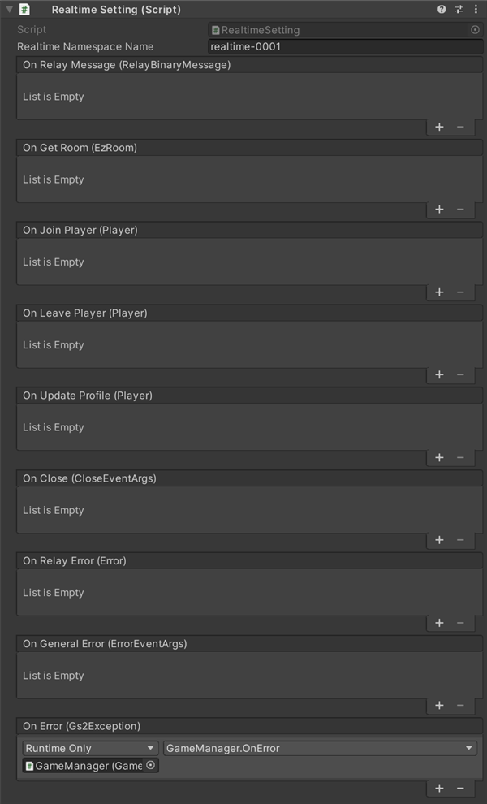

# Settings 設定

## 各機能のイベントについて

Settingにコールバックを設定することで、イベント発生時に処理を追加することができます。  

### アカウントの引継ぎ

| イベント | 説明 |
---------|------
| OnSetTakeOver(EzTakeOver takeOver) | アカウントの引継ぎ情報が設定されたとき。 |
| OnDeleteTakeOver(EzTakeOver takeOver) | アカウントの引継ぎ情報が削除されたとき。 |
| OnDoTakeOver(EzAccount takeOver) | アカウントの引継ぎが実行されたとき。 |
| OnError(Gs2Exception error) | エラーが発生したときに呼び出されます。 |

### ゴールド

| イベント | 説明 |
---------|------
| onGetInventoryModel(string inventoryName, EzInventoryModel, List<EzItemModel>) | インベントリーモデルを取得したとき。 |
| onGetInventory(EzInventory inventory, List<EzItemSet> itemSets) | インベントリーの情報を取得したとき。 |
| onAcquire(Product product) | ゴールドを追加したとき。 |
| onConsume(Product product) | ゴールドを消費したとき。 |
| onError(Gs2Exception error) | エラーが発生したときに呼び出されます。 |

### マッチメイキング

| イベント | 説明 |
---------|------
| OnJoinPlayer(EzGathering gathering, string userId) | 参加中のギャザリングに新しい参加者が来た時に呼び出されます。 |
| OnLeavePlayer(EzGathering gathering, string userId) | 参加中のギャザリングから参加者が離脱した時に呼び出されます。 |
| OnUpdateJoinedPlayerIds(EzGathering gathering, List<string> joinedPlayerIds) | アカウントが作成されたときに呼び出されます。 |
| OnLogin(EzAccount account, GameSession session) | 参加中のギャザリングのプレイヤーIDリストが更新されたときに呼び出されます。 このコールバックは必ず OnJoinPlayer / OnLeavePlayer のいずれかと同じタイミングで呼び出されます。 |
| OnMatchmakingComplete(EzGathering gathering, List<string> joinedPlayerIds) | マッチメイキングが完了したときに呼び出されます。 |
| OnError(Gs2Exception error) | エラーが発生したときに呼び出されます。 |

### リアルタイム対戦

| イベント | 説明 |
---------|------
| OnRelayMessage(RelayBinaryMessage message) | リアルタイムゲームサーバからメッセージを受信したときに呼び出されます。 |
| OnGetRoom(EzRoom room) | リアルタイムゲームサーバのIPアドレス・ポート情報を取得したときに呼び出されます。 |
| OnJoinPlayer(Player player) | リアルタイムゲームサーバに新しいプレイヤーが参加したときに呼び出されます。 |
| OnLeavePlayer(Player player) | リアルタイムゲームサーバからプレイヤーが離脱したときに呼び出されます。 このコールバックは必ず OnJoinPlayer / OnLeavePlayer のいずれかと同じタイミングで呼び出されます。 |
| OnUpdateProfile(Player player) | 誰かがプレイヤープロフィールを更新したときに呼び出されます。 |
| OnRelayError(Error error) | リアルタイムゲームサーバでエラーが発生したときに呼び出されます。 |
| OnClose(CloseEventArgs error) | リアルタイムゲームサーバから切断されたときに呼び出されます。 |
| OnGeneralError(ErrorEventArgs error) | コネクション関連でエラーが発生したときに呼び出されます。 |
| OnError(Gs2Exception error) | エラーが発生したときに呼び出されます。 |

