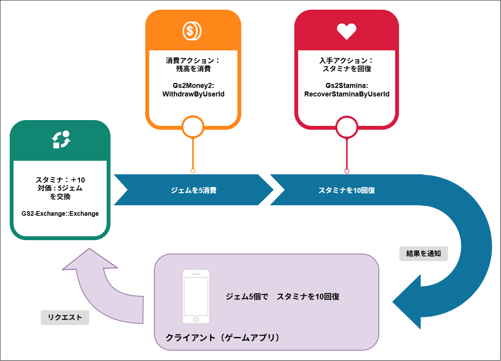

# スタミナ/スタミナストア　解説

[GS2-Stamina]( https://docs.gs2.io/ja/api_reference/stamina/ ) を使ってスタミナ値を管理するサンプルです。  
[GS2-Exchange]( https://docs.gs2.io/ja/api_reference/exchange/ ) と連携し [GS2-Money2]( https://docs.gs2.io/ja/api_reference/money2/ ) の課金通貨を消費しスタミナ値を回復するストア機能のサンプルです。  

## GS2-Deploy テンプレート

- [initialize_player_template.yaml - スタミナ/スタミナストア](../Templates/initialize_player_template.yaml)

## スタミナ設定 StaminaSetting


| 設定名 | 説明 |
---|---
| staminaNamespaceName | GS2-Stamina のネームスペース名 |
| staminaModelName | GS2-Stamina のスタミナモデル名 |
| staminaName | GS2-Stamina のスタミナの種類名 |
| exchangeNamespaceName | スタミナの回復に使用する GS2-Exchange のネームスペース名 |
| exchangeRateName | スタミナの回復に使用する GS2-Exchange の交換レート名 |

| イベント                                                                        | 説明                      |
-----------------------------------------------------------------------------|-------------------------
| OnGetStaminaModel(string staminaModelName, EzStaminaModel model)            | スタミナモデルを取得したときに呼び出されます。 |
| OnConsumeStamina(EzStaminaModel model, EzStamina stamina, int consumeValue) | スタミナ消費したときに呼び出されます。     |
| OnGetStamina(EzStamina stamina)                                             | スタミナの情報を取得したときに呼び出されます。 |
| OnBuy()                                                                     | 交換が完了したときに呼び出されます。      |
| OnError(Gs2Exception error)                                                 | エラーが発生したときに呼び出されます。     |

### スタミナを取得

最新のスタミナの状態を取得します。

・UniTask有効時
```c#
var domain = gs2.Stamina.Namespace(
    namespaceName: staminaNamespaceName
).Me(
    gameSession: gameSession
).Stamina(
    staminaName: staminaName
);
try
{
    stamina = await domain.ModelAsync();
    
    onGetStamina.Invoke(stamina);
    
    return stamina;
}
catch (Gs2Exception e)
{
    onError.Invoke(e);
}

return null;
```
・コルーチン使用時
```c#
var future = gs2.Stamina.Namespace(
    namespaceName: staminaNamespaceName
).Me(
    gameSession: gameSession
).Stamina(
    staminaName: staminaName
).Model();
yield return future;
if (future.Error != null)
{
    onError.Invoke(future.Error);
    yield break;
}
stamina = future.Result;

onGetStamina.Invoke(stamina);

callback.Invoke(stamina);
```

### スタミナを消費

スタミナをここでは5消費します。
CurrentStaminaMaster に設定された時間間隔ごとにスタミナは回復を始めます。

・UniTask有効時
```c#
var domain = gs2.Stamina.Namespace(
    namespaceName: staminaNamespaceName
).Me(
    gameSession: gameSession
).Stamina(
    staminaName: staminaName
);
try
{
    var result = await domain.ConsumeAsync(
        consumeValue
    );

    stamina = await result.ModelAsync();
}
catch (Gs2Exception e)
{
    onError.Invoke(e);
    return;
}

onConsumeStamina.Invoke(model, stamina, consumeValue);
onGetStamina.Invoke(stamina);
```
・コルーチン使用時
```c#
var domain = gs2.Stamina.Namespace(
    namespaceName: staminaNamespaceName
).Me(
    gameSession: gameSession
).Stamina(
    staminaName: staminaName
);
var future = domain.ConsumeFuture(
    consumeValue: consumeValue
);
yield return future;
if (future.Error != null)
{
    onError.Invoke(future.Error);
    yield break;
}

var future2 = future.Result.ModelFuture();
yield return future2;
if (future2.Error != null)
{
    onError.Invoke(future2.Error);
    yield break;
}

stamina = future2.Result;

onConsumeStamina.Invoke(model, stamina, consumeValue);
onGetStamina.Invoke(stamina);
```

### スタミナ回復の購入

スタミナ回復の購入処理を実行します。  
GS2-Exchangeの課金通貨を消費してスタミナを入手する交換処理を呼び出しています。  

・UniTask有効時
```c#
var domain = gs2.Exchange.Namespace(
    namespaceName: exchangeNamespaceName
).Me(
    gameSession: gameSession
).Exchange();
Gs2.Unity.Gs2Exchange.Model.EzConfig[] config =
{
    new Gs2.Unity.Gs2Exchange.Model.EzConfig
    {
        Key = "slot",
        Value = slot.ToString(),
    }
};
try
{
    var result = await domain.ExchangeAsync(
        exchangeRateName,
        1,
        config
    );
    // トランザクションの自動実行の完了を待機（連鎖するトランザクションも含めて全て待つ）
    await result.WaitAsync(true);
}
catch (Gs2Exception e)
{
    onError.Invoke(e);
    return e;
}

// スタミナ購入に成功
// Successfully purchased stamina

onBuy.Invoke();
return null;
```
・コルーチン使用時
```c#
var domain = gs2.Exchange.Namespace(
    namespaceName: exchangeNamespaceName
).Me(
    gameSession: gameSession
).Exchange();
var future = domain.ExchangeFuture(
    rateName: exchangeRateName,
    count: 1,
    config: new[]
    {
        new Gs2.Unity.Gs2Exchange.Model.EzConfig
        {
            Key = "slot",
            Value = slot.ToString(),
        }
    }
);
yield return future;
if (future.Error != null)
{
    onError.Invoke(
        future.Error
    );
    callback.Invoke(future.Error);
    yield break;
}

// トランザクションの自動実行の完了を待機（連鎖するトランザクションも含めて全て待つ）
yield return future.Result.WaitFuture(true);

// スタミナ購入に成功
// Successfully purchased stamina

onBuy.Invoke();

callback.Invoke(null);
```
Config には [GS2-Money2]( https://docs.gs2.io/ja/api_reference/money2/ )  のウォレットスロット番号 __slot__ を渡します。
ウォレットスロット番号はこのサンプルのためにプラットフォーム別に割り振った課金通貨の種別で、以下のように定義しています。

| プラットフォーム      | 番号 |
|---------------|---|
| スタンドアローン(その他) | 0 |
| iOS           | 1 |
| Android       | 2 |

Config はトランザクション処理に動的なパラメータを渡すための仕組みです。  
[⇒スタンプシート発行時のパラメータ設定]( https://docs.gs2.io/ja/articles/tech/stamp_sheet/#%e3%82%b9%e3%82%bf%e3%83%b3%e3%83%97%e3%82%b7%e3%83%bc%e3%83%88%e7%99%ba%e8%a1%8c%e6%99%82%e3%81%ae%e3%83%91%e3%83%a9%e3%83%a1%e3%83%bc%e3%82%bf%e8%a8%ad%e5%ae%9a )  
Config(EzConfig) はキー・バリュー形式で、渡したパラメータで #{Config で指定したキー値} のプレースホルダー文字列を置換することができます。
以下のトランザクションの定義中の　#{slot}　はウォレットスロット番号に置換されます。


課金通貨とスタミナを交換するトランザクション処理の流れは以下のようになります。

