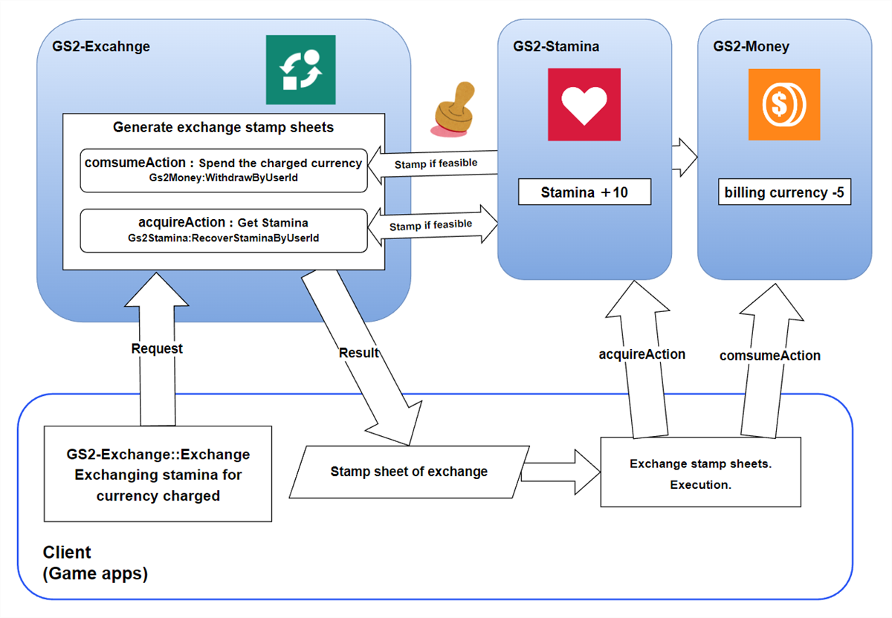

# Stamina/Stamina Store Explanation

This is a sample of using [GS2-Stamina](https://app.gs2.io/docs/en/index.html#gs2-stamina) to manage stamina values.  
It is linked to [GS2-Exchange](https://app.gs2.io/docs/en/index.html#gs2-exchange) and uses the billing currency of [GS2-Money](https://app.gs2.io/docs/en/index.html#gs2-money) to manage stamina values. The following is a sample of a store function that consumes and recovers stamina values.

## GS2-Deploy template

- [initialize_stamina_template.yaml - Stamina/Stamina Store](../Templates/initialize_stamina_template.yaml)

## StaminaSetting StaminaSetting


| Setting Name | Description |
---|---
| staminaNamespaceName | Namespace name of GS2-Stamina
| staminaModelName | Stamina model name of GS2-Stamina
| staminaName | Name of the type of stamina in GS2-Stamina |
| exchangeNamespaceName | Namespace name of GS2-Exchange used to recover stamina
| exchangeRateName | Name of the GS2-Exchange exchange rate used to recover stamina
| exchangeKeyId | cryptographic key used to calculate the signature on the stamp sheet issued for the exchange process by GS2-Exchange
| distributorNamespaceName | namespace name of the GS2-Distributor delivering the exchanged stamina recovery process

| Event | Description |
-----------------------------------------------------------------------------|-------------------------
| OnGetStaminaModel(string staminaModelName, EzStaminaModel model)            | Called when the stamina model is retrieved. |
| OnConsumeStamina(EzStaminaModel model, EzStamina stamina, int consumeValue) | Called when stamina is consumed.     |
| OnGetStamina(EzStamina stamina) | Called when stamina information is retrieved. |
| OnBuy() | Called when an exchange is completed. |
| OnError(Gs2Exception error) | Called when an error occurs. |

### Get Stamina

Get the latest stamina status.

When UniTask is enabled
```c#
var domain = gs2.Stamina.Namespace(
    namespaceName: staminaNamespaceName
).Me(
    gameSession: gameSession
).Stamina(
    staminaName: staminaName
);
try
{
    stamina = await domain.ModelAsync();
    
    onGetStamina.Invoke(stamina);
    
    return stamina;
}
catch (Gs2Exception e)
{
    onError.Invoke(e);
}

return null;
```
When coroutine is used
```c#
var future = gs2.Stamina.Namespace(
    namespaceName: staminaNamespaceName
).Me(
    gameSession: gameSession
).Stamina(
    staminaName: staminaName
).Model();
yield return future;
if (future.Error != null)
{
    onError.Invoke(future.Error);
    yield break;
}
stamina = future.Result;

onGetStamina.Invoke(stamina);

callback.Invoke(stamina);
```

### Consume Stamina

Consumes 5 stamina.
Stamina begins to recover at each time interval set in CurrentStaminaMaster.

When UniTask is enabled
```c#
var domain = gs2.Stamina.Namespace(
    namespaceName: staminaNamespaceName
).Me(
    gameSession: gameSession
).Stamina(
    staminaName: staminaName
);
try
{
    var result = await domain.ConsumeAsync(
        consumeValue
    );

    stamina = await result.ModelAsync();
}
catch (Gs2Exception e)
{
    onError.Invoke(e);
    return;
}

onConsumeStamina.Invoke(model, stamina, consumeValue);
onGetStamina.Invoke(stamina);
```
When coroutine is used
```c#
var domain = gs2.Stamina.Namespace(
    namespaceName: staminaNamespaceName
).Me(
    gameSession: gameSession
).Stamina(
    staminaName: staminaName
);
var future = domain.ConsumeFuture(
    consumeValue: consumeValue
);
yield return future;
if (future.Error != null)
{
    onError.Invoke(future.Error);
    yield break;
}

var future2 = future.Result.ModelFuture();
yield return future2;
if (future2.Error != null)
{
    onError.Invoke(future2.Error);
    yield break;
}

stamina = future2.Result;

onConsumeStamina.Invoke(model, stamina, consumeValue);
onGetStamina.Invoke(stamina);
```

### Purchase of Stamina Restoration

Executes the process of purchasing stamina recovery.  
The exchange process is called to obtain stamina by consuming GS2-Exchange billing currency.  

When UniTask is enabled
```c#
var domain = gs2.Exchange.Namespace(
    namespaceName: exchangeNamespaceName
).Me(
    gameSession: gameSession
).Exchange();
Gs2.Unity.Gs2Exchange.Model.EzConfig[] config =
{
    new Gs2.Unity.Gs2Exchange.Model.EzConfig
    {
        Key = "slot",
        Value = slot.ToString(),
    }
};
try
{
    await domain.ExchangeAsync(
        exchangeRateName,
        1,
        config
    );
}
catch (Gs2Exception e)
{
    onError.Invoke(e);
    return e;
}

// Successfully purchased stamina

onBuy.Invoke();
return null;
```
When coroutine is used
```c#
var domain = gs2.Exchange.Namespace(
    namespaceName: exchangeNamespaceName
).Me(
    gameSession: gameSession
).Exchange();
var future = domain.ExchangeFuture(
    rateName: exchangeRateName,
    count: 1,
    config: new[]
    {
        new Gs2.Unity.Gs2Exchange.Model.EzConfig
        {
            Key = "slot",
            Value = slot.ToString(),
        }
    }
);
yield return future;
if (future.Error != null)
{
    onError.Invoke(
        future.Error
    );
    callback.Invoke(future.Error);
    yield break;
}

// Successfully purchased stamina

onBuy.Invoke();

callback.Invoke(null);
```
Config is passed the wallet slot number __slot__ of [GS2-Money](https://app.gs2.io/docs/index.html#gs2-money).
The wallet slot number is the type of billing currency assigned by platform for this sample and is defined as follows  

| Platform | Number |
|---------------|---|
| Standalone (Other) | 0 |
| iOS | 1 |
| Android | 2 |

Config is a mechanism for passing dynamic parameters to the stamp sheet.  
[⇒Stamp sheet variables](https://app.gs2.io/docs/en/index.html#d7e97677c7)  
Config(EzConfig) is a key-value format that allows you to substitute a placeholder string of #{key value specified in Config} with the parameters you pass.
In the following stamp sheet definition #{slot} will be replaced by the wallet slot number.

By executing the stamp sheet in this manner, the actual exchange of charged currency for stamina values is performed.

