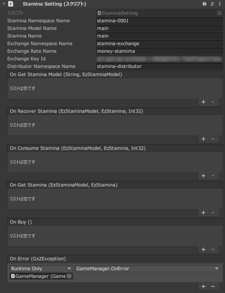
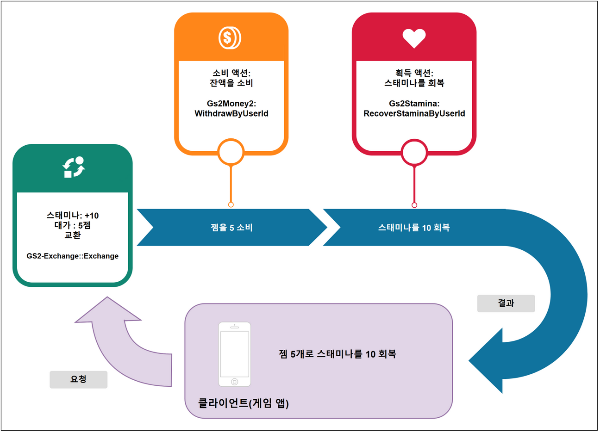

# 스태미나/스태미나 상점 해설

[GS2-Stamina](https://docs.gs2.io/ko/api_reference/stamina/) 를 사용하여 스태미나 값을 관리하는 샘플입니다.  
[GS2-Exchange](https://docs.gs2.io/ko/api_reference/exchange/) 와 연계하여 [GS2-Money2](https://docs.gs2.io/ko/api_reference/money2/) 의 유료 재화를 소비해 스태미나 값을 회복하는 상점 기능의 샘플입니다.  

## GS2-Deploy 템플릿

- [initialize_player_template.yaml - 스태미나/스태미나 상점](../Templates/initialize_player_template.yaml)

## 스태미나 설정 StaminaSetting



| 설정 이름 | 설명 |
---|---
| staminaNamespaceName | GS2-Stamina 의 네임스페이스 이름 |
| staminaModelName | GS2-Stamina 의 스태미나 모델 이름 |
| staminaName | GS2-Stamina 의 스태미나 종류 이름 |
| exchangeNamespaceName | 스태미나의 회복에 사용하는 GS2-Exchange 의 네임스페이스 이름 |
| exchangeRateName | 스태미나의 회복에 사용하는 GS2-Exchange 의 교환 레이트 이름 |

| 이벤트 | 설명 |
-----------------------------------------------------------------------------|-------------------------
| OnGetStaminaModel(string staminaModelName, EzStaminaModel model)            | 스태미나 모델을 가져왔을 때 호출됩니다. |
| OnConsumeStamina(EzStaminaModel model, EzStamina stamina, int consumeValue) | 스태미나를 소비했을 때 호출됩니다. |
| OnGetStamina(EzStamina stamina)                                             | 스태미나의 정보를 가져왔을 때 호출됩니다. |
| OnBuy()                                                                     | 교환이 완료되었을 때 호출됩니다. |
| OnError(Gs2Exception error)                                                 | 오류가 발생했을 때 호출됩니다. |

### 스태미나 가져오기

최신 스태미나의 상태를 가져옵니다.

UniTask 활성화 시
```c#
var domain = gs2.Stamina.Namespace(
    namespaceName: staminaNamespaceName
).Me(
    gameSession: gameSession
).Stamina(
    staminaName: staminaName
);
try
{
    stamina = await domain.ModelAsync();
    
    onGetStamina.Invoke(stamina);
    
    return stamina;
}
catch (Gs2Exception e)
{
    onError.Invoke(e);
}

return null;
```
코루틴 사용 시
```c#
var future = gs2.Stamina.Namespace(
    namespaceName: staminaNamespaceName
).Me(
    gameSession: gameSession
).Stamina(
    staminaName: staminaName
).Model();
yield return future;
if (future.Error != null)
{
    onError.Invoke(future.Error);
    yield break;
}
stamina = future.Result;

onGetStamina.Invoke(stamina);

callback.Invoke(stamina);
```

### 스태미나 소비

여기서는 스태미나를 5 소비합니다.
CurrentStaminaMaster 에 설정된 시간 간격마다 스태미나는 회복을 시작합니다.

UniTask 활성화 시
```c#
var domain = gs2.Stamina.Namespace(
    namespaceName: staminaNamespaceName
).Me(
    gameSession: gameSession
).Stamina(
    staminaName: staminaName
);
try
{
    var result = await domain.ConsumeAsync(
        consumeValue
    );

    stamina = await result.ModelAsync();
}
catch (Gs2Exception e)
{
    onError.Invoke(e);
    return;
}

onConsumeStamina.Invoke(model, stamina, consumeValue);
onGetStamina.Invoke(stamina);
```
코루틴 사용 시
```c#
var domain = gs2.Stamina.Namespace(
    namespaceName: staminaNamespaceName
).Me(
    gameSession: gameSession
).Stamina(
    staminaName: staminaName
);
var future = domain.ConsumeFuture(
    consumeValue: consumeValue
);
yield return future;
if (future.Error != null)
{
    onError.Invoke(future.Error);
    yield break;
}

var future2 = future.Result.ModelFuture();
yield return future2;
if (future2.Error != null)
{
    onError.Invoke(future2.Error);
    yield break;
}

stamina = future2.Result;

onConsumeStamina.Invoke(model, stamina, consumeValue);
onGetStamina.Invoke(stamina);
```

### 스태미나 회복의 구매

스태미나 회복의 구매 처리를 실행합니다.  
GS2-Exchange 의 유료 재화를 소비하여 스태미나를 획득하는 교환 처리를 호출하고 있습니다.  

UniTask 활성화 시
```c#
var domain = gs2.Exchange.Namespace(
    namespaceName: exchangeNamespaceName
).Me(
    gameSession: gameSession
).Exchange();
Gs2.Unity.Gs2Exchange.Model.EzConfig[] config =
{
    new Gs2.Unity.Gs2Exchange.Model.EzConfig
    {
        Key = "slot",
        Value = slot.ToString(),
    }
};
try
{
    var result = await domain.ExchangeAsync(
        exchangeRateName,
        1,
        config
    );
    // 트랜잭션의 자동 실행 완료를 대기(연쇄되는 트랜잭션도 포함하여 모두 대기)
    await result.WaitAsync(true);
}
catch (Gs2Exception e)
{
    onError.Invoke(e);
    return e;
}

// 스태미나 구매에 성공

onBuy.Invoke();
return null;
```
코루틴 사용 시
```c#
var domain = gs2.Exchange.Namespace(
    namespaceName: exchangeNamespaceName
).Me(
    gameSession: gameSession
).Exchange();
var future = domain.ExchangeFuture(
    rateName: exchangeRateName,
    count: 1,
    config: new[]
    {
        new Gs2.Unity.Gs2Exchange.Model.EzConfig
        {
            Key = "slot",
            Value = slot.ToString(),
        }
    }
);
yield return future;
if (future.Error != null)
{
    onError.Invoke(
        future.Error
    );
    callback.Invoke(future.Error);
    yield break;
}

// 트랜잭션의 자동 실행 완료를 대기(연쇄되는 트랜잭션도 포함하여 모두 대기)
yield return future.Result.WaitFuture(true);

// 스태미나 구매에 성공

onBuy.Invoke();

callback.Invoke(null);
```
Config 에는 [GS2-Money2](https://docs.gs2.io/ko/api_reference/money2/) 의 월렛 슬롯 번호 __slot__ 을 전달합니다.
월렛 슬롯 번호는 이 샘플을 위해 플랫폼별로 할당한 유료 재화의 종류로, 아래와 같이 정의하고 있습니다.

| 플랫폼 | 번호 |
|---------------|---|
| 스탠드얼론(기타) | 0 |
| iOS           | 1 |
| Android       | 2 |

Config 는 스탬프 시트에 동적인 파라미터를 전달하기 위한 구조입니다.  
[⇒스탬프 시트 발행 시 파라미터 설정]( https://docs.gs2.io/ko/articles/tech/stamp_sheet/#%EC%8A%A4%ED%83%AC%ED%94%84-%EC%8B%9C%ED%8A%B8-%EB%B0%9C%ED%96%89-%EC%8B%9C-%ED%8C%8C%EB%9D%BC%EB%AF%B8%ED%84%B0-%EC%84%A4%EC%A0%95 )  
Config(EzConfig) 는 키·값 형식으로, 전달한 파라미터로 #{Config 에서 지정한 키 값} 의 플레이스홀더 문자열을 치환할 수 있습니다.
아래 스탬프 시트의 정의 중 　#{slot}　은 월렛 슬롯 번호로 치환됩니다.


유료 재화와 스태미나를 교환하는 트랜잭션 처리의 흐름은 아래와 같습니다.


