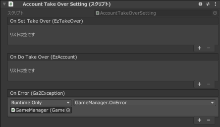

# Account Takeover Explanation

Anonymous accounts created by [GS2-Account](https://app.gs2.io/docs/en/index.html#gs2-account) with email addresses and  
Associate a Game Center/Google Play Game Service account  
The following is a sample of account takeover.

## GS2-Deploy template

- [initialize_account_template.yaml - login/account linkage and transfer](../Templates/initialize_account_template.yaml)

## Account transfer settings Setting



| Event | Description |
---------|------
| OnSetTakeOver(EzTakeOver takeOver) | Called when account takeover information is set. | OnSetTakeOver(EzTakeOver takeOver)
| OnDeleteTakeOver(EzTakeOver takeOver) | Called when account takeover information is deleted. | OnDeleteTakeOver(EzTakeOver takeOver)
| OnDoTakeOver(EzAccount takeOver) | Called when an account takeover is executed. | OnDoTakeOver(EzAccount takeOver)
| OnError(Gs2Exception error) | Called when an error occurs. | OnError(Gs2Exception error)

## Flow of linking/taking over accounts

In the menu opened from the `Account Linking` button  
Register the transfer information to the anonymous account that has already been created at the time of the first startup `Account Linking  
Select `Account takeover` to execute the takeover.

It is not necessary for the account to be logged in at the time the transfer is executed.

## Flow of linking accounts

Set up an account linkage using your email address and password at `Email`, and  
Game Center/Google Play Game Service in `Game Center` or `Google Play  
Choose to link your account with a distribution platform service such as
To link platform services, you must first log in to each service on your device before linking.

Under `Email` you will further set up your email address and password.

### Get transfer settings

Retrieves the currently configured transfer settings.

```c#
AsyncResult<EzListTakeOverSettingsResult> result = null;
yield return client.Account.ListTakeOverSettings(
    r => { result = r; }
    session,
    accountNamespaceName,
    null,
    30
);
````

### Register transfer information

Register transfer settings for anonymous accounts.

```c#
AsyncResult<EzAddTakeOverSettingResult> result = null;
yield return client.Account.AddTakeOverSetting(
    r => { result = r; }
    session,
    accountNamespaceName,
    type,
    userIdentifier,
    password
);
```

### Delete transfer information

Deletes (cancels) transfer settings already linked to an anonymous account.

```c#
AsyncResult<EzDeleteTakeOverSettingResult> result = null;
yield return client.Account.DeleteTakeOverSetting(
    r => { result = r; }
    session,
    accountNamespaceName,
    type
);
```

### Account takeover

Transferring an account by specifying an email address and password, or  
Or, transfer an account that has already been linked to the platform's services.  
Save the retrieved account information to local storage.

If you are already logged in, you will need to re-login with the obtained account.

```c#
AsyncResult<EzDoTakeOverResult> result = null;
yield return client.Account.DoTakeOver(
    r => { result = r; }
    accountNamespaceName,
    type,
    userIdentifier,
    password
);
```


