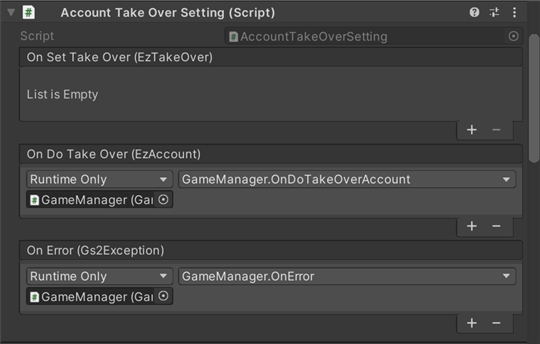

# Account Takeover Explanation

Anonymous accounts created by [GS2-Account](https://app.gs2.io/docs/en/index.html#gs2-account) with email addresses and  
Associate a Game Center/Google Play Game Service account  
The following is a sample of account takeover.

## GS2-Deploy template

- [initialize_account_template.yaml - login/account linkage and takeover](../Templates/initialize_account_template.yaml)

## Account takeover settings Setting



| Event | Description |
---------|------
| OnSetTakeOver(EzTakeOver takeOver) | Called when account takeover information is set. |
| OnDeleteTakeOver(EzTakeOver takeOver) | Called when account takeover information is deleted. |
| OnDoTakeOver(EzAccount takeOver) | Called when an account takeover is executed. |
| OnError(Gs2Exception error) | Called when an error occurs. |

## Flow of linking/takeover accounts

In the menu that opens from the `Account Linking` button, select `Account Linking` to register the takeover information to the anonymous account you have already created at the first startup, and `Account Takeover` to execute the transfer.

It is not necessary for the account to be logged in at the time the takeover is executed.

## Flow of linking accounts

Set up an account linkage using your email address and password at `Email`, and  
Game Center/Google Play Game Service in `Game Center` or `Google Play  
Choose to link your account with a distribution platform service such as
To link platform services, you must first log in to each service on your device before linking.

Under `Email` you will further set up your email address and password.

### Get takeover settings

Retrieves the currently configured takeover settings.

When UniTask is enabled
```c#
var domain = gs2.Account.Namespace(
    namespaceName: accountNamespaceName
).Me(
    gameSession: gameSession
);
try
{
    takeOverSettings = await domain.TakeOversAsync().ToListAsync();
}
catch (Gs2Exception e)
{
    onError.Invoke(e);
    return e;
}
return null;
```
When coroutine is used
```c#
var _takeOver = new List<EzTakeOver>();
var it = gs2.Account.Namespace(
    namespaceName: accountNamespaceName
).Me(
    gameSession: gameSession
).TakeOvers();
while (it.HasNext())
{
    yield return it.Next();
    if (it.Error != null)
    {
        onError.Invoke(it.Error);
        callback.Invoke(it.Error);
        break;
    }

    if (it.Current != null)
    {
        _takeOver.Add(it.Current);
    }
}

takeOverSettings = _takeOver;

callback.Invoke(null);
```

### Register transfer information

Register transfer settings for anonymous accounts.

When UniTask is enabled
```c#
var domain = gs2.Account.Namespace(
    namespaceName: accountNamespaceName
).Me(
    gameSession: gameSession
).TakeOver(
    type: type
);
try
{
    var result = await domain.AddTakeOverSettingAsync(
        userIdentifier: userIdentifier,
        password: password
    );
    var item = await result.ModelAsync();
    
    onSetTakeOver.Invoke(item);
}
catch (Gs2Exception e)
{
    onError.Invoke(e);
    return e;
}

return null;
```
When coroutine is used
```c#
var domain = gs2.Account.Namespace(
    namespaceName: accountNamespaceName
).Me(
    gameSession: gameSession
).TakeOver(
    type: type
);
var future = domain.AddTakeOverSettingFuture(
    userIdentifier: userIdentifier,
    password: password
);
yield return future;
if (future.Error != null)
{
    onError.Invoke(future.Error);
    callback.Invoke(future.Error);
    yield break;
}

var future2 = future.Result.ModelFuture();
yield return future2;
if (future2.Error != null)
{
    onError.Invoke(future2.Error);
    callback.Invoke(future2.Error);
    yield break;
}

onSetTakeOver.Invoke(future2.Result);
callback.Invoke(null);
```

### Delete takeover information

Deletes (cancels) takeover settings already linked to an anonymous account.

When UniTask is enabled
```c#
var domain = gs2.Account.Namespace(
    namespaceName: accountNamespaceName
).Me(
    gameSession: gameSession
).TakeOver(
    type: type
);
try
{
    var result = await domain.DeleteTakeOverSettingAsync();
}
catch (Gs2Exception e)
{
    onError.Invoke(e);
    return e;
}

return null;
```
When coroutine is used
```c#
var domain = gs2.Account.Namespace(
    namespaceName: accountNamespaceName
).Me(
    gameSession: gameSession
).TakeOver(
    type: type
);
var future = domain.DeleteTakeOverSettingFuture();
yield return future;
if (future.Error != null)
{
    onError.Invoke(future.Error);
    callback.Invoke(future.Error);
    yield break;
}

callback.Invoke(null);
```

### Account takeover

Transferring an account by specifying an email address and password, or  
Or, transfer an account that has already been linked to the platform's services.  
Save the retrieved account information to local storage.

If you are already logged in, you will need to re-login with the obtained account.

When UniTask is enabled
```c#
var domain = gs2.Account.Namespace(
    namespaceName: accountNamespaceName
);
try
{
    var result = await domain.DoTakeOverAsync(
        type: type,
        userIdentifier: userIdentifier,
        password: password
    );
    var item = await result.ModelAsync();

    onDoTakeOver.Invoke(item);
}
catch (Gs2Exception e)
{
    onError.Invoke(e);
    return e;
}

return null;
```
When coroutine is used
```c#
var domain = gs2.Account.Namespace(
    namespaceName: accountNamespaceName
);
var future = domain.DoTakeOverFuture(
    type: type,
    userIdentifier: userIdentifier,
    password: password
);
yield return future;
if (future.Error != null)
{
    onError.Invoke(future.Error);
    callback.Invoke(future.Error);
    yield break;
}

var future2 = future.Result.ModelFuture();
yield return future2;
if (future2.Error != null)
{
    onError.Invoke(future2.Error);
    callback.Invoke(future2.Error);
    yield break;
}

onDoTakeOver.Invoke(
    future2.Result
);
callback.Invoke(null);
```
