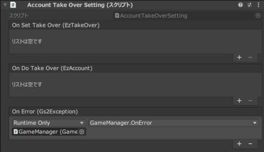

# 계정 인계 해설

[GS2-Account](https://docs.gs2.io/ko/api_reference/account/) 로 생성된 익명 계정에 이메일 주소나,  
Game Center/Google Play Game Service 의 계정을 연결하여  
계정을 인계하는 샘플입니다.

## GS2-Deploy 템플릿

- [initialize_core_template.yaml - 로그인/계정 연동·인계](../Templates/initialize_core_template.yaml)

## 계정 인계 설정 Setting



| 이벤트 | 설명 |
---------|------
| OnSetTakeOver(EzTakeOver takeOver) | 계정의 인계 정보가 설정되었을 때 호출됩니다. |
| OnDeleteTakeOver(EzTakeOver takeOver) | 계정의 인계 정보가 삭제되었을 때 호출됩니다. |
| OnDoTakeOver(EzAccount takeOver) | 계정의 인계가 실행되었을 때 호출됩니다. |
| OnError(Gs2Exception error) | 오류가 발생했을 때 호출됩니다. |

## 계정의 연동/인계의 흐름

`계정 연동` 버튼에서 연 메뉴에서, 최초 실행 시에 생성된 익명 계정에 인계 정보를 등록하는 `계정 연동`, 인계를 실행하는 `계정 인계` 를 선택합니다.

인계를 실행하는 시점에 계정이 로그인 상태일 필요는 없습니다.

## 계정 연동의 흐름

`Email` 로 이메일 주소·비밀번호를 사용한 계정의 연동 설정,  
`Game Center` 또는 `Google Play` 로 Game Center/Google Play Game Service  
와 같은 배포 플랫폼의 서비스를 사용한 계정과의 연동을 할지 선택합니다.
플랫폼 서비스의 연동은, 먼저 각 서비스에 디바이스에서 로그인한 다음에 연동을 해야 합니다.

`Email` 에서는 추가로 이메일 주소와 비밀번호의 설정을 합니다.

### 인계 설정 가져오기

현재 설정되어 있는 인계 설정을 가져옵니다.

UniTask 활성화 시
```c#
var domain = gs2.Account.Namespace(
    namespaceName: accountNamespaceName
).Me(
    gameSession: gameSession
);
try
{
    takeOverSettings = await domain.TakeOversAsync().ToListAsync();
}
catch (Gs2Exception e)
{
    onError.Invoke(e);
    return e;
}
return null;
```
코루틴 사용 시
```c#
var _takeOver = new List<EzTakeOver>();
var it = gs2.Account.Namespace(
    namespaceName: accountNamespaceName
).Me(
    gameSession: gameSession
).TakeOvers();
while (it.HasNext())
{
    yield return it.Next();
    if (it.Error != null)
    {
        onError.Invoke(it.Error);
        callback.Invoke(it.Error);
        break;
    }

    if (it.Current != null)
    {
        _takeOver.Add(it.Current);
    }
}

takeOverSettings = _takeOver;

callback.Invoke(null);
```

### 인계 정보의 등록

익명 계정에 인계 설정을 등록합니다.

UniTask 활성화 시
```c#
var domain = gs2.Account.Namespace(
    namespaceName: accountNamespaceName
).Me(
    gameSession: gameSession
).TakeOver(
    type: type
);
try
{
    var result = await domain.AddTakeOverSettingAsync(
        userIdentifier: userIdentifier,
        password: password
    );
    var item = await result.ModelAsync();
    
    onSetTakeOver.Invoke(item);
}
catch (Gs2Exception e)
{
    onError.Invoke(e);
    return e;
}

return null;
```
코루틴 사용 시
```c#
var domain = gs2.Account.Namespace(
    namespaceName: accountNamespaceName
).Me(
    gameSession: gameSession
).TakeOver(
    type: type
);
var future = domain.AddTakeOverSettingFuture(
    userIdentifier: userIdentifier,
    password: password
);
yield return future;
if (future.Error != null)
{
    onError.Invoke(future.Error);
    callback.Invoke(future.Error);
    yield break;
}

var future2 = future.Result.ModelFuture();
yield return future2;
if (future2.Error != null)
{
    onError.Invoke(future2.Error);
    callback.Invoke(future2.Error);
    yield break;
}

onSetTakeOver.Invoke(future2.Result);
callback.Invoke(null);
```

### 인계 정보의 삭제

익명 계정에 연동된 인계 설정을 삭제(해제)합니다.

UniTask 활성화 시
```c#
var domain = gs2.Account.Namespace(
    namespaceName: accountNamespaceName
).Me(
    gameSession: gameSession
).TakeOver(
    type: type
);
try
{
    var result = await domain.DeleteTakeOverSettingAsync();
}
catch (Gs2Exception e)
{
    onError.Invoke(e);
    return e;
}

return null;
```
코루틴 사용 시
```c#
var domain = gs2.Account.Namespace(
    namespaceName: accountNamespaceName
).Me(
    gameSession: gameSession
).TakeOver(
    type: type
);
var future = domain.DeleteTakeOverSettingFuture();
yield return future;
if (future.Error != null)
{
    onError.Invoke(future.Error);
    callback.Invoke(future.Error);
    yield break;
}

callback.Invoke(null);
```

### 계정의 인계

이메일 주소·비밀번호를 지정한 계정 인계,  
또는 이미 플랫폼의 서비스와 연동된 계정 인계를 실행합니다.  
가져온 계정 정보를 로컬 스토리지에 저장합니다.

이미 로그인한 상태인 경우에는, 얻은 계정으로 다시 로그인하는 처리가 필요합니다.

UniTask 활성화 시
```c#
var domain = gs2.Account.Namespace(
    namespaceName: accountNamespaceName
);
try
{
    var result = await domain.DoTakeOverAsync(
        type: type,
        userIdentifier: userIdentifier,
        password: password
    );
    var item = await result.ModelAsync();

    onDoTakeOver.Invoke(item);
}
catch (Gs2Exception e)
{
    onError.Invoke(e);
    return e;
}

return null;
```
코루틴 사용 시
```c#
var domain = gs2.Account.Namespace(
    namespaceName: accountNamespaceName
);
var future = domain.DoTakeOverFuture(
    type: type,
    userIdentifier: userIdentifier,
    password: password
);
yield return future;
if (future.Error != null)
{
    onError.Invoke(future.Error);
    callback.Invoke(future.Error);
    yield break;
}

var future2 = future.Result.ModelFuture();
yield return future2;
if (future2.Error != null)
{
    onError.Invoke(future2.Error);
    callback.Invoke(future2.Error);
    yield break;
}

onDoTakeOver.Invoke(
    future2.Result
);
callback.Invoke(null);
```
