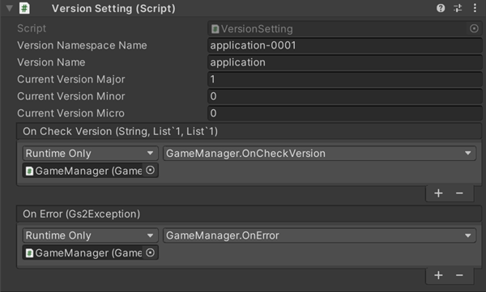
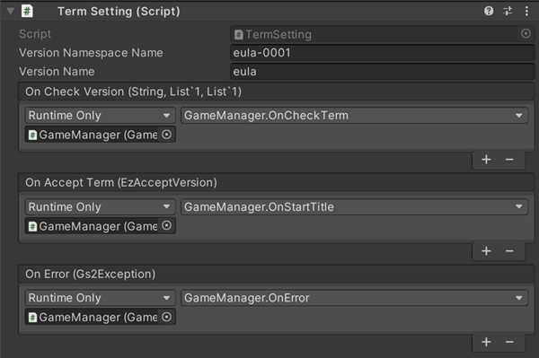

# バージョンチェック　解説

[GS2-Version](https://app.gs2.io/docs/index.html#gs2-version) を使ってアプリ起動時のバージョンチェック、利用規約のユーザー承諾確認をおこなうサンプルです。  

## GS2-Deploy テンプレート

- [initialize_version_template.yaml - アプリバージョンチェック](../Templates/initialize_version_template.yaml)
- [initialize_term_template.yaml - 利用規約チェック](../Templates/initialize_term_template.yaml)

## バージョン設定 VersionSetting



| 設定名 | 説明 |
---|---
| versionNamespaceName | GS2-Version のアプリバージョンチェックのネームスペース名 |
| versionName | GS2-Version のアプリバージョンチェックのバージョン名 |
| currentVersionMajor | アプリの現在のバージョン番号　メジャー部分 |
| currentVersionMinor | アプリの現在のバージョン番号　マイナー部分 |
| currentVersionMicro | アプリの現在のバージョン番号　マイクロ部分 |

| イベント | 説明 |
---|---
| onCheckVersion | バージョンのチェックを実行した結果を取得したときに呼び出されます。 |
| OnError(Gs2Exception error) | エラーが発生したときに呼び出されます。 |

## 利用規約設定 TermSetting



| 設定名 | 説明 |
---|---
| versionNamespaceName | GS2-Version の利用規約チェックのネームスペース名 |
| versionName | GS2-Version の利用規約チェックのバージョン名 |

| イベント | 説明 |
---|---
| onCheckVersion | 利用規約のバージョンのチェックを実行した結果を取得したときに呼び出されます。 |
| OnError(Gs2Exception error) | エラーが発生したときに呼び出されます。 |

## バージョンチェック機能の有効化

リポジトリから取得時のプロジェクトファイルでは、「アプリ起動」後のアプリのバージョンチェック処理、  
利用規約の確認処理は無効化されています。  
有効にするには、ヒエラルキーの `GameManager` オブジェクト ⇒ `GameManager` コンポーネント の  
以下のチェックをそれぞれ外してください。


## バージョンチェックの流れ

現在のアプリのバージョンとサーバ側のマスターデータに設定されているバージョンを  
それぞれ比較します。  
`warningVersion` バージョンアップを促すバージョンより古いバージョンであればWarning、  
`errorVersion` バージョンアップを必須とするバージョンより古いバージョンであればErrorとして  
結果を返します。 

Errorの場合はアプリケーションのバージョンアップを促す表示を行い、  
配信プラットフォームへの誘導等を行います。

```c#
EzVersion version = new EzVersion();
version.Major = 0;
version.Minor = 0;
version.Micro = 0;
targetVersion.Version = version;
targetVersion.VersionName = versionName;
targetVersions.Add(targetVersion);

yield return client.Version.CheckVersion(
    r =>
    {
        result = r;
    },
    session,    // GameSession ログイン状態を表すセッションオブジェクト
    versionNamespaceName,   //  ネームスペース名
    targetVersions
);
```

## 利用規約確認チェックの流れ

サーバ側のマスターデータに設定されている規約のバージョンと承認済みのバージョンを比較し  
未承認のバージョンをErrorsとWarningsに結果として返します。  

```c#
yield return client.Version.CheckVersion(
    r =>
    {
        result = r;
    },
    session,    // GameSession ログイン状態を表すセッションオブジェクト
    versionNamespaceName,   //  ネームスペース名
    targetVersions
);
```

ユーザーに利用規約の表示を行い、承諾を得た上で、承認されたことをサーバに送信します。  
そのユーザーの承認済みのバージョンとしてサーバに保存されます。

```c#
AsyncResult<EzAcceptResult> result = null;
var current = client.Version.Accept(
    r =>
    {
        result = r;
    },
    session,
    namespaceName: versionNamespaceName,
    versionName: versionName
);
```