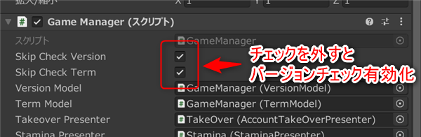

# バージョンチェック　解説

[GS2-Version](https://app.gs2.io/docs/index.html#gs2-version) を使ってアプリ起動時のバージョンチェック、利用規約のユーザー承諾確認をおこなうサンプルです。  

## GS2-Deploy テンプレート

- [initialize_version_template.yaml - アプリバージョンチェック/利用規約チェック](../Templates/initialize_version_template.yaml)

## バージョン設定 VersionSetting


| 設定名 | 説明 |
---|---
| versionNamespaceName | GS2-Version のアプリバージョンチェックのネームスペース名 |
| versionName | GS2-Version のアプリバージョンチェックのバージョン名 |
| currentVersionMajor | アプリの現在のバージョン番号　メジャー部分 |
| currentVersionMinor | アプリの現在のバージョン番号　マイナー部分 |
| currentVersionMicro | アプリの現在のバージョン番号　マイクロ部分 |

| イベント | 説明 |
---|---
| onCheckVersion | バージョンのチェックを実行した結果を取得したときに呼び出されます。 |
| OnError(Gs2Exception error) | エラーが発生したときに呼び出されます。 |

## 利用規約設定 TermSetting


| 設定名 | 説明 |
---|---
| versionNamespaceName | GS2-Version の利用規約チェックのネームスペース名 |
| versionName | GS2-Version の利用規約チェックのバージョン名 |

| イベント | 説明 |
---|---
| onCheckVersion | 利用規約のバージョンのチェックを実行した結果を取得したときに呼び出されます。 |
| OnError(Gs2Exception error) | エラーが発生したときに呼び出されます。 |

## バージョンチェック機能の有効化

リポジトリから取得時のプロジェクトファイルでは、「アプリ起動」後のアプリのバージョンチェック処理、  
利用規約の確認処理は無効化されています。  
有効にするには、ヒエラルキーの `GameManager` オブジェクト ⇒ `GameManager` コンポーネント の  
以下のチェックをそれぞれ外してください。



## バージョンチェックの流れ

現在のアプリのバージョンとGS2-Version側のマスターデータに設定されているバージョンを  
それぞれ比較します。  
`warningVersion` バージョンアップを促すバージョンより古いバージョンであればWarning、  
`errorVersion` バージョンアップを必須とするバージョンより古いバージョンであればErrorとして  
結果を返します。 

Errorの場合はアプリケーションのバージョンアップを促す表示を行い、  
配信プラットフォームへの誘導等を行います。

・UniTask有効時
```c#
List<EzTargetVersion> targetVersions = new List<EzTargetVersion>();
EzTargetVersion targetVersion = new EzTargetVersion();
targetVersion.VersionName = versionName;

EzVersion version = new EzVersion();
version.Major = 0;
version.Minor = 0;
version.Micro = 0;
targetVersion.Version = version;
targetVersions.Add(targetVersion);

var domain = gs2.Version.Namespace(
    namespaceName: versionNamespaceName
).Me(
    gameSession: gameSession
).Checker();
try
{
    var result = await domain.CheckVersionAsync(
        targetVersions: targetVersions.ToArray()
    );
    
    var projectToken = result.ProjectToken;
    var warnings = result.Warnings;
    var errors = result.Errors;

    onCheckVersion.Invoke(projectToken, warnings.ToList(), errors.ToList());
}
catch (Gs2Exception e)
{
    onError.Invoke(e);
}
```
・コルーチン使用時
```c#
List<EzTargetVersion> targetVersions = new List<EzTargetVersion>();
EzTargetVersion targetVersion = new EzTargetVersion();
targetVersion.VersionName = versionName;

EzVersion version = new EzVersion();
version.Major = major;
version.Minor = minor;
version.Micro = micro;
targetVersion.Version = version;
targetVersions.Add(targetVersion);

var domain = gs2.Version.Namespace(
    namespaceName: versionNamespaceName
).Me(
    gameSession: gameSession
).Checker();
var future = domain.CheckVersion(
    targetVersions: targetVersions.ToArray()
);
yield return future;
if (future.Error != null)
{
    onError.Invoke(
        future.Error
    );
    yield break;
}

var projectToken = future.Result.ProjectToken;
var warnings = future.Result.Warnings;
var errors = future.Result.Errors;

onCheckVersion.Invoke(projectToken, warnings.ToList(), errors.ToList());
```

## 利用規約確認チェックの流れ

GS2-Version側のマスターデータに設定されている規約のバージョンと承認済みのバージョンを比較し  
未承認のバージョンをErrorsとWarningsに結果として返します。  

・UniTask有効時
```c#
List<EzTargetVersion> targetVersions = new List<EzTargetVersion>();
EzTargetVersion targetVersion = new EzTargetVersion();
targetVersion.VersionName = versionName;

EzVersion version = new EzVersion();
version.Major = 0;
version.Minor = 0;
version.Micro = 0;
targetVersion.Version = version;
targetVersions.Add(targetVersion);

var domain = gs2.Version.Namespace(
    namespaceName: versionNamespaceName
).Me(
    gameSession: gameSession
).Checker();
try
{
    var result = await domain.CheckVersionAsync(
        targetVersions: targetVersions.ToArray()
    );
    
    var projectToken = result.ProjectToken;
    var warnings = result.Warnings;
    var errors = result.Errors;

    onCheckVersion.Invoke(projectToken, warnings.ToList(), errors.ToList());
}
catch (Gs2Exception e)
{
    onError.Invoke(e);
}
```
・コルーチン使用時
```c#
List<EzTargetVersion> targetVersions = new List<EzTargetVersion>();
EzTargetVersion targetVersion = new EzTargetVersion();
targetVersion.VersionName = versionName;

EzVersion version = new EzVersion();
version.Major = 0;
version.Minor = 0;
version.Micro = 0;
targetVersion.Version = version;
targetVersions.Add(targetVersion);

var domain = gs2.Version.Namespace(
    namespaceName: versionNamespaceName
).Me(
    gameSession: gameSession
).Checker();
var future = domain.CheckVersion(
    targetVersions: targetVersions.ToArray()
);
yield return future;
if (future.Error != null)
{
    onError.Invoke(
        future.Error
    );
    yield break;
}

var projectToken = future.Result.ProjectToken;
var warnings = future.Result.Warnings;
var errors = future.Result.Errors;

onCheckVersion.Invoke(projectToken, warnings.ToList(), errors.ToList());
```
ユーザーに利用規約の表示を行い承諾を得た上で、利用規約が承認されたことをGS2-Versionに送信します。  
そのユーザーの承認済みの利用規約バージョンとしてGS2-Versionに保存されます。

・UniTask有効時
```c#
var domain = gs2.Version.Namespace(
    namespaceName: versionNamespaceName
).Me(
    gameSession: gameSession
).AcceptVersion(
    versionName: versionName
);
try
{
    var result = await domain.AcceptAsync();
    var item = await result.ModelAsync();
    
    onAcceptTerm.Invoke(item);
}
catch (Gs2Exception e)
{
    onError.Invoke(e);
}
```
・コルーチン使用時
```c#
var domain = gs2.Version.Namespace(
    namespaceName: versionNamespaceName
).Me(
    gameSession: gameSession
).AcceptVersion(
    versionName: versionName
);
var future = domain.Accept();
yield return future;
if (future.Error != null)
{
    onError.Invoke(
        future.Error
    );
    yield break;
}

var future2 = future.Result.Model();
yield return future2;
if (future2.Error != null)
{
    onError.Invoke(
        future2.Error
    );
    yield break;
}

var item = future2.Result;

onAcceptTerm.Invoke(item);
```