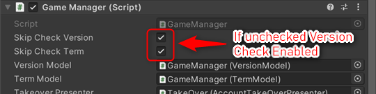

# Version Check Explanation

This sample uses [GS2-Version](https://app.gs2.io/docs/en/index.html#gs2-version) to check the version of an application when it is launched and to confirm user acceptance of the Terms of Use.

## GS2-Deploy template

- [initialize_version_template.yaml - app version check/Terms of Service Check](../Templates/initialize_version_template.yaml)

## VersionSetting VersionSetting


| Setting Name | Description |
---|---
| versionNamespaceName | Namespace name for GS2-Version app version check
| versionName | Version name of the app version check for GS2-Version
| currentVersionMajor | current version number of the app Major part |
| currentVersionMinor | current version number of the app Minor part |
| currentVersionMicro | current version number of the app Micro part |

| Event | Description |
---|---
| onCheckVersion | Called when the result of performing a version check is retrieved. | onCheckVersion
| OnError(Gs2Exception error) | Called when an error occurs. | OnError(Gs2Exception error)

## Terms of Service Setting TermSetting


| Setting Name | Description |
---|---
| versionNamespaceName | Namespace Name of GS2-Version's Terms of Use Check
| versionName | version name of GS2-Version's Terms of Use check

| Event | Description |
---|---
| onCheckVersion | Called when the result of performing a version check of the Terms of Use is obtained. | onCheckVersion
| OnError(Gs2Exception error) | Called when an error occurs. | OnError(Gs2Exception error)

## Enable version checking functionality

In the project file at the time of acquisition from the repository, the version check process of the application after "application startup", the  
The Terms of Use confirmation process is disabled.  
To enable it, you need to change the  
Uncheck each of the following



## Version check flow

The current version of the app and the version set in the master data on the server side  
Compare each.  
If the version is older than the `warningVersion` that prompts the user to upgrade to the next version, it returns a Warning.  
`errorVersion` If the version is older than the version that requires  
Returns the result.

In the case of an Error, the application will prompt the user to upgrade the version of the application and  
Guidance to the distribution platform, etc.

When UniTask is enabled
```c#
List<EzTargetVersion> targetVersions = new List<EzTargetVersion>();
EzTargetVersion targetVersion = new EzTargetVersion();
targetVersion.VersionName = versionName;

EzVersion version = new EzVersion();
version.Major = 0;
version.Minor = 0;
version.Micro = 0;
targetVersion.Version = version;
targetVersions.Add(targetVersion);

var domain = gs2.Version.Namespace(
    namespaceName: versionNamespaceName
).Me(
    gameSession: gameSession
).Checker();
try
{
    var result = await domain.CheckVersionAsync(
        targetVersions: targetVersions.ToArray()
    );
    
    var projectToken = result.ProjectToken;
    var warnings = result.Warnings;
    var errors = result.Errors;

    onCheckVersion.Invoke(projectToken, warnings.ToList(), errors.ToList());
}
catch (Gs2Exception e)
{
    onError.Invoke(e);
}
```
When coroutine is used
```c#
List<EzTargetVersion> targetVersions = new List<EzTargetVersion>();
EzTargetVersion targetVersion = new EzTargetVersion();
targetVersion.VersionName = versionName;

EzVersion version = new EzVersion();
version.Major = major;
version.Minor = minor;
version.Micro = micro;
targetVersion.Version = version;
targetVersions.Add(targetVersion);

var domain = gs2.Version.Namespace(
    namespaceName: versionNamespaceName
).Me(
    gameSession: gameSession
).Checker();
var future = domain.CheckVersionFuture(
    targetVersions: targetVersions.ToArray()
);
yield return future;
if (future.Error != null)
{
    onError.Invoke(
        future.Error
    );
    yield break;
}

var projectToken = future.Result.ProjectToken;
var warnings = future.Result.Warnings;
var errors = future.Result.Errors;

onCheckVersion.Invoke(projectToken, warnings.ToList(), errors.ToList());
```

## Flow of Terms of Use Confirmation Check

Compares the version of the agreement set in the master data on the server side with the approved version  
Unapproved versions are returned as results in Errors and Warnings.

When UniTask is enabled
```c#
List<EzTargetVersion> targetVersions = new List<EzTargetVersion>();
EzTargetVersion targetVersion = new EzTargetVersion();
targetVersion.VersionName = versionName;

EzVersion version = new EzVersion();
version.Major = 0;
version.Minor = 0;
version.Micro = 0;
targetVersion.Version = version;
targetVersions.Add(targetVersion);

var domain = gs2.Version.Namespace(
    namespaceName: versionNamespaceName
).Me(
    gameSession: gameSession
).Checker();
try
{
    var result = await domain.CheckVersionAsync(
        targetVersions: targetVersions.ToArray()
    );
    
    var projectToken = result.ProjectToken;
    var warnings = result.Warnings;
    var errors = result.Errors;

    onCheckVersion.Invoke(projectToken, warnings.ToList(), errors.ToList());
}
catch (Gs2Exception e)
{
    onError.Invoke(e);
}
```
When coroutine is used
```c#
List<EzTargetVersion> targetVersions = new List<EzTargetVersion>();
EzTargetVersion targetVersion = new EzTargetVersion();
targetVersion.VersionName = versionName;

EzVersion version = new EzVersion();
version.Major = 0;
version.Minor = 0;
version.Micro = 0;
targetVersion.Version = version;
targetVersions.Add(targetVersion);

var domain = gs2.Version.Namespace(
    namespaceName: versionNamespaceName
).Me(
    gameSession: gameSession
).Checker();
var future = domain.CheckVersionFuture(
    targetVersions: targetVersions.ToArray()
);
yield return future;
if (future.Error != null)
{
    onError.Invoke(
        future.Error
    );
    yield break;
}

var projectToken = future.Result.ProjectToken;
var warnings = future.Result.Warnings;
var errors = future.Result.Errors;

onCheckVersion.Invoke(projectToken, warnings.ToList(), errors.ToList());
```
Display the terms of use to the user, obtain his/her consent, and send the approval to the server.  
It is stored on the server as the approved version for that user.

When UniTask is enabled
```c#
var domain = gs2.Version.Namespace(
    namespaceName: versionNamespaceName
).Me(
    gameSession: gameSession
).AcceptVersion(
    versionName: versionName
);
try
{
    var result = await domain.AcceptAsync();
    var item = await result.ModelAsync();
    
    onAcceptTerm.Invoke(item);
}
catch (Gs2Exception e)
{
    onError.Invoke(e);
}
```
When coroutine is used
```c#
var domain = gs2.Version.Namespace(
    namespaceName: versionNamespaceName
).Me(
    gameSession: gameSession
).AcceptVersion(
    versionName: versionName
);
var future = domain.AcceptFuture();
yield return future;
if (future.Error != null)
{
    onError.Invoke(
        future.Error
    );
    yield break;
}

var future2 = future.Result.ModelFuture();
yield return future2;
if (future2.Error != null)
{
    onError.Invoke(
        future2.Error
    );
    yield break;
}

var item = future2.Result;

onAcceptTerm.Invoke(item);
```