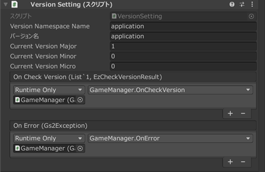
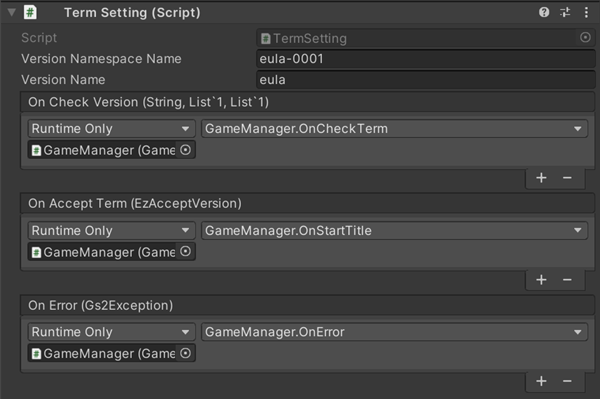

# 버전 체크 해설

[GS2-Version](https://docs.gs2.io/ko/api_reference/version/) 을 사용하여 앱 실행 시의 버전 체크와 이용약관의 사용자 승낙 확인을 수행하는 샘플입니다.  

## GS2-Deploy 템플릿

- [initialize_option_template.yaml - 앱 버전 체크/이용약관 체크](../Templates/initialize_option_template.yaml)

## 버전 설정 VersionSetting



| 설정 이름 | 설명 |
---|---
| versionNamespaceName | GS2-Version 의 앱 버전 체크의 네임스페이스 이름 |
| versionName | GS2-Version 의 앱 버전 체크의 버전 이름 |
| currentVersionMajor | 앱의 현재 버전 번호　메이저 부분 |
| currentVersionMinor | 앱의 현재 버전 번호　마이너 부분 |
| currentVersionMicro | 앱의 현재 버전 번호　마이크로 부분 |

| 이벤트 | 설명 |
---|---
| onCheckVersion | 버전의 체크를 실행한 결과를 가져왔을 때 호출됩니다. |
| OnError(Gs2Exception error) | 오류가 발생했을 때 호출됩니다. |

## 이용약관 설정 TermSetting



| 설정 이름 | 설명 |
---|---
| versionNamespaceName | GS2-Version 의 이용약관 체크의 네임스페이스 이름 |
| versionName | GS2-Version 의 이용약관 체크의 버전 이름 |

| 이벤트 | 설명 |
---|---
| onCheckVersion | 이용약관의 버전 체크를 실행한 결과를 가져왔을 때 호출됩니다. |
| OnError(Gs2Exception error) | 오류가 발생했을 때 호출됩니다. |

## 버전 체크 기능의 활성화

리포지토리에서 가져온 시점의 프로젝트 파일에서는, 「앱 실행」 후의 앱 버전 체크 처리와  
이용약관의 확인 처리가 비활성화되어 있습니다.  
활성화하려면 하이어라키의 `GameManager` 오브젝트 ⇒ `GameManager` 컴포넌트의  
아래 체크를 각각 해제해 주세요.


## 버전 체크의 흐름

현재 앱의 버전과 GS2-Version 쪽 마스터 데이터에 설정된 버전을  
각각 비교합니다.  
`warningVersion` 버전 업을 권장하는 버전보다 오래된 버전이면 Warning,  
`errorVersion` 버전 업을 필수로 하는 버전보다 오래된 버전이면 Error 로  
결과를 반환합니다. 

Error 인 경우에는 애플리케이션의 버전 업을 권장하는 표시를 하고,  
배포 플랫폼으로의 유도 등을 수행합니다.

UniTask 활성화 시
```c#
List<EzTargetVersion> targetVersions = new List<EzTargetVersion>();
EzTargetVersion targetVersion = new EzTargetVersion();
targetVersion.VersionName = versionName;

EzVersion version = new EzVersion();
version.Major = 0;
version.Minor = 0;
version.Micro = 0;
targetVersion.Version = version;
targetVersions.Add(targetVersion);

var domain = gs2.Version.Namespace(
    namespaceName: versionNamespaceName
).Me(
    gameSession: gameSession
).Checker();
try
{
    var result = await domain.CheckVersionAsync(
        targetVersions: targetVersions.ToArray()
    );
    
    var projectToken = result.ProjectToken;
    var warnings = result.Warnings;
    var errors = result.Errors;

    onCheckVersion.Invoke(projectToken, warnings.ToList(), errors.ToList());
}
catch (Gs2Exception e)
{
    onError.Invoke(e);
}
```
코루틴 사용 시
```c#
List<EzTargetVersion> targetVersions = new List<EzTargetVersion>();
EzTargetVersion targetVersion = new EzTargetVersion();
targetVersion.VersionName = versionName;

EzVersion version = new EzVersion();
version.Major = major;
version.Minor = minor;
version.Micro = micro;
targetVersion.Version = version;
targetVersions.Add(targetVersion);

var domain = gs2.Version.Namespace(
    namespaceName: versionNamespaceName
).Me(
    gameSession: gameSession
).Checker();
var future = domain.CheckVersionFuture(
    targetVersions: targetVersions.ToArray()
);
yield return future;
if (future.Error != null)
{
    onError.Invoke(
        future.Error
    );
    yield break;
}

var projectToken = future.Result.ProjectToken;
var warnings = future.Result.Warnings;
var errors = future.Result.Errors;

onCheckVersion.Invoke(projectToken, warnings.ToList(), errors.ToList());
```

## 이용약관 확인 체크의 흐름

GS2-Version 쪽 마스터 데이터에 설정된 약관의 버전과 승인된 버전을 비교하여  
미승인 버전을 Errors 와 Warnings 로 결과로 반환합니다.  

UniTask 활성화 시
```c#
List<EzTargetVersion> targetVersions = new List<EzTargetVersion>();
EzTargetVersion targetVersion = new EzTargetVersion();
targetVersion.VersionName = versionName;

EzVersion version = new EzVersion();
version.Major = 0;
version.Minor = 0;
version.Micro = 0;
targetVersion.Version = version;
targetVersions.Add(targetVersion);

var domain = gs2.Version.Namespace(
    namespaceName: versionNamespaceName
).Me(
    gameSession: gameSession
).Checker();
try
{
    var result = await domain.CheckVersionAsync(
        targetVersions: targetVersions.ToArray()
    );
    
    var projectToken = result.ProjectToken;
    var warnings = result.Warnings;
    var errors = result.Errors;

    onCheckVersion.Invoke(projectToken, warnings.ToList(), errors.ToList());
}
catch (Gs2Exception e)
{
    onError.Invoke(e);
}
```
코루틴 사용 시
```c#
List<EzTargetVersion> targetVersions = new List<EzTargetVersion>();
EzTargetVersion targetVersion = new EzTargetVersion();
targetVersion.VersionName = versionName;

EzVersion version = new EzVersion();
version.Major = 0;
version.Minor = 0;
version.Micro = 0;
targetVersion.Version = version;
targetVersions.Add(targetVersion);

var domain = gs2.Version.Namespace(
    namespaceName: versionNamespaceName
).Me(
    gameSession: gameSession
).Checker();
var future = domain.CheckVersionFuture(
    targetVersions: targetVersions.ToArray()
);
yield return future;
if (future.Error != null)
{
    onError.Invoke(
        future.Error
    );
    yield break;
}

var projectToken = future.Result.ProjectToken;
var warnings = future.Result.Warnings;
var errors = future.Result.Errors;

onCheckVersion.Invoke(projectToken, warnings.ToList(), errors.ToList());
```
사용자에게 이용약관을 표시하고 승낙을 받은 다음, 이용약관이 승인되었음을 GS2-Version 에 전송합니다.  
해당 사용자의 승인된 이용약관 버전으로서 GS2-Version 에 저장됩니다.

UniTask 활성화 시
```c#
var domain = gs2.Version.Namespace(
    namespaceName: versionNamespaceName
).Me(
    gameSession: gameSession
).AcceptVersion(
    versionName: versionName
);
try
{
    var result = await domain.AcceptAsync();
    var item = await result.ModelAsync();
    
    onAcceptTerm.Invoke(item);
}
catch (Gs2Exception e)
{
    onError.Invoke(e);
}
```
코루틴 사용 시
```c#
var domain = gs2.Version.Namespace(
    namespaceName: versionNamespaceName
).Me(
    gameSession: gameSession
).AcceptVersion(
    versionName: versionName
);
var future = domain.AcceptFuture();
yield return future;
if (future.Error != null)
{
    onError.Invoke(
        future.Error
    );
    yield break;
}

var future2 = future.Result.ModelFuture();
yield return future2;
if (future2.Error != null)
{
    onError.Invoke(
        future2.Error
    );
    yield break;
}

var item = future2.Result;

onAcceptTerm.Invoke(item);
```
