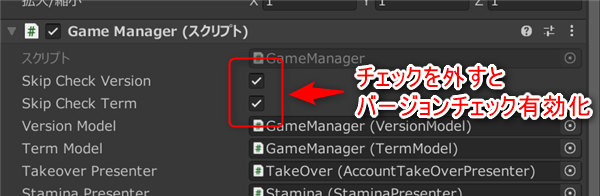
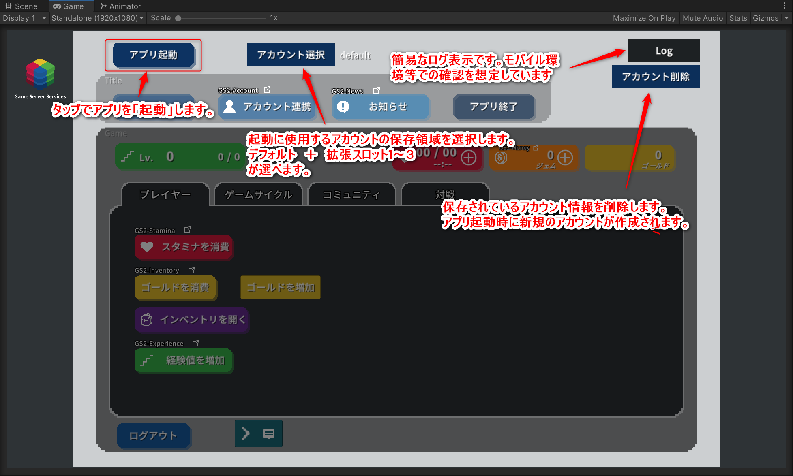
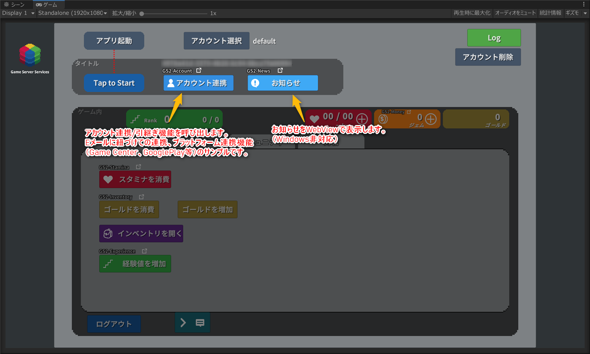
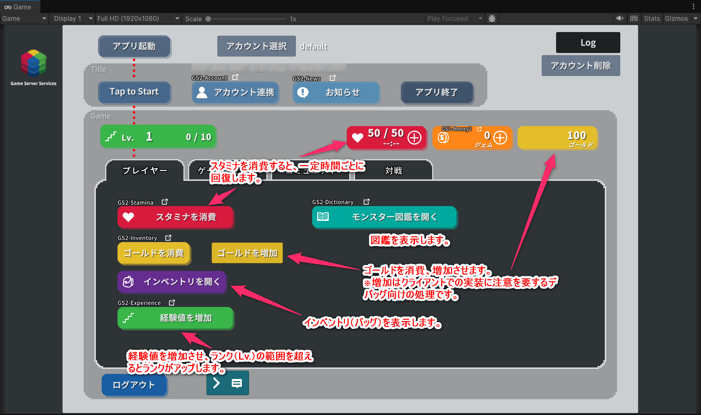
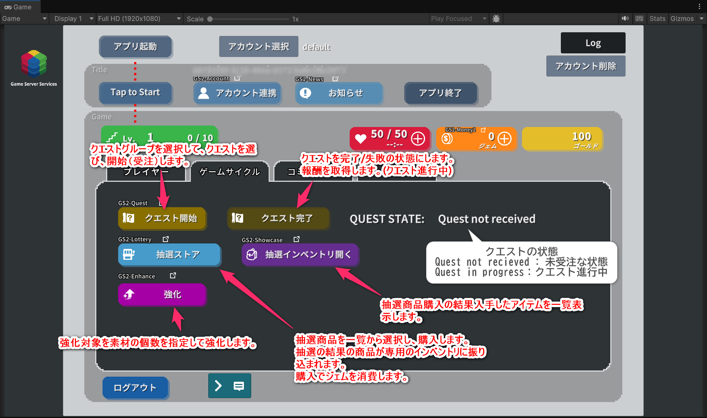
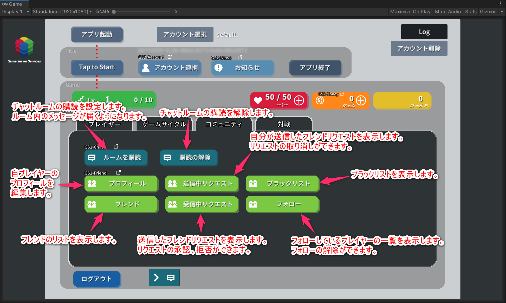
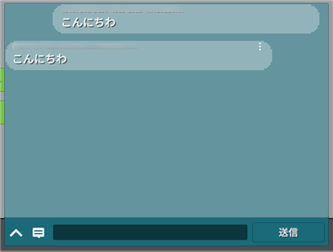
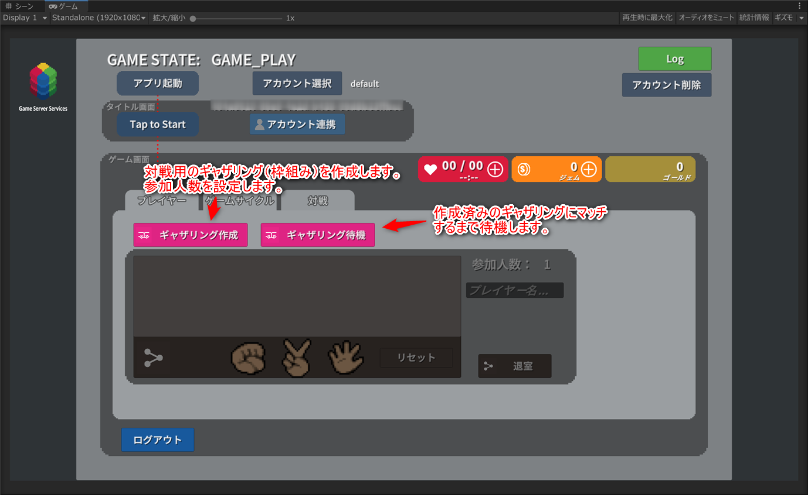

[⇒README in English](README.md) / [⇒README in Korean](README-ko.md)

# GS2 Sample Project for Unity

Game Server Services (https://gs2.io) の Unity 向けのサンプルプロジェクトです。  
ゲームでの大まかな流れを想定した GS2の各種機能を使った実装サンプルです。

## 動作環境

Unity 6000.6.0f1

GS2 C# SDK 2026.9.2  
GS2 SDK for Unity 2026.9.1  
Unity IAP (com.unity.purchasing) 5.4.3  

## 注意事項

- サンプルに含まれるmanifest.json、packages-lock.jsonファイルには、  
GS2のSDKのほか、Unity 6000.6上での動作に必要なパッケージの記述が含まれます。  
上記以外のUnityバージョンでプロジェクトを開くと、  
エラーが発生しパッケージのバージョン変更が必要になる場合があります。  
その場合は、パッケージマネージャーで検証済みバージョンをインストールすることで動作可能になります。  

- TextMeshPro用の日本語/韓国語フォントに  
 「Noto Sans Japanese」（ https://fonts.google.com/noto/specimen/Noto+Sans+JP ）  
 「Noto Sans Korean」（ https://fonts.google.com/noto/specimen/Noto+Sans+KR ）  
を使用しています。  
Licensed under SIL Open Font License 1.1 ( http://scripts.sil.org/OFL )  

## 機能別の解説

各機能を単独で動作させる方法、機能の詳細については以下のページで個別に解説しています。

- [アカウントの作成・ログイン 解説 (GS2-Account / GS2-Auth / GS2-Gateway)](Docs/Login.md)
- [バージョンチェック 解説 (GS2-Version)](Docs/Version.md)
- [アカウント引継ぎ 解説 (GS2-Account)](Docs/Takeover.md)
- [お知らせ 解説 (GS2-News)](Docs/News.md)
- [スタミナ/スタミナストア 解説 (GS2-Stamina)](Docs/Stamina.md)
- [課金通貨/課金通貨ストア 解説 (GS2-Money2 / GS2-Showcase)](Docs/Money.md)
- [ゴールド/インベントリ 解説 (GS2-Inventory)](Docs/Inventory.md)
- [経験値 解説 (GS2-Experience)](Docs/Experience.md)
- [クエスト 解説 (GS2-Quest)](Docs/Quest.md)
- [抽選機能 解説 (GS2-Lottery)](Docs/Lottery.md)
- [図鑑 解説 (GS2-Dictionary)](Docs/Dictionary.md)
- [強化 解説 (GS2-Enhance)](Docs/Enhance.md)
- [チャット 解説 (GS2-Chat)](Docs/Chat.md)
- [フレンド 解説 (GS2-Friend)](Docs/Friend.md)
- [マッチメイキング 解説 (GS2-Matchmaking)](Docs/Matchmaking.md)
- [リアルタイム対戦 解説 (GS2-Realtime)](Docs/Realtime.md)

## 起動の準備

ここではUnity Editor上でPlayボタンでゲームを再生するまでの準備について扱います。

### Unity でプロジェクトを開く

Unityで`gs2io/gs2-sample-project` をプロジェクトとして開きます。  
Unity Package Manager により、依存関係の解決に必要なパッケージのダウンロードが行われます。  
GS2 SDK for Unity、GS2 C# SDKのダウンロード、インストールが行われます。

Textの描画にTextMeshProを使用しています。  
TextMeshPro の必須リソース（TMP Essential Resources）は Unity 同梱のアセットのため
このリポジトリには含めておらず、プロジェクトを開いた際に自動でインポートされます。  
Console に次のログが出れば完了です。

```
[GS2 Sample] Importing the TMP Essential Resources...
[GS2 Sample] Registered NotoSansKR-Medium SDF in the Fallback Font Assets of TMP Settings.
```

自動でインポートされない場合は `Window > TextMeshPro > Import TMP Essential Resources` を  
実行してください。インポートせずにシーンを開くと、TextMeshPro が  
NullReferenceException を出してテキストが表示されません。

Assets/Scenes/SampleGameScene.unity シーンを開きます。

### 韓国語フォントの設定

日本語フォントにはハングルの字形が含まれないため、韓国語を表示するには
TextMeshPro のフォント Fallback の設定が必要です。  
この設定も、上記の TMP Essential Resources のインポートに続けて自動でおこなわれます。  
`Assets/Editor/Gs2SampleKoreanFontSetup.cs` が __Fallback Font Assets__ に  
`Assets/Resources/Fonts/NotoSansKR-Medium SDF` を登録します。

自動で設定されなかった場合は、次のどちらかをおこなってください。

- メニューの `GS2 Sample > Setup Korean Font Fallback` を実行する
- `Edit > Project Settings > TextMesh Pro > Settings` を開き、  
  __Fallback Font Assets__ に `Assets/Resources/Fonts/NotoSansKR-Medium SDF` を追加する

設定されていない場合、言語を韓国語に切り替えるとハングルが表示されません。  
日本語・英語のみで動作を確認する場合は影響ありません。

### GS2-Deploy を使って初期設定をおこなう

[マネージメントコンソール](https://app.gs2.io/)のDeploy機能を使ってスタックの作成を行い、  
サンプルの動作に必要なリソースの準備を行います。

Templatesフォルダの以下のファイルでスタックを作成します。  
テンプレートは画面下部の __4つのタブ__ と、タブに属さない機能の単位でまとめてあります。  
後のテンプレートが前のテンプレートで作成したネームスペースを参照するため、__上から順に__ 作成してください。  

| # | テンプレートファイル | 設定する機能 | 対応するタブ | 依存 |
---|---|---|---|---
1 | [initialize_core_template.yaml](Templates/initialize_core_template.yaml) | ログイン/アカウント連携・引継ぎ、課金通貨/課金通貨ストア | タブ外（ステータスバー） | ― （必須）
2 | [initialize_player_template.yaml](Templates/initialize_player_template.yaml) | スタミナ/スタミナストア、ゴールド、インベントリ、経験値、図鑑 | プレイヤー | 1
3 | [initialize_gamecycle_template.yaml](Templates/initialize_gamecycle_template.yaml) | クエスト、抽選機能（抽選アイテム用インベントリを含む）、強化 | ゲームサイクル | 1, 2
4 | [initialize_community_template.yaml](Templates/initialize_community_template.yaml) | チャット、フレンド機能 | コミュニティ | 1
5 | [initialize_match_template.yaml](Templates/initialize_match_template.yaml) | マッチメイキング/リアルタイム対戦 | 対戦 | 1
6 | [initialize_option_template.yaml](Templates/initialize_option_template.yaml) | お知らせ、アプリバージョン・利用規約チェック ※使用する場合に作成 | タブ外 | 1

1 の initialize_core_template.yaml は必須です。  
2〜6 は使用する機能のスタックだけを作成しても構いませんが、依存するスタックは先に作成してください。  

※ 以前のバージョンのサンプル（機能ごとに 16 個のテンプレートに分かれていたもの）で  
スタックを作成済みの場合は、__先に古いスタックをすべて削除してください。__  
ネームスペース名は変更していないため、古いスタックが残っていると同名のリソースの作成に失敗します。  
（Unity 側の `Gs2Settings` の設定値は変更不要です）  

```
core ─┬─ player ─── gamecycle
      ├─ community
      ├─ match
      └─ option
```

テンプレートをまたぐ参照は以下の 3 つです。  

| 参照する側 | 参照されるリソース |
---|---
player | スタミナストアが課金通貨 `money2-0001` を消費します（core）
gamecycle | クエストの対価がスタミナ `stamina-0001` を消費し、報酬が経験値 `experience-0001` を付与します（player）
gamecycle | クエストの報酬と抽選の対価が課金通貨 `money2-0001` を使用します（core）

※ 以下のリソースは、プロジェクトの作成時に `Default` という名前のスタックとして  
自動的に作成されるため、テンプレートで作成する必要はありません。  

| 自動で作成されるリソース | 用途 |
---|---
GS2-Identifier ユーザ `default` とクライアントID/シークレット | GS2 へのアクセスに使用するクレデンシャル
GS2-Key ネームスペース `default` / 暗号鍵 `default` | 署名計算に使用
GS2-Gateway ネームスペース `default` | 通知の受信に使用（チャット・フレンド・マッチメイキングの通知、自動実行の完了通知）
GS2-Distributor ネームスペース `default` | スタンプシート・トランザクションの自動実行に使用
GS2-JobQueue ネームスペース `default` | ジョブの自動実行に使用（自動実行が有効な状態で作成されます）

しばらく待ってすべてのスタックの状態が `作成完了` になればサーバ側の設定は完了です。

### Unity IAPの有効化、インポート

実機（AppStore / GooglePlay）での課金を行う場合は、Unity IAPの有効化が必要になります。  

[Unity IAP の設定](https://docs.unity3d.com/ja/current/Manual/UnityIAPSettingUp.html)

サービスウィンドウでのIn-App Purchasingの有効化、  
IAP パッケージのインポートを行います。  
（本サンプルはフェイクレシートでも動作するため、IAP無効のままでも購入フローを確認できます。）  
Unity IAP 5.x では、レシート検証の完了後に購入を確定する処理が必要になります。  
詳細は [課金通貨／課金通貨ストア](Docs/Money.md) を参照してください。  

### Settings の設定

ヒエラルキーウィンドウで `Gs2Settings`オブジェクト を選択します。

インスペクターウィンドウで GS2-Deploy で作成したリソースの情報を登録します。  
ダウンロード時は空欄になっている、以下の __太字__ の項目に、  
各スタックの「アウトプット」より必要な情報をコピー・アンド・ペーストします。


| スクリプトファイル | 設定名 | 説明                                                                   |
-----------------|------|------------------------------------------------------------------------
| __CredentialSetting__ | __Application Client Id__ | __GS2 にアクセスするためのクレデンシャル（クライアントID）__           |
| __CredentialSetting__ | __Application Client Secret__ | __GS2 にアクセスするためのクレデンシャル（クライアントシークレット）__ |
| CredentialSetting | distributorNamespaceName | トランザクション処理をおこなう GS2-Distributor のネームスペース名      |

※ プロジェクト作成時に自動で作成される __Default__ スタックの アウトプットリスト タブから  
アウトプット名　__ApplicationClientId__　の項目の右側に出力されている値を　__Application Client Id__　へ貼り付けます。  
アウトプット名　__ApplicationClientSecret__　の項目の右側に出力されている値を　__Application Client Secret__　へ貼り付けます。  


| スクリプトファイル | 設定名                           | 説明 |
-----------------|-------------------------------|------
| LoginSetting | Account Namespace Name        | GS2-Account のネームスペース名 |
| __LoginSetting__ | __Account Encryption Key Id__ | __GS2-Account でアカウント情報の暗号化に使用する GS2-Key の暗号鍵GRN__ |
| LoginSetting | Gateway Namespace Name        | GS2-Gateway のネームスペース名（自動で作成される `default` を使用します） |

※__initialize_core_template.yaml__ テンプレートで作成したスタックの アウトプットリスト タブから  
アウトプット名　__AccountEncryptionKeyId__　の項目の右側に出力されている値を　__Account Encryption Key Id__　へ貼り付けます。

### バージョンチェック機能の有効化

デフォルトでは「アプリ起動」後にアプリバージョンチェック、利用規約のチェック機能は無効化されています。
有効にするには、ヒエラルキーのGameManager → GameManagerコンポーネントの以下のチェックをそれぞれ外します。



設定が完了したら、Unity上での起動の準備は完了です。

## 言語切替

本サンプルは日本語（`ja`）／英語（`en`）／韓国語（`ko`）に対応しています。

### 起動時の判定

`UIManager` コンポーネントの __Auto Detect Language__ が有効な場合、`Awake` で言語を自動判定します。

1. `PlayerPrefs`（キー `Gs2.Sample.Language`）に保存された設定があればそれを使用
2. 無ければ端末の言語設定（`Application.systemLanguage`）から決定  
   日本語なら `ja`、韓国語なら `ko`、__それ以外はすべて `en`__

Editor で特定の言語を固定して確認したい場合は、__Auto Detect Language__ のチェックを外し、
`UIManager` の __Lang__ を切り替えてください。チェックが入ったままだと `Awake` で上書きされます。

### 実行中の切替

`UIManager.SetLanguage()` を呼びます。表示中の `LocalizedText` は `OnLanguageChanged` イベント経由で
自動的に更新されるため、画面を開き直す必要はありません。

```c#
UIManager.Instance.SetLanguage(UIManager.Language.en);

// 設定を保存せずに一時的に切り替える場合
UIManager.Instance.SetLanguage(UIManager.Language.en, save: false);
```

第2引数を省略すると `PlayerPrefs` に保存され、次回起動時も同じ言語が使用されます。  
なお、サンプルには言語を切り替える UI は用意していません。

### 文言の定義

文言は言語ごとの JSON にフラットな `{ "キー": "文言" }` 形式で定義しています。

```
Assets/Resources/Localization/ja.json
Assets/Resources/Localization/en.json
Assets/Resources/Localization/ko.json
```

シーンやプレハブ上の固定文言には `LocalizedText` コンポーネントを付け、__Key__ に JSON のキーを指定します。
スクリプトから取得する場合は `UIManager.Instance.GetLocalizationText(key)` を使用します。
語順が言語によって異なるため、文字列連結ではなくプレースホルダを使ってください。

```c#
// ja.json : "UnitObtain": "{0} x {1} を入手しました。"
// en.json : "UnitObtain": "Obtained {0} x {1}."
UIManager.Instance.GetLocalizationText("UnitObtain", itemName, count);
```

キーに対応する文言が無い場合はフォールバック言語（`ja`）の文言を、それも無い場合は__キーをそのまま__表示します。
JSON に登録していない文字列がそのまま表示されるのはこのためです。

### 言語を追加する

1. `UIManager.Language` の enum に言語コードを追加する
2. `Assets/Resources/Localization/{言語コード}.json` を追加する

`Assets/Resources/Localization` 配下の JSON を読み込む仕組みのため、他のコードを変更する必要はありません。

### フォント

日本語フォントにはハングルの字形が含まれないため、韓国語では字形の補完が必要です。
本サンプルでは TextMeshPro の __Fallback Font Assets__ で補う方式を採っており、
`LocalizedText` の __Apply Locale Font__ は既定で無効です。

フォントアセットごと差し替えるとアウトライン等のマテリアル設定が既定に戻ってしまうためですが、
中国語のように漢字の字形が言語で異なる場合は、`UIManager` の __Locale Fonts__ に言語とフォントの
対応を登録したうえで、__Apply Locale Font__ を有効にしてください。

## サンプルの流れ



サンプルを起動すると　`アプリ起動` のボタンが有効になります。  
`アプリ起動`をタップすると、GS2 SDKの初期化（GS2-Identifier）、  
有効化されていればアプリのバージョンチェック、利用規約のユーザー確認、  
（GS2-Version）を行い、
アカウントによるログインを実行します。  
初回起動時は匿名アカウントの自動作成を行います。  
（GS2-Account）  

[⇒アカウントの作成・ログイン 解説へ](Docs/Login.md)  
[⇒バージョンチェック 解説へ](Docs/Version.md)  



ログイン完了後、タイトル画面に遷移します。  
`アカウント連携` 機能を呼び出すことができます。  
作成ずみの匿名アカウントにメールアドレスや、  
各プラットフォームで利用可能なGame Center/Google Play Game Service のアカウントを連携し、  
引継ぎを実行できるようにする機能のサンプルです。
（GS2-Account）
`お知らせ` でWebViewを開き。お知らせのコンテンツを表示します。  
（GS2-News）

[⇒アカウント引継ぎ 解説へ](Docs/Takeover.md)  
[⇒お知らせ 解説へ](Docs/News.md)

`Tap to Start`　をタップするとゲーム内に遷移します。  
「プレイヤー」「ゲームサイクル」「コミュニティ」「対戦」の各タブにアクセスが可能です。


左上に　__レベルと経験値__が表示されます。  
（GS2-Experience）


右上に　__スタミナ__、__課金通貨__、__ゴールド__ が表示されます。  
（GS2-Stamina、GS2-Money2、GS2-Inventory）

## プレイヤータブ



`スタミナ消費`　・・・　スタミナを減少し、一定時間で回復します。
（GS2-Stamina）

[⇒スタミナ/スタミナストア 解説へ](Docs/Stamina.md)

`ゴールド消費`　・・・　ゴールドを10減少させます。  
`ゴールド増加`　・・・　ゴールドを100増加させます。  
（GS2-Inventory）

`インベントリを開く`　・・・　アイテムを一覧表示します。アイテムをタップで消費（つかう）します。  
`FireElement入手`、`WaterElement入手`　・・・　２種類あるアイテムをそれぞれ5増加させます。  
（GS2-Inventory）

[⇒ゴールド/インベントリ 解説へ](Docs/Inventory.md)

`経験値を増加`　・・・　経験値を10増加させます。

[⇒経験値 解説へ](Docs/Experience.md)
 
## ゲームサイクルタブ



`クエスト開始`　・・・　クエストグループを選択、クエストを開始します。  
`クエスト完了`　・・・　クエストを完了、もしくは失敗（破棄）します。  
（GS2-Quest）  

[⇒クエスト 解説へ](Docs/Quest.md)

`抽選ストア`　・・・　抽選商品リストで商品を選択、商品を購入します。  
抽選後、アイテムを入手します。アイテムは専用のインベントリに振り込まれます。  
（GS2-Lottery、GS2-Inventory、GS2-Showcase、トランザクション）  
`抽選インベントリを開く`　・・・　抽選で取得したアイテムを一覧表示します。  
アイテムをタップすると消費します。  
（GS2-Inventory）

[⇒抽選機能 解説へ](Docs/Lottery.md)

## コミュニティタブ



`ルームを購読`　・・・　チャットのルームに対して購読を登録し、新着メッセージの投稿通知を受け取れるようにします。  
`購読の解除`　・・・　チャットのルームの購読を解除します。
（GS2-Chat）

`プロフィール`　・・・　自プレイヤーのプロフィールの編集を行います。  
`フレンド`　・・・　フレンドリストを表示します。  
`送信中リクエスト`　・・・　自プレイヤーから他プレイヤーに送信中のフレンドリクエストの一覧を表示します。  
`受信中リクエスト`　・・・　他プレイヤーから自プレイヤーに送信されたフレンドリクエストの一覧を表示します。    
`ブラックリスト`　・・・　ブラックリストを表示します。  
`フォロー`　・・・　フォロー中のプレイヤーの一覧を表示します。  
（GS2-Friend）

画面中央下の `＞` を押すとチャットウィンドウが開きます。



ChatSettingのroomNameに設定された名前のルームへのメッセージの送受信ができます。

## 対戦タブ



`ギャザリング作成`　・・・　参加人数を設定してギャザリング（マッチングの単位）を作成します。  
`ギャザリング待機`　・・・　ギャザリングへの参加をリクエストします。  
（GS2-Matchmaking）  

[⇒マッチメイキング 解説へ](Docs/Matchmaking.md)

マッチングに成功すると、GS2-Realtimeを使用したRoomへの入室が行われ、  
参加者同士での通信が可能になります。  
サンプルでは簡単なじゃんけん対戦を行えます。  
(GS2-Realtime)  

[⇒リアルタイム 解説へ](Docs/Realtime.md)

## ストア


スタミナストア　（スタミナ表示の＋ボタン）・・・  
GS2-Exchange と連携して GS2-Money2 を消費してスタミナ値を回復する商品の購入のサンプルです。  
（GS2-Stamina、GS2-Exchange、Gs2-Money）  

[⇒スタミナ/スタミナストア 解説へ](Docs/Stamina.md)
 
課金通貨ストア　（課金通貨表示の＋ボタン）・・・  
GS2-Money2 を使って管理されている課金通貨を、GS2-Showcase で販売するサンプルです。  
定義されている商品の１つに GS2-Limit による購入回数の制限があり、１回のみ購入が可能になっています。  
（GS2-Showcase、GS2-Limit、GS2-Money2）  

[⇒課金通貨ストア 解説 へ](Docs/Money.md)