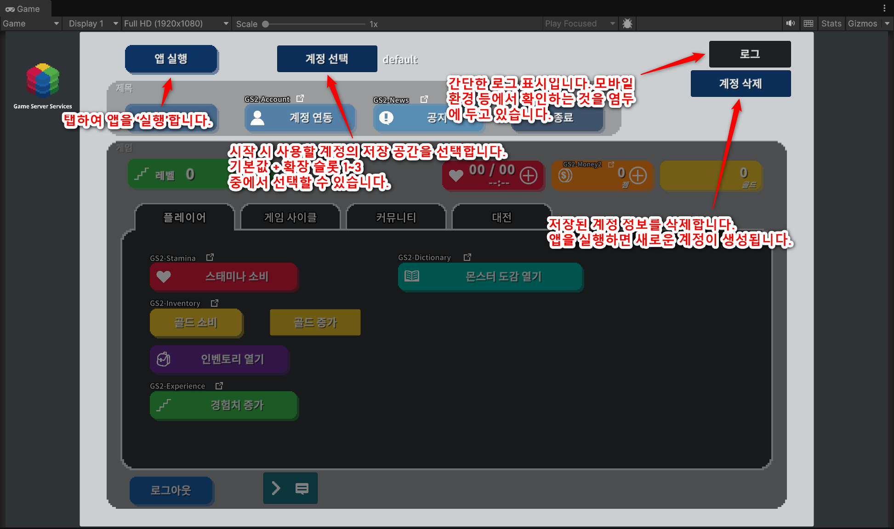
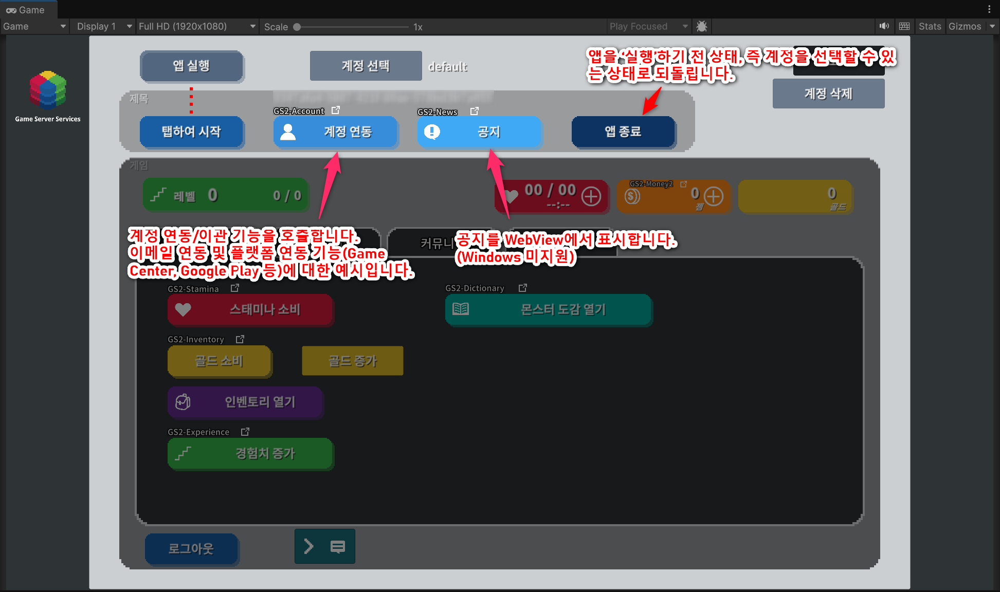
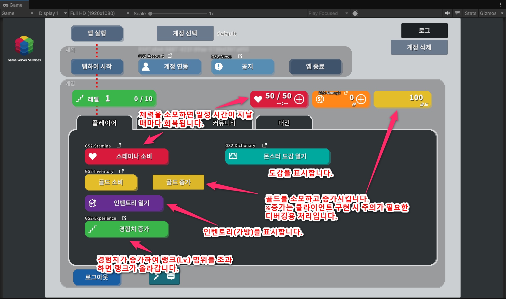
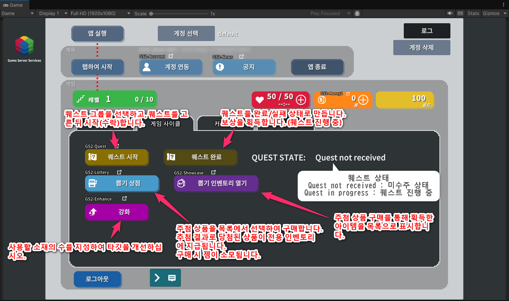
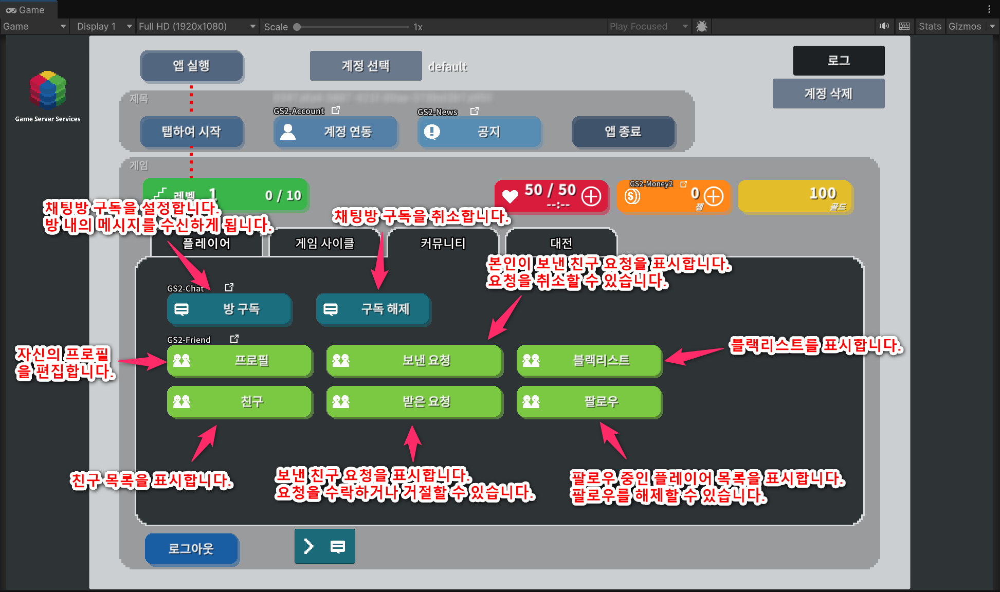
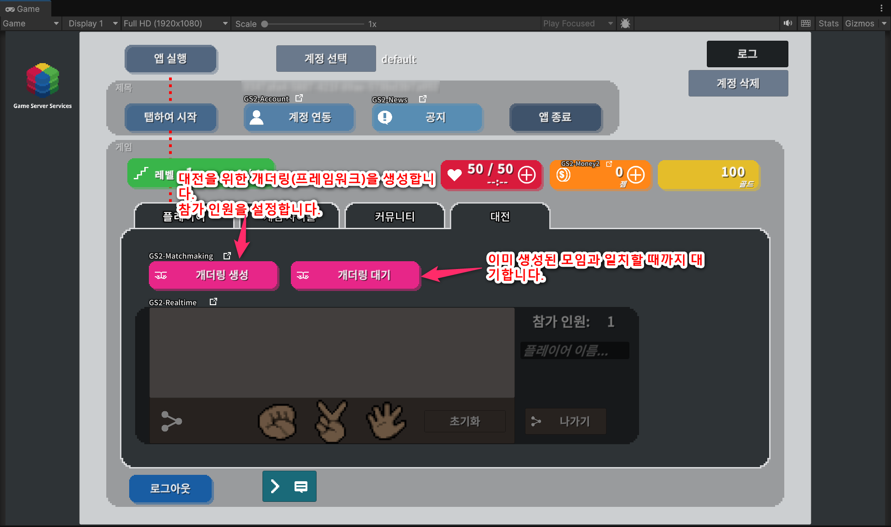

[⇒README in Japanese](README-ja.md) / [⇒README in English](README.md)

# GS2 Sample Project for Unity

Game Server Services (https://gs2.io) 의 Unity 용 샘플 프로젝트입니다.  
게임의 대략적인 흐름을 상정하여 GS2 의 각종 기능을 사용해 구현한 샘플입니다.

## 동작 환경

Unity 6000.5.10f1

GS2 C# SDK 2026.8.3  
GS2 SDK for Unity 2026.7.2  

## 주의 사항

- 샘플에 포함된 manifest.json, packages-lock.json 파일에는  
GS2 의 SDK 외에 Unity 6000.5 에서 동작하는 데 필요한 패키지의 기술이 포함되어 있습니다.  
위 이외의 Unity 버전으로 프로젝트를 열면  
오류가 발생하여 패키지의 버전 변경이 필요할 수 있습니다.  
그 경우에는 패키지 매니저에서 검증된 버전을 설치하면 동작합니다.  

- TextMeshPro 용 일본어/한국어 폰트로  
 「Noto Sans Japanese」( https://fonts.google.com/noto/specimen/Noto+Sans+JP )  
 「Noto Sans Korean」( https://fonts.google.com/noto/specimen/Noto+Sans+KR )  
을 사용하고 있습니다.  
Licensed under SIL Open Font License 1.1 ( http://scripts.sil.org/OFL )  

## 기능별 해설

각 기능을 단독으로 동작시키는 방법과 기능의 상세는 아래 페이지에서 개별적으로 해설하고 있습니다.

- [계정 생성·로그인 해설 (GS2-Account / GS2-Auth / GS2-Gateway)](Docs/Login_ko.md)
- [버전 체크 해설 (GS2-Version)](Docs/Version_ko.md)
- [계정 인계 해설 (GS2-Account)](Docs/Takeover_ko.md)
- [공지사항 해설 (GS2-News)](Docs/News_ko.md)
- [스태미나/스태미나 상점 해설 (GS2-Stamina)](Docs/Stamina_ko.md)
- [유료 재화/유료 재화 상점 해설 (GS2-Money2 / GS2-Showcase)](Docs/Money_ko.md)
- [골드/인벤토리 해설 (GS2-Inventory)](Docs/Inventory_ko.md)
- [경험치 해설 (GS2-Experience)](Docs/Experience_ko.md)
- [퀘스트 해설 (GS2-Quest)](Docs/Quest_ko.md)
- [뽑기 기능 해설 (GS2-Lottery)](Docs/Lottery_ko.md)
- [도감 해설 (GS2-Dictionary)](Docs/Dictionary_ko.md)
- [강화 해설 (GS2-Enhance)](Docs/Enhance_ko.md)
- [채팅 해설 (GS2-Chat)](Docs/Chat_ko.md)
- [친구 해설 (GS2-Friend)](Docs/Friend_ko.md)
- [매치메이킹 해설 (GS2-Matchmaking)](Docs/Matchmaking_ko.md)
- [실시간 대전 해설 (GS2-Realtime)](Docs/Realtime_ko.md)

## 실행 준비

여기서는 Unity Editor 에서 Play 버튼으로 게임을 실행하기까지의 준비를 다룹니다.

### Unity 에서 프로젝트 열기

Unity 에서 `gs2io/gs2-sample-project` 를 프로젝트로 엽니다.  
Unity Package Manager 에 의해 의존 관계의 해결에 필요한 패키지의 다운로드가 이루어집니다.  
GS2 SDK for Unity, GS2 C# SDK 의 다운로드와 설치가 이루어집니다.

Text 의 렌더링에 TextMeshPro 를 사용하고 있습니다.  
TextMeshPro 의 필수 리소스(TMP Essential Resources)는 Unity 에 동봉된 애셋이라
이 저장소에는 포함되어 있지 않으며, 프로젝트를 열 때 자동으로 임포트됩니다.  
Console 에 다음 로그가 출력되면 완료입니다.

```
[GS2 Sample] Importing the TMP Essential Resources...
[GS2 Sample] Registered NotoSansKR-Medium SDF in the Fallback Font Assets of TMP Settings.
```

자동으로 임포트되지 않는 경우에는 `Window > TextMeshPro > Import TMP Essential Resources` 를  
실행해 주세요. 임포트하지 않은 채 씬을 열면 TextMeshPro 가 NullReferenceException 을  
발생시켜 텍스트가 표시되지 않습니다.

Assets/Scenes/SampleGameScene.unity 씬을 엽니다.

### 한국어 폰트의 설정

일본어 폰트에는 한글의 자형이 포함되어 있지 않기 때문에, 한국어를 표시하려면
TextMeshPro 의 폰트 Fallback 설정이 필요합니다.  
이 설정도 위의 TMP Essential Resources 임포트에 이어서 자동으로 이루어집니다.  
`Assets/Editor/Gs2SampleKoreanFontSetup.cs` 가 __Fallback Font Assets__ 에  
`Assets/Resources/Fonts/NotoSansKR-Medium SDF` 를 등록합니다.

자동으로 설정되지 않은 경우에는 다음 중 하나를 실행해 주세요.

- 메뉴의 `GS2 Sample > Setup Korean Font Fallback` 을 실행합니다
- `Edit > Project Settings > TextMesh Pro > Settings` 를 열고,  
  __Fallback Font Assets__ 에 `Assets/Resources/Fonts/NotoSansKR-Medium SDF` 를 추가합니다

설정되어 있지 않으면 언어를 한국어로 전환했을 때 한글이 표시되지 않습니다.  
일본어·영어로만 동작을 확인하는 경우에는 영향이 없습니다.

### GS2-Deploy 를 사용하여 초기 설정하기

[매니지먼트 콘솔](https://app.gs2.io/) 의 Deploy 기능을 사용하여 스택을 생성하고,  
샘플의 동작에 필요한 리소스를 준비합니다.

Templates 폴더의 아래 파일로 스택을 생성합니다.  
템플릿은 화면 하단의 __4개의 탭__ 과, 탭에 속하지 않는 기능의 단위로 묶여 있습니다.  
뒤의 템플릿이 앞의 템플릿에서 생성한 네임스페이스를 참조하므로 __위에서부터 순서대로__ 생성해 주세요.  

| # | 템플릿 파일 | 설정하는 기능 | 대응하는 탭 | 의존 |
---|---|---|---|---
1 | [initialize_core_template.yaml](Templates/initialize_core_template.yaml) | 로그인/계정 연동·인계, 유료 재화/유료 재화 상점 | 탭 외(상태 표시줄) | ― (필수)
2 | [initialize_player_template.yaml](Templates/initialize_player_template.yaml) | 스태미나/스태미나 상점, 골드, 인벤토리, 경험치, 도감 | 플레이어 | 1
3 | [initialize_gamecycle_template.yaml](Templates/initialize_gamecycle_template.yaml) | 퀘스트, 뽑기 기능(뽑기 아이템용 인벤토리 포함), 강화 | 게임 사이클 | 1, 2
4 | [initialize_community_template.yaml](Templates/initialize_community_template.yaml) | 채팅, 친구 기능 | 커뮤니티 | 1
5 | [initialize_match_template.yaml](Templates/initialize_match_template.yaml) | 매치메이킹/실시간 대전 | 대전 | 1
6 | [initialize_option_template.yaml](Templates/initialize_option_template.yaml) | 공지사항, 앱 버전·이용약관 체크 ※사용하는 경우에 생성 | 탭 외 | 1

1 의 initialize_core_template.yaml 은 필수입니다.  
2〜6 은 사용하는 기능의 스택만 생성해도 되지만, 의존하는 스택은 먼저 생성해 주세요.  

※ 이전 버전의 샘플(기능별로 16 개의 템플릿으로 나뉘어 있던 것)로  
스택을 생성한 적이 있는 경우에는 __먼저 오래된 스택을 모두 삭제해 주세요.__  
네임스페이스 이름은 변경하지 않았기 때문에, 오래된 스택이 남아 있으면 같은 이름의 리소스 생성에 실패합니다.  
(Unity 쪽 `Gs2Settings` 의 설정값은 변경할 필요가 없습니다)  

```
core ─┬─ player ─── gamecycle
      ├─ community
      ├─ match
      └─ option
```

템플릿을 넘나드는 참조는 아래 3 개입니다.  

| 참조하는 쪽 | 참조되는 리소스 |
---|---
player | 스태미나 상점이 유료 재화 `money2-0001` 을 소비합니다(core)
gamecycle | 퀘스트의 대가가 스태미나 `stamina-0001` 을 소비하고, 보상이 경험치 `experience-0001` 을 부여합니다(player)
gamecycle | 퀘스트의 보상과 뽑기의 대가가 유료 재화 `money2-0001` 을 사용합니다(core)

※ 아래 리소스는 프로젝트 생성 시에 `Default` 라는 이름의 스택으로  
자동으로 생성되므로, 템플릿으로 생성할 필요가 없습니다.  

| 자동으로 생성되는 리소스 | 용도 |
---|---
GS2-Identifier 사용자 `default` 와 클라이언트 ID/시크릿 | GS2 에 접근하는 데 사용하는 자격 증명
GS2-Key 네임스페이스 `default` / 암호 키 `default` | 서명 계산에 사용
GS2-Gateway 네임스페이스 `default` | 알림 수신에 사용(채팅·친구·매치메이킹 알림, 자동 실행의 완료 알림)
GS2-Distributor 네임스페이스 `default` | 스탬프 시트·트랜잭션의 자동 실행에 사용
GS2-JobQueue 네임스페이스 `default` | 잡의 자동 실행에 사용(자동 실행이 활성화된 상태로 생성됩니다)

잠시 기다린 후 모든 스택의 상태가 `생성 완료` 가 되면 서버 쪽 설정은 완료입니다.

### Unity IAP 의 활성화, 임포트

실제 기기(AppStore / GooglePlay)에서 결제를 하는 경우에는 Unity IAP 의 활성화가 필요합니다.  

[Unity IAP 설정](https://docs.unity3d.com/Manual/UnityIAPSettingUp.html)

서비스 창에서 In-App Purchasing 을 활성화하고,  
IAP 패키지를 임포트합니다.  
(본 샘플은 페이크 영수증으로도 동작하므로, IAP 가 비활성화된 상태에서도 구매 흐름을 확인할 수 있습니다.)  

### Settings 설정

하이어라키 창에서 `Gs2Settings` 오브젝트를 선택합니다.

인스펙터 창에서 GS2-Deploy 로 생성한 리소스의 정보를 등록합니다.  
다운로드 시에는 비어 있는, 아래 __굵은 글씨__ 항목에  
각 스택의 「아웃풋」에서 필요한 정보를 복사하여 붙여넣습니다.


| 스크립트 파일 | 설정 이름 | 설명 |
-----------------|------|------------------------------------------------------------------------
| __CredentialSetting__ | __Application Client Id__ | __GS2 에 접근하기 위한 자격 증명(클라이언트 ID)__ |
| __CredentialSetting__ | __Application Client Secret__ | __GS2 에 접근하기 위한 자격 증명(클라이언트 시크릿)__ |
| CredentialSetting | distributorNamespaceName | 트랜잭션 처리를 수행하는 GS2-Distributor 의 네임스페이스 이름 |

※ 프로젝트 생성 시에 자동으로 생성되는 __Default__ 스택의 아웃풋 목록 탭에서  
아웃풋 이름 __ApplicationClientId__ 항목의 오른쪽에 출력된 값을 __Application Client Id__ 에 붙여넣습니다.  
아웃풋 이름 __ApplicationClientSecret__ 항목의 오른쪽에 출력된 값을 __Application Client Secret__ 에 붙여넣습니다.  


| 스크립트 파일 | 설정 이름 | 설명 |
-----------------|-------------------------------|------
| LoginSetting | Account Namespace Name        | GS2-Account 의 네임스페이스 이름 |
| __LoginSetting__ | __Account Encryption Key Id__ | __GS2-Account 에서 계정 정보의 암호화에 사용하는 GS2-Key 의 암호 키 GRN__ |
| LoginSetting | Gateway Namespace Name        | GS2-Gateway 의 네임스페이스 이름(자동으로 생성되는 `default` 을 사용합니다) |

※ __initialize_core_template.yaml__ 템플릿으로 생성한 스택의 아웃풋 목록 탭에서  
아웃풋 이름 __AccountEncryptionKeyId__ 항목의 오른쪽에 출력된 값을 __Account Encryption Key Id__ 에 붙여넣습니다.

### 버전 체크 기능의 활성화

기본적으로 「앱 실행」 후의 앱 버전 체크, 이용약관 확인 기능은 비활성화되어 있습니다.
활성화하려면 하이어라키의 GameManager → GameManager 컴포넌트의 아래 체크를 각각 해제합니다.


설정이 완료되면 Unity 에서의 실행 준비는 완료입니다.

## 언어 전환

본 샘플은 일본어(`ja`)／영어(`en`)／한국어(`ko`)에 대응하고 있습니다.

### 실행 시의 판정

`UIManager` 컴포넌트의 __Auto Detect Language__ 가 활성화되어 있는 경우, `Awake` 에서 언어를 자동으로 판정합니다.

1. `PlayerPrefs`(키 `Gs2.Sample.Language`)에 저장된 설정이 있으면 그것을 사용
2. 없으면 단말의 언어 설정(`Application.systemLanguage`)에서 결정  
   일본어면 `ja`, 한국어면 `ko`, __그 외에는 모두 `en`__

Editor 에서 특정 언어를 고정하여 확인하고 싶은 경우에는 __Auto Detect Language__ 의 체크를 해제하고,
`UIManager` 의 __Lang__ 을 전환해 주세요. 체크가 되어 있는 상태에서는 `Awake` 에서 덮어써집니다.

### 실행 중의 전환

`UIManager.SetLanguage()` 를 호출합니다. 표시 중인 `LocalizedText` 는 `OnLanguageChanged` 이벤트를 통해
자동으로 갱신되므로, 화면을 다시 열 필요가 없습니다.

```c#
UIManager.Instance.SetLanguage(UIManager.Language.en);

// 설정을 저장하지 않고 일시적으로 전환하는 경우
UIManager.Instance.SetLanguage(UIManager.Language.en, save: false);
```

두 번째 인자를 생략하면 `PlayerPrefs` 에 저장되어, 다음 실행 시에도 같은 언어가 사용됩니다.  
또한 샘플에는 언어를 전환하는 UI 를 제공하지 않습니다.

### 문구의 정의

문구는 언어별 JSON 에 플랫한 `{ "키": "문구" }` 형식으로 정의되어 있습니다.

```
Assets/Resources/Localization/ja.json
Assets/Resources/Localization/en.json
Assets/Resources/Localization/ko.json
```

씬이나 프리팹 상의 고정 문구에는 `LocalizedText` 컴포넌트를 붙이고, __Key__ 에 JSON 의 키를 지정합니다.
스크립트에서 가져오는 경우에는 `UIManager.Instance.GetLocalizationText(key)` 를 사용합니다.
어순이 언어마다 다르므로, 문자열 연결이 아니라 플레이스홀더를 사용해 주세요.

```c#
// ja.json : "UnitObtain": "{0} x {1} を入手しました。"
// en.json : "UnitObtain": "Obtained {0} x {1}."
UIManager.Instance.GetLocalizationText("UnitObtain", itemName, count);
```

키에 대응하는 문구가 없는 경우에는 폴백 언어(`ja`)의 문구를, 그것도 없는 경우에는 __키를 그대로__ 표시합니다.
JSON 에 등록하지 않은 문자열이 그대로 표시되는 것은 이 때문입니다.

### 언어 추가하기

1. `UIManager.Language` 의 enum 에 언어 코드를 추가한다
2. `Assets/Resources/Localization/{언어 코드}.json` 을 추가한다

`Assets/Resources/Localization` 아래의 JSON 을 읽어 들이는 구조이므로, 다른 코드를 변경할 필요가 없습니다.

### 폰트

일본어 폰트에는 한글의 자형이 포함되어 있지 않기 때문에, 한국어에서는 자형의 보완이 필요합니다.
본 샘플에서는 TextMeshPro 의 __Fallback Font Assets__ 로 보완하는 방식을 채택하고 있으며,
`LocalizedText` 의 __Apply Locale Font__ 는 기본적으로 비활성화되어 있습니다.

폰트 에셋 자체를 교체하면 아웃라인 등의 머티리얼 설정이 기본값으로 돌아가 버리기 때문이지만,
중국어처럼 한자의 자형이 언어마다 다른 경우에는 `UIManager` 의 __Locale Fonts__ 에 언어와 폰트의
대응을 등록한 다음, __Apply Locale Font__ 를 활성화해 주세요.

## 샘플의 흐름



샘플을 실행하면 `앱 실행` 버튼이 활성화됩니다.  
`앱 실행` 을 탭하면 GS2 SDK 의 초기화(GS2-Identifier),  
활성화되어 있다면 앱의 버전 체크, 이용약관의 사용자 확인  
(GS2-Version)을 수행하고,
계정에 의한 로그인을 실행합니다.  
최초 실행 시에는 익명 계정을 자동으로 생성합니다.  
(GS2-Account)  

[⇒계정 생성·로그인 해설로](Docs/Login_ko.md)  
[⇒버전 체크 해설로](Docs/Version_ko.md)  



로그인이 완료되면 타이틀 화면으로 전환됩니다.  
`계정 연동` 기능을 호출할 수 있습니다.  
이미 생성된 익명 계정에 이메일 주소나,  
각 플랫폼에서 이용 가능한 Game Center/Google Play Game Service 의 계정을 연동하여,  
인계를 실행할 수 있도록 하는 기능의 샘플입니다.
(GS2-Account)
`공지사항` 으로 WebView 를 열어 공지사항의 콘텐츠를 표시합니다.  
(GS2-News)

[⇒계정 인계 해설로](Docs/Takeover_ko.md)  
[⇒공지사항 해설로](Docs/News_ko.md)

`Tap to Start` 를 탭하면 게임 내로 전환됩니다.  
「플레이어」「게임 사이클」「커뮤니티」「대전」의 각 탭에 접근할 수 있습니다.


왼쪽 위에 __레벨과 경험치__ 가 표시됩니다.  
(GS2-Experience)


오른쪽 위에 __스태미나__, __유료 재화__, __골드__ 가 표시됩니다.  
(GS2-Stamina, GS2-Money2, GS2-Inventory)

## 플레이어 탭



`스태미나 소비` ··· 스태미나를 감소시키고, 일정 시간마다 회복합니다.
(GS2-Stamina)

[⇒스태미나/스태미나 상점 해설로](Docs/Stamina_ko.md)

`골드 소비` ··· 골드를 10 감소시킵니다.  
`골드 증가` ··· 골드를 100 증가시킵니다.  
(GS2-Inventory)

`인벤토리 열기` ··· 아이템을 목록으로 표시합니다. 아이템을 탭하면 소비(사용)합니다.  
`불 속성 획득`, `물 속성 획득` ··· 2 종류가 있는 아이템을 각각 5 증가시킵니다.  
(GS2-Inventory)

[⇒골드/인벤토리 해설로](Docs/Inventory_ko.md)

`경험치 증가` ··· 경험치를 10 증가시킵니다.

[⇒경험치 해설로](Docs/Experience_ko.md)
 
## 게임 사이클 탭



`퀘스트 시작` ··· 퀘스트 그룹을 선택하고, 퀘스트를 시작합니다.  
`퀘스트 완료` ··· 퀘스트를 완료, 또는 실패(파기)합니다.  
(GS2-Quest)  

[⇒퀘스트 해설로](Docs/Quest_ko.md)

`뽑기 상점` ··· 뽑기 상품 목록에서 상품을 선택하고, 상품을 구매합니다.  
뽑기 후 아이템을 획득합니다. 아이템은 전용 인벤토리에 지급됩니다.  
(GS2-Lottery, GS2-Inventory, GS2-Showcase, 트랜잭션)  
`뽑기 인벤토리 열기` ··· 뽑기로 획득한 아이템을 목록으로 표시합니다.  
아이템을 탭하면 소비합니다.  
(GS2-Inventory)

[⇒뽑기 기능 해설로](Docs/Lottery_ko.md)

## 커뮤니티 탭



`룸 구독` ··· 채팅 룸에 대해 구독을 등록하여, 새 메시지의 게시 알림을 받을 수 있도록 합니다.  
`구독 해제` ··· 채팅 룸의 구독을 해제합니다.
(GS2-Chat)

`프로필` ··· 자기 플레이어의 프로필을 편집합니다.  
`친구` ··· 친구 목록을 표시합니다.  
`보낸 요청` ··· 자기 플레이어가 다른 플레이어에게 보낸 친구 요청의 목록을 표시합니다.  
`받은 요청` ··· 다른 플레이어가 자기 플레이어에게 보낸 친구 요청의 목록을 표시합니다.    
`블랙리스트` ··· 블랙리스트를 표시합니다.  
`팔로우` ··· 팔로우 중인 플레이어의 목록을 표시합니다.  
(GS2-Friend)

화면 중앙 하단의 `＞` 를 누르면 채팅 창이 열립니다.


ChatSetting 의 roomName 에 설정된 이름의 룸으로 메시지를 주고받을 수 있습니다.

## 대전 탭



`개더링 생성` ··· 참가 인원을 설정하여 개더링(매칭의 단위)을 생성합니다.  
`개더링 대기` ··· 개더링에 대한 참가를 요청합니다.  
(GS2-Matchmaking)  

[⇒매치메이킹 해설로](Docs/Matchmaking_ko.md)

매칭에 성공하면 GS2-Realtime 을 사용한 Room 에 입장하게 되어,  
참가자끼리의 통신이 가능해집니다.  
샘플에서는 간단한 가위바위보 대전을 할 수 있습니다.  
(GS2-Realtime)  

[⇒실시간 해설로](Docs/Realtime_ko.md)

## 상점


스태미나 상점 (스태미나 표시의 ＋ 버튼) ···  
GS2-Exchange 와 연계하여 GS2-Money2 를 소비해 스태미나 값을 회복하는 상품의 구매 샘플입니다.  
(GS2-Stamina, GS2-Exchange, GS2-Money2)  

[⇒스태미나/스태미나 상점 해설로](Docs/Stamina_ko.md)
 
유료 재화 상점 (유료 재화 표시의 ＋ 버튼) ···  
GS2-Money2 로 관리되는 유료 재화를 GS2-Showcase 로 판매하는 샘플입니다.  
정의되어 있는 상품 중 하나에는 GS2-Limit 에 의한 구매 횟수 제한이 있어, 1 회만 구매가 가능합니다.  
(GS2-Showcase, GS2-Limit, GS2-Money2)  
